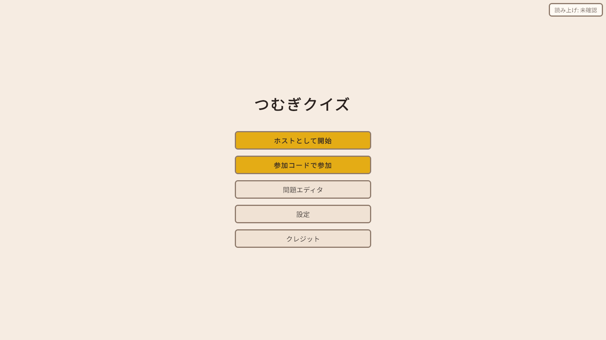
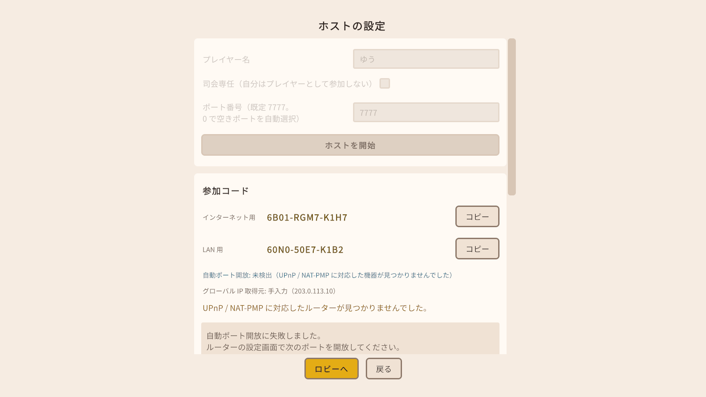
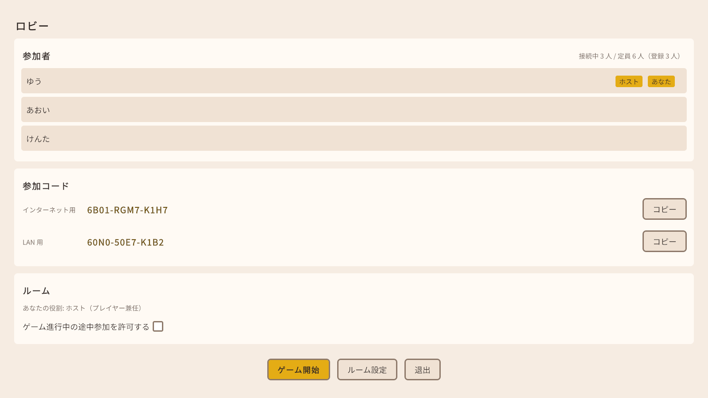
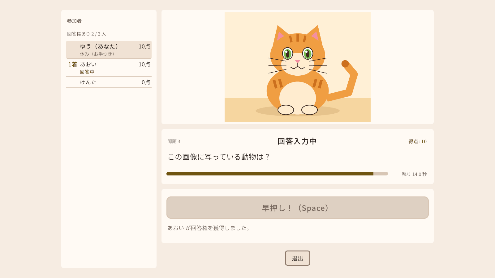
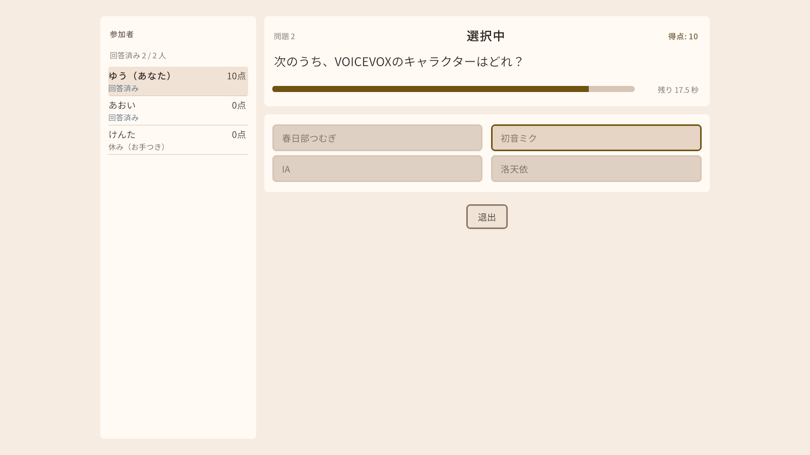
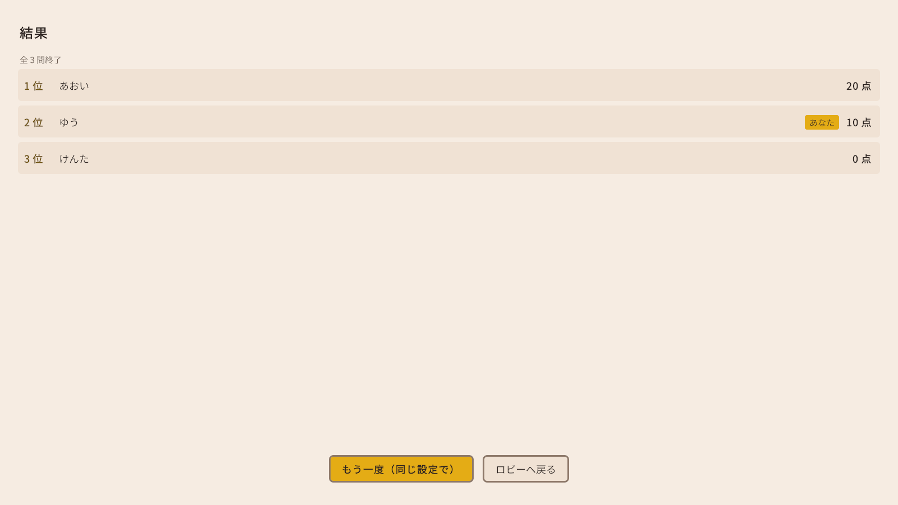

# tsumugi-quiz

友人同士でオンライン飲み会やオフ会の際に遊べる早押しクイズアプリです。参加者の 1 人がホストとしてクイズを開始し、他の参加者は表示された参加コードを入力するだけで接続できます。読み上げには VOICEVOX の音声ライブラリ「春日部つむぎ」を使い、各プレイヤーの PC でローカルに音声合成を行います。外部の常設サーバーやアカウント登録は不要です。

本作品は非公式のファンメイド作品です。VOICEVOX（ヒホ氏）および春日部つむぎ運営の公式のものではなく、承認や推奨を受けたものでもありません。

## 手順書

配布 zip を受け取って遊ぶ人向けの手順書です。配布 zip の `manual` フォルダにも、同じ内容を HTML にしたもの（`setup.html` / `usage.html`）が入っています。

- [セットアップ手順書](docs/manual/setup.md) — zip の展開、初回起動（SmartScreen・ファイアウォール・利用規約）、読み上げの確認、立ち絵の準備（任意）、ホスト役の準備（ポート開放・Tailscale）、アップデート、アンインストール
- [操作手順書](docs/manual/usage.md) — 画面ごとの操作、ルーム設定とプリセット、ゲーム画面の見方、司会の操作、問題エディタ、困ったとき

## スクリーンショット

| タイトル画面 | ホストの設定画面 | ロビー画面（ホスト） |
|---|---|---|
|  |  |  |

| ゲーム画面（画像付きの問題） | ゲーム画面（選択式） | 結果画面 |
|---|---|---|
|  |  |  |

撮影方法（2026-10-03）: この手順書を追加した時点（develop の #212 まで）のソースを Editor で開き、Boot → Main シーンを PlayMode で動かし、UI Toolkit のパネルを 1600x900 の RenderTexture に描いて保存しました（UI の基準解像度 1600x900 と同じで、倍率は 1.0）。ホストは Main シーンの UI を操作し、参加者（あおい・けんた）は同じプロセス内のクライアント用 NetworkManager から 127.0.0.1 で接続しています（画面に写るのはホスト側の UI です）。

- 写っている参加コードは、インターネット用が [RFC 5737](https://www.rfc-editor.org/rfc/rfc5737) のドキュメント用アドレス `203.0.113.10` を「グローバル IP を手入力する」欄に入れて作ったもの（復号して `203.0.113.10:7777` になることを確認済み）、LAN 用がテスト用の偽の LAN IP `192.168.10.7` から作ったもの（同じく `192.168.10.7:7777`）です。撮影機の実際の IP アドレス・PC 名・ユーザー名は写っていません。自動ポート開放とグローバル IP の確認サービスは、テスト用の偽物に差し替えて「失敗」にしています。
- 問題と画像は、アプリ同梱のサンプル問題セット（`Assets/TsumugiQuiz/Resources/Questions/sample-questions.json` と同梱のサンプル画像）です。
- 立ち絵は置いていないため、どの画面にも写っていません（立ち絵が無いときは、ゲーム画面の右の列が無くなり、中央の列が真ん中に寄ります）。
- 読み上げは、撮影の都合でゲーム中だけルーム設定で OFF にしています（問題文は 80 ミリ秒/文字の文字送りで表示されます）。

## 主な機能

- **早押し**: `Space` キーか画面のボタンで押します。各 PC が押した時刻（ホストの時刻に合わせたもの）をもとにホストが判定し、同着は抽選です。誤答すると、残り時間があればほかの人がもう一度押せます。押せる人が全員誤答・休みになったときは、時間切れを待たずに締め切ります
- **選択式**: 早押しなしで全員が 1 回だけ選び、制限時間で一斉に判定します
- **ゲーム画面の 3 列表示**: 左に参加者パネル、中央に問題の画像と問題文、右に立ち絵（置いた人だけ）
- **参加者パネル**: 参加者ごとに「1着」「回答中」「○ 正解」「× 不正解」「休み（お手つき）」「回答済み」「切断中」などの状態と得点を表示します（得点はルーム設定で隠せます）
- **読み上げと文字送り**: 問題文を春日部つむぎの声で読み上げ、読み上げに合わせて 1 文字ずつ表示します。読み上げのない部屋では一定の速さで文字送りします
- **立ち絵（任意）**: 公式の立ち絵を自分で入手して置くと、ゲーム画面の右に表示します（完成版の画像を 1 枚置くだけなら全身、生成スクリプトで表情画像を作ればバストアップ）。生成スクリプトで作った 9 種類の表情（待機・読み上げ中・回答権の獲得（自分 / 他人）・誤答の瞬間・正解・不正解・時間切れ・回答できる人がいない）を場面ごとに切り替えます。生成スクリプトは配布 zip の `tools/tsumugi-expressions/` にも入っており、リポジトリが無くても Python を入れれば使えます（手順はセットアップ手順書の 6.4）
- **わかりやすい切断理由**: 参加を拒否されたとき（参加画面）や、ロビーにいるときに切断されたとき、理由を日本語で表示します（「満室のため参加できません。」「ホストがゲームを終了しました。」など）。ゲーム中に切断された場合は、タイトル画面へ戻ります
- **ビルドの一致の確認**: ホストと参加者のビルドが違うと「バージョンが異なります（ホスト: x / あなた: y）。」で接続を拒否します。**参加者全員が同じ zip を使ってください**。ビルド番号はクレジット画面で確かめられます
- **司会専任モード**: ホストが答えずに進行役（次へ・一時停止・強制正解 / 不正解）になれます
- **問題エディタ**: アプリの中で問題セットを作れます（画像付きの問題も作れます）

## 必要環境

- Windows 10 / 11（x64）

## 遊び方

1. ホスト役の 1 人が「ホストとして開始」→「ホストを開始」で部屋を作り、画面に出た参加コード（インターネット用 / LAN 用）をほかの人に送ります
2. ほかの人は「参加コードで参加」で、送られた参加コードを入力して参加します
3. 全員がロビーにそろったら、ホストが「ゲーム開始」を押します

くわしくは [操作手順書](docs/manual/usage.md) を見てください。

## 接続できないとき

まず次を確かめてください。拒否・切断の文言ごとの対処は [操作手順書](docs/manual/usage.md) の「困ったとき」にあります。

- 同じ家・同じ Wi-Fi の中なら「LAN 用」の参加コードを使います
- 「バージョンが異なります（ホスト: x / あなた: y）。」と出たら、ホストと同じ zip に入れ替えます

離れた場所から参加できない場合は、以下の順に試してください（[セットアップ手順書](docs/manual/setup.md) の「ホスト役の準備」にも同じ内容があります）。

### 1. 手動でポートを開放する（UPnP 非対応ルーターの場合）
ホスト側のルーターの管理画面にログインし、UDP の **7777** 番ポート（「ホストの設定」でポート番号を変えた場合はその番号）をホストの PC の IP アドレスへ転送（ポートフォワーディング）してください。自動ポート開放に失敗すると、「ホストの設定」画面に設定する値（プロトコル・外部ポート・内部ポート・宛先 IP）が表示されます。手順はルーターの機種ごとに異なるため、お使いのルーターの取扱説明書や管理画面のヘルプを参照してください。

### 2. それでも接続できない場合は Tailscale を使う
ルーターの設定が難しい場合や、CGNAT 環境（一部のモバイル回線・集合住宅回線など）でグローバル IP が使えない場合は、[Tailscale](https://tailscale.com/) という無料の VPN アプリを使うと、ポート開放なしで接続できる見込みです。**この手順は Tailscale の公式ドキュメントに基づいて書いたもので、開発者の環境では実機で確かめていません**（実機 2 台以上での接続検証は、複数の物理デバイスを用意できない本プロジェクトの作業環境では実施できていません。[docs/network-nat.md](docs/network-nat.md) §1.5 の脚注を参照）。 Tailscale は本アプリには同梱されていません。参加者全員が各自でインストールする必要があります。

**ホスト側の手順**
1. [Tailscale のダウンロードページ](https://tailscale.com/download) から Windows 版をインストールする
2. Tailscale を起動し、Google など好きなアカウントでログインする（Personal プランは無料。最大 6 ユーザー・デバイス数無制限）
3. Tailscale のメニューまたはコマンド `tailscale ip -4` で、自分の Tailscale IP アドレス（`100.x.x.x` の形式）を確認する
4. 本アプリの「ホストの設定」画面で、自動ポート開放に失敗した場合に表示される「グローバル IP を手入力する」欄に、確認した Tailscale IP を入力して「コードを作る」を押す
5. 生成された参加コードを参加者に共有する

**参加者側の手順**
1. ホストと同様に [Tailscale のダウンロードページ](https://tailscale.com/download) からインストールし、ログインする
2. ホストから招待された場合は招待を承認する、または同じアカウントでログインすることで、ホストと同じ Tailnet（Tailscale のネットワーク）に参加する
3. 本アプリの「参加コードで参加」に、ホストから共有された参加コードを貼り付けて接続する

Tailscale が NAT 越えを肩代わりするため、UPnP やポート開放は不要になる見込みです（経路によっては Tailscale 側のリレーサーバーを介して中継されることもあります）。手順の詳細は [Tailscale 公式ドキュメント](https://tailscale.com/kb/1017/install)・[docs/network-nat.md](docs/network-nat.md) §1.5 を参照してください。

Tailscale の Personal プランは個人利用であれば無料で、最大 6 ユーザー・デバイス数無制限で利用できます（2026-09-17 時点、[Tailscale の料金ページ](https://tailscale.com/pricing) で確認。無料利用にも Google 等のアカウントでのログインが必要です）。本アプリの定員は最大 12 人のため、**7 人以上で遊ぶ場合は Tailscale の無料枠（6 ユーザーまで）に収まらない可能性があります**（有料プランへのアップグレードが必要になる場合があります）。Tailscale クライアント本体（tailscale/tailscale リポジトリ）は BSD 3-Clause License で公開されていますが、Tailscale サービス自体はオープンソースではなく Tailscale Inc. が運営する商用サービスです（詳細は [docs/licenses.md](docs/licenses.md) §14）。

## 問題の追加方法

ホストの PC の `ドキュメント\TsumugiQuiz\Questions` フォルダに問題セットの JSON ファイルを置くと、アプリが自動的に読み込みます。画像は同じフォルダの `images` フォルダに置きます。アプリの「問題エディタ」でも作れます（[操作手順書](docs/manual/usage.md) の「問題エディタで問題を作る」）。JSON の形式は [docs/question-data.md](docs/question-data.md) を参照してください。

## 開発者向け

- 開発手順・ローカル検証・ビルド手順: [docs/dev-workflow.md](docs/dev-workflow.md)
- ネイティブライブラリ・音声モデル・立ち絵など git 管理外の素材の準備手順: [External/README.md](External/README.md)
- プロジェクト規約全般: [CLAUDE.md](CLAUDE.md)
- 配布 zip: `pwsh ./scripts/package-release.ps1`（[docs/dev-workflow.md](docs/dev-workflow.md) §8）。`docs/manual/*.md` を HTML にして zip の `manual` フォルダに入れます。**ビルドするたびにネットワーク上は別のビルドになる**ので、配った zip を作り直したら全員分を差し替えてください

### 起動オプション（開発・検証用）

通常のプレイでは不要だが、同一 PC で複数プロセスを起動して手動検証する際に使うコマンドライン引数。
`scripts/run-multi.ps1` がこれらを使って自動化する（詳細は [docs/dev-workflow.md](docs/dev-workflow.md) §3.3）。

| 引数 | 意味 |
|---|---|
| `-tq-host` | 起動時にホストを自動開始する |
| `-tq-join <参加コード>` | 起動時に指定した参加コードで自動接続する |
| `-tq-name <名前>` | プレイヤー名 |
| `-tq-port <ポート番号>` | ホストの待ち受けポート（`0` で OS に空きポートを選ばせる） |
| `-tq-data-root <フォルダ>` | データ保存先の上書き（設定・参加コードファイル等）。`-tq-host` 指定時、この配下に LAN 用参加コードを平文で書き出す |
| `-tq-documents-root <フォルダ>` | 問題フォルダ・プリセットフォルダの親（既定は `ドキュメント`）の上書き（[docs/question-data.md](docs/question-data.md) §4） |
| `-tq-window <x,y,w,h>` | ウィンドウの位置・サイズ（複数プロセスを画面上に並べるため） |

利用規約への同意（初回起動時の Terms 画面）はこれらの引数を指定しても省略されない。

## クレジット

本アプリは以下の音声・素材・ソフトウェアを利用しています。根拠となる利用規約・ライセンスの詳細は [docs/licenses.md](docs/licenses.md) を参照してください。

- `VOICEVOX:春日部つむぎ`
- 春日部つむぎ立ち絵 (C) 春日部つくし
- VOICEVOX CORE (C) 2021 Hiroshiba Kazuyuki (MIT License)
- ONNX Runtime (C) Microsoft Corporation (MIT License)
- voicevox_onnxruntime (C) 2021 VOICEVOX (MIT License)
- Open JTalk (Modified BSD License)
- Unity と各パッケージ (C) Unity Technologies (Unity Companion License)
  - TsumugiQuiz was made with Unity®. Unity is a trademark or registered trademark of Unity Technologies
  - Copyright © 2005-2026 Unity Technologies. All rights reserved.
  - TsumugiQuiz is not sponsored by or affiliated with Unity Technologies or its affiliates. Unity is a trademark or registered trademark of Unity Technologies or its affiliates in the U.S. and elsewhere.

アプリ内の「クレジット」画面にも同内容を表示しています。配布パッケージには `THIRD-PARTY-NOTICES.txt` を同梱し、各ライセンスの全文または参照 URL を記載しています。

## ライセンス

本リポジトリの自作部分（コード、文書、効果音、サンプル画像、問題データ）は [MIT License](LICENSE)（Copyright (c) 2026 Tomonorarari-Think）です。

次のものは MIT License の対象外で、それぞれのライセンス・利用規約に従います（範囲の詳細は [NOTICE.md](NOTICE.md) と [docs/licenses.md](docs/licenses.md) §17 を参照）。

- `Packages/com.unity.transport/`（Unity Companion License。改変部分を含む）
- Unity のテンプレートに由来するファイル（`Assets/Settings/`、`ProjectSettings/`、`Packages/manifest.json`、`Packages/packages-lock.json`。Unity Companion License）
- `Assets/Plugins/Mono.Nat/`（MIT License、Alan McGovern ほか）
- `Assets/TsumugiQuiz/UI/Fonts/`（SIL Open Font License 1.1）
- 本リポジトリに転記した第三者のライセンス・規約の文章
- VOICEVOX / voicevox_core / 春日部つむぎの音声・立ち絵（リポジトリには含まれません。利用者が各規約に従って入手します）
