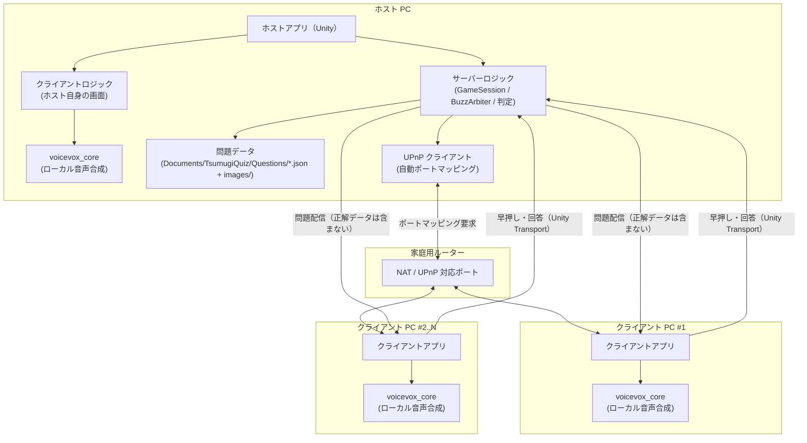
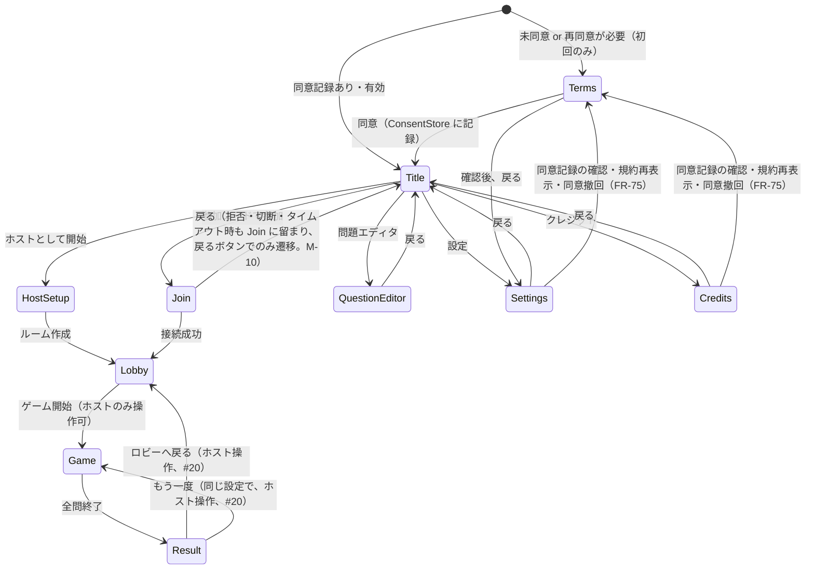
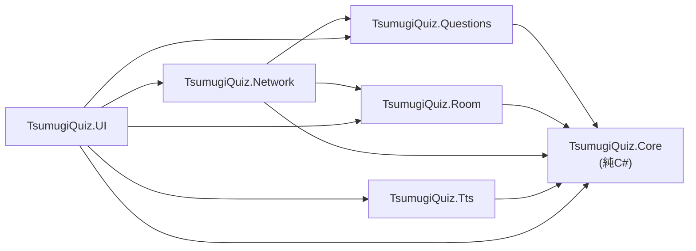
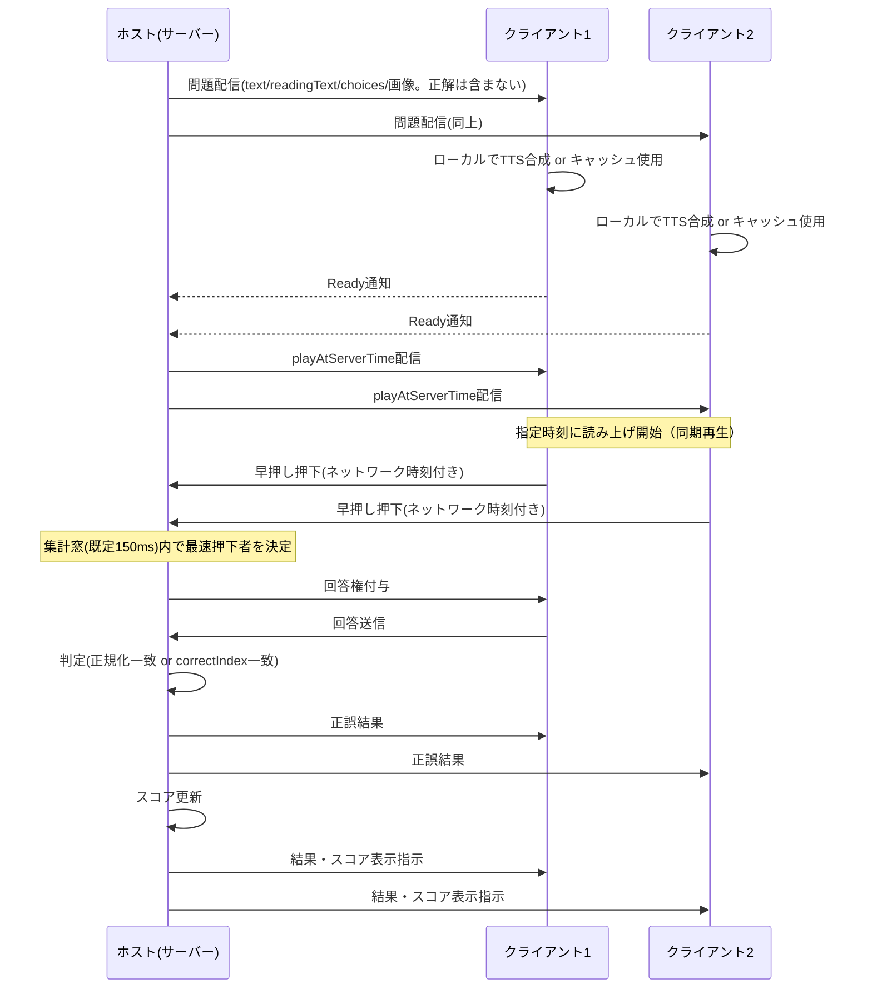

# アーキテクチャ

## 目的
tsumugi-quiz の全体構成・シーン構成・レイヤー分け（asmdef）・主要コンポーネント・データフロー・フォルダ構成・ビルド構成を定義し、実装時の判断基準とする。

## 関連ドキュメント
- [requirements.md](./requirements.md) — 機能要件・非機能要件・確定済み技術決定
- [question-data.md](./question-data.md) — 問題データの JSON スキーマ・配信 DTO
- [room-settings.md](./room-settings.md) — ルーム設定項目・適用タイミング
- network.md — NGO・参加コード・早押し判定・画像配信の実装詳細（別担当作成、本書では概要のみ）
- tts.md — VOICEVOX 連携・再生同期の実装詳細（別担当作成、本書では概要のみ）
- docs/tasks/setup-brief.md — 統括が配布した共通ブリーフ（K1〜K24 の仮決めの出典）

---

## 1. 全体構成図

ホストは NGO の Host モードでサーバー機能とクライアント機能を同一プロセス内に持つ。他の参加者は参加コードでホストへ直接接続するクライアントのみを起動する。



- ホストは自分自身に対してもクライアントと同じ経路（ローカルループ）で問題を受け取り、他クライアントと同期して読み上げ・立ち絵を表示する（サーバー特権を持つが表示ロジックは共通）
- 正解データ（`answers` / `correctIndex`）はクライアントへ一切送信しない（question-data.md §配信 DTO 参照）
- UPnP が使えない環境では手動ポート開放または Tailscale 案内（詳細は network.md）

---

## 2. シーン構成

**仮決め K4**: シーンは `Boot.unity` → `Main.unity` の 2 つのみ。画面遷移は UI Toolkit の View（UXML + C#）を `ViewRouter` が切り替えることで実現し、Unity のシーン遷移は使わない。

| シーン | 役割 |
|---|---|
| `Boot.unity` | `NetworkManager`、`TtsService` などの常駐サービスを `DontDestroyOnLoad` で生成し、`Main.unity` へ遷移する |
| `Main.unity` | `UIDocument` を 1 枚持ち、`ViewRouter` が画面（View）を切り替える。ゲームロジックはシーンを跨がずこの 1 シーンで完結する |

### View 一覧

| View | 役割 |
|---|---|
| Terms | 利用規約同意画面（requirements.md FR-71〜FR-76、2026-09-13 追加）。初回起動時（未同意 or 再同意が必要な場合）のみ、Title の前に表示する。VOICEVOX 音声モデル / VOICEVOX ONNX Runtime / 春日部つむぎ音声 / 立ち絵の各規約を本文表示または URL リンクで提示し、「同意します」チェック + 同意ボタンで `ConsentStore` に記録する |
| Title | 起動直後の画面（同意済みの場合はここから開始）。「ホストとして開始」「参加コードで参加」「問題エディタ」「設定」「クレジット」への入口 |
| HostSetup | ホスト側のルーム設定・参加コード表示・UPnP 状態表示 |
| Join | クライアント側の参加コード入力・接続 |
| Lobby | 接続済みプレイヤー一覧・ルーム設定確認・ゲーム開始待ち |
| Game | 出題・読み上げ・立ち絵・早押し・回答・判定を行うメイン画面（`GameView`、#14）。司会専用モード（`host.role = "moderator"`）のホストには、早押し・回答 UI（`buzz-section`）の代わりに司会操作パネル（`moderator-controls.uxml` + `ModeratorControlsPanel`、#20）を組み込む（`GameView.Moderator.cs`） |
| Result | 得点・順位を表示する結果画面（`ResultView`、#20）。全問終了（`GameSession.SessionFinished`）で自動遷移する。同点は同順位、切断中は「（切断中）」と表示する。ホストには「もう一度（同じ設定で）」「ロビーへ戻る」を、それ以外にはホストの操作待ち表示を出す |
| QuestionEditor | 問題セット・問題の追加編集（question-data.md 参照） |
| Settings | ルーム設定・プリセット・アプリ設定・音声合成の状態確認をまとめた設定画面（room-settings.md §1〜§3、#28） |
| Credits | 権利表記・クレジット表示（licenses.md 参照） |

### 画面遷移図



> **Lobby → Game の駆動（#95）**: ホストが「ゲーム開始」を押すと `LobbyView` が問題フォルダを読み直し、
> `GameSession.Configure` → `SetQuestionSets` → `StartSession()` を呼ぶ（network.md §12.7）。
> 画面遷移そのものは `GameSession.Phase` が `Lobby` 以外になった合図で行うため、ホストだけでなく
> ロビーに居るクライアント（進行中に途中参加・再接続した場合も含む）も Game へ移る。出題できる問題が無い場合は遷移せず、
> ロビーに理由（問題セット 0 件 / 読み込み失敗 / 絞り込み後 0 件）を表示する。

---

## 3. レイヤー分け・asmdef 構成

**K5/K6（確定、2026-09-18 ユーザー承認）**: `Assets/TsumugiQuiz/Scripts/` 配下を機能ごとに 7 分野 + テスト 3 本、計 10 本の asmdef に分割する（2026-09-14 改訂: EditMode/PlayMode 共通のテスト用フェイクを集約する `TsumugiQuiz.Tests.Shared` を追加、#67）。依存方向は `Core ← Questions/Room ← Network/Tts ← UI` の一方向のみとし、逆方向の参照は禁止する。`Core` は Unity API に依存しない純 C# を目標とし、EditMode でのユニットテストを容易にする。

| asmdef | 責務 | 依存先（このプロジェクト内） | Unity API 依存 |
|---|---|---|---|
| `TsumugiQuiz.Core` | 早押し判定ロジック、回答正規化、参加コードのエンコード/デコード、スコア計算など、Unity に依存しないドメインロジック | なし | なし（純 C#） |
| `TsumugiQuiz.Questions` | 問題データの読み込み・バリデーション・モデル定義 | Core | あり（`Application.dataPath` 等のファイル I/O のみ最小限） |
| `TsumugiQuiz.Room` | ルーム設定・プリセットの定義と読み書き | Core | あり（ファイル I/O） |
| `TsumugiQuiz.Network` | NGO 接続管理、参加コード解決、問題配信、早押し・回答メッセージの送受信 | Core, Questions, Room | あり（NGO, Unity Transport） |
| `TsumugiQuiz.Tts` | voicevox_core 連携、TTS キャッシュ、再生スケジューリング | Core | あり（`AudioSource` 等） |
| `TsumugiQuiz.UI` | UI Toolkit の View・ViewRouter・立ち絵表示 | Core, Questions, Room, Network, Tts | あり（UI Toolkit） |
| `TsumugiQuiz.Editor` | Unity エディタ拡張（ビルド補助等。アプリ内問題エディタとは別） | Core, Questions | あり（UnityEditor） |
| `TsumugiQuiz.Tests.Shared`（2026-09-14 追加、#67） | EditMode/PlayMode 共通のテスト用フェイク（`FakeTtsSynthesisEngine`、`TestWavFactory`、`FakeNatDevice` 等） | Core, Network, Tts | あり（Unity Test Framework。`UNITY_INCLUDE_TESTS` 限定、ランタイム・配布物には含まれない） |
| `TsumugiQuiz.Tests.EditMode` | Core / Questions / Room の純 C# ロジックのユニットテスト | Core, Questions, Room, Tests.Shared | あり（Unity Test Framework、EditMode） |
| `TsumugiQuiz.Tests.PlayMode` | Network / Tts / UI を含む統合的な PlayMode テスト | 全レイヤー, Tests.Shared | あり（Unity Test Framework、PlayMode） |

名前空間はフォルダ構成と一致させる（例: `TsumugiQuiz.Network` 配下のクラスは `namespace TsumugiQuiz.Network`）。

SE（効果音、`SePlayer`）の発火も依存方向の制約を受ける。`Network`/`Room` から `UI`（`SePlayer`）を直接呼ぶことは禁止のため、UI 層が `Network`/`Room` が公開するイベント（早押し・正誤判定・タイムアップ・ゲーム開始・参加通知等）を購読し、UI 側から `SePlayer.Play(SeKind)` を呼び出す（2026-09-13 追加）。

**依存方向の図**



---

## 4. 主要コンポーネント一覧

| クラス名（案） | 所属 asmdef | 責務 |
|---|---|---|
| `GameSession` | Network | サーバー側のゲーム進行。`NetworkBehaviour` として `QuizPhase` などの `NetworkVariable` と RPC を持ち、出題・受付開始・判定・得点更新・結果表示のタイミングを制御する。遷移ロジック自体は `QuizStateMachine`（Core）に切り出し、本クラスは薄いアダプタとする（#12） |
| `QuizPhase` | Core | 進行フェーズの列挙: `Lobby` / `Reading` / `BuzzOpen` / `Locked` / `Answering` / `Judging` / `Result` / `Finished`（#12 で実装。早押し受付中と勝者確定後を区別する必要があるため、当初案の `Buzzing` を network.md §1.2 / §6.6 に合わせて `BuzzOpen` / `Locked` に分割した） |
| `QuizStateMachine` | Core | 1 問の進行（フェーズ遷移・タイムアウト・正誤判定・暫定得点）を担う純 C# ロジック。時刻はすべてサーバー時刻軸の `double` 秒で受け取り、1 回の `Tick` で最大 1 遷移だけ進める（#12） |
| `IQuestionSource` / `RepositoryQuestionSource` | Questions | 出題に使う問題の供給元。`QuestionRepository` の読み込み結果を 1 本の出題リストに平坦化し、出題形式で絞り込む（#12） |
| `BuzzArbiter` | Core | サーバー時刻を基準に早押しの押下イベントを比較し、集計窓（既定 150ms、K13）内の最速押下者を決定する純ロジック |
| `AnswerNormalizer` | Core | 自由入力の回答をひらがな正規化・大文字小文字統一・空白除去などのルールで正規化する（question-data.md §正規化ルール） |
| `AnswerMatcher` | Core | 正規化後の完全一致による正誤判定（複数正解対応） |
| `JoinCode` | Core | IPv4 + ポートのエンコード/デコード（Crockford Base32、K9） |
| `ConsentStore`（2026-09-13 追加） | Core | 利用規約同意記録（同意日時・提示した各規約テキストの SHA-256・アプリバージョン）の生成・検証・再同意要否判定を行う純 C# ロジック（requirements.md FR-71〜FR-76）。`consent.json` への実ファイル読み書きは呼び出し側（UI 層 `TermsView` 等）からインターフェース越しに注入し、`ConsentStore` 自体は Unity API に依存しない |
| `QuestionRepository` | Questions | `Documents/TsumugiQuiz/Questions/*.json` の読み込み・パース・バリデーションを行い、問題セットのコレクションを提供する |
| `QuestionDistributor` | Network | サーバーが保持する問題データから正解を除いた DTO を生成し、クライアントへ出題直前に配信する。画像は分割送信を制御する |
| `RoomSettings` | Room | 1 ルーム分の設定値（room-settings.md の全項目）を保持する不変データ |
| `RoomPreset` | Room | `RoomSettings` の名前付き保存単位。プリセットファイルの読み書きを担う |
| `RoomSettingsSync`（2026-09-17 追加） | Network | 確定した `RoomSettings` を `NetworkVariable<RoomSettingsPayload>` でクライアントへ読み取り専用に配り、ゲーム開始操作の時点でロックする `NetworkBehaviour`（#27）。`GameSession.prefab` に同居する。受信側は `RoomSettingsValidator` で再検証してから採用し、`RoomSettingsApplier` が `LobbyState` / `TtsSyncCoordinator` へ流し込む（network.md §12） |
| `WavParser` / `WavData`（2026-09-13 追加） | Core | メモリ上の WAV（RIFF / 16bit PCM）の解析と再生時間の算出。`UnityWebRequestMultimedia.GetAudioClip` はファイル URL を要求するため自前で持つ（tts.md §6.3）。Unity API に依存しない純 C# で、`AudioClip` 化だけを Tts 層の `TtsAudioClipFactory` が担う |
| `TtsService` | Tts | 読み上げ要求の受付・キャッシュ確認・合成依頼・再生スケジューリングの窓口。Boot 常駐（DontDestroyOnLoad）だが **Awake では初期化しない**（`_initializeOnAwake = false`）。voicevox_core の初期化は ONNX Runtime をプロセス全体にロードする副作用があるため、読み上げを使う画面の起動シーケンスから `EnsureInitializedAsync()` を明示的に呼ぶ（tts.md §6.5）。責務ごとに `TtsService.cs` / `TtsService.Initialization.cs` / `TtsService.Consent.cs` / `TtsService.Synthesis.cs` / `TtsService.Cache.cs` / `TtsService.Status.cs` の 6 ファイルへ partial 分割してある（#140、tts.md §6.0） |
| `VoicevoxNative` | Tts | voicevox_core（ネイティブ DLL）への P/Invoke ラッパー |
| `TtsCache` | Tts | 合成済み音声（wav）のディスクキャッシュ管理（キーは SHA-256、K16） |
| `TtsSyncCoordinator`（2026-09-13 追加） | Network | 読み上げ同期の司令塔（#23）。`GameSession.prefab` に同居する `NetworkBehaviour` で、各クライアントの Ready 通知（`TtsReadyRpc`）を集約し、`playAtServerTime` を決めて `PlayAtRpc` を配信し、`GameSession.NotifyReadingStarted` / `NotifyReadingCompleted` で受付開始 T0 を確定する。Ready の集約は純 C# の `TtsReadyTracker`（tts.md §6.6） |
| `TtsSyncPlayer` | Tts | `playAtServerTime` に基づき全クライアントで再生開始時刻を揃える（#23）。`AudioSource` 1 つで `PlayScheduled` し、サーバー時刻 → `AudioSettings.dspTime` の変換は純 C# の `PlaybackScheduler` に切り出す。`Network` から `Tts` は参照できないため、司令塔との契約は Core 層の `IReadingPlayback`（`Core/Audio`）に置き、同じ `GameObject` から `GetComponent<IReadingPlayback>()` で結ぶ |
| `ViewRouter` | UI | UI Toolkit の View 切り替えを管理する。`SwapTo()` は `VisualTreeAsset.Instantiate()` の戻り値（`TemplateContainer`）に `view-container` クラス（theme.uss、#105）を付与して `Document.rootVisualElement` いっぱいに伸ばす。各 View のルート要素は次のいずれかで画面全体を塗る（付けないと `flex-grow: 1` が効かずウィンドウ上部の一部にしか収まらない。#105 の再発防止）。① `screen-root` 単独（`title-root` 等）。② `screen-root` と併用するクラス（`host-setup-root` / `game-root` 等。#113 で `game-root` も対応済み）。③ `screen-root` 相当（`flex-grow: 1`・背景色・`padding`）を自前で持つ独立クラス（`lobby-root`。`lobby-view` / `result-view` が使用。`screen-root` の併用は不要、#113 で点検済み） |
| 各 View（`TitleView` 等） | UI | 画面ごとの表示・入力ハンドリング |
| `LobbyView`（#7 / #95） | UI | ロビー画面のコントローラ。参加者一覧・参加コード再表示のほか、ホストの「ゲーム開始」で問題フォルダを読み直して `GameSession.Configure` / `SetQuestionSets` / `StartSession()` を呼ぶ（本番で `Configure` を呼ぶ唯一の場所、network.md §12.7）。Game View への遷移は `GameSession.Phase` が `Lobby` 以外になった合図で行い、購読開始時の現在値でも判定するので進行中に途中参加・再接続したクライアントも合流できる |
| `GameStartPlanner` / `GameStartPlan`（#95） | UI | 読み込んだ問題セットとルーム設定の `questions.*` から「出題できるか」を判定し、できない理由（問題セット 0 件 / 読み込み失敗 / 絞り込み後 0 件）をユーザー向け文言で返す純 C#（EditMode でテスト）。絞り込みそのものは `QuestionSelector`（Network、#19）に委ねて再実装しない |
| `CharacterView` | UI | 立ち絵の状態切り替え（待機/読み上げ中/正解/不正解、#24。#212 で回答権の獲得（自分/他人）・誤答の瞬間・時間切れ・回答できる人がいないを加えた 9 状態）。状態ごとに別の表情差分 PNG へ差し替える（#86）。画像は二次配布禁止（licenses.md §3）のため `Assets/` に持たず、`AppPaths.DataRoot/tsumugi/` にユーザーが配置・生成したものを実行時に読む。未生成の表情は意味の近い表情 → 待機 → 従来の全身 PNG の順にフォールバックし、1 枚も無ければ `character-root` ごと非表示。表情はローカル表示でネットワーク同期しない（tts.md §8.3） |
| `CharacterImagePaths` / `CharacterImageLoader` | UI | 表情（`CharacterState`）→ ファイル名の対応とフォールバック順（状態専用 →（#212: 誤答の瞬間・時間切れは `tsumugi_wrong.png`、回答できる人がいないは `tsumugi_timeout.png` → `tsumugi_wrong.png` を挟む）→ `tsumugi_idle.png` → `tsumugi_v2.png`）の解決、および PNG の読み込み。差分 PNG は `scripts/generate-tsumugi-expressions.ps1` がユーザー環境で PSD から生成する（External/README.md §5.7、#86） |
| `CreditsView` | UI | クレジット画面の表示（licenses.md の文言を表示） |
| `SePlayer`（2026-09-13 追加） | UI | SE（効果音）再生の窓口。`AudioSource` 1つで `PlayOneShot` する。`SeKind`（早押し/正解/不正解/タイムアップ/開始/参加）→ `AudioClip` の対応は Inspector で設定し、Boot シーンに常駐（DontDestroyOnLoad）させる。wav 本体は `scripts/gen-se.py` が生成（K17、`docs/dev-workflow.md` §7）。発火元は Network/Room のイベントを購読する UI 層（§3 参照）で、Network/Room から直接呼ばない |
| `TermsView`（2026-09-13 追加） | UI | 利用規約同意画面。VOICEVOX 音声モデル / VOICEVOX ONNX Runtime / 春日部つむぎ音声 / 立ち絵の各規約を本文表示または URL リンクで提示し、「同意します」チェック + 同意ボタンで `ConsentStore` に同意を記録する。設定・クレジット画面からの再表示時は既存の同意記録の確認・撤回も扱う |
| `ResultView`（#20） | UI | 結果画面のコントローラ。`LobbyState` の名簿を基準に、得点は `GameSession.GetScore`（未登録は 0）で解決して `ResultRanking`（Core）で順位表示を組み立てる（司会専任のホストは除外、名簿に無く得点表にだけいる ID は末尾に補う）。ホストの「もう一度（同じ設定で）」「ロビーへ戻る」を扱い、フェーズが Reading になったら（ホストの「もう一度」で次のセッションが出題を始めたら）Game へ、ホストから切断されたら Title へ追従する |
| `ResultRanking` | Core | 得点表から順位を計算する純 C# ロジック（同点は同順位、いわゆる competition ranking）。`GameSession.ScoreEntry` に依存しないよう `(ulong ClientId, int Score)` のタプルを受け取る（#20） |
| `ModeratorControlsPanel`（#20） | UI | 司会専用モードの進行操作パネル（`moderator-controls.uxml`）のコントローラ。「次へ」「一時停止/再開」「強制正解/不正解」を `GameSession` の `Request*` 経由でサーバーへ送る。`GameView.Moderator.cs` がホスト（`host.role = "moderator"`）のときだけ組み込む。テンプレート参照は `ViewRouter.ModeratorControlsTemplate`（`UiToolkitBootstrap` が設定） |

---

## 5. データフロー（1 問の流れ）

以下はホスト（サーバー）と 2 クライアントを例にした 1 問分のシーケンス。詳細な各メッセージの仕様は network.md（配信・早押し・判定）と tts.md（合成・同期再生）を参照。



- 早押し判定の詳細（集計窓・不正タイムスタンプの棄却）は network.md、TTS 同期再生の詳細（Ready タイムアウト・playAtServerTime 決定方式）は tts.md を参照

---

## 6. フォルダ構成

```
tsumugi-quiz/
├─ Assets/
│  └─ TsumugiQuiz/
│     ├─ Scripts/
│     │  ├─ Core/            (TsumugiQuiz.Core)
│     │  ├─ Questions/        (TsumugiQuiz.Questions)
│     │  ├─ Room/             (TsumugiQuiz.Room)
│     │  ├─ Network/          (TsumugiQuiz.Network)
│     │  ├─ Tts/              (TsumugiQuiz.Tts)
│     │  ├─ UI/               (TsumugiQuiz.UI)
│     │  └─ Editor/           (TsumugiQuiz.Editor)
│     ├─ UI/
│     │  ├─ Views/            (各画面の UXML/USS/C#)
│     │  ├─ Styles/           (共通 USS。theme.uss・theme-controls.uss・theme-views-*.uss と、PanelSettings のテーマに設定する tsumugi-theme.tss)
│     │  ├─ Templates/        (再利用 UXML テンプレート)
│     │  └─ Fonts/            (Noto Sans JP Regular 等の同梱フォント。docs/licenses.md §13)
│     ├─ Scenes/              (Boot.unity, Main.unity)
│     ├─ Prefabs/
│     ├─ Audio/
│     │  └─ SE/               (scripts/gen-se.py で生成、git 管理対象)
│     ├─ Settings/             (URP 設定、panel-settings.asset 等)
│     └─ Tests/
│        ├─ Shared/           (TsumugiQuiz.Tests.Shared。EditMode/PlayMode 共通のテスト用フェイク、#67)
│        ├─ EditMode/         (TsumugiQuiz.Tests.EditMode)
│        └─ PlayMode/         (TsumugiQuiz.Tests.PlayMode)
├─ Assets/UI Toolkit/           (Unity 固定パス。テーマの `unity-theme://default` 参照時に
│                                Unity が自動生成する既定ランタイムテーマのコピー。git 管理対象)
├─ Assets/Plugins/
│  └─ voicevox_core/x86_64/   (配置スクリプトが External からコピー、git 管理外)
├─ Assets/StreamingAssets/
│  └─ voicevox_core/
│     ├─ open_jtalk_dic_utf_8-1.11/  (git 管理外)
│     └─ models/                     (git 管理外)
├─ Packages/                   (Unity パッケージマニフェスト)
├─ ProjectSettings/
├─ External/                   (git 管理外。voicevox_core, 立ち絵素材の原本置き場)
│  ├─ voicevox_core/
│  └─ tsumugi/
├─ docs/                       (設計ドキュメント。本書もここ)
│  ├─ schemas/                 (question-data.md 用 JSON Schema)
│  ├─ samples/                 (question-data.md 用サンプル問題)
│  └─ tasks/                   (統括からの指示書)
├─ scripts/                    (verify.ps1, build.ps1, setup-external.ps1, gen-se.py)
├─ .claude/                    (エージェント設定)
├─ Builds/                     (ビルド出力。git 管理外)
└─ Logs/                       (git 管理外)
```

---

## 7. 実行時のファイル配置

| 内容 | 配置場所 | 備考 |
|---|---|---|
| 問題データ（JSON） | `%USERPROFILE%\Documents\TsumugiQuiz\Questions\*.json` | 仮決め K8。`persistentDataPath`（AppData\LocalLow）は探しにくいため Documents を採用 |
| 問題画像 | `%USERPROFILE%\Documents\TsumugiQuiz\Questions\images\` | 仮決め K8。アプリ内に「フォルダを開く」ボタンを用意 |
| 初回起動用サンプル問題データ | `Assets/TsumugiQuiz/Resources/Questions/sample-questions.json`, `sample-image.bytes` | issue #29。`QuestionLibrary` が問題フォルダ未作成時にのみ `Resources.Load` で読み出し、`Documents\TsumugiQuiz\Questions\` へ書き出す（docs/samples/sample-questions.json と同内容。画像は `.bytes` 拡張子で同梱し `images/sample.png` として書き出す） |
| TTS キャッシュ | `Application.persistentDataPath/TtsCache/` | 仮決め K8/K16。キーは SHA-256(readingText + styleId + speed) |
| 利用規約 同意記録 | `Application.persistentDataPath/consent.json` | 2026-09-13 追加（requirements.md FR-73）。同意日時・各規約テキストの SHA-256・アプリバージョンを記録 |
| 設定プリセット | `%USERPROFILE%\Documents\TsumugiQuiz\Presets\*.json` | room-settings.md 参照。組み込みプリセットと利用者作成プリセットを同フォルダに保存 |
| voicevox_core / ONNX Runtime DLL | `Assets/Plugins/voicevox_core/x86_64/`（ビルド後は実行ファイル横） | 仮決め K24。`External/` から `scripts/setup-external.ps1` がコピー。git 管理外 |
| Open JTalk 辞書・音声モデル(vvm) | `Assets/StreamingAssets/voicevox_core/{open_jtalk_dic_utf_8-1.11, models}` | 仮決め K24。git 管理外。配布方式（zip 同梱 or 初回ダウンロード）は未確定（要件定義 §5 参照） |

---

## 8. ビルド構成

- ビルドターゲット: Windows x64（Standalone）のみ
- スクリプティングバックエンド: Mono を既定とする。IL2CPP は任意（パフォーマンス上の必要が生じた場合に検討）
- ビルド手順: `scripts/build.ps1` が Unity CLI（`unity` コマンド）を呼び出し、`Builds/Windows/` へ出力する
- ビルド前提: `scripts/setup-external.ps1` によって `External/` の素材が `Assets/Plugins` 等へ配置済みであること
- ローカル検証: `scripts/verify.ps1` が EditMode + PlayMode テストを実行し、結果 XML を保存、ログの error を grep する（GitHub Actions の代替、K23）

---

## 9. Noto Sans JP FontAsset の運用（#48）

`Assets/TsumugiQuiz/UI/Fonts/notosansjp-regular-sdf.asset`（#4 で導入した Dynamic FontAsset）が
EditMode/PlayMode テストやビルドのたびに書き換わり、無関係な PR の作業ツリーを汚す問題があった。

**採用方針: (a) Dynamic のまま維持し、Editor 実行時の書き換えが git 差分にならないようにする。**
静的アトラス事前生成（案 (b)）への切り替えは行わなかった。

### 原因
差分は FontAsset 本体（グリフテーブル・キャラクタテーブル）ではなく、付属する
Atlas `Texture2D` サブアセット（グリフ未投入時は 1x1 のプレースホルダー）の生ピクセルバイト
（YAML 上の `_typelessdata`）1 バイトのみだった。`FontAsset.CreateFontAsset` はこのプレースホルダーの
ピクセルを明示的に設定しないため、Unity のメモリアロケータが返す未初期化領域の値がそのまま
シリアライズされ、Editor セッション（マシン・Unity プロセス）ごとに変わりうる。
PlayMode テストが実際に動的グリフをアトラスへ投入しても、Play Mode 終了時に Unity が変更を破棄するため
グリフテーブル・アトラスサイズには影響しない（実測: EditMode 364 件 + PlayMode 25 件のテストを
2 回連続実行しても、差分は上記 1 バイトのみで、テスト内容による差は出なかった）。

### 対処
1. `m_ClearDynamicDataOnBuild` を明示的に有効化する（ビルド時に動的追加されたグリフをクリアし、
   実行環境ごとのグリフ差分がビルド成果物に残らないようにする）。
2. 動的グリフがまだ 1 つも投入されていない状態のプレースホルダー Atlas Texture のピクセルを
   明示的にゼロで埋めて `Apply()` し、シリアライズされるバイト列を確定させる。

上記は `Assets/TsumugiQuiz/Scripts/Editor/Setup/FontAssetSetup.cs`（`SetupAll` から呼び出される）で
再現可能な形で実装している。

### 検証結果
`pwsh ./scripts/verify.ps1` を連続 2 回実行し、2 回目終了後の `git status --short` が空であることを
確認した（EditMode/PlayMode とも failed=0、Title 画面の日本語表示を検証する
`MainSceneUiTests` も Passed）。

---

## 10. UI テーマ（配色・タイポグラフィ・状態スタイル、#132）

UI Toolkit のスタイルは次のファイルで構成する。

| ファイル | 内容 |
|---|---|
| `Assets/TsumugiQuiz/UI/Styles/theme.uss` | デザイントークン（`:root`）+ 基礎・レイアウト・タイポグラフィ + Button の通常・`:hover`・`:focus`・`:active`・`:disabled` |
| `Assets/TsumugiQuiz/UI/Styles/theme-controls.uss` | 入力系コントロール（TextField / DropdownField / Toggle / Foldout / ScrollView）の同上（#189 レビュー M-2 で theme.uss から分割） |
| `Assets/TsumugiQuiz/UI/Styles/theme-views-misc.uss` | Terms / TTS 状態 / HostSetup / Credits |
| `Assets/TsumugiQuiz/UI/Styles/theme-views-game.uss` | Game 画面と立ち絵（CharacterView） |
| `Assets/TsumugiQuiz/UI/Styles/theme-views-lobby.uss` | Lobby / Result |
| `Assets/TsumugiQuiz/UI/Styles/theme-views-editor.uss` | QuestionEditor / Settings |
| `Assets/TsumugiQuiz/UI/Styles/tsumugi-theme.tss` | PanelSettings に設定するテーマ。`unity-theme://default` → `theme.uss` → `theme-controls.uss` → `theme-views-*.uss` の順に `@import` する |

画面別スタイルは 1 ファイル 800 行以内を保つためドメインごとに分割している（#132 レビュー M-4。入力系コントロールも #189 で分割）。
`theme.uss` を読み込む UXML は `theme-controls.uss` と `theme-views-*.uss` 4 本も、`tsumugi-theme.tss` と同じ順で併せて読み込むこと。EditMode テスト
`ThemePaletteTests` が、全 UXML の `<Style>`・`tsumugi-theme.tss` の `@import` 順・
`Styles/` 配下すべての `.uss` の行数を検証している。

### 10.1 詳細度の前提（重要）

`tsumugi-theme.tss` が最初に読み込む Unity 既定ランタイムテーマは、コントロールを
`.unity-button` のような **クラスセレクタ**（詳細度 0,1,0）で塗る。したがって
`Button { ... }` のような**型セレクタ**（0,0,1）で書いたルールは既定テーマに負けて一切効かない。

> **実測（#132）**: #132 以前の `theme.uss` は `Button { background-color: var(--color-primary); }`
> と書いていたため、ボタンは Unity 既定のグレーのまま描画されていた
> （git 履歴にある、#132 より前の版の `docs/images/screenshot-title.png` で確認できる。`docs/images/screenshot-*.png` は
> 利用者向け手順書の追加（PR #218）で削除し、撮り直した画面は `docs/manual/images/` に置いた）。

規約:

- 共通コントロールは `.unity-button` / `.unity-base-text-field__input` のように **既定テーマと同じ
  クラスセレクタ**で上書きする（同詳細度なので、後から読み込む `theme.uss` が勝つ）
- 画面固有のボタンは `.unity-button.<クラス>`（0,2,0）と書き、読み込み順に依存せず基本スタイルに勝つ
- **既定テーマは状態（`:hover` / `:active` / `:focus`）の規則に `:enabled` を含めている**（#132 撮影時の実測）。
  そのため状態の規則は **`:enabled` を足して 1 段詳細度を上げる**こと。付けないと、同じ規則の一部の
  プロパティだけが既定テーマに負ける（例: 背景は変わるのに枠だけ既定の青 `#006aa6` のまま）。

  | 部品 | 既定テーマに負けた規則（詳細度） | 負けたときの見た目（実測） | 採用した規則（詳細度） |
  |---|---|---|---|
  | 中立ボタン `:hover` | `.unity-button:hover`（0,2,0） | 背景 `#d1d1d1`・枠 `#808080` | `.unity-button:hover:enabled`（0,3,0） |
  | 中立ボタン `:active` | `.unity-button:active`（0,2,0） | 背景 `#959595` | `.unity-button:active:enabled`（0,3,0） |
  | 中立ボタン `:focus` | `.unity-button:focus`（0,2,0） | 枠 `#006aa6` | `.unity-button:focus:enabled`（0,3,0） |
  | 入力欄 `:hover` | `.unity-base-text-field:hover .unity-base-text-field__input`（0,3,0） | 枠 `#323232` | 同 `:hover:enabled`（0,4,0） |
  | 入力欄 `:focus` | `.unity-base-text-field:focus .unity-base-text-field__input`（0,3,0） | 枠 `#006aa6`（背景だけ通る） | 同 `:focus:enabled`（0,4,0） |
  | ドロップダウン `:hover` / `:focus` | `.unity-base-popup-field:hover` / `:focus` …（0,3,0） | 枠 `#808080` / `#006aa6` | 同 `:enabled` 付き（0,4,0） |
  | トグルの箱（通常・未チェック） | `.unity-toggle__checkmark`（0,1,0） | 地 `#f0f0f0` 一色・枠なし（パネルに対して 1.10:1） | `.unity-toggle .unity-toggle__input .unity-toggle__checkmark`（0,3,0）と `:enabled` 版（0,4,0）で地 `--color-input`・枠 `--color-border` |
  | トグル `:focus` | `.unity-toggle:focus .unity-toggle__checkmark`（0,3,0） | 枠 `#006aa6` | `.unity-toggle:focus:enabled .unity-toggle__input .unity-toggle__checkmark`（0,5,0） |

  主要導線・危険操作・早押し・選択中タブのように `.unity-button.<クラス>:<状態>`（0,3,0）で書いている
  規則は、既定テーマと同詳細度で後から読み込まれるため勝っている（`:enabled` 不要）。ただし中立の
  `:hover:enabled` が枠色も書き換えるので、主要・危険の `:hover` では枠色も明示している。

  これらは PlayMode テスト **`ButtonStateStyleTests`**（疑似状態を反射で直接立てて resolvedStyle を検証）と
  `TextFieldFocusRingTests`（実際の `Focus()`）が回帰検知する。権威ある確認はビルドしたプレイヤーの
  スクリーンショットのピクセル計測（docs/dev-workflow.md §8.6）。

  > **経緯（訂正）**: #132 のレビュー途中では「入力欄のフォーカス枠は USS では上書きできない」と判断し、
  > `TsumugiQuiz.UI.Theme.TextFieldFocusRing`（フォーカスイベントでインラインスタイルを当てる C# の回避策）を
  > 入れていた。原因は `:enabled` の有無による詳細度差であり、当時の切り分け用セレクタ
  > `#unity-text-input:focus` はフォーカスが TextField 自身に載るため**そもそも一致していなかった**
  > （border-width の probe が効かなかったのはこのため）。`:enabled` を足した規則で USS だけで上書き
  > できることを確認したので、回避策は削除した。

- スクロールバーの部品だけは既定テーマが **名前セレクタ**（`#unity-dragger` など、詳細度 1,0,0）で
  塗っているため、こちらも名前セレクタで上書きする。あわせて `background-image: none` を指定する
  （既定テーマはスプライトで描いており、`background-color` だけでは色が変わらない）。
  名前セレクタは UXML 側で同名を付けた要素にも当たってしまうため、必ず
  `.unity-scroll-view` / `.unity-scroller` の子孫に限定して書くこと（#132 レビュー M-2。
  詳細度も 1,1,0 になり既定テーマの 1,0,0 に確実に勝てる）
- 透明度（`opacity`）で「無効そうな見た目」を作らない。要素全体の不透明度を下げると、その中の
  すべての文字のコントラストが等倍で落ちて AA を保証できなくなる。地の色（`--color-surface-dim`）と
  文字色（`--color-text-muted`）の組み合わせで表現する（#132 レビュー M-3）

### 10.2 パネルの拡縮（PanelSettings）

`Assets/TsumugiQuiz/Settings/panel-settings.asset` は `ScaleWithScreenSize` /
`MatchWidthOrHeight (match = 0.5)`、**基準解像度 1600x900**（#132 で 1920x1080 から変更）。

UI Toolkit の `MatchWidthOrHeight` は、幅の比と高さの比を match で**線形補間**した値を倍率にする
（UnityCsReference の [`PanelSettingsUtility.ResolveScale`](https://github.com/Unity-Technologies/UnityCsReference/blob/master/Modules/UIElements/Core/GameObjects/PanelSettingsUtility.cs):
`denominator = Mathf.Lerp(size.x / ref.x, size.y / ref.y, match)`、`resolvedScale = 1 / denominator`）。

- 倍率 `scale = lerp(実幅 / 1600, 実高 / 900, 0.5) = (実幅 / 1600 + 実高 / 900) / 2`
- **論理ビューポート** = 実解像度 ÷ 倍率。UI の px 値（`--font-size-*` など）はすべてこの論理ピクセルで解釈される

> #193 で訂正: #132〜#187 の版は倍率を幾何平均 `sqrt(実幅 / 基準幅 × 実高 / 基準高)`（uGUI の `CanvasScaler` の
> 対数補間と同じ値）として計算しており、900x750 と 21:9 の論理ビューポート・作業領域を大きめに見積もっていた
> （旧: 1314x1095 / 1031px、1847x779 / 715px）。16:9 は幅と高さの比が等しいのでどちらの式でも変わらない。
> RenderTexture に描いた実測（#189）でも線形補間の値（900x750 → 1290x1075、2560x1080 → 1829x771）になる。
> 縦幅のテスト（`GameViewVerticalFitSceneTests`）は `PanelScaleProbe.LogicalViewportFor`（#189 で `GameViewLayoutProbe` から共通の補助へ移した）でこの式から論理ビューポートを求め、
> `panel-settings.asset` の値（基準解像度・match・モード）が前提と一致することも検証している。

**下げすぎても上げすぎても破綻する**ことに注意（#132 レビュー H-1）。

- 基準が高すぎる（1920x1080）と、想定最小ウィンドウ 900x750 で倍率が **約 0.58** まで落ち、
  `--font-size-base: 18px` が実測 **約 10px** になって読めない
  （実測: `menu-column` の 360px が 207px で描画された）
- 基準が低すぎる（1280x720）と、**論理縦幅が足りなくなる**。`ProjectSettings` は
  `fullscreenMode: 1`（FullScreenWindow）+ `defaultIsNativeResolution: 1` なので既定起動は
  ディスプレイいっぱいのフルスクリーンであり、16:9 環境では論理ビューポートがちょうど
  基準解像度そのものになる。Game 画面（`game-view.uxml`）は操作中にスクロールさせない前提で詰めてあるため
  （#187 で縦スクロール領域を足したが、これは想定より長い問題のための保険）、
  論理縦 720px（`.screen-root` の padding 32px×2 を引いて 656px）では溢れる

基準 1600x900 での論理ビューポート（`.screen-root` の padding を引いた作業領域は幅・縦とも −64px）:

| 実解像度 | 倍率 | 論理ビューポート | 作業領域（縦） | `--font-size-base: 18px` の実寸 | `--font-size-small: 15px` の実寸 |
|---|---|---|---|---|---|
| 900x750（想定最小ウィンドウ） | 0.698 | 1289.6x1074.6 | 1010.6px | 12.6px | 10.5px |
| 1280x720（ウィンドウ） | 0.800 | 1600x900 | 836px | 14.4px | 12.0px |
| 1600x900（フルスクリーン 16:9） | 1.000 | 1600x900 | 836px | 18.0px | 15.0px |
| 1920x1080（フルスクリーン 16:9） | 1.200 | 1600x900 | 836px | 21.6px | 18.0px |
| 2560x1080（フルスクリーン 21:9） | 1.400 | 1828.6x771.4 | 707.4px | 25.2px | 21.0px |

（例: 900x750 は `(900 / 1600 + 750 / 900) / 2 = (0.5625 + 0.8333) / 2 = 0.6979`、論理 `900 / 0.6979 = 1289.6`・`750 / 0.6979 = 1074.6`。
2560x1080 は `(1.6 + 1.2) / 2 = 1.4`、論理 `1828.6x771.4`。バッチ実行の実測ではパネルの物理ピクセルへの丸めで作業領域が
1〜2px 小さく出る（900x750 は 1009.3px、21:9 は 707.1px）。）

> 想定最小ウィンドウでは `.small-text` が 10.5px 相当まで縮む。注記・状態表示にしか使っていないが、
> これより小さくしないこと（`ThemePaletteTests.本文の最小フォントサイズが15px以上ある` が
> `--font-size-small >= 15px` を固定している）。

参考: 基準 1280x720 だと 16:9 フルスクリーンの作業領域は 656px、21:9（2560x1080）では
倍率 `(2 + 1.5) / 2 = 1.75`・論理 1462.9x617.1 の **553px** しか残らない。

#### Game 画面の 3 列レイアウト（#193）

Game 画面は作業領域いっぱいに 3 列を並べる（`game-content-row`。以前の max-width 980px は撤廃）。

- **左 = 参加者パネル**（`participant-panel`、幅 20%・最小 240px・最大 320px。中身は #194。下の「参加者パネル（#194）」を参照）
- **中央 = 画像エリア（上）+ 問題・解答（下）**（`game-content-main`、左右の列の残りの幅を使い、**最大幅 880px** で頭打ち。下記）
- **右 = 立ち絵**（`character-view-instance`、幅 26%・最小 280px・最大 420px。列そのものは地のままで、立ち絵のカードを下端に置く。下の「立ち絵のカード（#191）」）
- 列の間隔は 16px。左右の列は作業領域の高さいっぱいの縦長パネル
- 中央列には立ち絵の有無にかかわらず **最大幅 880px** を付け（`.game-content-main`、#213）、頭打ちになって余った幅は
  行の `justify-content: center` で列ごと中央に寄せる。上限なしだと中央列が、立ち絵なしで 16:9 1215px・21:9 1449px、
  立ち絵ありでも 21:9 で 994px まで伸び、問題文（`--font-size-heading: 24px`）の 1 行が全角 40〜60 字になって読みにくい
  （21:9 は画像の高さが上限に当たるので、中央を広げても画像は大きくならない）。880px は立ち絵ありの 16:9 の中央列
  （799px、問題パネルの内側 767px ≒ 全角 32 字）と同程度の行長（内側 848px ≒ 全角 35 字）に抑えた値。
  16:9（799px）と 900x750（632px）の立ち絵ありは左右の列の残りが 880px に届かないので効かない
- **立ち絵が非表示**（素材未配置・未同意・撤回・`character.enabled=false`）の間は右列を隠し（#172）、中央列に
  `game-content-main--no-character` を付ける。中央列は右列の分だけ広がって 880px で頭打ちになり、参加者パネルごと
  行の中央に寄る。最大幅は上記のとおり中央列そのものに付いているので、このクラスはスタイルを持たない
  （立ち絵の有無を見分けるフックとして残す。#213）
- **21:9 の立ち絵あり**は中央列が 880px で頭打ちになり、3 列（参加者パネル・中央列・立ち絵）ごと行の中央に寄る
  （バッチ実行の実測で左右の余白 57.9 / 55.7px。#213）。左右の差 2.2px は物理ピクセルへの丸めで生じる
  （バッチ実行のパネルでは 1 物理 px = 2.142857 論理 px で、測った値はその整数倍。PR #215 レビュー M-2）。
  テストは左右の余白の差を 2 物理 px まで許す（`GameViewLayoutProbe.AssertCenteredInRow`）

#### 参加者パネル（#194）

左列に、名簿順（参加順）で固定した行を並べる（並び替えない。統括判断 #194）。

- 1 行 = 上段 **押下順位のバッジ**（直近の早押しの集計窓での順位。`1着`・`2着`…、1着が勝者。幅 44px は最長の `12着` が収まる値）/
  **名前**（自分の行は「（あなた）」付き・強調）/ **得点**、下段 **状態**。状態はバッジの右から行の右端（得点の列の下）まで使う
  （PR #201 再レビュー M-B (a)。名前と同じ列に入れると得点の列の分だけ削られ、900x750 で「回答1人目・× / 不正解」のように切れていた）
- パネル内に押下順位を持つ行が 1 つも無いとき（選択式は常に、自由入力では押す前・受付を開き直した直後）は、バッジの列ごと
  出さずに名前と状態へ幅を回す（同 M-B (b)）
- 状態の文言（「・」でつなぐ。PR #201 レビュー M-1 / L-2）:

  | 場面 | 文言の例 |
  |---|---|
  | 回答権を持って回答中 | `回答中`（何人目かは出さない。押下順位はバッジで出る） |
  | 誤答・正解が確定した | `回答2人目・× 不正解`、`回答2人目・○ 正解`（回答権を得た人が 1 人だけなら `回答n人目` は省く） |
  | 勝者と同着の抽選だった | 末尾に `同着`（例 `回答中・同着`） |
  | 次問休み | `休み（お手つき）` |
  | 選択式 | `回答済み` / `未回答`（判定後は `○ 正解` / `× 不正解`） |
  | 切断中 | 末尾に `切断中`（例 `回答1人目・× 不正解・切断中`） |
- 状態は動的な文言なので `white-space: normal` で折り返す（§10.10）。`GameViewParticipantPanelLayoutSceneTests` が保証する範囲:
  - 3 ビューポートで、最長の組み合わせ（12 行・`12着`・`回答12人目・× 不正解・同着・切断中`・16 文字の名前・`-100点`）の各行について、
    押下順位・名前・状態・得点の文字を要素自身の折り返し規則で組んだ大きさが要素の内側に収まり、文字の組み範囲どうしが重ならない
  - 900x750 でバッジの列がある状態でも、`回答1人目・× 不正解` と `休み（お手つき）` は 1 行に収まる（実測値は PR #201 を参照）
  - 読みやすい位置で折り返すか（語の途中で切れないか）は、上の 2 つの文言以外は保証しない
- 見出しの下に要約。自由入力は「回答権あり n / m 人」（分母は接続中の参加者で、休みの人も含む）、
  選択式は「回答済み n / m 人」（分母は接続中で休みでない参加者。休みの人は選択できないため）
- 得点の列は `display.showScores`（docs/room-settings.md「表示」）が OFF なら出さない。**司会には常に出す**。
  回答順・未回答者は設定に関わらず常に出す
- 名前は動的な文字列なので明示改行を入れず、`white-space: normal` で列幅に合わせて折り返して全文を出す（§10.10、統括判断 #194）
- 行の一覧は縦スクロール（`ScrollView`）。スクロール領域・スクロールバーはフォーカスを持たない（Space の早押しを奪わないため）
- 司会専任のホストは参加者ではないので行に出さない
- 記号は「○」（U+25CB）と「×」（U+00D7）。UI フォント（Noto Sans JP）は「✕」（U+2715）を持たないため使わない
- 表示内容は Core の `ParticipantPanelModel`（純関数、EditMode でテスト）が名簿・得点表・進行状態
  （docs/network.md §1.2「現在の問題の進行状態（#194）」）から組み立て、`GameView.Participants.cs` が
  変更のあった Tick（100ms 間隔）でだけ描き直す（別々の同期値が別々の順で届くため、1 回にまとめる）

列幅の実測（`GameViewVerticalFitSceneTests` のログ、px）:

| 論理ビューポート（実解像度） | 左 / 中央 / 右（立ち絵あり） | 立ち絵なしの中央 |
|---|---|---|
| 1289.6x1074.6（900x750） | 244 / 632 / 319 | 880（最大幅） |
| 1600x900（16:9） | 306 / 799 / 401 | 880（最大幅） |
| 1828.6x771.4（21:9） | 319 / 880（最大幅。#213 以前は 994） / 420 | 880（最大幅） |

#### 立ち絵のカード（#191）

立ち絵はバストアップ（頭から腰の上まで）に切り出した画像を、右列の幅いっぱいの**カード**（`character-image-frame`）に
載せて右列の下端に置く（配信の立ち絵のように画面の右下に立たせる。カードの上の余白は地の色）。

- **切り出し**は生成スクリプト（`scripts/generate_tsumugi_expressions.py` の `--crop`、既定 `bustup`）が PSD から行う。
  PSD キャンバス（2037x4084）に対する比率 `0.22,0.01,0.90,0.45` = px (448, 41)〜(1833, 1838)、1385x1797、縦横比 0.771。
  頭頂（y 123）の上に約 80px の余白を残し、ジャケットの裾（y 1840 前後）で切る。表情差分に使う全レイヤー
  （`!口` / `!目` / `!眉` / `!アクセサリー`）の外接矩形 x 735〜1475 / y 327〜837 がすべて入る。
  `--max-height` の既定は 1280（出力 987x1280）。根拠は下の表と `DEFAULT_MAX_HEIGHT` のコメント
- **カードの大きさ**は USS（Yoga のレイアウト）で決め、C# では寸法を計算しない（縦横比の値だけ `CharacterView` が画像から設定する）。幅 100%（右列）、`aspect-ratio`（幅 / 高さ）で高さを決め、`max-height: 100%` で
  右列の高さに抑える。既定の `aspect-ratio: 0.771` はバストアップの縦横比で、`CharacterView` が読み込んだ画像の縦横比で
  `style.aspectRatio` を上書きする（全身の `tsumugi_v2.png` へのフォールバックや `--crop` で範囲を変えた画像でも
  カードが画像に沿う）。右列に収まらない縦長の画像は高さが右列で頭打ちになり、Yoga が幅を縦横比から決め直すので
  カードは画像に沿ったまま右列の中央に寄る
- **見た目**: 地は `--color-character-frame`（瞳・ロゴの青 `#4fa5c2` をごく淡くした `#e4f1f5`。クリームの地と明るいベージュの
  髪の両方から立ち絵を浮かせる）、枠線 3px の金（`--color-primary`）、角丸 `--radius-l`。USS に `box-shadow` が無いため、
  影の代わりに下辺だけ 7px の暗い金（`--color-primary-active`）にしている。`overflow: hidden` で画像を角丸の内側に切り抜く
- **ティント（#192）**は `character-image`（`Image.tintColor`）の画素にだけ乗算するので、カードの地・枠には乗らない。
  #212 からは、その状態専用の表情差分を表示しているときは掛けず、差分が無くて別の表情・全身 PNG へフォールバックした
  ときだけ、正解・不正解・時間切れ・回答できる人がいないの場面で掛ける（`CharacterStateVisuals.GetTint`。
  正解の `#fff4d6` はほとんど見分けられず、表情で伝わるなら色は不要なため）
- **読み上げ中のバウンス**は、カードごと上下させると下端の切れ目がカードの下辺から浮くため、画像だけを
  下端中央を支点に 1.03 倍にする（`transform-origin: 50% 100%` + `scale` のトランジション）
- ○ / × マークはカードが大きくなった分 1.25 倍（○ 80px、× 90x12px）にした

カードの寸法の実測（`GameViewCharacterLayoutSceneTests` のログ。987x1280 のダミー画像。論理 px。枠線は物理ピクセルに
丸められるため、バッチ実行では左右の合計が 4.3px・上下の合計が 8.6px（本来は 6px / 10px）で測れる）:

| 論理ビューポート（実解像度） | 右列 | カード | カードの内側（画像の表示） | 中央列 |
|---|---|---|---|---|
| 1289.6x1074.6（900x750） | 319x1009 | 319x411 | 315x403 | 632x1009 |
| 1600x900（16:9） | 401x836 | 401x519 | 396x510 | 799x836 |
| 1828.6x771.4（21:9） | 420x707 | 420x544 | 416x536 | 994x707 |
| 1828.6x771.4（21:9、全身 1:2 のフォールバック） | 420x707 | 354x707（高さで頭打ち） | 349x699 | 994x707 |

どの条件でも右列・中央列の高さは作業領域のままで（立ち絵を出しても縦幅は伸びない）、カードは右列の下端に揃い、
作業領域からはみ出さないことをテストで検証している。

`--max-height`（出力の高さ）の根拠。画像の表示の高さ（論理）に、パネルの倍率 `lerp(実幅/1600, 実高/900, 0.5)` を掛けた物理 px:

| 実解像度 | 倍率 | 画像の表示の高さ（物理 px） |
|---|---|---|
| 1920x1080（16:9） | 1.2 | 510 × 1.2 ≒ 612 |
| 2560x1440（16:9） | 1.6 | 510 × 1.6 ≒ 816 |
| 3840x2160（16:9、4K） | 2.4 | 510 × 2.4 ≒ 1224 |
| 2560x1080（21:9） | 1.4 | 536 × 1.4 ≒ 750 |
| 3440x1440（21:9） | 1.875 | 536 × 1.875 ≒ 1004 |
| 5120x2160（21:9） | 2.8 | 536 × 2.8 ≒ 1500 |

1280 は「一般的な 1920x1080 の表示の約 2 倍」かつ「4K 16:9 でも拡大せずに表示できる」値（5120x2160 だけは約 1.17 倍の拡大）。
縮小表示は mipmap + Trilinear（`CharacterImageLoader`、#190）で補間する。以前の既定 2048（全身）では 220x440 の枠に
約 1/4.6 まで縮小していた（#190）。

#### Game 画面の縦幅

縦幅を確保するため、Game 画面では次のとおりセクションを出し分けている（#132 レビュー H-1）。

- 選択式（`choice`）の問題では `buzz-section` を隠す（確定仕様 K18「選択式は早押しなし・
  時間切れで一斉判定」。`GameViewPresenter.IsBuzzSectionVisible`）
- `result-section` は判定後（`Result` / `Finished`）だけ表示する
  （`GameViewPresenter.IsResultSectionVisible`）。得点は `game-header-row` に移して常時表示する

#187 で次のように詰めた（#185 の実測で、判定後に 1600x900 基準の作業領域 836px を 10〜34px 超えていたため）。

- **「次へ」（`host-controls`）と「退出」（`game-actions`）を 1 行（`game-footer-row`）にまとめた**（−66px）。
  「次へ」の有無で行の高さは変わらないので、ホストとクライアントで縦幅は同じになる
- **判定後は選択肢を詰める**（`choice-section` に `game-choice-section--compact`。`GameViewPresenter.IsChoiceSectionCompact`
  が `Result` / `Finished` で true。ボタンの上下 padding 10→2px・間隔 4→2px・最小高さ 44→32px）
- **自分が回答している間（回答欄が出ている間）は早押しボタンを隠す**（押しても受け付けないため。`buzz-section` 約 176→86px）
- **残り時間バーと残り秒数を 1 行（`time-row`）に並べた**（−21px）。あわせて締め切りが無いときの残り秒数を空文字ではなく
  ノーブレークスペースにし（`GameViewPresenter.EmptyTimeRemainingText`）、フェーズが変わるたびにラベルの高さ（23px）
  が伸び縮みして下の選択肢・早押しボタンがずれる現象をなくした
- **選択肢の上の案内文「選択してください」を削除した**（フェーズ表示「選択中」と重複。−38px）
- 本体の問題〜判定結果を**縦スクロール領域 `game-scroll-view`** に入れ、司会操作・退出確認・下段のボタン行は
  その外（縮まない）に置いた。作業領域に収まらないとき（3 行以上の問題文・5 択以上など）はスクロール領域だけが縮み、
  「次へ」「退出」は常に見える。さらに操作が始まるフェーズでは `GameView.Scroll.cs`（`GameViewScrollPolicy`）が
  早押しボタン / 回答欄 / 選択肢を表示範囲へスクロールする（新しい問題の提示時は先頭へ戻す）。
  `ScrollView.ScrollTo` は既に見えている要素では位置を変えないので、収まっている間はスクロールは起きない

#193 で画像を大きく出すために、さらに次のように詰めた（ユーザー承認済み）。

- **フェーズ表示（`phase-label`）を問題番号・得点と同じ 1 行（`game-header-row`）の中央に置いた**（約 −58px）
- **選択肢を 2 列に並べた**（`.game-choice-buttons` を折り返しの横並びにし、ボタン幅 49%。4 択で回答中 279→154px、判定後 193→111px）

**問題画像（#185 / #193、FR-12）** は問題文とは別の**画像エリア**（`question-image-container`）として中央列の最上部に置く。

- 画像エリアは**中央列の残りの高さをすべて使う**（`flex-grow: 1`）。問題・解答（スクロール領域）と下段のボタン行は
  内容の高さのままなので、画像はそのフェーズで使える最大の大きさになる。画像の表示高さは**最小 160px・最大 480px**
  （USS の `min-height: 176px` / `max-height: 496px` は padding 8px × 2 込み。`QuestionImageLayout` の定数と一致させる）。
  画像そのもの（`question-image`）はエリアの内側に絶対配置で広げ、`scale-mode="ScaleToFit"` で縦横比を保って収める
  （小さい画像も拡大する。余白はパネルの地の色）。大きさの計算は C# では行わない
- 読み上げ・早押し受付・選択中（画像がいちばん大事な場面）で最も大きく、**回答欄（回答者の画面だけ）や判定結果が出ると
  その分だけ縮み、問題パネル以下が上へずれる**（フェーズが変わるときに 1 回ずつ。案 B としてユーザー承認済み。
  高さを固定する案 A は、スクロールを出さないためには 16:9 で約 164px しか取れず採らなかった）
- 画像が無い・未着・受信失敗の問題では画像エリアを `display: none` で畳み、問題パネルが中央列の上に詰まる
- 画像エリアはスクロール領域の外にあるので、問題・解答がスクロールしても画像は隠れない
- 画像が文字送り（#144）の途中に後から届いた場合（Ack 期限切れ・NAK 再送・途中参加）は、画像エリアが現れた時点で
  問題パネル以下が下へずれる（1 回だけ）。通常は現在問の画像 Ack が受付開始のゲートに含まれ、提示の時点で画像が揃っているので起きない
- 旧構成（#185）: 画像は問題パネルの右に横並びで最大 220px。縦積みにすると判定後 1080px（#185 実測）で作業領域を大きく超えたため
  横並びにしていたが、#193 で中央列を広げ・縦幅を詰めたうえで、残りの高さを画像に回す構成に置き換えた

#193 の実測（`GameViewVerticalFitSceneTests` / `GameViewQuestionImageSceneTests`。`game-root` の幅・高さを各論理ビューポートに
固定して再現。ホスト＝通常プレイヤー、2 行の問題文、縦長画像 120x480。「画像以外」はスクロール領域の中身 + 下段の本来の縦幅、
「画像」は画像の表示枠の高さ＝画像エリアの高さ − 16px、px）:

| 条件 | 画像以外（16:9・21:9 / 900x750） | 画像 16:9（836px） | 画像 21:9（707px） | 画像 900x750（1011px） |
|---|---|---|---|---|
| 選択式 4 択・回答中 | 467 / 501 | 338 | 209 | 477 |
| 選択式 4 択・判定後（「次へ」あり） | 525 / 559 | 280 | 160（+9 スクロール） | 419 |
| 早押し・受付中 | 461 / 495 | 344 | 215 | 479 |
| 早押し・回答入力中（自分が回答権） | 604 / 639 | 200 | 160（+88 スクロール） | 340 |
| 早押し・判定後（「次へ」あり） | 589 / 621 | 215 | 160（+73 スクロール） | 357 |
| 選択式 4 択・画像なし 回答中 / 判定後 | 467 / 525（900x750 は 501 / 559） | — | — | — |
| 選択式 8 択（上限）・3 行・画像なし 回答中 / 判定後（全ビューポートで収まることもテストで検証） | 626 / 641（900x750 は 660 / 675） | — | — | — |

| 論理ビューポート（実解像度） | 作業領域 | 画像なしの問題 | 画像ありの問題 |
|---|---|---|---|
| 1289.6x1074.6（900x750 ウィンドウ、立ち絵あり＝中央列が最も狭い 632px） | 1011px | スクロールなしで収まる（8 択・3 行も） | 全フェーズでスクロールなしで収まる（画像 340〜479px） |
| 1600x900（16:9、1280x720 ウィンドウ、立ち絵あり） | 836px | スクロールなしで収まる（8 択・3 行も） | 全フェーズでスクロールなしで収まる（画像 200〜344px） |
| 1828.6x771.4（21:9、2560x1080。中央列は立ち絵の有無にかかわらず 880px、#213） | 707px | スクロールなしで収まる（8 択・3 行も） | 回答中・受付中は収まる（画像 209〜215px）。選択式の判定後と早押しの回答入力中・判定後は画像が最小 160px でも超え、スクロール領域が縮む（主要操作・「次へ」「退出」は表示範囲内） |

いずれの条件でも、操作中の選択肢ボタン・早押しボタン・回答欄と判定後の「次へ」「退出」が作業領域かつスクロールの
表示範囲に収まること、画像エリアが中央列の最上部にあり高さが上下限の範囲にあること、画像の無い問題では問題パネルが
中央列の最上部に詰まることをテストで検証している。内訳（中央列 799px 以上、2 行）は `game-header` 216 + 15
（`game-header-row` 45 + 4 / 問題文 84 + 15 / `time-row` 39 + パネルの padding 32）、`choice-section` 154 + 15
（判定後 111 + 15）、`result-section` 86 + 15、`buzz-section` 148 + 15（回答入力中 86 + 15、判定後 176 + 15）、
`answer-section` 191 + 15、`game-footer-row` 66。900x750 の立ち絵あり（中央列 632px）では問題文が 1 行増え `game-header` が 251px。

- 立ち絵の素材はテストに同梱できない（docs/licenses.md §3）ため、「立ち絵あり」は右列を表示して中央列の
  `game-content-main--no-character` を外して再現した（右列の幅は USS で決まり、立ち絵そのものは縦幅に寄与しない。
  実際にダミー画像を表示したときも右列・中央列の高さが作業領域のままであることは、上の「立ち絵のカード」の実測で確かめている）。
  中央列が最も狭く問題文の折り返しが最も多い組み合わせ（900x750・16:9 は立ち絵あり）と、21:9 の立ち絵あり・なし
  （どちらも中央列 880px で、測った値は同じ。#213）を測っている
- 司会専用モード（#20）は選択肢・早押し・回答欄を出さず、司会操作パネルをスクロール領域の外に置く
- 既知事項（#187 レビュー L3）: 自動スクロールはフェーズ変更・出題・判定・View の復元・再同期のときだけ行う。
  問題画像が後から届いた（上記の後着）ときや、退出確認パネル（スクロール領域の外）を開いてスクロール領域が
  低くなったときはやり直さないので、作業領域に収まっていない条件では操作中の要素が表示範囲からずれうる（手でスクロールすれば戻せる）

`.screen-root` は縦方向の flex コンテナなので、見出し・注記・ボタン行のような固定高の要素には
`flex-shrink: 0` を付け、ウィンドウが低いときの不足分は `ScrollView`（`flex-shrink: 1; min-height: 0`）
だけが吸収するようにする（#132 以前は 900x750 で利用規約の「同意して進む」や設定のタブ行が欠けていた）。

### 10.3 パレットの抽出（素材由来）

`pwsh ./scripts/extract-palette.ps1` で、`External/tsumugi/extracted/` に展開した公式素材から
主要色を抽出できる（System.Drawing で RGB を 5bit/ch に量子化 → 重み付き k-means。外部ライブラリ不要）。
**素材そのものは git 管理外**で、リポジトリに残すのは色の数値だけである（二次配布禁止、`docs/licenses.md` §3）。

実測（`-ColorCount 8 -SampleStride 3 -MinAlpha 200`、2026-09-18）:

| 素材 | 上位色（HEX / 比率） |
|---|---|
| `tsumugi_logo.png`（1220x350） | `#e4ac15` 34.2% / `#856d66` 31.4% / `#fcfbfb` 24.4% / `#b8a5a4` 3.1% / `#e3d7ce` 2.5% / `#e4427b` 2.1% / `#4fa5c2` 1.4% / `#edc563` 0.8% |
| 立ち絵 v2.0（2037x4084） | `#fcecdf` 27.0% / `#b57229` 26.2% / `#e7d4c4` 13.3% / `#6f4721` 11.8% / `#ceb7a5` 7.0% / `#a88775` 6.1% / `#2c2320` 5.4% / `#f5f4f2` 3.3% |
| 立ち絵 v1.1.1（2037x4084） | `#f8eee5` 20.4% / `#d5af6c` 16.9% / `#e0d7cc` 15.3% / `#ad8564` 12.7% / `#dec19f` 12.6% / `#564a48` 8.4% / `#66606b` 7.4% / `#2c2625` 6.4% |

3 素材に共通する軸は **金（ロゴの `#e4ac15`、立ち絵のジャケット `#b57229`、制服のカーディガン `#d5af6c`）**、
**暖かいクリーム（肌・白フチの `#fcecdf` / `#f8eee5`）**、**暖色寄りの濃い墨色（線画・黒インナーの
`#2c2320`、制服の陰 `#564a48`）** で、差し色としてロゴのマゼンタ `#e4427b` と瞳の青 `#4fa5c2` がある。
既定（案 B）はクリームを面に、墨色を文字に、金をボタンの地に割り当てている。

### 10.4 採用したトークン（案 B = ライト基調、既定）

**ユーザー決定（2026-09-18）**: ライト基調を既定にする。立ち絵・ロゴから受ける春日部つむぎの印象は
「活発」であり、暗い地に金（オレンジ系）を敷くと雰囲気が合わない
（ユーザーの言葉: 「ダーク基調のオレンジ系＋黒はアダルトサイトのデザインに似てしまうので避けたい。
春日部つむぎのイメージも活発なイメージなのでライト基調にしたい」）。
ダーク基調（案 A）のトークン値は §10.5 に残してあり、`:root` の差し替えだけで切り替えられる。

金 `#e4ac15` の扱いだけ注意が要る。金は明るいので **白系の面の上では文字色として使えない**
（`#e4ac15` on `#fffaf4` = 1.71:1）。用途でトークンを分けている。

| 金の使い方 | トークン | 組み合わせ | 比 |
|---|---|---|---|
| ボタンの「地」 | `--color-primary` `#e4ac15` | 上に `--color-on-primary` `#2c2320` | 7.46 |
| ボタンの地（:hover） | `--color-primary-hover` `#f3c64a` | 上に `--color-on-primary` | 9.49 |
| ボタンの地（:active） | `--color-primary-active` `#c08f0b` | 上に `--color-on-primary` | 5.24 |
| 面の上に置く「文字」 | `--color-primary-text` `#6f5410`（金を暗く寄せた値） | `--color-surface` の上 | 6.85 |

| トークン | 値 | 由来・用途 |
|---|---|---|
| `--color-background` | `#f6ece2` | 立ち絵の肌ハイライト `#fcecdf` をわずかに沈めた地 |
| `--color-surface` | `#fffaf4` | パネル（白フチ `#f8eee5` 系） |
| `--color-surface-alt` | `#f0e2d4` | インセット・一覧行（髪のハイライト `#e0d7cc` 系） |
| `--color-surface-hover` | `#e6d5c4` | ボタン・行のホバー |
| `--color-surface-dim` | `#e8dacb` | 切断中の行（`opacity` を使わず地で沈める、M-3） |
| `--color-input` | `#ffffff` | 入力欄 |
| `--color-input-focus` | `#fff8ec` | フォーカス中の入力欄 |
| `--color-border` | `#8d7768` | 入力欄と中立ボタンの枠（非文字コントラスト: 入力欄 4.22:1 / パネル 4.07:1 / 地 3.62:1 / 一覧行 3.33:1） |
| `--color-divider` | `#d8c6b5` | 区切り線・スクロールバー・時間バーの地 |
| `--color-primary` | `#e4ac15` | ロゴの金。主要導線のボタン地 |
| `--color-primary-hover` / `-active` | `#f3c64a` / `#c08f0b` | 同上の状態 |
| `--color-on-primary` | `#2c2320` | 金の上に置く文字（立ち絵の線画色） |
| `--color-primary-text` | `#6f5410` | 面の上に**文字として**置く金（参加コード・順位・得点） |
| `--color-text` | `#2c2320` | 立ち絵の線画・黒インナー。本文 |
| `--color-text-muted` | `#6b5a50` | 制服の陰 `#564a48` 系。補助テキスト |
| `--color-accent` | `#1b6480` | 瞳・ロゴの青 `#4fa5c2` を明るい地に合わせて暗くした情報色（`.status-text`）。インセット（`--color-surface-alt`）の上でも 5.20:1 を確保する |
| `--color-success` / `--color-on-success` | `#2a7348` / `#fcecdf` | 正解 |
| `--color-error` / `--color-on-error` | `#b62e56` / `#fcecdf` | 誤答・破壊的操作（ロゴのマゼンタ系） |
| `--color-error-hover` / `--color-error-active` | `#c1355f` / `#8f2342` | `.button-danger` の状態 |
| `--color-error-text` | `#a3264b` | 明るい面の上に置くエラー文言 |
| `--color-warning` | `#8a5a00` | 警告文言 |
| `--color-disabled` / `--color-on-disabled` | `#ded0c2` / `#7a6a60` | 無効化 |
| `--color-focus-ring` | `#2c2320`（#174 で `#8a6a12` から変更） | フォーカスリング（明るい面の上）。中立・危険ボタン、入力欄、ドロップダウン、トグルに使う |
| `--color-focus-ring-on-primary` | `#2c2320` | フォーカスリング（金の面の上）。主要ボタン・早押しボタン・選択中タブに使う |
| `--color-selection` | `rgba(228, 172, 21, 0.35)` | テキスト選択の反転色（`--unity-selection-color`）。**唯一の半透明トークン**で、地の文字を透かすためコントラスト検証の対象外 |
| `--color-character-tint-none` / `-correct` / `-wrong` | `#ffffff` / `#fff4d6` / `#9a9a9a` | 立ち絵のティント（#192、`Image.tintColor` で画素に乗算）。無着色 / 正解（弱い暖色。乗算なので明るくはできない）/ 不正解・時間切れ・回答できる人がいない（灰色で沈める）。#212 からは表情差分へフォールバックしたときだけ掛ける（§10.2「立ち絵のカード」）。**基調に依存しない**（§10.5） |
| `--color-character-frame` | `#e4f1f5` | 立ち絵のカードの地（#191。瞳・ロゴの青 `#4fa5c2` をごく淡くした色）。文字は載せないのでコントラスト検証の対象外 |

フォントサイズは `--font-size-title: 40px` / `heading: 24px` / `subheading: 20px` / `base: 18px` /
`small: 15px`（#132 で 14px から引き上げ）。余白は `--spacing-xs/s/m/l = 4/8/16/32px`、
角丸は `--radius-s/m/l = 4/8/14px`。

### 10.5 ダーク基調（案 A）への切り替え

`:root` ブロックの色トークンを次の値へ差し替えるだけで、ダーク基調に切り替えられる
（セレクタ側は一切変更しない）。下の値でも `ThemePaletteTests` のコントラスト検証は全件通る。

```
--color-background: #1b1614;    --color-surface: #2c2320;       --color-surface-alt: #3b302c;
--color-surface-hover: #4a3d37; --color-surface-dim: #241d1a;   --color-input: #16110f;
--color-input-focus: #201917;   --color-border: #8a7972;        --color-divider: #564a48;
--color-primary: #e4ac15;       --color-primary-hover: #f3c64a; --color-primary-active: #c08f0b;
--color-on-primary: #2c2320;    --color-primary-text: #e4ac15;  --color-text: #fcecdf;
--color-text-muted: #cbb4a4;    --color-accent: #7fd3ec;        --color-success: #62c07b;
--color-on-success: #1b1614;    --color-error: #b62e56;         --color-error-hover: #c1355f;
--color-error-active: #8f2342;  --color-on-error: #fcecdf;      --color-error-text: #ff8fb0;
--color-warning: #ffcf5c;       --color-disabled: #463833;      --color-on-disabled: #9b8a81;
--color-focus-ring: #fcecdf;    --color-focus-ring-on-primary: #1b1614;
--color-selection: rgba(228, 172, 21, 0.35);
--color-character-frame: #243238;
```

**立ち絵のティント（`--color-character-tint-none` / `-correct` / `-wrong`、#192。#212 からはフォールバック時だけ掛ける）は基調に依存しない**ので、
上の差し替えには含めない（ライト基調と同じ値のまま）。ティントは画面の地ではなく立ち絵の画素への乗算
（`Image.tintColor`）で、結果の色は立ち絵そのものの色で決まるため（#196 レビュー L）。
立ち絵のカードの地（`--color-character-frame`、#191）は基調に合わせて暗い青（`#243238`）にする。枠線の金
（`--color-primary` / `--color-primary-active`）はどちらの基調でも同じ値。

`--color-focus-ring` は #174 で `#f3c64a`（金寄りの明るい色）から `--color-text` と同じ `#fcecdf` に
変更した。ダーク基調の `--color-border`（`#8a7972`）との差が旧値では 2.57:1 しかなく、キーボードの
フォーカス前後で枠の変化が乏しかったため（ライト基調の `#8a6a12` と同じ問題。#174 参照）。

案 A では `--color-primary-text` が金そのもの（`#e4ac15`、暗い面の上で 7.46:1）になる点が
案 B との主な違い。`.game-time-bar-track` のように「地よりわずかに沈めた面」を使っている箇所は
`--color-divider` 側に寄せてあるため、どちらの基調でも段差が出る。

**色の指定はすべて `:root` のトークンに集約してあり、セレクタ側にリテラルの色を書かない**
（#132 レビュー H-3。`.button-danger:hover` / `:active` と入力欄のフォーカス背景がリテラルのままだと、
基調を差し替えたときに文字が読めなくなる組み合わせが生まれる）。

### 10.6 コントラスト（WCAG 2.1 AA）

`--color-*` の組み合わせは EditMode テスト
`ThemePaletteTests.主要な文字と地のコントラスト比がWCAG_AAを満たす` が検証する
（通常文字 4.5:1、非文字 UI 部品・フォーカスリング 3:1）。新しい色の組み合わせを USS に
追加したら、同テストの `ContrastCases` にも追加すること。

既定（案 B）の実測値:

| 用途 | 文字 | 地 | 比 |
|---|---|---|---|
| 本文（地の上） | `--color-text` `#2c2320` | `--color-background` `#f6ece2` | 13.17 |
| 本文（パネル上） | `--color-text` | `--color-surface` `#fffaf4` | 14.79 |
| 本文（一覧行の上） | `--color-text` | `--color-surface-alt` `#f0e2d4` | 12.08 |
| 本文（ホバー中） | `--color-text` | `--color-surface-hover` `#e6d5c4` | 10.73 |
| 本文（切断中の行） | `--color-text` | `--color-surface-dim` `#e8dacb` | 11.20 |
| 入力欄の文字 | `--color-text` | `--color-input` `#ffffff` | 15.35 |
| 入力欄（フォーカス中） | `--color-text` | `--color-input-focus` `#fff8ec` | 14.54 |
| 補助テキスト | `--color-text-muted` `#6b5a50` | `--color-background` | 5.62 |
| 補助テキスト | `--color-text-muted` | `--color-surface-alt` | 5.16 |
| 補助テキスト（切断中） | `--color-text-muted` | `--color-surface-dim` | 4.78 |
| 主要ボタンの文字 | `--color-on-primary` `#2c2320` | `--color-primary` `#e4ac15` | 7.46 |
| 主要ボタン :hover | `--color-on-primary` | `--color-primary-hover` `#f3c64a` | 9.49 |
| 主要ボタン :active | `--color-on-primary` | `--color-primary-active` `#c08f0b` | 5.24 |
| 参加コード・順位・得点 | `--color-primary-text` `#6f5410` | `--color-surface` | 6.85 |
| エラー文言 | `--color-error-text` `#a3264b` | `--color-surface` | 6.89 |
| 警告文言 | `--color-warning` `#8a5a00` | `--color-surface` | 5.71 |
| 警告文言（インセット上） | `--color-warning` | `--color-surface-alt` | 4.67 |
| 情報（`.status-text`） | `--color-accent` `#1b6480` | `--color-surface` | 6.36 |
| 情報（地の上） | `--color-accent` | `--color-background` | 5.66 |
| 情報（インセット上） | `--color-accent` | `--color-surface-alt` | 5.20 |
| 危険ボタンの文字 | `--color-on-error` `#fcecdf` | `--color-error` `#b62e56` | 5.18 |
| 危険ボタン :hover | `--color-on-error` | `--color-error-hover` `#c1355f` | 4.62 |
| 危険ボタン :active | `--color-on-error` | `--color-error-active` `#8f2342` | 7.32 |
| 正解ハイライトの文字 | `--color-on-success` `#fcecdf` | `--color-success` `#2a7348` | 4.99 |
| 残り時間バーの塗り（非文字） | `--color-primary-text` `#6f5410` | `--color-divider` `#d8c6b5`（track） | 4.29 |
| 切断中の行のバッジ文字 | `--color-text` | `--color-divider`（バッジの地） | 9.26 |
| 入力欄・中立ボタンの枠（非文字） | `--color-border` `#8d7768` | `--color-input` `#ffffff` | 4.22 |
| 入力欄の枠（非文字） | `--color-border` | `--color-surface` `#fffaf4` | 4.07 |
| 中立ボタンの枠（非文字） | `--color-border` | `--color-background` | 3.62 |
| 中立ボタンの枠（非文字） | `--color-border` | `--color-surface-alt` | 3.33 |
| フォーカスリング（明るい面、非文字） | `--color-focus-ring` `#2c2320` | `--color-surface-alt` | 12.08 |
| フォーカスリング（金の面、非文字） | `--color-focus-ring-on-primary` `#2c2320` | `--color-primary` | 7.46 |
| 無効化の文字（AA 対象外） | `--color-on-disabled` `#7a6a60` | `--color-disabled` `#ded0c2` | 3.43 |

フォーカス前後の枠色の差（WCAG 2.2 の 2.4.13 Focus Appearance を参考にした目標水準、#174。
ユーザー承認済み・2026-09-30。「フォーカス前後で 3:1 以上」を採用し、
`ThemePaletteTests.ContrastCases` に追加した）:

| 部品 | 通常時の枠 | フォーカス時の枠 | 前後の比 |
|---|---|---|---|
| 中立・危険ボタン、入力欄、ドロップダウン、トグル | `--color-border` `#8d7768` | `--color-focus-ring` `#2c2320` | 3.63 |
| 主要ボタン（`.button-primary`）・早押しボタン・選択中タブ | `--color-border` `#8d7768` | `--color-focus-ring-on-primary` `#2c2320` | 3.63 |

上記のとおり、`.button-primary` / `.button-danger` の**通常時**の枠も #174 で `--color-border` に
統一した（旧: `.button-primary` は `--color-primary-text` `#6f5410`、`.button-danger` は
`--color-error-active` `#8f2342`）。理由は、どちらの旧トークンも輝度が低く、暗い墨色
（`--color-focus-ring` 系）とのフォーカス前後差を 3:1 以上に広げる余地がなかったため
（旧 `.button-primary` は 2.16:1、旧 `.button-danger` は 1.82:1 しか出なかった。
`.button-danger` は #132 時点の明るい金のフォーカスリング `#8a6a12` に対してもさらに低い
1.67:1 だった）。

**この変更が必要だった理由（#174 レビューで訂正）**: 旧 `--color-primary-text`（輝度 0.10）は、
変更前の時点で「地の金 `--color-primary`（輝度 0.46）に対して 3.46:1」「ページの地
`--color-background`（輝度 0.85）に対して 6.10:1」と、WCAG 1.4.11 が求める両方の 3:1 を
満たしていた。両立できなくなったのは、#174 で「フォーカス色との差が 3:1 以上」という
**第 3 の条件**を新たに課したことが原因である。旧 `--color-primary-text`（輝度 0.10）と
新しいフォーカス色（暗い墨色、輝度 0.02）は輝度が近すぎて、両者の差を 3:1 まで広げる余地が
無かった（暗くする方向には輝度 0 が下限のため届かず、明るくする方向には地の金との 3:1 を
割ってしまう）。そのため通常時の枠のほうを `--color-border`（輝度 0.20）に寄せ、
フォーカス色との差を 3.63:1 まで確保した。

**承認済みのトレードオフ（#174、ユーザー承認済み 2026-09-30）**: 上記の統一により、
`.button-primary` / `.button-danger` の通常時の枠は自分自身の地に対する比が下がった。

| 部品 | 自分自身の地との比（変更前） | 自分自身の地との比（変更後） | ページの地との比（変更後） |
|---|---|---|---|
| `.button-primary`（対 `--color-primary`） | 3.46 | 2.05 | 3.62 |
| `.button-danger`（対 `--color-error`） | 1.41 | 1.41（変更前から同水準） | 3.62 |

いずれもページの地（`--color-background`）に対しては 3:1 以上を保っており、「部品の境界が
ページから識別できる」という WCAG 1.4.11 の主旨は満たしていると判断した。「部品自身の地に
対する境界」までは必須要件ではないと判断した（未確定事項として明記していたが、ユーザーが
本 PR の案を承認したため確定した）。同じ理由で、`.button-danger` の**フォーカス時**の枠
（`--color-focus-ring` `#2c2320`）と自分自身の地（`--color-error` `#b62e56`）との比（2.57）も
`ThemePaletteTests.ContrastCases` の必須ケースには加えていない（自地に対する境界は対象外という
上記の判断と同じため）。

### 10.7 ボタンの階層と状態スタイル

| クラス | 用途 |
|---|---|
| （クラスなし = `.unity-button`） | 中立。補助的な操作（コピー・再読込・戻る など） |
| `.button-primary` | 画面の主要導線（ホストとして開始 / 参加する / ゲーム開始 / 同意して進む / 適用 / 保存 / 次へ） |
| `.button-danger` | 取り消せない操作（削除する / はい、退出する / 同意を撤回） |

状態スタイルの作法:

- すべてのボタンは既定で **3px のボーダー**（`--color-border`。#174 で 2px から変更し、あわせて
  主要導線・危険操作の枠も `--color-border` に統一した）を持ち、`:focus` で色だけを変える。
  太さは全状態で常に 3px にする。`:focus` のときだけ `border-width` を増やすとレイアウトが動くため
  （UI Toolkit のボーダーは内側に描かれる）。ライト基調では中立ボタンの地と画面の地の差が 1.09:1
  しかなく、枠が無いと押せる場所に見えない
- `:focus` の枠色は `--color-focus-ring`（主要ボタン・早押しボタン・選択中タブは
  `--color-focus-ring-on-primary`）。通常時の枠との差を **3:1 以上**にする（WCAG 2.2 の 2.4.13
  Focus Appearance を参考にした目標水準、#174。ユーザー承認済み・2026-09-30。§10.6 参照）
- `:hover` は面を 1 段明るく、`:active` は 1 段暗くし、あわせて `scale: 0.97` で沈み込ませる
- 早押しボタン（`.game-buzz-button`）だけは `:hover` で `scale: 1.02`、`:active` で `scale: 0.94` と
  反応を大きくし、`transition-duration` を 0.07s に短くして押した瞬間に返す
- `:disabled` のルールは `:hover` / `:active` より **後** に書く（同詳細度のため後勝ち）
- 入力欄・Toggle・Foldout も同じ考え方で、`:hover` は枠を `--color-primary-active`、
  `:focus` は `--color-focus-ring` にする。入力欄・ドロップダウン・トグルの枠も #174 で
  2px → 3px にした
- 入力欄のキャレット（`--unity-cursor-color`）と選択の反転色（`--unity-selection-color`）も
  明示する。既定テーマの値は明るい地色前提で、ダーク基調では見えない（#132 レビュー M-1）

テキストのユーティリティクラス:

| クラス | 用途 | 色 |
|---|---|---|
| `.body-text` / `.small-text` | 本文・注記 | `--color-text-muted` |
| `.status-text` | 進行状況・接続状態・待機案内（`join-status-label` / `lobby-status-label` / `result-status-label` / `result-waiting-label` / `host-status-label` / `port-mapping-status-label` / `moderator-pause-status-label`） | `--color-accent` |
| `.error-text` | 入力検証エラー | `--color-error-text` |
| `.host-setup-warning` / `.lobby-notice` / `.question-issue-line` | 警告 | `--color-warning` |

### 10.8 スクリーンショットの撮り方

`docs/dev-workflow.md` §3.3 の手順（`-tq-window` でサイズ指定、`scripts/window-capture.ps1`、
表示スケール 100%、外周の角丸分をクロップ、プロセス終了は自分が起動した PID のみ）に従う。
ネットワークを使わない画面（Title / HostSetup（ホスト開始前）/ Join / QuestionEditor / Settings /
Credits / Terms）は、`-tq-data-root` に一時フォルダを渡して単体起動すれば撮影できる。
Lobby / Game / Result は `scripts/run-multi.ps1` が必要で、初回は Windows ファイアウォールの
許可ダイアログが出る（**自動操作せず、人が許可すること**）。

### 10.9 キーボード操作（フォーカス移動・実行、#148）

| キー | 動作 | 経路 |
|---|---|---|
| Tab / Shift+Tab | 次 / 前のフォーカス可能な要素へ移る（UXML の並び順） | InputForUI（下記）が `<Keyboard>/tab` を `NavigationMoveEvent`（Next / Previous）に変換 |
| 方向キー | 同上（上下左右） | プロジェクト全体のアクション `UI/Navigate` |
| Enter | フォーカス中のボタンを実行（`Button.clicked`） | `UI/Submit`（`*/{Submit}` = キーボードでは Enter）→ `NavigationSubmitEvent`。**テンキーの Enter は対象外**（Input System の `Keyboard` で `Submit` usage を持つのは `enter` だけで、`numpadEnter` には無い。`Devices/Keyboard.cs`） |
| Space | **UI の実行には使わない**。早押し専用（`GameView.Input.cs` の `<Keyboard>/space`） | `UI/Submit` に Space を含めない |

**シーンに `EventSystem` / `InputSystemUIInputModule` は置かない（不要）。** `EventSystem` は
com.unity.ugui の型（`Runtime/UGUI/EventSystem/EventSystem.cs`）で、CLAUDE.md の禁止事項にも触れる。
Unity 2023.2 以降の UI Toolkit は `UnityEngine.InputForUI` 経由で入力を受け取り、Input System 導入時は
パッケージの `InputSystemProvider`（com.unity.inputsystem 1.20.0 の
`InputSystem/Runtime/Plugins/InputForUI/InputSystemProvider.cs`）がその実装になる。パッケージの
ドキュメント `Documentation~/understand-ui-compatibility.md` の表でも
「UI Toolkit (2023.2+) … UI Input Module component: Not required」とされている。
`InputSystemProvider` は `UI` マップを持つプロジェクト全体のアクション（`Assets/Settings/InputSystem_Actions.inputactions`、
`ProjectSettings/EditorBuildSettings.asset` の `com.unity.input.settings.actions`）を優先して使い、
Tab の Next / Previous だけはアクションアセットではなくコード内で固定のバインドを持つ。

- **ボタンの実行は Enter のみとし、Space は早押し専用にする（#148 で統括判断、A 案）。** Windows の一般的な作法では
  Space でもボタンを押せるが、このアプリの Space は早押しキーであり、Game 画面の早押し受付中は早押しボタンに
  フォーカスを戻す（M-6）。Space を `UI/Submit` に足すと、フォーカス中のボタンの実行と早押しが同時に起きるため、
  **Space を `UI/Submit` に足さないこと**。「次へ」「退出」は `focusable="false"` で Tab の巡回から外してある
  （#14 レビュー M-6）
- **フォーカス順は視覚ツリーの深さ優先順**（Unity マニュアル「Focus order of elements」6000.6、https://docs.unity3d.com/6000.6/Documentation/Manual/UIE-focus-order.html :
  “By default, a depth-first search (DFS) on the visual tree defines the focus order of elements.”）。
  起動直後はどこにもフォーカスが無く、1 回目の Tab で UXML の最初のフォーカス可能要素に当たる。
  Title では主要導線を先にするため、右上の読み上げ状態ボタン（`position: absolute` で配置）を
  `title-view.uxml` のメニューの **後ろ** に置いている（ホストとして開始 → 参加コードで参加 → 問題エディタ →
  設定 → クレジット → 読み上げ状態）。位置は USS で決まるので、並び順を変えても見た目は変わらない。
  `tabindex` は使わない（正の値の並び方がマニュアルの記述からは読み取りにくく、並び順で足りるため）
- 回帰テスト: `Tests/PlayMode/UI/KeyboardNavigationSceneTests.cs`（`NavigationMoveEvent` によるフォーカス移動と Title の巡回順、
  `UI/Submit` が Enter を含み Space を含まないこと、Game 画面で「次へ」「退出」に到達しないこと）。
  batchmode の Editor はアプリがフォーカスを持たず（`Application.isFocused == false`）、Input System が
  仮想キーボードの状態を処理しないうえ、UI Toolkit の既定イベントシステムもイベントを捨てるため、
  キー → InputForUI の区間は PlayMode テストでは再現できない（実測）。この区間はビルドで確認する
- **ビルドでキーを自動送出して確認するときは、スキャンコードを付けること**（`keybd_event(vk, MapVirtualKey(vk, 0), …)`）。Input System はキーを物理位置（スキャンコード）で識別するため、`bScan = 0` で送った
  キーは Input System 側では押されたことにならない（実測: Tab が無反応。#148 の追記では早押しの Space も同様に無反応）。一方、文字入力
  （`WM_CHAR`）は届くため、入力欄への英字入力は通ってしまい「キーは届いている」と誤認しやすい
  （#148 の当初の報告はこれが原因だった）。docs/dev-workflow.md §3.3.3 も参照
- **フォーカス枠の見分けやすさ（#174）**: #148（PR #169）のレビューで、Tab によるフォーカス移動自体は
  動くが、フォーカスが当たっているボタンの枠（`--color-focus-ring` 系の色だけが変わる、§10.7）が
  見分けにくいと指摘された（中立ボタンで前後の枠色の比 1.20:1）。§10.6 のとおり枠の太さを
  2px → 3px にしたうえで、フォーカス前後の枠色の比を 3:1 以上にした。ビルドのスクリーンショットで
  確認する際は、Title でボタンにフォーカスした状態と、Settings 等の入力欄にフォーカスした状態の
  両方を撮り、枠のピクセル値を実測すること（docs/dev-workflow.md §8.6）

### 10.10 文字の折り返し・はみ出し・平文表示（#189・#199・#206）

UI Toolkit の文字は Unity 6.5 以降の既定である Advanced Text Generator（ATG。HarfBuzz / ICU / FreeType。
Unity 6.6 マニュアル「Get started with text」「New in Unity 6.5」）で組まれる。折り返しの挙動は、実測したものだけを書く
（Unity 6000.6.0f1。#199 の実測は Join 画面の列（内容幅 351.4px、`.error-text`）で、行末ちょうどの位置の次に文字を置いて
描画された行を `TextLayoutProbe.VisualLines` で調べた）:

- 日本語は文字単位で折り返す。文節単位の折り返しはしない（#189 の修正前のスクリーンショットで「確 / 認」「参 / 照」、
  #199 の修正前に「ハイフンを除いて12 / 文字です」のように語の途中で折り返していた）
- 行頭禁則: 「、」「。」「」」「）」「？」「…」「：」「％」「・」「ー」は行頭に来ず、直前の 1 字と一緒に次の行へ送られた。
  ASCII の「. , ! : ;」は行末に残った（#199）。これ以外の文字は確かめていない
- 改行を止める指定は、一部の場合にしか効かない（#199）:
  - 英字の間の NBSP（U+00A0）と WORD JOINER（U+2060）は、「ONNX」と「Runtime」の間の改行を止めた（2 語がまとめて次の行へ送られた）
  - 日本語の文字の間に挟んだ WORD JOINER は、改行を止めなかった（「…除いて12 / 文字です」が同じ位置で折り返した）。
    UAX #14 では WJ の前後で改行しない（LB11）ので、ATG の行分割は [UAX #14](https://www.unicode.org/reports/tr14/) に完全には従っていない
  - `<nobr>` タグは、日本語の文言で改行を止めなかった（英字では確かめていない）
- USS には文節で折る指定は無い（`white-space` は `normal | nowrap | pre | pre-wrap` のみ。同マニュアル「USS common properties」）

折り返しの作法（#189 で統一）:

- 入力項目のラベル（`.unity-base-field__label`）は**行幅の 50% の列に固定**する（最小 200px・最大 360px、
  `theme.uss`）。設定画面・ホスト設定のパネル（最大幅 720px）では 338px（実測）= 全角 18 字ぶん。
  **静的なラベル・案内文は自動では折り返させない**。1 行に収まらない文言は、語の途中や末尾 1〜2 字だけの改行を
  避けるため、**UXML / C# 側で括弧の前や文の区切りに改行（UXML では `&#10;`）を入れる**
  （例「NATデバイス探索のタイムアウト&#10;（ミリ秒）」「自動ポート開放に失敗しました。&#10;…」）。
  パネルは論理 px で幅が固定なので、ウィンドウサイズが変わっても折り返し位置は変わらない。
  動的な文言（エラー・状態表示）は幅・長さが変わりうるため、文言の定義元に明示改行を入れない
  （表示の側で区切りの位置に改行を入れる。下の「動的な文言の改行（#199）」）
- トグルは列に固定せず（`width: auto; min-width: 0`）、文言の直後にチェックボックスを置く。
  静的な文言は**トグルも含め**自動では折り返させず、明示改行で制御する（回帰テストはトグルのラベルの自動折り返しも失敗として扱う）
- ドロップダウン・`RadioButtonGroup` は既定テーマの左右余白を 0 にして、TextField とラベル・入力欄の左端をそろえる
- 複数行の入力欄（`.unity-base-text-field__input--multiline`、`theme-controls.uss`）は `white-space: pre-wrap` で
  入力欄の幅で折り返す（入力した連続スペース・改行をそのまま表示するため。カーソル位置が連続スペース・改行どおりに
  進むことは PlayMode テストで確認。#189 の実測では `normal` でも差は見られなかった）
- `.heading` など `white-space` を指定していないラベルは折り返さない（実測: `resolvedStyle.whiteSpace` = `NoWrap`）。
  パネルなど幅の決まった枠の中で長くなりうる見出しは、`white-space: normal` を明示する（読み上げ状態パネル。
  子孫まで当てると配置手順の本文まで中央ぞろえになるため、直下 `>` に限る）
- Foldout（設定の「詳細設定」）は既定テーマの字下げ（`.unity-foldout__content` の左余白）を 0 にし、中身を
  `.host-setup-panel` で包む（`theme-views-editor.uss` の `.settings-advanced-foldout > .unity-foldout__content`、#199）。
  字下げのままだと入力欄が右にずれ、右端もパネルの外（スクロール領域の端）まで伸びていた
  （900x750 を RenderTexture に描いた実測: ほかのパネルの入力欄は左端 644.8・右端 977.2 なのに、詳細設定の中は 659.1・993.0。
  修正後は詳細設定の中も 644.8・977.2）

#### 動的な文言の改行（#199）

エラー・状態表示のように実行時に選ばれる文言は、**`PhraseWrappedText.SetText`（`TsumugiQuiz.UI.TextLayout`）で設定する**。
ラベルの幅で 1 行に収まるよう、文節に近い区切り（`PhraseSegmenter`、Core）の位置にだけ改行文字を入れる
（`PhraseLineComposer` が区切りを 1 行に詰め、収まらなくなった区切りの前で改行する。幅は `MeasureTextSize` で測る）。
ラベルの幅が変わったら（`GeometryChangedEvent`）元の文言から組み直す。`text` には改行を入れた文字列が入るので、
元の文言と比べるときは `PhraseWrappedText.GetSourceText` を使う。適用先は Join 画面の 3 つの表示欄
（`JoinView.SetLabel`）と読み上げ状態パネルの見出し・案内文（`TtsStatusPanel`）。

日本語の文言について、描画側で「語の途中で改行しない」ようにできないことは #199 で実測した（冒頭の箇条書き）:

- `<nobr>` タグは折り返しを止めない。マニュアル「Supported rich text tags」は `<nobr>` を載せ、ATG で使えない印は
  `<align=flush>` にしか付いていないが、`<nobr>` で包んだ文言もタグなしと同じ位置で折り返した
  （「…ハイフンを除いて12 / 文字です）。」）。語の文字の間に WORD JOINER（U+2060）を挟んでも同じ位置で折り返した。
  Unity Discussions では、句読点の前後の改行について NBSP・U+FEFF・U+2060 のどれも効かないと報告されている
  （https://discussions.unity.com/t/ui-toolkit-advanced-text-generator-breaking-lines-at-commas-punctuation-no-unicode-or-css-fixes-work/1681614 。Unity 社の回答はない。
  #199 の実測では英字の間の NBSP・WJ は効いたので、効かないのは一部の組み合わせと考えられる）
- USS に `word-break` / `line-break` に当たるプロパティは無い（`white-space` と、生成器を切り替える
  `-unity-text-generator: standard | advanced` だけ。マニュアル「USS common properties」）。旧生成器（standard）への
  切り替えは、画面ごとに生成器が混ざるため採らなかった（旧生成器で `<nobr>` が効くかは確かめていない）

区切りの規則（`PhraseSegmenter`。辞書を使わない簡易な規則）: 句読点の後、開き括弧の前、閉じ括弧の後（助詞が続くときを除く）、
英字の前の空白の後、助詞になりやすいひらがな（を が は の で に と へ も や か て ば ら く）の後で漢字・カタカナ・英数字が
続く位置だけで区切る。閉じ括弧・句読点と、ASCII の「. , ! ? : ;」・「…」「：」「％」「・」（中黒はカタカナとしてではなく
この記号として扱う）の前では区切らず（行頭禁則）、サロゲートペアの間でも区切らない。英数字・URL・IP アドレス・参加コード
（`ABCD-EFGH-JKMN`）は空白を含まない限り 1 つの片になる（`PhraseSegmenterTests`）。NBSP（U+00A0）は空白として扱わない。
900x750 での変更前後（行の区切りを「 / 」で示す）:

| 表示欄 | 変更前 | 変更後 |
|---|---|---|
| Join 参加コードのエラー | 参加コードの長さが違います（ハイフンを除いて12 / 文字です）。 | 参加コードの長さが違います（ハイフンを除いて / 12文字です）。 |
| Join 接続状況 | 接続がタイムアウトしました。参加コード / や接続先を確認してください。 | 接続がタイムアウトしました。 / 参加コードや接続先を確認してください。 |
| Join 接続状況 | ネットワーク機能を初期化できませんでし / た。アプリを起動し直してください。 | ネットワーク機能を / 初期化できませんでした。アプリを / 起動し直してください。 |
| 読み上げ状態の見出し | ONNX Runtime のバージョンが対応してい / ない可能性があります。 | ONNX Runtime のバージョンが / 対応していない可能性があります。 |
| 読み上げ状態の案内文 | 「配置手順を表示」から手順を確認し、配置したら再試行してく / ださい。 | 「配置手順を表示」から手順を確認し、配置したら / 再試行してください。 |

保証する範囲と限界:

- `DynamicTextWrappingSceneTests` が、Join 画面に出る文言（`JoinCodeErrorMessages`・`JoinStatusMessages`・
  `ConnectionRejectionMessages` の全理由・`DisconnectReasonMessages` の全文言（#208））と `TtsStatusMessages` の全理由を 3 ビューポートで表示し、描画された各行
  （`TextLayoutProbe.VisualLines`。カーソル位置の y で行を分ける）が明示改行の位置でだけ区切られ、改行がすべて
  区切りの位置にあることを確かめる（`PhraseWrappedText` を通さずに設定すると失敗することを #199 で確認）。
  タグを含む上限の長さの文言も同じように確かめる（#206。平文にせず `<` を含む文言に改行を入れない実装に戻すと失敗することを確認）。
  #206 の時点ではホストから届いた切断理由を整えて表示していたための確認だったが、#208 からは切断理由として画面に出るのは
  自前の文言だけになった。このテストは、`PhraseWrappedText` が `<` を含む文言を平文として区切りの位置で改行することの確認として残している
- 区切りは文節の近似で、読みやすい位置とは限らない（例「（この / セッション限りの状態です）」「別の / 名前で」）。
  1 つの片が 1 行より長いと、その片の中は描画側が文字単位で折り返す（語の途中で改行しうる）。
  上の文言にはそうした片は無い（テストで検出する）。ホストから届く拒否理由・切断理由も、#208 から画面に出すのは
  自前の文言（`ConnectionRejectionMessages`・`DisconnectReasonMessages`・`JoinStatusMessages`）と完全に一致したものだけなので、
  同じテストの対象に入っている（`DisconnectReasonMessages.All` を列挙に足した。docs/network.md §2.4「切断理由の対応づけ」）
- 英字の前の空白は区切りになるため、**英語の複数語の固有名詞（「ONNX Runtime」など）は語の間で改行しうる**
  （900x750 の読み上げ状態パネルでは起きていない）。改行した位置の空白は `PhraseLineComposer` が削る（行頭に空白を
  残さないため）ので、`text` から改行を除いても元の文言とは一致しない（テストは削った空白を読み飛ばして突き合わせる）。
  分けたくない語は、定義元で NBSP（U+00A0）でつなぐ（区切りの規則でも描画側でも改行しないことを #199 で実測）
- 文言は平文として表示する。`PhraseWrappedText.SetText` は要素の `enableRichText` を false にするので、`<` を含む文言も
  タグとして解釈せず、ほかの文言と同じく区切りの位置で改行する（#206。#199 の時点では、タグを壊さないよう `<` を含む
  文言には改行を入れていなかった）
- ラベルの幅が文言で変わる配置（`align-items: center` の子など）には使わない。改行のたびに幅が変わるため、
  読み上げ状態パネルの見出し・案内文は `align-self: stretch` にしている
- 組み直すのは、ラベルの内容幅（論理 px）が 0.5px を超えて変わったとき（`GeometryChangedEvent`）だけ。
  Join 画面の列（360px）と読み上げ状態パネル（600px）は論理 px で幅が固定なので、ウィンドウの大きさや倍率が変わっても
  組み直さない。これは「同じ論理幅なら、倍率が変わっても 1 行に収まるかの判定は変わらない」ことを前提にしている。
  判定には 1 論理 px の余白（`PhraseLineComposer.FitTolerance`。想定最小ウィンドウ 900x750 の倍率約 0.698 では物理約 0.7px）を
  残す。この前提を確かめたのは、900x750（倍率約 0.698、論理 1289.6x1074.6）を RenderTexture に描いた場合と、
  バッチ実行（`-nographics`）の場合だけである。RenderTexture では、Join の 4 文言は描画された行で確かめ、
  読み上げ状態パネルは 3 理由のスクリーンショットを目で確かめた。どちらも明示改行以外の折り返しは出なかった。
  倍率がこれより小さいウィンドウ（900x750 未満）は想定の外で、確かめていない
- ほかの画面の動的な文言（ホスト設定・ロビー・設定の状況表示、Game 画面など）はまだ `PhraseWrappedText` を通していない

#### ほかの参加者・ホストから届く文字列は平文で表示する（#206）

UI Toolkit のテキスト要素は既定でリッチテキストのタグ（`<size>`・`<color>`・`<br>` など）を解釈する（`enableRichText` の
既定は true。`PlainTextSceneTests` で確かめている）。ホストから届く切断理由や、ほかの参加者が決めるプレイヤー名をそのまま
表示すると、大きな文字・色・改行で画面を崩せる。そこで、それらを表示する要素は **`PlainText`（`TsumugiQuiz.UI.TextLayout`）
で `enableRichText = false` にする**。このアプリの文言はタグを使っていない（#206 で `Assets/TsumugiQuiz` の C# と UXML を
検索して確認）ので、自前の文言と混ぜて表示する要素に使っても見た目は変わらない。

`enableRichText = false` の効果は、Advanced Text Generator で測って確かめた（`PlainTextSceneTests`、Unity 6000.6.0f1、
Main シーンのパネル。`MeasureTextSize` の幅 x 高さ、論理 px）:

| 文字列 | 既定（タグを解釈） | `PlainText`（平文） |
|---|---|---|
| `<size=60>あ</size>` | 62.1 x 87.9（大きな 1 字） | 160.7 x 27.9（タグも文字として 1 行） |
| `あ<br><br><br>あ` | 19.3 x 105.0（4 行） | 152.1 x 27.9（1 行） |

適用先:

| 表示欄 | 出す文字列 | 由来 |
|---|---|---|
| Join 画面の 3 つの表示欄（`PhraseWrappedText` 経由） | 拒否理由・切断理由 | ホスト |
| ロビーの状況表示（`lobby-status-label`） | 切断理由 | ホスト |
| ロビーの参加者一覧の名前・同名の注意（`lobby-duplicate-name-label`） | プレイヤー名 | 各参加者（ホストが中継） |
| Game 画面の参加者パネルの名前、回答権を得た人の表示（`buzz-result-label`） | プレイヤー名 | 各参加者 |
| Result 画面の順位表の名前 | プレイヤー名 | 各参加者 |
| Game 画面の問題文（`question-text-label`・`question-text-sizer`）、選択肢のボタン | 問題データ | ホスト |
| Game 画面の結果表示（`result-label`） | 正解（問題データ）と回答者の名前 | ホスト・各参加者 |
| 問題エディタのセット一覧・問題一覧の行、削除の確認文、編集フォームの見出し・検証エラー | 問題データ（題名・id・問題文の要約・入力値） | 自分 |
| ホスト設定の問題の読み込み結果（`question-issue-line`） | 問題データ（題名・id など） | 自分 |
| 読み上げ状態パネルの見出し・案内文（`PhraseWrappedText` 経由） | 定型文 | 自分 |

問題データを平文として表示するのは統括判断による（#206。装飾タグは仕様外、docs/question-data.md §1.1）。
問題文の文字送り（`RevealText`）もタグを文字として数えるので、表示と送りの数え方がそろう。読み上げに渡す文字列には手を入れない。

切断理由は、表示の前に `NetworkService` が日本語の文言に対応づける（`DisconnectReasonLocalizer`、#208。docs/network.md §2.4）。
画面に出るのは自前の定数と完全に一致した理由（とその対応先の定型文）だけで、NGO の英語や未知の理由（改変されたホストが送る文字列など）は
そのまま出さない。元の理由は `DisconnectReasonSanitizer.SanitizeForLog` で整えて詳細ログに残す（#206 の表示用の整形は表示の経路では使わなくなった）。
名簿の名前は、表示の直前に `PlayerEntry.GetDisplayName()`（`PlayerDisplayNameSanitizer`）で同じ規則で整える
（名簿のデータは変えない。整えた結果が空なら `プレイヤー{clientId}`。docs/network.md §9）。規則は Core の `DisplayTextSanitizer`
にまとめている（改行・行区切り類は空白 1 つ、制御文字と見えない文字（双方向の制御・幅のない区切りなど）は除去、
結合記号は基底文字 1 つあたり 4 個まで、長さはコードポイントで数える）。

見えない文字と積み重ねた結合記号の規則は `TextRules.RemoveHiddenCharacters`（Core）の 1 か所にあり、承認時の名前の検証も
同じ規則で拒否する（#209、docs/network.md §9.2）。問題データ（問題文・選択肢のボタン・結果の表示の正解）は、Game 画面に出す直前に
`GameViewPresenter.ToQuestionDisplayText` で同じ規則を当てる（改行・連続した空白は残し、切り詰めない。docs/question-data.md §1.1）。
問題エディタとホスト設定の読み込み結果は、自分のデータを確かめる場所なので除かない。

回帰テストは PlayMode の `Tests/PlayMode/UI/TextLayout/`（View のルートを論理ビューポートに固定し、
`TextElement.MeasureTextSize` で「1 行に収まるか」「明示改行の位置以外で折り返していないか」を測る。
明示改行を外すとテストが失敗することを #189 で確認済み）。動的な文言は上のとおり描画された行で確かめる（#199）。

論理ビューポートの値（線形補間の式、#189 の RenderTexture での実測を含む）は §10.2 を参照（テストでは `PanelScaleProbe.LogicalViewportFor` で求める）。
