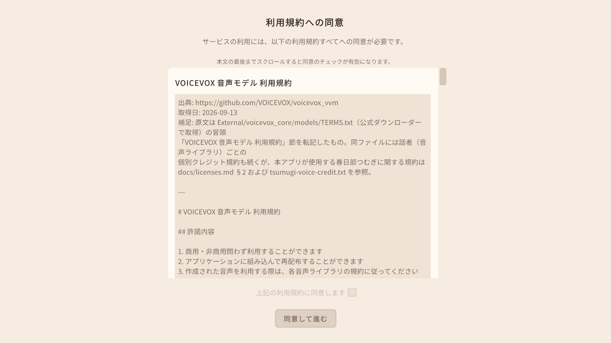
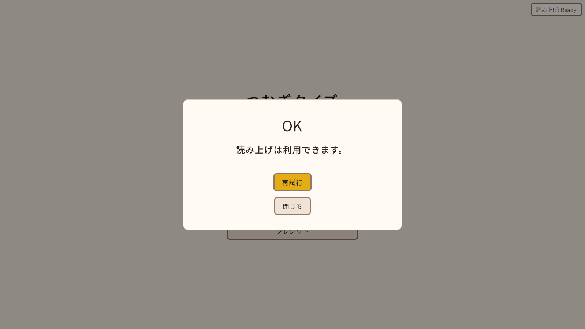
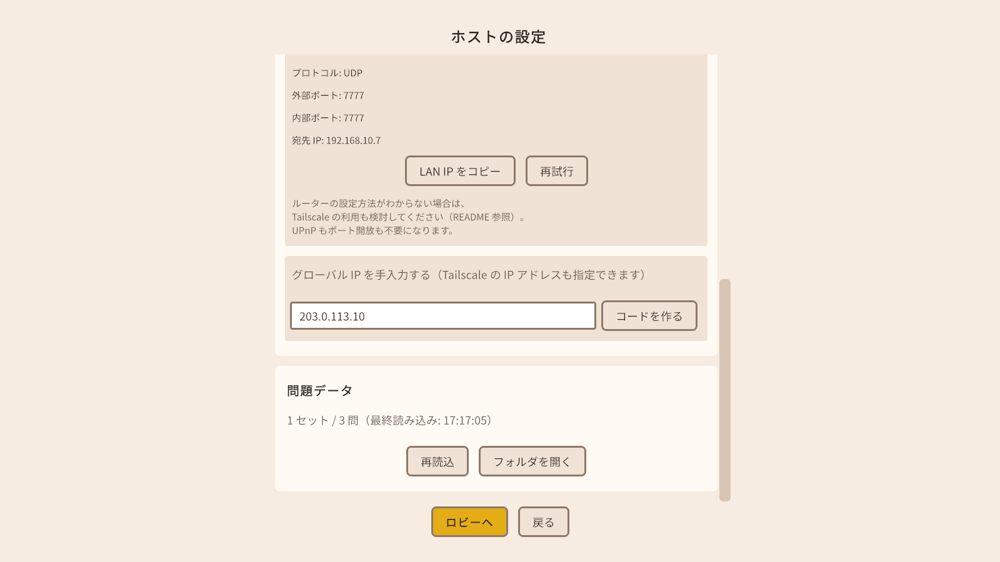

# つむぎクイズ セットアップ手順書

配布された zip を受け取ってから、遊べる状態にするまでの手順です。
遊び方（画面ごとの操作）は [操作手順書](usage.md) を見てください。

## もくじ

1. 必要なもの
2. zip を展開する
3. 初めて起動する
4. プレイヤー名を決める
5. 読み上げ（音声）を確かめる
6. 立ち絵を表示する（任意）
7. ホスト役の準備（インターネット越しに遊ぶとき）
8. アップデートするとき
9. 問題データの置き場所
10. アンインストール（データの場所）

---

## 1. 必要なもの

- Windows 10 / 11（64 ビット版）のパソコン
- 配布された zip ファイル（`TsumugiQuiz-v<バージョン>-win-x64.zip` という名前です）
- インターネット越しに遊ぶ場合は、ホスト役の人の回線で「ポート開放」ができること（7 章）

アカウント登録や、常に動いているサーバーは必要ありません。参加者の 1 人が「ホスト」になり、ほかの人はホストのパソコンに直接つなぎます。

> **全員が同じ zip を使ってください。** ホストと参加者で zip（ビルド）が違うと接続できません（8 章）。

---

## 2. zip を展開する

1. 受け取った zip を右クリックし、「すべて展開」を選びます。
2. 展開先は、自分のわかる場所（例: `ドキュメント` や `デスクトップ` の下）にします。
3. 展開したフォルダの中に、次のファイルとフォルダがあることを確かめます。

| 名前 | 内容 |
|---|---|
| `TsumugiQuiz.exe` | アプリ本体（これをダブルクリックして起動します） |
| `TsumugiQuiz_Data` フォルダ | アプリのデータ（音声合成のライブラリと音声モデルもここに入っています） |
| `UnityPlayer.dll` ほか | アプリの動作に必要なファイル |
| `README.txt` | 簡単な説明 |
| `LICENSE` / `NOTICE.md` | アプリの自作部分のライセンス（MIT License）と、その適用範囲 |
| `THIRD-PARTY-NOTICES.txt` | 使っているソフトウェア・素材の権利表記 |
| `manual` フォルダ | この手順書（`setup.html`）と操作手順書（`usage.html`） |
| `tools` フォルダ | 立ち絵の表情を作るツール（`tsumugi-expressions` フォルダ。使い方は 6.4） |

> zip の中のファイルを直接ダブルクリックせず、必ず展開してから起動してください。フォルダの中身は、どれか 1 つでも欠けると動きません。

---

## 3. 初めて起動する

`TsumugiQuiz.exe` をダブルクリックします。

### 3.1 「Windows によって PC が保護されました」と出たとき

このアプリには署名がないため、Windows の SmartScreen が警告を出すことがあります。
配布元が信頼できる場合は、「詳細情報」を押してから「実行」を押してください。

### 3.2 ファイアウォールの確認が出たとき

ホストを開始したときなどに、Windows セキュリティから次のような確認が出ることがあります（Windows の版によって文言やボタンの名前は違います）。

```
パブリック ネットワークとプライベート ネットワークにこのアプリへのアクセスを許可しますか？
```

ほかの人とつなぐために必要なので、許可してください。許可しないと、ほかのパソコンから接続できないことがあります。

許可しなかった・誤って閉じた場合は、Windows の設定で許可し直せます（この手順は開発者の環境では確かめていません。画面やボタンの名前は Windows の版で違うことがあります）。

1. 「Windows セキュリティ」→「ファイアウォールとネットワーク保護」→「ファイアウォールによるアプリケーションの許可」を開き、「設定の変更」を押します。
2. 一覧から `TsumugiQuiz`（展開したフォルダの `TsumugiQuiz.exe`）を探します。一覧に無いときは、「別のアプリの許可」から、展開したフォルダの `TsumugiQuiz.exe` を選んで追加します。
3. 遊ぶときにつないでいるネットワークの種類の列にチェックを入れます。自宅のネットワークなら、ふつうは「プライベート」です（どちらか分からないときは、Windows の設定の「ネットワークとインターネット」で、つないでいるネットワークの種類を確かめてください）。

### 3.3 利用規約に同意する

初めて起動すると「利用規約への同意」画面が出ます。読み上げの音声（VOICEVOX・春日部つむぎ）と立ち絵の利用規約で、**すべてに同意しないとアプリを使えません**。



1. 規約の本文を最後までスクロールします（最後まで読むと、チェックボックスが押せるようになります）。
2. 「上記の利用規約に同意します」にチェックを入れます。
3. 「同意して進む」を押すと、タイトル画面に進みます。

同意した内容は、あとから「設定」または「クレジット」の「利用規約の確認・撤回」で見直せます（[操作手順書](usage.md) の「設定画面」）。

### 3.4 画面の表示について

最初は全画面で起動します。ウィンドウ表示に切り替えたいときは `Alt` + `Enter` を押してください。切り替えた表示のしかた（全画面かウィンドウか）は保存され、次に起動したときも使われることがあります。
タイトル画面には終了ボタンがありません。アプリを閉じるときは `Alt` + `F4` を押してください。

---

## 4. プレイヤー名を決める

プレイヤー名は、ホストを始めるとき（「ホストの設定」画面）と、参加するとき（「参加コードで参加」画面）に入力します。一度入力すると、次からは前回の名前が最初から入っています。

先に決めておきたいときは、タイトル画面の「設定」→「アプリ設定」タブ →「プレイヤー」の「プレイヤー名」に入力して「保存」を押します。

- 1〜16 文字
- 見えない文字（制御文字など）や、記号を重ねすぎた文字は使えません
- 同じ部屋に同じ名前の人がいると参加できません。名前は参加者どうしで重ならないようにしてください

---

## 5. 読み上げ（音声）を確かめる

読み上げに使う音声合成（VOICEVOX）は zip に入っています。追加のダウンロードや設定はいりません。

1. タイトル画面の右上にある「読み上げ: 未確認」ボタンを押します。

   

2. 開いた画面で「確認する」を押します。
3. 「読み上げは利用できます。」と出れば準備完了です。「閉じる」で画面を閉じます。右上のボタンは「読み上げ: Ready」に変わります。

   

実際の声を聞いてみたいときは、タイトル画面の「問題エディタ」でサンプルの問題を選び、「読み上げを試す」を押します（[操作手順書](usage.md) の「問題エディタ」）。

### うまくいかないとき

| 表示 | すること |
|---|---|
| 「音声合成ライブラリが見つかりません。」「読み上げ用の辞書が見つかりません。」「音声モデルが見つかりません。」など | zip の展開に失敗している可能性があります。展開したフォルダを消して、zip をもう一度展開してください |
| 「利用規約への同意が必要です。」 | 「利用規約画面へ」を押して同意してください |

読み上げが使えなくてもクイズは遊べます。その場合は「読み上げなしで続行」を押して画面を閉じてください。問題文は画面に文字で表示されます。

---

## 6. 立ち絵を表示する（任意）

ゲーム画面の右側に、春日部つむぎの立ち絵を表示できます（6.4 の表情画像を作った場合はバストアップ、6.3 の方法で 1 枚だけ置いた場合は全身の絵になります）。**立ち絵がなくてもクイズはすべて遊べます。**

### 6.1 立ち絵が zip に入っていない理由

立ち絵の利用規約では「二次配布」が禁止されています。そのため、このアプリの zip には立ち絵の画像を入れていません。立ち絵から作った表情の画像も、作った本人のパソコンの中だけで使い、ほかの人には渡さないでください。

立ち絵を使いたい人は、**自分で公式の配布元から入手**してください。

### 6.2 立ち絵を入手する

1. 春日部つむぎ公式サイト（<https://tsumugi-official.studio.site/>）の案内に従って、公式立ち絵（`春日部つむぎ立ち絵_公式_v2.0.zip`）を入手します。
2. 立ち絵の利用規約（<https://tsumugi-official.studio.site/rule2>）と、zip の中の `readme.txt` を読んでください。

### 6.3 いちばん簡単な方法（1 枚だけ置く）

zip に入っている完成版の画像を 1 枚置くだけで、立ち絵が表示されます。

1. 立ち絵の zip をエクスプローラーで展開します（右クリック →「すべて展開」）。
2. 中の `春日部つむぎ立ち絵_公式_v2.0.png` をコピーし、名前を `tsumugi_v2.png` に変えて、次のフォルダに置きます（フォルダがなければ作ります）。

   ```
   %USERPROFILE%\AppData\LocalLow\Tomonorarari-Think\TsumugiQuiz\tsumugi\
   ```

   エクスプローラーのアドレス欄に上の文字をそのまま貼り付けると開けます。
3. アプリを起動し直します（起動中に置いた画像は、起動し直すまで表示されません）。

この方法では、どの場面でも同じ全身の絵が表示されます（正解・不正解などの場面では、色合いと ○・× の印で表します）。

### 6.4 場面ごとの表情（9 種類）を作る方法

待機・読み上げ中・回答権を取ったとき・正解・不正解・時間切れなど、場面ごとに表情を変えたいときは、入手した立ち絵の zip から 9 枚の表情画像を自分のパソコンで作ります。

作るためのツールは、このアプリの zip の `tools\tsumugi-expressions` フォルダに入っています（画像は入っていません。ツールのプログラムと設定だけです）。ツールは Python というプログラムの上で動くので、初めてのときだけ 6.4.1 と 6.4.2 の準備がいります。

流れは「**アプリを起動して利用規約に同意する → ツールで表情を作る → アプリを起動し直す**」です。ツールは、アプリで立ち絵の規約を含む利用規約に同意していないと動きません（6.4.3）。

| 用意するもの | 内容 |
|---|---|
| 立ち絵の zip | 6.2 で入手した `春日部つむぎ立ち絵_公式_v2.0.zip`（展開しないまま使えます） |
| アプリでの同意 | アプリの利用規約（立ち絵の規約を含む）に同意していること（3.3。6.4.3 で確かめます） |
| Python 3.10 以降 | 6.4.1 で入れます（無料） |
| インターネット接続 | 6.4.1 と 6.4.2 でダウンロードするときだけ |

#### 6.4.1 Python を入れる（初めてのときだけ）

1. Python の公式サイトのダウンロードページ（<https://www.python.org/downloads/>）を開き、Windows 用の Python をダウンロードします。
2. ダウンロードしたインストーラーを開き、画面の案内に従ってインストールします。
   - 最初の画面に、PATH に追加するかどうかを選ぶチェックボックスがあれば、チェックを入れてから「Install Now」を押します（ツールは `python` のほかに `py` というコマンドでも Python を探すので、チェックしなくても動くことがあります。うまくいかないときは、チェックを入れて入れ直してください）。
   - 「Python install manager」という名前のインストーラーで入れた場合は、6.4.2 で初めてツールを動かしたときに Python 本体のダウンロードが始まったり、確認を求められたりすることがあります。画面の案内に従ってください。
3. インストールが終わったら、インストーラーを閉じます。

> 開発者の環境で確かめたのは、従来のインストーラーで入れた Python 3.14 です。Python install manager で入れた場合の動きは、Python の公式ドキュメントに基づいて書いています。

#### 6.4.2 ライブラリを入れる（初めてのときだけ）

画像を作るのに使うライブラリ（psd-tools と Pillow。どちらも無料）を、インターネットからダウンロードして入れます。

1. アプリのフォルダ（zip を展開したフォルダ）の `tools` → `tsumugi-expressions` を開きます。
2. `install-libraries.bat` をダブルクリックします。黒い画面が開き、ダウンロードが進みます（数分かかることがあります）。
3. 「ライブラリを入れました。」と出たら、何かキーを押して画面を閉じます。

> ダブルクリックしたときに「セキュリティの警告」や「Windows によって PC が保護されました」が出ることがあります。配布元が信頼できる場合は、「実行」を押します（「詳細情報」が出ているときは、それを押してから「実行」を押します）。

#### 6.4.3 アプリで利用規約に同意する

ツールは、アプリでの同意の記録を確かめてから動きます。まだ同意していないときは、先に次の手順で同意します。

1. `TsumugiQuiz.exe` を起動し、利用規約への同意画面で、立ち絵の規約を含むすべての規約に同意します（3.3）。すでに同意していれば、この手順はいりません。
2. 同意画面の「規約ページを開く」から立ち絵の利用規約を読み、立ち絵の zip の中の `readme.txt` も読んでおきます（6.2）。

同意を撤回した場合や、アプリを新しくして規約が変わった場合（もう一度同意画面が出ます）は、もう一度同意するまでツールは動きません。

#### 6.4.4 表情を作る

1. 立ち絵の zip（`春日部つむぎ立ち絵_公式_v2.0.zip`）を、展開しないまま `tools\tsumugi-expressions` フォルダの `make-expressions.bat` の上にドラッグ＆ドロップします。
   - 立ち絵の zip がダウンロード フォルダに入っているときは、`make-expressions.bat` をダブルクリックするだけでも動きます（ダウンロード フォルダの `春日部つむぎ立ち絵` で始まる名前の zip を使います）。
   - 立ち絵の zip を展開済みのときは、展開したフォルダや `.psd` ファイルをドラッグ＆ドロップしても動きます。
   - 置き場所のフォルダ名やファイル名に `&` が入っていると、ドラッグ＆ドロップでうまく渡らないことがあります（Windows のコマンドの制限です）。そのときは、zip をダウンロード フォルダに置いて `make-expressions.bat` をダブルクリックしてください。
2. 黒い画面に「同意の確認: …同意済みです。」「書き出し: …」が 9 行出て、最後に「完了しました。」と出たら、何かキーを押して画面を閉じます。
3. アプリを起動し直します（起動中に作った画像は、起動し直すまで表示されません）。

画像は 6.3 と同じフォルダ（`%USERPROFILE%\AppData\LocalLow\Tomonorarari-Think\TsumugiQuiz\tsumugi\`）に、次の 9 枚ができます。同じ名前の画像がすでにあるときは上書きします（作り直したいときは、もう一度ドラッグ＆ドロップするだけです）。

| ファイル | 場面 |
|---|---|
| `tsumugi_idle.png` | 待機 |
| `tsumugi_reading.png` | 読み上げ中 |
| `tsumugi_buzz_self.png` | 自分が回答権を取った |
| `tsumugi_buzz_other.png` | ほかの人が回答権を取った |
| `tsumugi_wrong_moment.png` | 誤答の瞬間 |
| `tsumugi_correct.png` | 正解 |
| `tsumugi_wrong.png` | 不正解 |
| `tsumugi_timeout.png` | 時間切れ |
| `tsumugi_no_eligible.png` | 回答できる人がいない |

このツールは、PSD にもともと入っている表情（目・口・眉・飾り）の表示を切り替え、バストアップの範囲を切り出して縮小するだけです。服装を変えるなどの加工はしません（制服が表示され、私服が表示されていないことを確かめてから書き出し、そうでなければ 1 枚も書き出さずに止まります）。作業中は PSD を Windows の一時フォルダに取り出し、終わったら消します。

> **守ること**: 立ち絵の zip や作った画像を、アプリのフォルダの中に置かないでください。アプリのフォルダを丸ごとほかの人に渡したときに、一緒に渡ってしまいます（二次配布になります）。ツールも、アプリのフォルダの中には画像を書き出しません。

#### 6.4.5 うまくいかないとき

| 表示 | すること |
|---|---|
| 「先にアプリ（TsumugiQuiz.exe）を起動し、立ち絵の規約を含む利用規約に同意してください。」（終了コード 5） | 6.4.3 の手順でアプリを起動して同意してから、もう一度ツールを実行してください。続けて出る行に理由（記録が無い・撤回している・規約が更新された・記録が壊れている）が出ます |
| 「Python 3.10 以降が見つかりません。」 | Python が入っていません。6.4.1 の手順で入れてください。「Microsoft Store を開くためのエイリアスだけ」と出ている場合も同じです（Windows には、Python が入っていなくても `python` という名前だけがあることがあります）。入れたあとも同じ表示が出るときは、パソコンを再起動してから試してください |
| 「見つかった Python が古すぎます」 | 6.4.1 の手順で新しい Python を入れてください |
| 「画像を作るのに使うライブラリ（psd-tools・Pillow）が入っていません。」 | 6.4.2 の `install-libraries.bat` を先に実行してください |
| 「ライブラリを入れられませんでした」 | インターネットにつながっているか確かめて、もう一度 `install-libraries.bat` を実行してください |
| 「立ち絵の zip が見つかりません。」「指定したファイル・フォルダが見つかりません」 | 立ち絵の zip を `make-expressions.bat` の上にドラッグ＆ドロップしてください。名前に `&` が入った場所からドラッグ＆ドロップした場合は、zip をダウンロード フォルダに置いて `make-expressions.bat` をダブルクリックしてください |
| 「zip の中に立ち絵の PSD … が見つかりません」「zip を開けません」 | 公式の立ち絵の zip（`春日部つむぎ立ち絵_公式_v2.0.zip`）か確かめてください。ダウンロードが途中で止まっていた場合は、入手し直してください |
| 「禁止グループ…」「表示が必須のグループ…」（終了コード 4） | PSD が想定と違う状態のため、安全のために止めました。公式の配布元から入手した zip をそのまま使ってください |
| 「出力先がアプリのフォルダの中です」 | 出力先を指定せずに（ドラッグ＆ドロップだけで）実行してください |

### 6.5 アプリで表示する

立ち絵を表示するには、次の 2 つがそろっている必要があります。

- 利用規約（立ち絵の規約を含む）に同意していること（3.3）
- 「設定」→「アプリ設定」→「立ち絵」の「立ち絵を表示する」が ON になっていること（最初から ON です）

表示したくないときは「立ち絵を表示する」を OFF にして「保存」を押します。

---

## 7. ホスト役の準備（インターネット越しに遊ぶとき）

同じ家・同じ Wi-Fi の中で遊ぶときは、この章の準備はいりません。ホストの画面に出る「LAN 用」の参加コードを使ってください。

離れた場所の人と遊ぶときは、ホスト役の人の回線に、外からつなげるようにする必要があります。次の順に試してください。

### 7.1 自動ポート開放（UPnP）

ホストを開始すると、アプリが自動でルーターのポートを開けようとします（UPnP / NAT-PMP）。
「ホストの設定」画面の「自動ポート開放:」が「成功（…）」になっていれば、「インターネット用」の参加コードをそのまま配れます。

### 7.2 手動でポートを開放する

「自動ポート開放に失敗しました。」と出たときは、「ホストの設定」画面に出る案内のとおりに、ルーターの設定画面でポートを開放します（設定のしかたはルーターの説明書を見てください）。

| 項目 | 値 |
|---|---|
| プロトコル | UDP |
| 外部ポート | 7777（ポート番号を変えた場合はその番号。画面に出る値に合わせます） |
| 内部ポート | 外部ポートと同じ番号 |
| 宛先 IP | ホストのパソコンの LAN の IP アドレス（画面の「LAN IP をコピー」でコピーできます） |



手動でポートを開放した場合は、「自動ポート開放」の表示が失敗のままでも、「インターネット用」の参加コードでつながります。ルーターの UPnP を有効にしたときは、「再試行」を押すと自動ポート開放をやり直します。

グローバル IP アドレスが取れなかったときは、「グローバル IP を手入力する」欄に自分のグローバル IP アドレスを入れて「コードを作る」を押すと、インターネット用の参加コードができます。
（アプリはグローバル IP アドレスを調べるために `https://api.ipify.org` に問い合わせます。）

「この回線は CGNAT のため…」と出た場合は、その回線ではポート開放ができません。次の Tailscale を使ってください。

### 7.3 Tailscale を使う

ルーターの設定ができないときや、CGNAT の回線（一部のモバイル回線・マンションの回線など）では、[Tailscale](https://tailscale.com/)（無料の VPN アプリ。アプリには入っていません）を使うと、ポート開放なしでつなげる見込みです。参加者全員がそれぞれ入れる必要があります。

> この手順は Tailscale の公式ドキュメントに基づいて書いたもので、開発者の環境では実機で確かめていません。うまくいかないときは、[Tailscale の公式ドキュメント](https://tailscale.com/kb/1017/install) も見てください。

**ホスト役**

1. [Tailscale のダウンロードページ](https://tailscale.com/download) から Windows 版を入れます。
2. Tailscale を起動し、Google などのアカウントでログインします。
3. Tailscale のメニューで、自分の Tailscale の IP アドレス（`100.` で始まる番号）を確かめます。
4. 「ホストの設定」画面の「グローバル IP を手入力する（Tailscale の IP アドレスも指定できます）」欄に、その IP アドレスを入れて「コードを作る」を押します。
5. できた参加コードを参加者に送ります。

**参加者**

1. ホストと同じように Tailscale を入れてログインします。
2. ホストから招待を受けて、ホストと同じ Tailscale のネットワーク（Tailnet）に入ります。
3. 送られた参加コードで参加します。

Tailscale の無料プラン（Personal）は、2026 年 9 月 17 日の時点で最大 6 ユーザーまでです（[料金ページ](https://tailscale.com/pricing)）。このアプリは最大 12 人で遊べますが、7 人以上だと Tailscale の無料プランに入りきらないことがあります。

---

## 8. アップデートするとき

新しい zip を受け取ったら、**参加者全員**が同じ zip に入れ替えてください。

1. アプリを閉じます。
2. 古いフォルダを消して（またはフォルダの名前を変えて）、新しい zip を展開します。
3. 起動すると、設定・利用規約への同意・問題データ・立ち絵はそのまま使えます（どれもアプリのフォルダとは別の場所に保存されているためです。10 章）。利用規約の内容が変わっていた場合は、もう一度同意画面が出ます。

ホストと参加者の zip（ビルド）が 1 つでも違うと、参加しようとしたときに次のように表示されて接続できません。

```
バージョンが異なります（ホスト: 12345 / あなた: 54321）。
```

数字はふつう「ビルド番号」です（アプリの通信の版が違う場合も同じ文言になり、そのときは通信の版を表す小さな番号が出ます。どちらの場合も、全員が同じ zip にそろえれば直ります）。タイトル画面の「クレジット」を開き、いちばん下の「アプリ情報」に出る「バージョン: …（ビルド番号 …）」をホストと見比べてください。番号が違う人は、ホストと同じ zip に入れ替えてください。同じソースから作り直した zip でも、ビルドが違えば番号も変わります。

アップデートのあと、ファイアウォールの確認がもう一度出ることがあります。そのときも許可してください（3.2）。

---

## 9. 問題データの置き場所

問題は、ホストのパソコンの次のフォルダにある JSON ファイルから読み込みます。

| 場所 | 内容 |
|---|---|
| `ドキュメント\TsumugiQuiz\Questions\` | 問題セット（`*.json`） |
| `ドキュメント\TsumugiQuiz\Questions\images\` | 問題で使う画像（PNG / JPG） |
| `ドキュメント\TsumugiQuiz\Presets\` | ルーム設定のプリセット |

- 初めて起動したときにフォルダが作られ、サンプルの問題セット（`sample-questions.json`、3 問）が入ります。
- OneDrive でドキュメントフォルダを同期している場合は、OneDrive 側のドキュメントフォルダになります。
- 問題を使うのはホストだけです。参加者のパソコンに問題ファイルを置く必要はありません（問題と画像はホストから届きます）。
- 「ホストの設定」画面と「問題エディタ」の「フォルダを開く」で、このフォルダをエクスプローラーで開けます。
- 問題の作り方は [操作手順書](usage.md) の「問題エディタ」を見てください。

---

## 10. アンインストール（データの場所）

インストーラーはありません。次のフォルダを消せばアンインストールできます。

| 場所 | 中身 | 消すと |
|---|---|---|
| zip を展開したフォルダ | アプリ本体 | アプリが消えます |
| `%USERPROFILE%\AppData\LocalLow\Tomonorarari-Think\TsumugiQuiz\` | アプリ設定（`app-settings.json`）、利用規約への同意（`consent.json`）、再接続用の情報、読み上げのキャッシュ、立ち絵（`tsumugi` フォルダ）、ログ（`Player.log`） | 設定と同意が消え、次に起動したときに同意画面からやり直しになります |
| `ドキュメント\TsumugiQuiz\` | 問題セット・画像・プリセット | **自分で作った問題も消えます。** 残したいものは先にコピーしてください |

このほかに、Windows のレジストリ（`HKEY_CURRENT_USER\Software\Tomonorarari-Think\TsumugiQuiz`）に画面の大きさなどの情報が残ります。気になる場合は、レジストリエディターでこのキーを消してください（消さなくても困ることはありません）。
