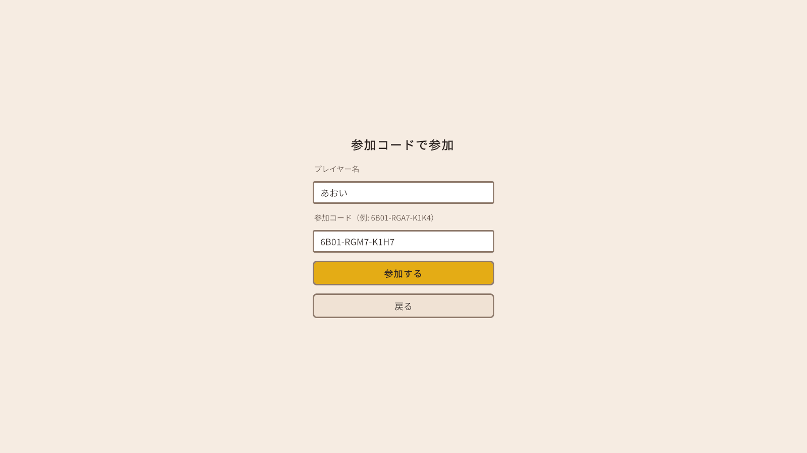
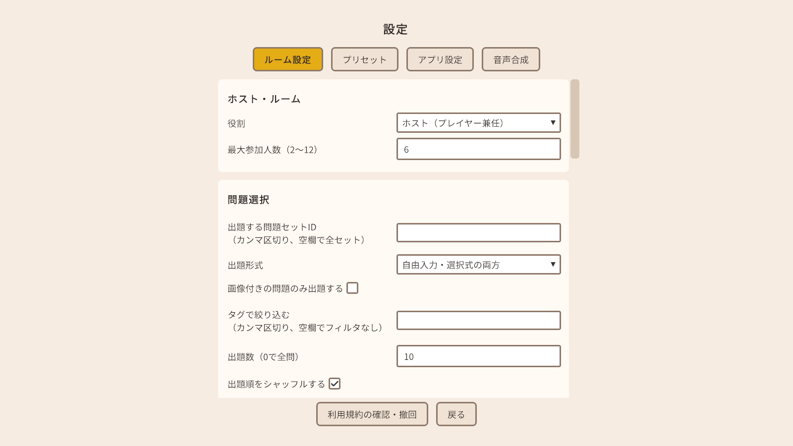
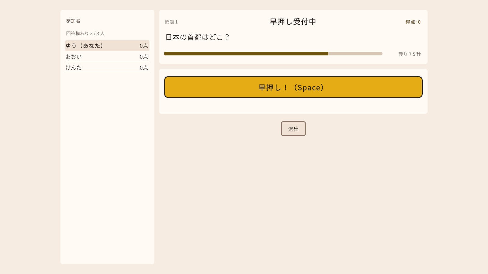
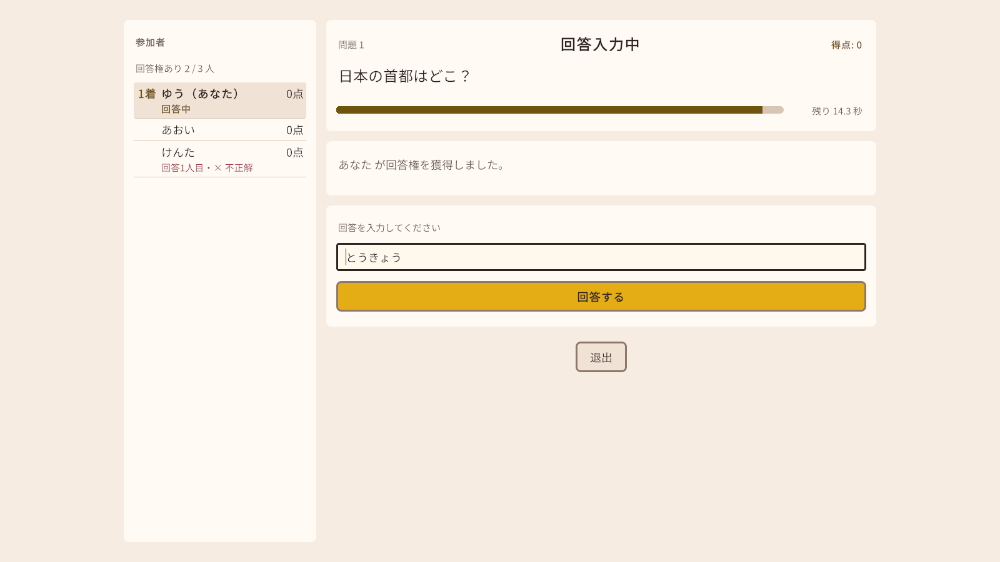
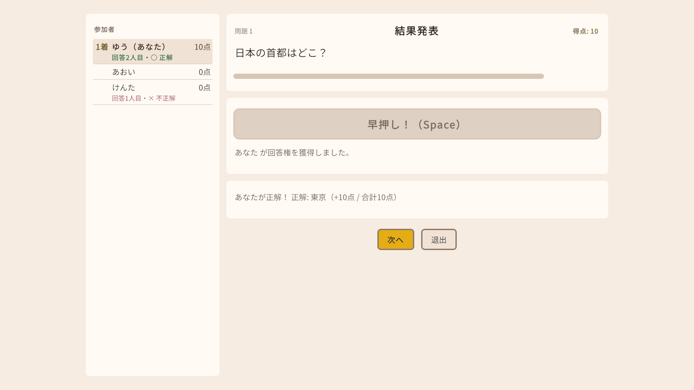
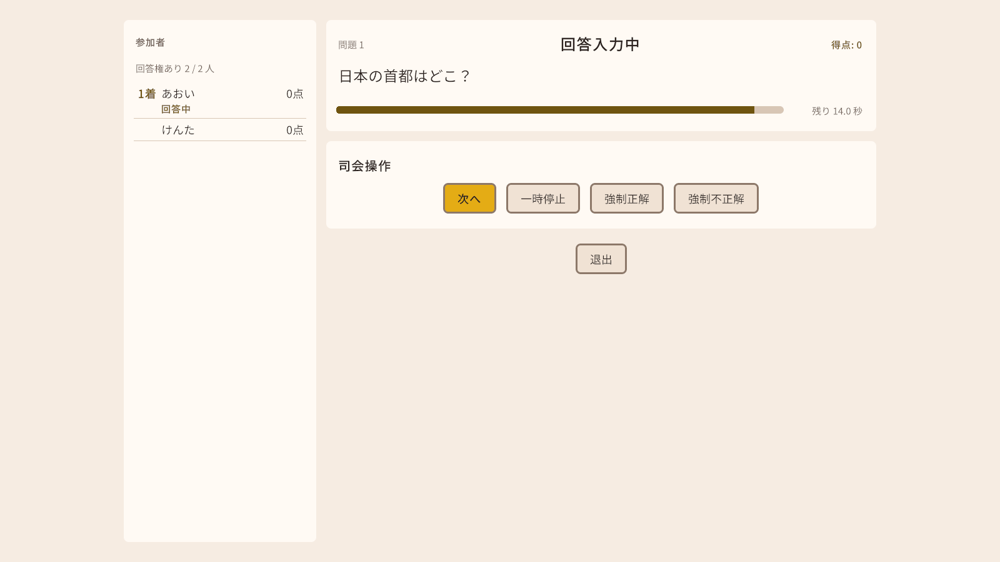
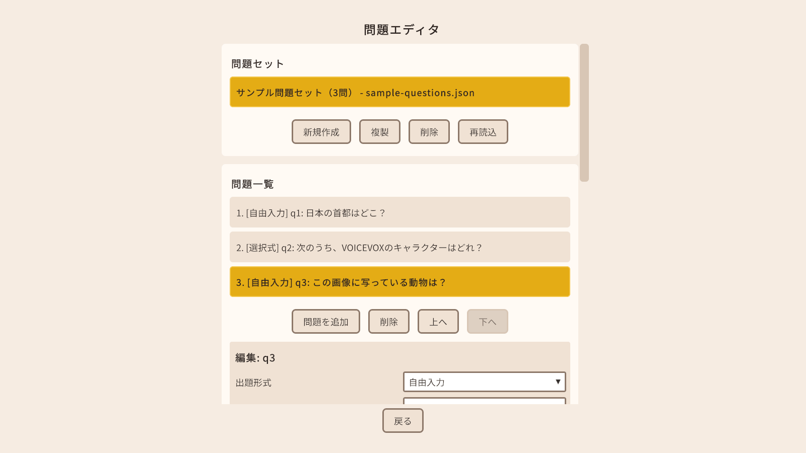
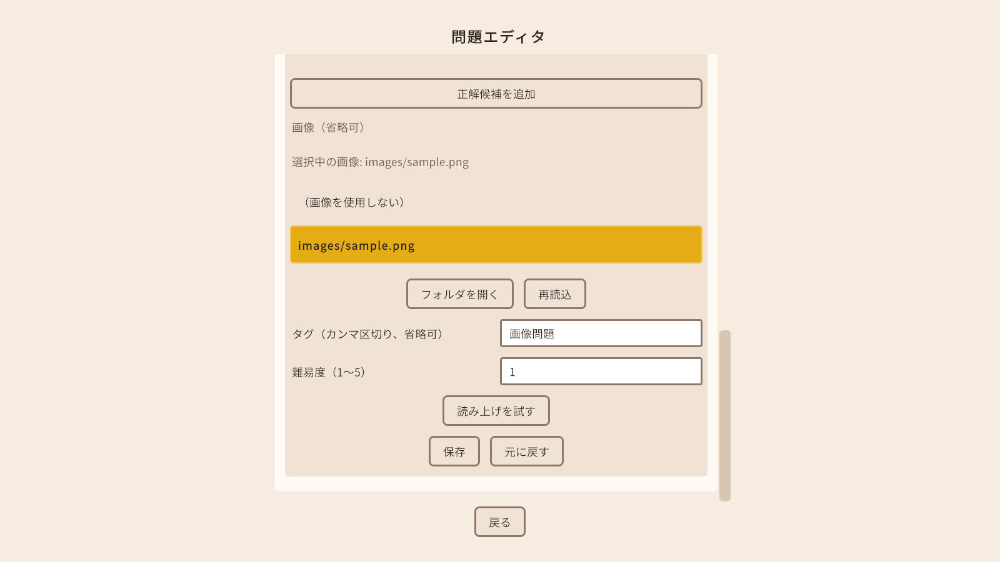

# つむぎクイズ 操作手順書

アプリの画面ごとの操作方法です。インストールや初回の準備は [セットアップ手順書](setup.md) を見てください。

## もくじ

1. 遊び方の流れ
2. タイトル画面
3. ホストとして部屋を作る
4. 参加する
5. ロビー
6. ルーム設定
7. ゲーム画面の見方
8. 早押しで答える（自由入力の問題）
9. 選択式の問題
10. 回答の入力と正解の判定
11. 司会の操作（司会専任モード）
12. 結果画面
13. 設定画面
14. 問題エディタで問題を作る
15. 困ったとき

---

## 1. 遊び方の流れ

1. ホスト役の 1 人が「ホストとして開始」で部屋を作り、画面に出た**参加コード**をほかの人に送ります。
2. ほかの人は「参加コードで参加」で、送られた参加コードを入力して参加します。
3. 全員がロビーにそろったら、ホストが「ゲーム開始」を押します。
4. 問題が出たら、早押しで回答権を取って答えます（選択式の問題は全員が選んで答えます）。
5. 全問終わると結果画面で順位が出ます。

---

## 2. タイトル画面

| ボタン | すること |
|---|---|
| ホストとして開始 | 部屋を作ります（3 章） |
| 参加コードで参加 | ほかの人の部屋に参加します（4 章） |
| 問題エディタ | 問題を作ったり直したりします（14 章） |
| 設定 | ルーム設定・プリセット・アプリ設定・音声合成の状態確認（13 章） |
| クレジット | 使っている音声・素材・ソフトウェアの権利表記、利用規約への同意状況、アプリのバージョンとビルド番号 |
| 右上の「読み上げ: …」 | 読み上げ（音声合成）の状態を確認します（[セットアップ手順書](setup.md) の 5 章） |

アプリを閉じるときは `Alt` + `F4` を押してください。

---

## 3. ホストとして部屋を作る

タイトル画面で「ホストとして開始」を押すと、「ホストの設定」画面が出ます。

1. 「プレイヤー名」に自分の名前を入れます。
2. 自分は答えずに進行役だけをするときは、「司会専任（自分はプレイヤーとして参加しない）」に チェックを入れます（11 章）。
3. 「ポート番号」は、ふつうは最初の 7777 のままにします。
4. 「ホストを開始」を押します。
5. 「参加コード」の欄に、2 種類の参加コードが出ます。参加する人に合わせて「コピー」を押し、チャットなどで送ってください。

| 参加コード | 使う相手 |
|---|---|
| インターネット用 | 離れた場所から参加する人 |
| LAN 用 | 同じ家・同じ Wi-Fi の中から参加する人 |

参加コードは `6B01-RGA7-K1K4` のような 12 文字（4 文字ずつハイフンで区切ったもの）です。ホストのパソコンのアドレスとポート番号が入っているので、**遊ぶ相手以外には教えないでください**。

6. 「ロビーへ」を押してロビーに進みます（参加者はホストがロビーにいなくても参加できます）。

「自動ポート開放に失敗しました。」「グローバル IP が未取得のため…」などと出たときは、[セットアップ手順書](setup.md) の 7 章を見てください。

画面の下の「問題データ」には、読み込んだ問題の数（「○ セット / ○ 問」）が出ます。問題ファイルを足したり直したりしたときは「再読込」を押します。読み込めなかったファイルがあると、ここに理由が出ます。

「戻る」を押すと「ホストを停止して戻りますか？参加者は切断されます。」と確認が出ます。「はい、戻る」でホストを止めてタイトル画面に戻ります。

---

## 4. 参加する

タイトル画面で「参加コードで参加」を押します。

1. 「プレイヤー名」に自分の名前を入れます（ほかの参加者と同じ名前は使えません）。
2. 「参加コード」に、ホストから送られたコードを貼り付けます。
   - 小文字で入力しても、ハイフンの代わりに空白を入れても、全角で入力しても構いません。
   - 数字の `0` を英字の `O` と、`1` を `I` や `L` と打ち間違えても、そのまま読み取れます。
3. 「参加する」を押します。つながるとロビーに進みます。

つながらないときは、画面に理由が出ます（15 章）。

### 途中で切れてしまったとき

切断してから 60 秒以内に、**同じパソコンから、同じ名前**と同じ参加コードで参加し直すと、もとの席に戻れます（得点も戻ります）。もとの席に戻るための情報はそのパソコンの中に保存されているので、別のパソコンから参加し直した場合は、新しい参加者として扱われます。60 秒を過ぎると、新しい参加者として扱われます（得点は 0 からになります）。

---

## 5. ロビー

参加者がそろうのを待つ画面です。

- 「参加者」に、参加している人の一覧が出ます。名前の横に「ホスト」「司会」「あなた」「切断中」の印が付きます。人数は「接続中 ○ 人 / 定員 ○ 人」と出ます。
- 「参加コード」（ホストだけに見えます）: 参加コードをもう一度コピーできます。
- 「ルーム」（ホストだけに見えます）: 自分の役割と、「ゲーム進行中の途中参加を許可する」の切り替えがあります。途中参加は最初は許可していません。ゲームの途中で入ってくる人がいそうなときは、ゲームを始める前に ON にしてください。
- 「切断中のエントリを削除」（ホストだけ、切断中の人がいるときに出ます）: 切断した人の席を消します。消した人は、参加し直すと新しい参加者になります。

| ボタン | すること |
|---|---|
| ゲーム開始（ホストだけ） | ゲームを始めます。参加者全員がゲーム画面に移ります |
| ルーム設定（参加者は「ルーム設定を見る」） | ルーム設定を開きます（6 章）。参加者は見るだけで、変えられません |
| 退出 | 部屋から出てタイトル画面に戻ります。ホストが退出すると、参加者は全員切断されます |

ホストの接続が切れたときは、ロビーに理由が出て、ボタンは「タイトルへ戻る」だけになります。

---

## 6. ルーム設定

ホストがロビーで「ルーム設定」を押すと、設定画面の「ルーム設定」タブが開きます。値を変えたら、いちばん下の「適用」を押してください。「設定を適用しました（参加者全員に反映されます）。」と出れば完了です。

- ゲームが始まると設定は固定され、ロビーに戻るまで変えられません。
- タイトル画面の「設定」から変えた値は、このパソコンに保存され、次にホストを開始したときに使われます。
- 範囲の外の値を入れると、範囲の端の値に直され、注意が出ます。

### 主な項目

| 項目 | 最初の値 | 説明 |
|---|---|---|
| 役割 | ホスト（プレイヤー兼任） | 「司会専任」にすると、ホストは答えずに進行だけをします（11 章） |
| 最大参加人数（2〜12） | 6 | 部屋に入れる人数。司会専任のホストは数に入りません |
| 出題する問題セットID | 空欄（全セット） | 使う問題セットを絞るときに、問題ファイルの `setId` をカンマ区切りで書きます（サンプルは `sample-set-01`） |
| 出題形式 | 自由入力・選択式の両方 | 「自由入力のみ」「選択式のみ」も選べます |
| 画像付きの問題のみ出題する | OFF | |
| タグで絞り込む | 空欄（絞り込まない） | 書いたタグのどれかが付いた問題だけを出します（カンマ区切り） |
| 出題数（0で全問） | 10 | 問題が足りないときは、ある分だけ出ます |
| 出題順をシャッフルする | ON | |
| 選択肢の表示順をシャッフルする | ON | 人によって選択肢の並びが変わります |
| 早押し受付のタイムアウト（秒） | 10 | 早押しの受付が始まってから、誰も押さないときに締め切るまでの秒数 |
| 自由入力の回答制限時間（秒） | 15 | 回答権を取ってから入力できる時間 |
| 選択式の回答制限時間（秒） | 20 | 選択式で選べる時間 |
| 正解時の加点 | 10 | |
| 誤答時の得点変化 | 0 | 間違えたときに増減する点（マイナスも書けます） |
| お手つきペナルティ | 次の問題は休み | 間違えたときの罰です。「次の問題は休み」「減点」「ペナルティなし」から選びます。選択式で間違えたときも同じです |
| 減点幅（ペナルティが「減点」のとき） | -5 | |
| 読み上げを有効にする | ON | OFF にすると問題文を読み上げません |
| 読み上げ速度（0.5〜2.0） | 1.0 | |
| 読み上げなしの問題文の文字送り（ミリ秒/文字、0で一括表示） | 80 | 読み上げをしない部屋で、問題文を 1 文字ずつ出す速さ。0 にすると全文をすぐに出します |
| 読み上げ中でも早押しを受け付ける | ON | OFF にすると、読み上げが終わってから早押しを受け付けます |
| 誤答後、残り時間があれば早押しを再開放する | ON | 誰かが間違えたあと、ほかの人がもう一度押せるようにします |
| 結果表示から自動で次へ進む秒数（0で手動） | 5 | 0 にすると、ホスト（司会）が「次へ」を押すまで次の問題に進みません |
| ゲーム進行中の途中参加を許可する | OFF | ゲームの途中では変えられません。ロビーで、ゲームを始める前に決めます |
| ゲーム画面の参加者一覧に全員の得点を表示する | ON | OFF にすると参加者パネルに他人の得点を出しません（自分の得点、司会の画面、結果画面には出ます） |

「読み上げ準備完了の待ち上限」「再生開始の先行時間」「詳細設定」の「早押し集計窓」は、ふつうは変えなくて構いません。

### プリセット

「プリセット」タブでは、ルーム設定の組み合わせを読み込んだり保存したりできます。

| プリセット | 内容 |
|---|---|
| 標準 | 最初の設定のまま |
| 早押し重視 | 読み上げが終わってから早押しを受け付け、制限時間を短くします（早押し 6 秒・自由入力 8 秒・選択式 10 秒）。間違えると 5 点減点。結果は 3 秒で次へ |
| のんびり | 制限時間を長くします（早押し 20 秒・自由入力 30 秒・選択式 40 秒）。間違えても罰なし。結果は 8 秒で次へ |

1. プリセットを選んで「読み込む」を押します。
2. 「ルーム設定」タブで内容を確かめ、「適用」を押します（読み込んだだけでは参加者に反映されません）。

今の設定を残したいときは、「保存する名前」に名前を入れて「現在の設定を保存」を押します。保存したプリセットは「削除」で消せます（もう一度「削除」を押すと消えます。組み込みの 3 つは消せません）。

---

## 7. ゲーム画面の見方

ゲーム画面は 3 列に分かれています。

| 場所 | 内容 |
|---|---|
| 左: 参加者パネル | 参加者の一覧と、今の問題での状態 |
| 中央の上 | 問題の画像（画像付きの問題のときだけ） |
| 中央 | 問題の番号（「問題 1」など）、今の段階（「早押し受付中」など）、自分の得点、問題文、残り時間、早押しボタン・回答欄・選択肢、判定の結果 |
| 右 | 春日部つむぎの立ち絵（[セットアップ手順書](setup.md) の 6 章で用意した人だけ。用意していないときは右の列はなく、中央の列が真ん中に寄ります） |
| 下 | 「次へ」（ホストだけ）と「退出」 |

### 参加者パネル

参加した順に並び、自分の行には「（あなた）」が付きます。状態は次のように表示されます。

| 表示 | 意味 |
|---|---|
| 1着、2着… | 早押しを押した順番 |
| 回答中 | 回答権を取って答えています |
| ○ 正解 | 正解しました |
| × 不正解 | 間違えました（この問題ではもう押せません） |
| 回答○人目 | 何番目に答えたか（2 人以上が答えたとき） |
| 同着 | 1 着の人とまったく同時に押しました（回答権は抽選で決まりました） |
| 休み（お手つき） | 前の問題で間違えたので、この問題は休みです |
| 回答済み | 選択式で、もう選びました（何を選んだかは判定まで出ません） |
| 未回答 | 選択式で、まだ選んでいません |
| 切断中 | 接続が切れています |

パネルの上には「回答権あり ○ / ○ 人」（自由入力）や「回答済み ○ / ○ 人」（選択式）が出ます。得点の表示はルーム設定（6 章）で切り替えられます。

### 段階の表示

「問題文表示中」→「早押し受付中」→「回答権確定」→「回答入力中」→「判定中」→「結果発表」の順に進みます。選択式は「選択中」になります。

---

## 8. 早押しで答える（自由入力の問題）

1. 問題文が読み上げに合わせて 1 文字ずつ出ます（読み上げのない部屋では、決まった速さで出ます）。
2. 「早押し受付中」になったら、**`Space` キー**か「早押し！（Space）」ボタンで押します（最初の設定では、読み上げの途中でも押せます）。

   

3. いちばん早く押した人に回答権が移り、「○○ が回答権を獲得しました。」と出ます。まったく同時（1000 分の 1 秒未満の差）に押した人がいると、抽選で決まります。
4. 回答権を取った人の画面に回答欄が出ます。15 秒以内に答えを入力し、「回答する」ボタンか `Enter` キーで送ります（10 章）。日本語入力を使っているときは、変換を確定してから `Enter` を押してください（迷ったら「回答する」ボタンを押してください）。

- 間違えた人は、その問題ではもう押せません。残り時間があれば、ほかの人がもう一度押せます（「○○ はお手つきです。他のプレイヤーの早押しを再開放します。」）。
- 最初の設定では、間違えた人は**次の問題が休み**になります（6 章「お手つきペナルティ」）。
- 誰も押さないまま時間が過ぎると「時間切れ… 正解: ○○」になります。
- 押せる人が全員間違えたり休みだったりして、答えられる人がいなくなると、時間を待たずに「回答できる人がいないため締め切りました。正解: ○○」で締め切ります。

判定が出ると、問題文の下に正解と得点が出ます。最初の設定では 5 秒後に次の問題に進みます。ホストは「次へ」を押すとすぐに次に進めます。

---

## 9. 選択式の問題

1. 選択式の問題には早押しはありません。「選択中」の間に、全員が選択肢のボタンを 1 つ押します。
2. **選べるのは 1 回だけです**。押したあとは変えられません。
3. 制限時間（最初の設定は 20 秒）が来ると、全員の答えをまとめて判定します。全員が選び終わっても、時間までは待ちます。
4. 「正解: ○○ / あなたは正解でした（+10点 / 合計10点）」のように結果が出ます。選ばなかったときは「（あなたは選択しませんでした）」と出ます。正解の選択肢は緑、自分が選んで外れた選択肢は赤で表示されます。

選択肢の並びは人によって違うことがあります（6 章「選択肢の表示順をシャッフルする」）。

---

## 10. 回答の入力と正解の判定

自由入力の問題では、入力した答えが、問題に登録された正解のどれかと一致すれば正解です。次の違いは気にせず判定されます。

- ひらがなとカタカナ（「トウキョウ」と「とうきょう」は同じ）
- 全角と半角（「ｔｏｋｙｏ」と「tokyo」は同じ）
- 英字の大文字と小文字
- 空白（「東京 です」と「東京です」は同じ）

次の違いは区別されます（一致しないと不正解です）。

- 漢字とかな（「東京」と「とうきょう」は別。問題に両方が正解として登録されていれば、どちらでも正解です）
- 伸ばす音（「ー」）、濁点・半濁点、小さい文字（「っ」「ゃ」など）

回答は 100 文字までです。空のままでは送れません。

---

## 11. 司会の操作（司会専任モード）

ホストが「司会専任」になると、ホストは早押しや回答をせず、進行役になります。司会は参加者パネルには出ません。司会の画面には、早押しボタンの代わりに「司会操作」が出ます。司会の画面では、問題文は 1 文字ずつではなく最初から全部出ます。また、参加者パネルに全員の得点が必ず出ます。

| ボタン | すること |
|---|---|
| 次へ | 結果が出ているときに、次の問題に進みます |
| 一時停止 / 再開 | 進行を止めます。止めている間は全員の画面に「一時停止中」と出て、押す・答える・選ぶことができません。もう一度押すと再開します（問題文を読み上げている間は止められません） |
| 強制正解 / 強制不正解 | 回答権を取った人が答えを入力している間に押すと、その人を正解・不正解にします（選択式では使えません） |

司会専任にするには、「ホストの設定」画面の「司会専任（自分はプレイヤーとして参加しない）」にチェックを入れてからホストを開始するか、ロビーで「ルーム設定」の「役割」を「司会専任」にして「適用」します。

---

## 12. 結果画面

全問が終わると、結果画面に順位が出ます。

- 得点の高い順に「1 位」「2 位」…と並びます。同じ点の人は同じ順位です。
- ホストの画面には「もう一度（同じ設定で）」と「ロビーへ戻る」が出ます。参加者は「ホストの操作をお待ちください…」と出て、ホストの操作を待ちます。

---

## 13. 設定画面

タイトル画面の「設定」で開きます。上のタブで切り替えます。

### ルーム設定タブ / プリセットタブ

6 章を見てください。

### アプリ設定タブ

このパソコンだけの設定です。変えたら「保存」を押します。

| 項目 | 説明 |
|---|---|
| プレイヤー名 | ホスト開始・参加のときに最初から入る名前 |
| UPnP・ネットワーク到達性 | 自動ポート開放をするかどうかなど。ふつうは変えません |
| 読み上げ（アプリ設定） | 話者名・スタイル名・キャッシュの上限など。ふつうは変えません |
| 立ち絵を表示する | 立ち絵を表示するかどうか（最初は ON） |
| 詳細設定 | ホストの待ち受けポート、先読みする問題数 |

### 読み上げと文字送り

- 読み上げをする・しない、読み上げ速度、読み上げのない部屋での文字送りの速さは、ルーム設定（ホストが決める）で変えます（6 章）。
- 「音声合成」タブを押すと、読み上げの状態を確かめる画面が開きます（[セットアップ手順書](setup.md) の 5 章と同じ画面です）。

### 利用規約の確認・撤回（立ち絵・読み上げの同意）

画面の下の「利用規約の確認・撤回」を押すと、利用規約の画面が開きます。同意した日時が出ます。「戻る」で戻ります。

「同意を撤回」を押すと同意を取り消せます。読み上げと立ち絵は、同意がないと使えません。

撤回すると、この画面でもう一度同意するまで、ほかの画面には戻れません。アプリを使い続けるときは、もう一度本文を最後までスクロールし、チェックを入れて「同意して進む」を押してください。使わない場合はアプリを閉じてください（次に起動したときに同意画面が出ます）。

立ち絵だけを消したいときは、撤回ではなく「アプリ設定」の「立ち絵を表示する」を OFF にしてください。

---

## 14. 問題エディタで問題を作る

タイトル画面の「問題エディタ」で開きます。問題はホストのパソコンの `ドキュメント\TsumugiQuiz\Questions\` に保存されます（[セットアップ手順書](setup.md) の 9 章）。

### 問題セットを作る

1. 「問題セット」の「新規作成」を押すと、「新しい問題セット」ができます（問題が 1 問入っています）。
2. 一覧からセットを選びます。
   - 「複製」: 選んだセットのコピーを作ります
   - 「削除」: 選んだセットを消します（確認が出ます。元に戻せません）
   - 「再読込」: フォルダの中身を読み直します

セットの名前（「新しい問題セット」）はエディタでは変えられません。変えたいときは、メモ帳などで JSON ファイルの `"title"` を書き換えてください。

### 問題を作る

1. 「問題一覧」の「問題を追加」で問題を足します。「上へ」「下へ」で順番を変え、「削除」で消します（セットに 1 問しかないときは消せません）。
2. 一覧から問題を選ぶと、下に編集の欄が出ます。

| 欄 | 書くこと |
|---|---|
| 出題形式 | 「自由入力」（早押しで答える）か「選択式」 |
| 問題文 | 画面に出す文（500 文字まで） |
| 読み上げ用テキスト | 読み方を変えたいときに書きます（例: 「VOICEVOX」を「ボイスボックス」と読ませる）。空欄なら問題文を読み上げます |
| 正解候補（自由入力） | 正解として認める答え。「正解候補を追加」で増やせます（20 個まで）。漢字・ひらがな・英語など、認めたい書き方をすべて登録します（10 章） |
| 選択肢（選択式） | 2〜8 個。「選択肢を追加」で増やし、「正解」で「選択肢 ○ を正解にする」を選びます |
| 画像 | 問題に画像を付けるとき（下の「画像付きの問題」） |
| タグ | カンマ（`,`）で区切って書きます。ルーム設定の「タグで絞り込む」で使います |
| 難易度 | 1〜5 |

3. 「読み上げを試す」で、読み上げを聞いて確かめられます。
4. 「保存」を押します。入力に間違いがあると、保存せずに理由が出ます。「元に戻す」で保存前の内容に戻ります。

**保存しないまま別の問題を選ぶと、入力した内容は消えます**（「未保存の変更を破棄しました。」と出ます）。

### 画像付きの問題

1. 画像（PNG か JPG）を用意します。1 枚 2MB まで、縦横それぞれ 4096 ピクセルまでです。
2. 編集の欄の「画像」で「フォルダを開く」を押し、開いた `images` フォルダに画像をコピーします。
3. 「再読込」を押すと、画像が一覧に出ます。
4. 使う画像を選びます。「選択中の画像: images/○○.png」と出ます。画像を外すときは「（画像を使用しない）」を選びます。

   

5. 「保存」を押します。

画像はゲーム中、ホストから参加者に送られて、中央の列の上に大きく表示されます。

### 作った問題を使う

ホストの「ホストの設定」画面の「問題データ」で「再読込」を押すと、新しい問題が読み込まれます。読み込めないファイルがあると、ここに理由が出ます（1 つの問題に間違いがあると、そのセット全体が読み込まれません）。

---

## 15. 困ったとき

### 参加できない

| 表示 | 原因と対処 |
|---|---|
| バージョンが異なります（ホスト: ○ / あなた: ○）。 | ホストと違う zip を使っています。全員が同じ zip に入れ替えてください。数字はふつうビルド番号で、「クレジット」画面の下で確かめられます（アプリの通信の版が違う場合も同じ文言になり、そのときは小さな番号が出ます。どちらも同じ zip にそろえれば直ります。[セットアップ手順書](setup.md) の 8 章） |
| 接続がタイムアウトしました。参加コードや接続先を確認してください。 | 参加コードが違う、ホストが止まっている、またはホストの回線に外からつなげない状態です。参加コードを確かめ、ホストはポート開放を見直してください（[セットアップ手順書](setup.md) の 7 章）。同じ Wi-Fi の中なら「LAN 用」のコードを使います |
| 参加コードの長さが違います（ハイフンを除いて12文字です）。 / 参加コードに使えない文字が含まれています。 / 参加コードが正しくありません。入力を確認してください。 | 参加コードの写し間違いです。もう一度コピーし直してください |
| 満室のため参加できません。 | 最大参加人数に達しています。ホストがルーム設定の「最大参加人数」を増やしてください |
| ゲームが進行中のため参加できません。ホストが途中参加を許可するのを待ってください。 | ゲームが始まっています。いまのゲームが終わるのを待ってください。次のゲームから途中参加を受け付けたいときは、ホストがロビーで「ゲーム進行中の途中参加を許可する」を ON にしてからゲームを始めます |
| 同じ名前のプレイヤーがすでに参加しています。別の名前でお試しください。 | 名前を変えて参加し直してください |
| 切断したプレイヤーの席を確保中です（最大 60 秒）。しばらく待ってからもう一度お試しください。 | 切断した人のために席を空けて待っています。少し待つか、ホストが「切断中のエントリを削除」を押してください |
| ホストのロビーがまだ準備中です。少し待ってからもう一度お試しください。 | 少し待ってから参加し直してください |
| プレイヤー名が正しくありません（1〜16文字。制御文字、見えない文字、重ねすぎた記号は使えません）。 | 名前を直してください |
| 接続に失敗しました（ネットワークの問題が発生しました）。 | ネットワークの状態を確かめて、もう一度試してください |

### 途中で切れた

次の文言は、ロビーにいるときに切断された場合に表示されます。ゲームの途中で切断された場合は、理由は表示されず、タイトル画面に戻ります。

| 表示 | 原因と対処 |
|---|---|
| ホストがゲームを終了しました。 | ホストが部屋を閉じました |
| ホストとの通信が途絶えました。 / ホストとの接続が切断されました。 | 回線が切れた可能性があります。60 秒以内に、同じパソコンから同じ名前で参加し直すと、もとの席に戻れます（4 章） |
| 別の接続が同じ席を引き継ぎました。 | 同じ席に、別の接続（同じ名前で参加し直したもの）が入りました |
| 送信が多すぎるため、ホストから切断されました。 | 短い時間に操作を送りすぎました。参加し直してください |

### ホスト側

| 表示 | 対処 |
|---|---|
| 自動ポート開放に失敗しました。… | [セットアップ手順書](setup.md) の 7.2 |
| この回線は CGNAT のため、インターネット用の参加コードを作成できません。… | [セットアップ手順書](setup.md) の 7.3（Tailscale） |
| ルーターが割り当てた外部ポートが ○ から ○ に変わりました。参加コードを作り直して配り直してください。 | 参加コードが変わりました。新しいコードを配り直してください |
| 出題できる問題セットがありません。… / ルーム設定の絞り込み条件に合う問題が 1 件もありません… | 問題フォルダに問題を入れるか、ルーム設定の「出題する問題セットID」「出題形式」「タグで絞り込む」を見直してください |

### 読み上げが聞こえない

- タイトル画面の右上の「読み上げ: …」を押して状態を確かめてください（[セットアップ手順書](setup.md) の 5 章）。
- ホストのルーム設定で「読み上げを有効にする」が OFF になっていないか確かめてください。
- 読み上げが使えない人がいても、ほかの人と同じタイミングで問題文が表示されるので、そのまま遊べます。

### 立ち絵が出ない

- 画像を置いたあと、アプリを起動し直しましたか（[セットアップ手順書](setup.md) の 6 章）。
- 「設定」→「アプリ設定」の「立ち絵を表示する」が ON になっているか確かめてください。
