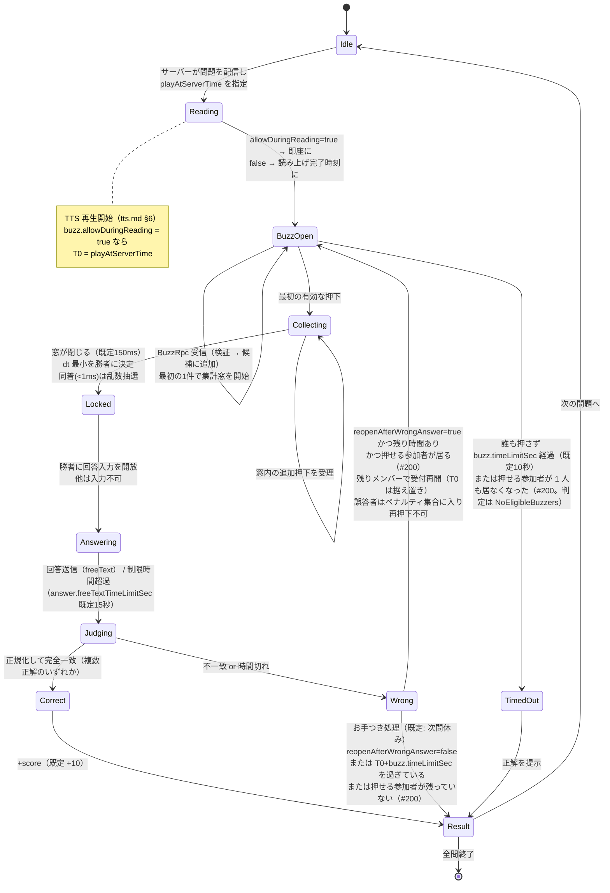
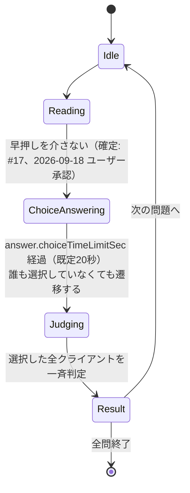

# ネットワーク設計（Netcode for GameObjects / 直接接続）

## 目的

tsumugi-quiz のオンライン早押しクイズ機能を、外部アカウント・運用コストゼロで成立させるための設計を定める。
具体的には次の 6 点を確定する。

1. Host モードにおけるサーバー権限とクライアント権限の分担
2. ホスト開始から参加までの接続フロー（UPnP・参加コードを含む）
3. 参加コードのビット仕様とエンコード／デコードアルゴリズム
4. UPnP ライブラリの選定と、失敗時のフォールバック
5. **早押し判定をサーバー時刻基準で公平に行う方法**（本ドキュメントの最重要項目）
6. 問題データ・画像の配信方式とセキュリティ検証

## 関連ドキュメント

- [docs/tasks/setup-brief.md](tasks/setup-brief.md) — 共通ブリーフ（確定事項・仮決め K1〜K24）
- **[docs/network-joincode.md](network-joincode.md)** — 参加コードのビット仕様・符号化・テストベクタ（本書 §3 を分離）
- **[docs/network-nat.md](network-nat.md)** — UPnP / NAT-PMP とグローバル IP 取得（本書 §4・§5 を分離）
- [docs/tts.md](tts.md) — TTS 合成と再生同期（本書の「7. 時刻同期」と対で読むこと）
- [docs/room-settings.md](room-settings.md) — ルーム設定のキー名（本書 §11 で追加を提案）
- [External/README.md](../External/README.md) — 外部素材の配置

## 0. 実測した前提バージョン

本書の API 名・既定値は、本リポジトリに実際にインストールされているパッケージのソースを読んで確認した。

| 項目 | 値 | 確認方法 |
|---|---|---|
| Unity | 6000.6.0f1 | `ProjectSettings/ProjectVersion.txt` |
| com.unity.netcode.gameobjects | **2.13.2** | `Packages/manifest.json` / `Library/PackageCache/com.unity.netcode.gameobjects@.../package.json` |
| com.unity.transport | 6.6.0 | 同上 |
| Api Compatibility Level | .NET Standard 2.1（`apiCompatibilityLevel: 6`） | `ProjectSettings/ProjectSettings.asset` |
| Allow unsafe code | 無効（`allowUnsafeCode: 0`） | 同上 |

公式ドキュメント（NGO 2.x）は <https://docs.unity3d.com/Packages/com.unity.netcode.gameobjects@2.5/> 配下にある。
旧 URL <https://docs-multiplayer.unity3d.com/netcode/current/…> は 301 で `docs.unity3d.com` にリダイレクトされる（2026-09 時点で実測）。

---

## 1. 役割分担（サーバー権限 / クライアント権限）

### 1.1 トポロジ

Host モード（ホスト PC が 1 プロセスでサーバーとクライアントを兼ねる）を採用する。
`NetworkManager.Singleton.StartHost()` で開始し、ホスト自身のクライアント ID は `NetworkManager.ServerClientId`（= `0`、`NetworkManager.cs` の `public const ulong ServerClientId = 0;` で確認）になる。

分散オーソリティ（`DistributedAuthorityMode`）は使わない。これは Unity のマルチプレイサービスへの接続を前提とするため、「外部アカウント不要・運用コストゼロ」という確定事項に反する。

### 1.2 サーバーだけが持つ状態（権威）

| 状態 | 型 | 備考 |
|---|---|---|
| ゲームフェーズ | `NetworkVariable<GamePhase>` | Lobby / Reading / BuzzOpen / Locked / Answering / Judging / Result / Finished / ChoiceAnswering（確定: #17、2026-09-18 ユーザー承認。選択式専用、§6.6） |
| 現在の問題インデックス | `NetworkVariable<int>` | |
| 各プレイヤーのスコア | `NetworkList<PlayerScoreEntry>` | プレイヤー ID・名前・得点・お手つき状態 |
| 参加者名簿 | `NetworkList<PlayerEntry>` | プレイヤー ID・名前・ホスト/司会・接続状態（#7 で実装。§2.3 / §2.4） |
| 早押し受付開始時刻 `T0` | `NetworkVariable<double>` | サーバー時刻（`NetworkManager.ServerTime.Time`）で表現 |
| 早押しロック保持者 | `NetworkVariable<ulong>` | ロック中でなければ `ulong.MaxValue` |
| **正解データ**（`answers` / `correctIndex`） | サーバー内のみ（同期しない） | 仮決め K14。クライアントに一切送らない |
| ルーム設定 | `NetworkVariable<RoomSettingsPayload>` | ロビー確定後は読み取り専用（#27、§12） |
| 乱数シード・出題順 | サーバー内のみ | 先読み配信で漏れないよう、次問のみ配る |

クライアントはこれらを **読むだけ**。書き込みは `NetworkVariableWritePermission.Server`（既定）で禁止する。

#### 実装済みの `NetworkVariable`（#12、`TsumugiQuiz.Network.GameSession`）

M2 の縦切り（1 問・freeText）で実装した分は次のとおり。いずれも書き込み権限はサーバー（NGO 既定）。

| プロパティ | 型 | 内容 |
|---|---|---|
| `GameSession.Phase` | `NetworkVariable<QuizPhase>` | 現在のフェーズ。`QuizPhase` は `TsumugiQuiz.Core` の enum（`Lobby` / `Reading` / `BuzzOpen` / `Locked` / `Answering` / `Judging` / `Result` / `Finished` / `ChoiceAnswering`。`ChoiceAnswering` は選択式専用で #17 で確定（2026-09-18 ユーザー承認）、§6.6） |
| `GameSession.QuestionIndex` | `NetworkVariable<int>` | 現在の問題インデックス。未出題は `-1` |
| `GameSession.PhaseStartServerTime` | `NetworkVariable<double>` | 現在のフェーズに入ったサーバー時刻。クライアントは「この値＋制限時間」で残り時間を出す（回答フェーズの締め切り） |
| `GameSession.BuzzOpenServerTime` | `NetworkVariable<double>` | 早押し受付開始時刻 `T0`（§6.3）。受付前は `0` |
| `GameSession.CurrentDeadlineServerTime`（プロパティ、#154） | `double`（同期値ではない） | 現在のフェーズの締め切り（サーバー時刻軸）。上の 2 つの時刻アンカーと制限時間から `TsumugiQuiz.Core.QuizDeadlines.DeadlineServerTime` で求める。制限時間はサーバーが進行用の値、クライアントが `RoomSettingsSync.Current` の値を使う（§12.6「クライアントの残り時間表示」）。締め切りの無いフェーズは `NaN` |
| `GameSession.LockedClientId` | `NetworkVariable<ulong>` | ロック保持者。ロック中でなければ `ulong.MaxValue`（`GameSession.NoClientId`） |
| `GameSession.TotalQuestions`（#19） | `NetworkVariable<int>` | 出題列の長さ（`questions.count` 適用後）。セッション未開始は `0`。`QuestionIndex` は**この出題列の中の位置**で、問題セット上の並びではない（出題順そのものはサーバー内のみ） |
| `GameSession.Scores`（#18） | `NetworkList<ScoreEntry>` | 得点表。`ScoreEntry` は `{ ulong ClientId, int Score }`（`INetworkSerializable`）。クライアント ID の昇順。**行があるのは一度でも得点が動いた（回答した）参加者だけ**で、誤答で ±0 だった人も「回答した事実」として得点 0 の行が載る（`ScoreBoard.WithDelta`）。一度も回答していない参加者の行は無いので、表示側は「行が無い = 0 点」として扱う（#194 で記述を訂正）。全員の得点を一度に読むには `GetScoreSnapshot()` を使う（Result 画面と参加者パネル #194 が使用）。`NetworkList` 自体は公開せず、読み取りは `GameSession.GetScore(ulong)` / `ScoreCount`、変更通知は `ScoreTableChanged`（本体プロパティは書き込み権限の確認・診断用に `NetworkVariableBase` として公開） |
| `GameSession.QuestionProgressVariable`（#194） | `NetworkVariable<QuestionProgressPayload>` | 現在の問題の進行状態（参加者パネル用）。`{ int QuestionIndex, FixedList512Bytes<ParticipantProgressEntry> }`、行は `{ ulong ClientId, byte BuzzRank, byte AnswerOrder, byte Flags }`（最大 24 行）。下の「現在の問題の進行状態（#194）」を参照。読み取りは `GetQuestionProgress()`、変更通知は `QuestionProgressChanged` |

フェーズ遷移そのものは `TsumugiQuiz.Core.QuizStateMachine`（純 C#、時刻は `double` 秒）が持ち、
`GameSession` は「NGO の時刻・`NetworkVariable`・RPC」と状態機械をつなぐアダプタとして実装している。
サーバーは **ネットワーク tick ごとに `QuizStateMachine.Tick` を 1 回だけ呼び、1 tick で最大 1 遷移**とする。
こうすると各フェーズが必ず 1 tick 以上続き、`NetworkVariable` の差分同期で中間フェーズも取りこぼさずクライアントに届く。

得点の権威はサーバー側の `QuizStateMachine.Scores`（`TsumugiQuiz.Core` の不変な `ScoreBoard`）で、
`GameSession` はそれを `NetworkList<ScoreEntry>` に写して配る（#18）。
`NetworkList` を使うのは、増減の RPC だけだと**途中参加・再接続したクライアントが参加前の増減を受け取れない**ため。

本書の設計値 `NetworkList<PlayerScoreEntry>`（プレイヤー ID・名前・得点・お手つき状態）との差分:

- **名前は含めない**。クライアント ID と名前の対応は参加者名簿（#7 の `LobbyState.Players`、§2.3）が持つので、得点表と二重に持たない
- **お手つき状態は含めない**。サーバー側では `QuizStateMachine.Penalties`（`PenaltyTracker`）と
  `WrongAnswerers` が持っている。クライアントへは得点表とは別の同期値（下の「現在の問題の進行状態（#194）」）で配る

#### 現在の問題の進行状態（#194、`GameSession.Progress.cs`）

参加者パネル（Game 画面の左列）に出す「早押しの押下順」「回答権を失った人」「選択式の回答済み」を、
`NetworkVariable<QuestionProgressPayload>` 1 本で配る。RPC は増やしていない。

| 項目 | 内容 |
|---|---|
| 権威 | サーバーの `QuizStateMachine.BuildProgress()`（Core、`TsumugiQuiz.Core.Participants.QuestionProgress`）。`GameSession.PublishState` のたびに写す（同値なら NGO が送らない）。フェーズ遷移を伴わない変化（選択式の選択の受理、席の破棄）では明示的に写す |
| 押下順（`BuzzRank`） | **集計窓の中で受理した押下だけ**に付ける。勝者の確定時（`QuizEvent.BuzzResolved`）にまとめて書き、窓の途中経過は配らない（届いた順と押下時刻の順が食い違いうるため）。並びは勝者が 1 位、以降は dt の昇順（`BuzzResolution.Ranking`）。同着の抽選だった候補には `TiedWithWinner` を立てる。窓が閉じた後の押下は従来どおり棄却し、順位にも載らない（統括判断 #194: 規則は変えない）。受付を開き直したら消す |
| 回答順（`AnswerOrder`） | その問題で回答権を得た順番（1, 2, …）。受付を開き直しても消えない（「A× → B× → C○」が残る）。次の問題で消す |
| 回答権なし（`WrongAnswered` / `SuspendedSkipNext`） | 誤答済み（`WrongAnswerers`）と次問休み（`Penalties.SuspendedFor`）。サーバーの受付判定 `IsPenalized` と同じ定義で、クライアントの早押しボタンの無効化もこれから決める。誤答の印は判定の反映（Judging の tick）後に立つ |
| 回答済み（`ChoiceSubmitted`） | 選択式で選択を送ったか。**選んだ番号はペイロードの構造上どこにも入らない** |
| 正誤（`Correct` / 選択式の `WrongAnswered`） | **結果（`Result` / `Finished`）に入ってから**だけ立てる。回答を受理した直後の `Judging` や選択式の受付中には載せない |
| 行 | 状態を持つ参加者だけ。行が無い参加者は「まだ押せる」「未回答」。上限 24 行（定員 12 + 保持期間中の切断席）。超えた分は警告ログを出して配らない |

`NetworkList` ではなく unmanaged な構造体の `NetworkVariable` にした理由: NGO 2.13.2 はこの型の差分を**毎回値の全体**として
送る（`UnmanagedNetworkSerializableSerializer.WriteDelta` → `Write`、`Runtime/NetworkVariable/Serialization/TypedSerializerImplementations.cs`）。
受信側は何度適用しても同じ結果になり、再接続でスポーン時の同期と差分が重なっても食い違わない（`NetworkList` で起きた食い違いは
`GameSession.Score.cs` の `MoveScoreRow` を参照）。1 回の変更で `OnValueChanged` も 1 回だけ発火し、途中の状態も見えない。
1 回の送信は 12 人で 137 バイト（EditMode `QuestionProgressPayloadTests` で実測）。

途中参加・再接続では、スポーン時の同期で現在値が届く（`SessionStateRpc` に載せ直す必要はない）。
席の引き継ぎ（#84 / #163）では `QuizStateMachine.TransferClient` が押下順・回答順も新しいクライアント ID へ付け替え、
スポーン後の値も新しい ID で届く。表示側は `QuestionIndex` が一致するときだけ使う（同期の途中で前の問題の値を出さない）。

`NetworkVariable<RoomSettingsPayload>`（ルーム設定）は #27 で実装した。詳細は §12 を参照。

#### スポーン済み `GameSession` の取得（#14、`NetworkService.FindActiveGameSession()`）

UI 層（`GameView`）がホスト・クライアントのどちらであっても同じ呼び出しで自分の
`GameSession` を得られるよう、`NetworkService.FindActiveGameSession()` を用意した。

- ホスト: `NetworkService.ActiveGameSession`（`StartHost` 成功時に `SpawnGameSession()` でキャッシュ済み）をそのまま返す
- クライアント: `GameSessionSpawner.Spawn()` を呼ばない（ホストのみが呼ぶ API）ため、
  NGO の同期でスポーンされた自分の `NetworkManager.SpawnManager.SpawnedObjectsList` から
  `GameSession` コンポーネントを持つものを探す
- まだスポーンされていない（Lobby → Game の遷移直後で NGO の同期が届いていない等）場合は null を返す。
  `GameView` はこれを見て一定間隔で再探索する（表示直後に一度だけ試して諦めない）
- `NetworkManager.Shutdown()` の途中でネイティブコレクションが解放済みの状態で呼ばれた場合、
  `ObjectDisposedException` を内部で捕捉して null を返す（例外を UI 層へ伝播させない）
- `NetworkService` が `Dispose` 済みの場合も null を返す（#101。UI が毎フレーム呼ぶ「探索」API だけの扱いで、
  `StartHost` 等ほかの API は従来どおり `ObjectDisposedException` を投げる）
- `NetworkService.IsDisposed` は `Dispose()` 実行中（`Stop()` の呼び出しから完了までの間。
  `Stop()` の中で発火する `Stopped` イベントのハンドラの中を含む）も true になる（#116）。
  `Dispose()` は `Stop()` を呼んでから内部の破棄済みフラグを立てるため、`Stopped` のハンドラが
  `NetworkService` へ再入した場合でも `IsDisposed` で一貫して「もう使えない」と判定できるようにしている

### 1.3 クライアントが送るもの

| 操作 | 送信方法 | 検証 |
|---|---|---|
| 押下（バズ） | `[Rpc(SendTo.Server)] void BuzzRpc(double clientBuzzTime, RpcParams p = default)` | フェーズ、二重押下、タイムスタンプ範囲（§6.4） |
| 回答（自由記述） | `[Rpc(SendTo.Server)] void SubmitAnswerRpc(FixedString128Bytes text, …)` | ロック保持者本人か、文字数上限 |
| 回答（選択式） | `[Rpc(SendTo.Server)] void SubmitChoiceRpc(byte index, …)` | フェーズ（`ChoiceAnswering`）、選択肢数の範囲内か、クライアントごとに 1 回まで（確定: #17、2026-09-18 ユーザー承認。早押しを介さず全員が送れる） |
| Ready（TTS 合成完了） | `[Rpc(SendTo.Server)] void TtsReadyRpc(int questionIndex, …)` | 問題インデックス一致 |
| 画像受信完了 Ack | `[Rpc(SendTo.Server)] void ImageAckRpc(int questionIndex, …)` | 同上 |
| 問題データ受信 Ack | `[Rpc(SendTo.Server)] void QuestionReceivedRpc(int questionIndex, …)` | 問題インデックスの範囲・配信済みか・重複（§8.6） |
| プレイヤー名・準備完了 | ConnectionApproval のペイロード＋ロビー RPC | 文字数・禁止文字 |

#### 実装済みの RPC（#12、`TsumugiQuiz.Network.GameSession`）

| メソッド | 方向 | 備考 |
|---|---|---|
| `BuzzRpc(double buzzServerTime, RpcParams rpcParams = default)` | `SendTo.Server` | 押下。時刻はクライアントの `LocalTime.Time`（§6.2）。送信元は `rpcParams.Receive.SenderClientId` から取る。検証は `BuzzArbiter`（§6.4） |
| `SubmitAnswerRpc(FixedString512Bytes text, RpcParams rpcParams = default)` | `SendTo.Server` | 自由記述の回答。ロック保持者本人のみ受理し、**100 文字以内**（`QuizStateMachine.MaxAnswerLength`）に制限する。§9 の表は 128 文字としているが、`answers` の上限（question-data.md §1: 100 文字）に合わせて厳しい側に倒した。文字数上限より容量に余裕を持たせるため `FixedString128Bytes` ではなく `FixedString512Bytes` を使う（日本語 1 文字は UTF-8 で 3 バイト） |
| `QuestionShownRpc(int questionIndex)` | `SendTo.ClientsAndHost`（`InvokePermission = Server`） | 出題（提示）の合図。問題データは `QuestionDistributor` が先に配信済みなので、同じ内容を二重に送らず問題インデックスだけを渡す（#13 で `QuestionShownRpc(int, FixedString4096Bytes)` から置き換え。§8.6） |
| `BuzzResultRpc(ulong winnerClientId, double lockedAtServerTime, bool wasTie)` | `SendTo.ClientsAndHost`（`InvokePermission = Server`） | 早押しの裁定結果。`wasTie` は同着抽選だったか（§6.3。UI に「同着のため抽選」を出すため） |
| `QuestionResultRpc(QuizJudgement judgement, ulong answererClientId, FixedString512Bytes correctAnswer, int score, int scoreDelta)` | `SendTo.ClientsAndHost`（`InvokePermission = Server`） | 1 問の結果。**正解データを送るのはこの RPC だけ**（Result フェーズ、仮決め K14）。誰も押さなかった場合は `judgement = TimedOut`、`answererClientId = ulong.MaxValue`。`scoreDelta`（#18）はこの結果での得点の増減で、タイムアウト時と再開放後のタイムアウト時は `0` |
| `ScoreChangedRpc(ulong clientId, int delta, int total)`（#18） | `SendTo.ClientsAndHost`（`InvokePermission = Server`） | 得点の増減。累計は `NetworkList` でも同期しているが、「何点動いたか」の演出のために配る。**増減が ±0 のとき（既定設定でのお手つき）も送る**。累計表示には `total` を使う（`GetScore` は `NetworkList` の同期待ちで 1 tick 前の値を返すことがある） |
| `SessionFinishedRpc(ulong[] clientIds, int[] scores)`（#19） | `SendTo.ClientsAndHost`（`InvokePermission = Server`） | 全問終了と最終得点。`Finished` に入った時点の得点表（`QuizStateMachine.FinalScores`）をクライアント ID 昇順の 2 本の配列で配る。1 セッションで 1 度だけ送る。受信側は長さの不一致と件数上限（`GameSession.MaxFinalScoreCount = 32`）を検証して捨てる |
| `SessionStateRpc(QuizPhase phase, int questionIndex, int totalQuestions, RpcParams)`（#19） | `SendTo.SpecifiedInParams`（`InvokePermission = Server`） | 途中参加・再接続したクライアント 1 人への現在状態（`GameSession.ResyncClient`）。フェーズ・得点表は `NetworkVariable` / `NetworkList` がスポーン時に同期するが、**提示の合図は RPC なので後から参加したクライアントには届かない**ため、これで補う。受信側は `QuestionDistributor` が保持している DTO を使って `QuestionShown` を発火する |
| `BuzzReopenedRpc(ulong wrongClientId, double buzzOpenServerTime)`（#18） | `SendTo.ClientsAndHost`（`InvokePermission = Server`） | 誤答・お手つき後の受付再開放（§6.6）。`buzzOpenServerTime` は**据え置きの `T0`** なので、クライアントは残り時間を計算し直せる。`wrongClientId` は再押下できないプレイヤー |
| `SubmitChoiceRpc(byte choiceIndex, RpcParams rpcParams = default)`（#17） | `SendTo.Server` | 選択式の選択。確定（2026-09-18 ユーザー承認）: 早押しを介さず、`ChoiceAnswering` の間クライアントごとに 1 回まで受理する。判定はここでは行わず集計だけし、制限時間切れで一斉判定する |
| `ChoiceResultRpc(int correctChoiceIndex, ulong[] clientIds, byte[] choiceIndices, int[] scoreDeltas, int[] totalScores)`（#17） | `SendTo.ClientsAndHost`（`InvokePermission = Server`） | 選択式の一斉判定結果（確定: 2026-09-18 ユーザー承認）。単独の回答者を前提とする `QuestionResultRpc` とは別に、選択した全クライアント分の選択・得点をまとめて配る。誰も選択していなくても、正解インデックスを知らせるために送る |

#### 実装済みの RPC（#13、`TsumugiQuiz.Network.QuestionDistributor`）

`GameSession` と同じ `NetworkObject` に載る問題配信用の 2 本。詳細は §8.6。

| メソッド | 方向 | 備考 |
|---|---|---|
| `QuestionDataRpc(int questionIndex, bool isCurrent, QuestionDto question)` | `SendTo.ClientsAndHost`（`InvokePermission = Server`） | 問題データの配信。`QuestionDto` は正解を構造上持たない（question-data.md §7）。`isCurrent = false` は先読み分 |
| `QuestionReceivedRpc(int questionIndex, RpcParams rpcParams = default)` | `SendTo.Server` | 現在問の受信確認（Ack）。送信元は `rpcParams.Receive.SenderClientId` から取り、問題インデックスの範囲・未配信・重複を検証する |
| `QuestionResyncRpc(int questionIndex, QuestionDto question, RpcParams)`（#19） | `SendTo.SpecifiedInParams`（`InvokePermission = Server`） | 途中参加・再接続したクライアント 1 人への現在問の再送（`TryResendTo`）。**Ack は待たない**（進行はサーバー権威で既に動いており、後から来たクライアントのために全体を止めないため。§8.4 と同じ方針） |

#### 実装済みの RPC（#23、`TsumugiQuiz.Network.TtsSyncCoordinator`）

`GameSession` と同じ `NetworkObject` に載る読み上げ同期用の 2 本。詳細は docs/tts.md §6.6。

| メソッド | 方向 | 備考 |
|---|---|---|
| `TtsReadyRpc(int questionIndex, double durationSec, RpcParams rpcParams = default)` | `SendTo.Server` | 読み上げの準備完了。送信元は `rpcParams.Receive.SenderClientId` から取る。読み上げを行わないクライアントも **長さ 0 で即座に**返す。範囲外（0〜120 秒）・重複・待っていないクライアント・待っていない問題インデックスからの通知は棄却する |
| `PlayAtRpc(int questionIndex, double playAtServerTime, double durationSec)` | `SendTo.ClientsAndHost`（`InvokePermission = Server`） | 再生開始時刻の配信。`durationSec` は**ホストの合成結果だけ**を正とする（ホストが報告できなければ 0。tts.md §6.2）。受信側は提示済みの現在問と一致するかも検証する |

サーバー → 全員の RPC（`GameSession` の 5 本と `QuestionDistributor` の 1 本）には
`InvokePermission = RpcInvokePermission.Server` を付け、メソッド自体も `private` にしている。クライアントが送ろうとすると NGO が送信時に `RpcException` を投げるため、
偽の出題・裁定・結果をクライアントから配ることはできない。

サーバー側の公開メソッド（RPC ではない）:

| メソッド | 用途 |
|---|---|
| `Configure(IQuestionSource, QuizTimeLimits, IRandom, ScoringSettings)` | 問題の供給元・制限時間・乱数源・得点設定（`TsumugiQuiz.Room.ScoringSettings`、#18）の注入。制限時間はゲーム開始時にルーム設定へ書き戻して配る（§12.6「クライアントの残り時間表示」、#154）。`RoomSettingsSync` が無い構成で既定値以外を渡した場合だけ、クライアントの表示が既定値のままになる旨を警告ログに出す。呼ぶたびに得点表を初期化する |
| `StartSession(SessionSettings, int? shuffleSeed)`（#19） | 出題列の確定（`QuestionSelector` でフィルタ・シャッフル・出題数を適用）＋進行設定（制限時間・得点）の確定＋1 問目の出題。候補が 0 件なら警告して開始しない。選択式（`choice`）の進行は #17 で実装したため、`typeFilter = "choice"` でも開始できる。`shuffleSeed` は再現用（null ならサーバーの乱数源から作る） |
| `SetQuestionSets(IReadOnlyList<QuestionSet>)`（#19） | `questions.setIds` を適用するための問題セットの注入（任意）。渡さない場合は `Configure` の供給元が候補プールになり `setIds` は無視する |
| `NextQuestion()`（#19） | 結果表示 → 次問の出題、次が無ければ Finished（＋最終得点の配信）。司会の「次へ」（#20）と `result.autoAdvanceSec` の自動進行の共通の入口。出題できない問題は読み飛ばす（§6.6） |
| `ResyncClient(ulong clientId)`（#19、配線は #109） | 途中参加・再接続したクライアントへ現在状態と現在問の DTO を送り直す（`network.allowLateJoin`）。**呼び出し元はロビー（#7 の後続）**（統括判断 2026-09-13）。`GameSession` は接続イベントを購読せず、自動では再同期しない。#109 で `LobbyState`（サーバー）の接続完了時に呼ぶ配線を入れた（§2.4「進行中に合流したクライアントへの再送」） |
| `StartQuestion(int)` | 出題（Lobby / Result → Reading） |
| `SetBuzzOpenTime(double)` | 早押し受付開始 `T0` の指定（TTS 連携 #23 のフック）。出題時刻以降かつ出題から 600 秒以内のみ受理する |
| `NotifyReadingStarted(double playAtServerTime)` | `buzz.allowDuringReading = true`（既定）向けの別名。読み上げ開始と同時に受付を開く |
| `NotifyReadingCompleted(double readingEndServerTime)` | `buzz.allowDuringReading = false` 向けの別名。読み上げ完了時刻を `T0` にする |
| `FinishSession()` | Result → Finished |
| `ReturnToLobby()`（#20） | 結果表示（Result / Finished）から全員をロビーへ戻す。進行設定（`ActiveSessionSettings`）は保持したまま新しい `QuizStateMachine` に差し替え、`ReturnToLobbyRpc`（下表）を全員へ配る。Result View の「ロビーへ戻る」の入口 |

クライアント側のヘルパー: `RequestBuzz()`（`LocalTime.Time` を載せて `BuzzRpc` を送る。同じ受付中の 2 回目以降はローカルで抑止）/ `RequestAnswer(string)`。

#### 司会専用モードの進行操作（#20、`GameSession.Moderator.cs`）

このゲームは Host モードのみ。「次へ」「一時停止」「再開」は送信元が `NetworkManager.ServerClientId`
（＝ホスト自身、`IsFromHost`）であることだけを検証する（通常モードのホストにも進行の巻き戻し手段として
提供して差し支えないため）。「強制正解」「強制不正解」（`ForceJudgeRpc`）はさらに強く、送信元がホストで
あることに加えて `host.role == "moderator"`（`LobbyState.Role`、`IsHostModerator`）も要求する。通常モードの
ホストは自分自身が回答者になりうるため、自分の判定を自分で書き換えられないようにするため（統括判断）。
一致しなければ何もせず棄却ログだけ残す（§9）。すべての RPC は先頭で `RpcRateGuard.Allow`（`BuzzRpc` と同形、#52）
も通す。クライアント側の入口は `RequestNextQuestion()` / `RequestPause()` / `RequestResume()` /
`RequestForceJudge(QuizJudgement)`。

| メソッド | 方向 | 備考 |
|---|---|---|
| `NextQuestionRpc(RpcParams rpcParams = default)` | `SendTo.Server` | 司会の「次へ」。`NextQuestion()`（既存、自動進行と共通）をそのまま呼ぶ。一時停止中は棄却する |
| `PauseRpc(RpcParams rpcParams = default)` | `SendTo.Server` | 司会の「一時停止」。`QuizStateMachine.Pause` を呼ぶ。フェーズ遷移・押下・回答・選択の受理をすべて止める。**Reading 中は棄却する**（TTS の同期再生を途中で止められないため）。受理できるのは BuzzOpen / Locked / Answering / ChoiceAnswering / Judging / Result のみ（`QuizStateMachine.CanPause` が唯一の定義） |
| `ResumeRpc(RpcParams rpcParams = default)` | `SendTo.Server` | 司会の「再開」。`QuizStateMachine.Resume` を呼ぶ。一時停止していた秒数だけ `PhaseStartServerTime` 等を後ろへずらし、残り時間を保存する |
| `ForceJudgeRpc(QuizJudgement judgement, RpcParams rpcParams = default)` | `SendTo.Server` | 司会の「強制正解」「強制不正解」。送信元がホストかつ司会専用モードのときのみ受理し、Answering 中のロック保持者に対して `QuizStateMachine.ForceJudge` を呼ぶ。新しい判定種別は追加せず、既存の `Correct` / `Wrong` をそのまま使う（配信は通常の回答と同じ `QuestionResultRpc`）。`LastAnswerText` は書き換えない |
| `ReturnToLobbyRpc()` | `SendTo.ClientsAndHost`（`InvokePermission = Server`） | `ReturnToLobby()` からの、結果表示 → ロビーの合図。Result View はこれを購読して Lobby View へ切り替える |

`GameSession.IsPaused`（`NetworkVariable<bool>`）が一時停止中かを全クライアントへ配る（「一時停止中」表示用）。
司会専用モードのホストは早押し・回答・選択をしない（H3、M-A）。`BuzzRpc` / `SubmitAnswerRpc` / `SubmitChoiceRpc` は、
送信元がホストかつ司会専用モードのときは棄却する（クライアント側も `GameView` が早押しキー入力・ボタンクリック・
選択ボタンクリックのすべてを止める）。

強制正解/不正解（`ForceJudgeRpc`）は freeText の Answering 中のロック保持者に対してのみ行える。選択式
（choice）は早押しを介さず全員が回答し、制限時間切れで一斉に自動判定するため（`QuizStateMachine.ApplyChoiceScores`）、
司会による強制判定の対象にはならない。

一時停止中の立ち絵（`CharacterView`、#24）は状態を変えない。`CharacterView` は
`TtsSyncPlayer.ReadingStarted` / `ReadingCompleted` と `GameSession.QuestionResolved` だけを購読し、
`GameSession.IsPaused` は見ていないため、BuzzOpen 以降（読み上げ完了後）に一時停止しても
読み上げ中の見た目のまま止まり、待機（アイドル）へは落ちない。

### 1.4 NetworkVariable / RPC / CustomMessagingManager の使い分け

| 手段 | 用途 | 根拠 |
|---|---|---|
| `NetworkVariable<T>` / `NetworkList<T>` | **状態**（途中参加者にも最新値が届くべきもの）。スコア、フェーズ、ロック保持者、ルーム設定 | 値は tick ごとに差分同期され、後から Spawn したクライアントにも初期同期される |
| `[Rpc(...)]` | **イベント**（その瞬間に一度だけ起きること）。押下、回答、判定結果、再生開始指示 | NGO 2.x の統一 RPC 属性。§1.5 |
| `CustomMessagingManager` | **NetworkObject に紐付かない大きなバイナリ**。問題画像の分割転送 | `NetworkManager.CustomMessagingManager.SendNamedMessage(string, ulong, FastBufferWriter, NetworkDelivery)`。§8 |

### 1.5 NGO 2.x の RPC 記法

NGO 2.x では `[ServerRpc]` / `[ClientRpc]` に代えて統一 `[Rpc(SendTo.…)]` 属性を使う。
`SendTo` の定義は `Runtime/Messaging/RpcTargets/RpcTarget.cs` にあり、実測した列挙子は次の 11 個。

```
Owner, NotOwner, Server, NotServer, Me, NotMe, Everyone, ClientsAndHost, Authority, NotAuthority, SpecifiedInParams
```

`RpcAttribute`（`Runtime/Messaging/RpcAttributes.cs`）の公開フィールドは `RequireOwnership` / `DeferLocal` / `AllowTargetOverride`、デリバリは `RpcDelivery { Reliable = 0, Unreliable }`。

```csharp
using Unity.Netcode;

public sealed class BuzzNetworkBehaviour : NetworkBehaviour
{
    // クライアント → サーバー。押下時刻はクライアントが推定したサーバー時刻（§6.2）。
    [Rpc(SendTo.Server)]
    public void BuzzRpc(double buzzServerTime, RpcParams rpcParams = default)
    {
        var senderId = rpcParams.Receive.SenderClientId;   // 送信元は受信側で取る（詐称不可）
        _buzzArbiter.Accept(senderId, buzzServerTime, NetworkManager.ServerTime.Time);
    }

    // サーバー → 全員（ホスト自身にも実行される）
    [Rpc(SendTo.ClientsAndHost)]
    public void BuzzResultRpc(ulong winnerClientId, double lockedAtServerTime) { /* UI 更新 */ }
}
```

重要な制約（公式ドキュメント <https://docs.unity3d.com/Packages/com.unity.netcode.gameobjects@2.5/manual/advanced-topics/message-system/rpc.html> で確認）:

- **メソッド名は必ず `Rpc` で終わる**。付け忘れはコンパイルエラーになる。
- 送信元 ID は必ず `rpcParams.Receive.SenderClientId` から取る。引数に入れさせるとクライアントが詐称できる。
- `SendTo.ClientsAndHost` は「全クライアント＋ホスト」。`SendTo.Everyone` との差は、専用サーバー時にサーバー自身を含めるかどうか。本プロジェクトは Host モードのみなので実質同じだが、意図を明示するため `ClientsAndHost` を使う。

---

## 2. 接続フロー

### 2.1 ホスト側

```
[Title] ──「ホストを開始」
   │
   ├─1. ルーム設定を確定（人数上限、得点、制限時間、司会専用モード…）
   │
   ├─2. UnityTransport にポートを設定
   │      transport.SetConnectionData("0.0.0.0", 7777, "0.0.0.0");
   │      （既定ポート 7777。使用中なら +1 して最大 10 回リトライ）
   │
   ├─3. NetworkManager.NetworkConfig.ConnectionApproval = true
   │      NetworkManager.ConnectionApprovalCallback = OnApproval
   │      NetworkManager.StartHost()
   │
   ├─4. UPnP でポートマッピング（§4）        ── 失敗 ─→ 手動ポート開放案内画面へ
   │      成功: 外部ポート 7777/UDP → 内部 7777/UDP
   │
   ├─5. グローバル IP を取得（§5）           ── 失敗 ─→ 手動入力 or LAN コードのみ表示
   │      CGNAT 判定 → 該当なら「直接接続不可・Tailscale 案内」を表示
   │
   ├─6. 参加コードを生成（§3）
   │      ・インターネット用: グローバル IP + 外部ポート
   │      ・LAN 用:          プライベート IP + ポート
   │      両方を画面に表示。各行に「コピー」ボタン（GUIUtility.systemCopyBuffer）
   │
   └─7. [Lobby] 参加者を待つ
```

ポート既定値 7777 は NGO のサンプル・ドキュメントで慣用されている値で、本プロジェクトでも既定とする。ルーム設定で変更可能にする。

`UnityTransport.SetConnectionData` の第 3 引数 `listenAddress` に `"0.0.0.0"` を渡すと全 NIC で待ち受ける。省略すると `ConnectionData.Address` が待ち受けアドレスになり、LAN と WAN の両方から受けられなくなるため、ホストでは必ず明示する。

### 2.2 クライアント側

```
[Title] ──「参加する」
   │
   ├─1. 参加コードを貼り付け（または入力）
   │      入力のたびに正規化（network-joincode.md §1.4）してプレビュー表示
   │
   ├─2. デコード（network-joincode.md §1.3）。チェック文字不一致なら「コードが正しくありません」
   │
   ├─3. プレイヤー名を入力（1〜16 文字、改行・制御文字禁止）
   │
   ├─4. NetworkConfig.ConnectionData に承認ペイロードを詰める
   │      { protocolVersion, playerName, clientBuildHash, reconnectToken? }
   │      transport.SetConnectionData(ip, port);
   │      NetworkManager.StartClient()
   │
   ├─5. サーバーの ConnectionApproval を待つ（§2.3）
   │      拒否・切断・タイムアウト（UI 側 10 秒） → Reason（または切断/失敗の定型文）を [Join] 画面に
   │      表示したまま留まる。[Title] へは「戻る」ボタンを押したときだけ戻る
   │      （統括判断 M-10、2026-09-13 改訂。旧仕様は拒否時に自動で [Title] へ戻っていたが、
   │      参加コード・プレイヤー名を再入力させやすくするため変更した）
   │
   └─6. [Lobby]
```

クライアント側でも `NetworkConfig.ConnectionApproval = true` にしておくこと。NGO 2.13.2 の `NetworkConnectionManager.SendConnectionRequest()` は `ShouldSendConnectionData = NetworkManager.NetworkConfig.ConnectionApproval` としており、**false のままだと承認ペイロードが送信されない**（ホストからは空のペイロードとして見え、必ず拒否される）。さらに `NetworkConfig.GetConfig()` は `ConnectionApproval` を含めてハッシュを取るため、ホストと値が違うと「設定不一致」で弾かれる。Boot シーンの `NetworkManager` で既定 true にしてあり、`NetworkService.StartClient()` でも開始前に検査する。

### 2.3 ConnectionApproval

NGO 2.13.2 の実装（`Runtime/Core/NetworkManager.cs`）で確認した構造体は次のとおり。

```csharp
public struct ConnectionApprovalRequest      // L845
{
    public byte[] Payload;          // クライアントの NetworkConfig.ConnectionData がそのまま入る
    public ulong  ClientNetworkId;
}

public class ConnectionApprovalResponse      // L803
{
    public bool        Approved;
    public bool        CreatePlayerObject;
    public uint?       PlayerPrefabHash;
    public Vector3?    Position;
    public Quaternion? Rotation;
    public bool        Pending;     // 非同期に判定したいときに true にして後から Approved を書く
    public string      Reason;      // 拒否理由。クライアントの DisconnectReason に届く
}
```

サーバー側の判定順序（**すべて拒否理由を Reason に入れる**）:

1. **プロトコルバージョン一致**。`NetworkConfig.ProtocolVersion`（`ushort`）だけでは問題フォーマットのバージョンまで表せないので、承認ペイロードに独自の `protocolVersion`（`ushort`）を入れ、不一致なら `Reason = "バージョンが異なります（ホスト: x / あなた: y）"` で拒否。**ペイロード全体を復号する前に先頭 2 バイトだけを読んで判定する**（ペイロード形式そのものを変えた将来版クライアントにも「形式が不正」ではなく正しい理由を返すため。先頭 2 バイトのレイアウトは今後も変えない）。
2. **ペイロードの形式とサイズ、ビルドの一致**。`Payload.Length` が 256 バイトを超えたら即拒否。空・長さ不整合・余剰バイト・不正な UTF-8 も拒否する。
   復号できたら `clientBuildHash` の文字種（制御文字を含まない）を検査し、**ホストのビルドの識別子と完全一致しなければ、1 と同じ書式**
   `Reason = "バージョンが異なります（ホスト: x / あなた: y）"`（x / y はビルドの番号）で拒否する（#204。下記「バージョンとビルドの一致」）。
   名前より先に見るので、ビルドの違う相手には名前の規則や文言が版で違っていても必ずこの理由が届く。
3. **プレイヤー名**。UTF-8 デコード後 1〜16 文字（サロゲートペアは 1 文字、単独サロゲートは拒否）、制御文字を含まないこと。前後空白をトリムした結果が空でないこと。見えない文字（書式文字など）と、基底文字 1 つあたり 5 個以上の結合記号を含まないこと（#209。規則は §9.2）。
4. **人数上限**。`ConnectedClientsIds.Count >= room.maxPlayers` なら拒否。司会専用モード時はホストを人数に数えない（仮決め K18）。
5. **フェーズ**。ゲーム進行中（Lobby 以外）の新規参加は既定で拒否。司会が「途中参加を許可」を ON にしている間だけ承認する **（仮決め: 途中参加は司会が許可した場合のみ）**。
6. **再接続**。切断済みプレイヤーと **プレイヤー名が一致し、かつホストが発行した再接続トークンも一致** し、そのプレイヤーが「切断中」状態なら、席とスコアを引き継いで復帰させる（#69）。トークンが無い / 一致しない場合は**新規参加として評価する**（満室・進行中なら拒否になる）。
   **名簿上まだ「接続中」でも、名前とトークンが一致すれば席を引き継ぐ（#163）**。クライアントが強制終了した直後は、ホストが切断を検知する（UTP の `DisconnectTimeoutMS`、`Boot.unity` では 30 秒）まで旧エントリが接続中のまま残る。この間に本人が再起動して戻ってきたとき、名前重複で拒否しないためのもの。ホストは新しい接続の完了時に旧 `clientId` を `NetworkManager.DisconnectClient` で切る（`LobbyState.DisconnectReplacedClient`）。トークンが無い / 一致しない場合は従来どおり名前重複で拒否する。
   **挙動の変化（#163）**: 同じ PC で、同じ名前・同じデータルート（＝同じトークン）のアプリを 2 つ起動すると、後から接続した側が席を引き継ぎ、先に起動した側は `LobbyState.SeatTakenOverDisconnectReason`（「別の接続が同じ席を引き継ぎました。」）の理由付きで切断される（以前は後から来た側が `DuplicatePlayerName` で拒否されていた）。

実装は 1〜3 が `TsumugiQuiz.Core.Network.ConnectionApprovalEvaluator`（純 C#）、NGO との接続が `TsumugiQuiz.Network.ConnectionApprovalHandler`。

#### バージョンとビルドの一致（#204）

**ホストとクライアントのビルドが一致しない接続は、すべて拒否する**（案 (b)、2026-10-03 ユーザー決定）。
#204 より前は承認で `protocolVersion` だけを照合しており、`ProtocolConstants.Version` を上げたのは承認ペイロードの形式を変えた #69 だけだった。
ゲーム中の RPC・`NetworkVariable`・enum の値を変えた #17（`ChoiceResultRpc`）・#194（`NetworkVariable<QuestionProgressPayload>`）・
#200（`QuizJudgement.NoEligibleBuzzers = 4`）では上げていないので、古いビルドのクライアントが新しいホストに接続できてしまい、
たとえば #200 以降のホストが `NoEligibleBuzzers` を送ると、古いクライアントでは結果欄が空になっていた。

| 項目 | 決めたこと |
|---|---|
| ビルドの識別子 | Unity の `Application.buildGUID`（`TsumugiQuiz.Network.LocalBuildIdentity.BuildHash`）。Unity のドキュメントによれば、ビルドのたびに一意の GUID が作られ、Editor では空文字を返す。ビルドの手順で値を作る必要はない（`scripts/build.ps1` は変えていない）。同じソースからビルドし直しても別のビルドになる |
| 送る側 | `NetworkService.StartClient` は、引数 `clientBuildHash` を省略（null）すると自分の識別子を `clientBuildHash` に載せる。明示した値はそのまま載せる（テストで別のビルドを再現するため） |
| 照合する側 | `NetworkService.StartHost` が `ConnectionApprovalPolicy.ExpectedClientBuildHash` に自分の識別子を入れる。`ConnectionApprovalEvaluator` が `clientBuildHash` と序数比較（大文字小文字も区別）で完全一致を求める。一致しなければ `ConnectionRejectionReason.ClientBuildMismatch` |
| 拒否の文言 | 既存の `ConnectionRejectionMessages.ProtocolVersionMismatchFormat`（「バージョンが異なります（ホスト: {0} / あなた: {1}）。」）を**そのまま流用**する（ユーザー決定）。#208 以降のクライアントは、既知の文言と完全一致するか、この書式に ASCII の数字 1〜5 桁を入れたものと全体が一致する理由しか日本語で出さない（§2.4「切断理由の対応づけ」）ため、新しい文言を足すと #208〜#209 の版には汎用の文言しか出ない |
| 番号 | 識別子（GUID の 16 進 32 文字）は書式の数字に入らないので、Core の `BuildDisplayNumber.From` で番号に写す。空は 0、それ以外は FNV-1a（32bit、UTF-16 の符号単位ごと）を 65535 で割った余り + 1（1〜65535。5 桁に収まり、`Create` の引数の ushort にも収まる）。識別子が違うのに番号が同じになった場合（約 6.5 万分の 1）は、`BuildDisplayNumber.ForMismatch` がクライアント側を 1 ずらして必ず違う番号にする。そのため衝突した場合だけ、拒否の文言の「あなた」の番号は、クライアントのクレジット画面に出る自分の番号より 1 大きくなる（65535 の次は 1）。自分の番号はクレジット画面の「バージョン: {Application.version}（ビルド番号 N）」と、起動ログ `[NetworkBootstrap] 起動しました … buildNumber=N` で確かめられる |
| Editor | 識別子が空（番号 0）。Editor どうし（PlayMode テストを含む）は一致する。Editor とビルドした exe の間の接続は拒否される |

**`ProtocolConstants.Version` を上げる場面**（#204 で統一。`ProtocolConstants.cs` のコメントと同じ）:

- **承認ペイロードの形式**（先頭 2 バイトより後ろの並び・長さの規則）か、**承認で照合する項目の意味**を変えたときだけ上げる。
  ホストはペイロードを読めないとビルドの識別子を照合できないため、形式の違いはバージョンで先に見分ける
- ゲーム中の RPC・`NetworkVariable`・enum の値・問題配信の形式を変えても**上げない**。ビルドの違う相手はビルドの一致の照合で
  必ず拒否されるので、版の違う相手とゲーム中のメッセージをやり取りすることはない
- 先頭 2 バイトのレイアウトと、拒否の文言の書式は変えない（変えると古い版のクライアントには正しい理由が届かない）
- #204 で 2 → 3 に上げた。形式は 2 と同じだが、`clientBuildHash` が「参考情報」から「一致必須」に変わった（照合する項目の意味を変えた）。
  上げないと、ビルドの一致を見ない #204 より前のホスト（2）に #204 以降のクライアントが入れてしまう

**版の違う相手に何が表示されるか**（#204 以降のホスト・クライアントの側から見たもの。`NetworkApprovalIntegrationTests` と
`ConnectionApprovalEvaluatorTests` で確かめている）:

| ホスト | クライアント | 拒否の理由（Reason） | クライアントの表示 |
|---|---|---|---|
| #204 以降（3） | #204 より前（2） | 「バージョンが異なります（ホスト: 3 / あなた: 2）。」 | #208〜#209 の版: 書式と一致するのでそのまま出る。#208 より前の版: 届いた文字列を整えてそのまま出す |
| #204 より前（2） | #204 以降（3） | 「バージョンが異なります（ホスト: 2 / あなた: 3）。」（古いホストの文言） | 書式と一致するのでそのまま出る |
| #204 以降 | #204 以降の別のビルド | 「バージョンが異なります（ホスト: x / あなた: y）。」（x ≠ y はビルドの番号） | そのまま出る |
| #204 以降 | 識別子の無いクライアント（空、仮に 3 を名乗った場合） | 「バージョンが異なります（ホスト: x / あなた: 0）。」 | そのまま出る |

> **仮決め（K-N1 / #69 で改訂）**: 途中参加は司会が明示的に許可した場合のみ。
> **再接続は「プレイヤー名の完全一致 + ホストが発行した再接続トークンの一致」で判定する**。
> **名前だけでは復帰できない**（同名で入ってきても新規参加として評価され、満室・進行中なら拒否される）。
> **#163 で追加**: 名簿上まだ接続中の同名エントリでも、トークンが一致すれば旧接続を切って席を引き継ぐ
> （強制終了した直後、ホストが切断を検知するまでの約 30 秒間に戻ってきた本人を拒否しないため）。
> トークンは本人しか持たないので、「名前だけで席を奪えない」という K-N1 の要件は変わらない。
> ただし**トークンが漏れた場合（同じ PC の共有、`session-token.json` の受け渡し等）は、接続中の本人を追い出して
> 席を奪える**ようになる（以前は本人が切断中のときだけ奪えた）。身内向け・LAN 前提の本アプリでは、これを許容する
> （PR #171 レビュー L-2。下の表の後にある「トークンを盗まれた場合…はなりすませる」という既存の留保の範囲内）。
>
> 経緯: #7 の時点では名前の完全一致だけで復帰させていた（当初の K-N1）。実装では再接続を定員・フェーズより
> 先に判定するため（下記「判定 4〜6」）、名前が一致しさえすれば **満室の部屋にもゲーム進行中の部屋にも
> 入れてしまい**、#18 の得点表と合わせて席と得点を丸ごと騙し取れる経路になっていた。
> #7 では緩和策として (1) 切断中エントリの名前をクライアントへ同期しない（伏せ字にする）、
> (2) ホストが切断中エントリを手動で削除できるボタンを置く、の 2 つを入れてあり、これは **#69 でも維持する**。
>
> **#69 の方式**（実装: `TsumugiQuiz.Core.Network.SessionToken` / `SessionTokenHash` / `LobbyRoster`、
> `TsumugiQuiz.Network.LobbyState`（`LobbyState.Token.cs`）/ `NetworkService`（`NetworkService.SessionToken.cs`））:
>
> | 項目 | 決めたこと |
> |---|---|
> | 発行 | サーバーは**承認のたびに** `RandomNumberGenerator` で 128bit のトークンを 1 つ発行し、**名簿が新しいエントリを作った場合だけ採用・配布する**（`LobbyRoster.TryApply` が返したエントリのハッシュが発行分と一致するかで判定）。再接続で既存エントリへ戻った場合は採用せず、既存のトークンを使い続ける（配布もしない。クライアントが持っている有効なトークンを上書きしないため）。保持期間切れでエントリが消えていた再接続も「新しいエントリ」になるので、そのときは新しいトークンが配られる |
> | 受け渡し | NGO 2.13.2 の `ConnectionApprovalResponse` には承認応答にアプリ独自のデータを載せる口が無い（`Approved` / `CreatePlayerObject` / `PlayerPrefabHash` / `Position` / `Rotation` / `Pending` / `Reason` のみ。`Reason` は拒否時にしか使われない）ため、**接続完了後に `SendTo.SpecifiedInParams` の RPC（`LobbyState.SessionTokenRpc`）でその 1 人だけへ送る**。16 進 32 文字（`FixedString64Bytes`）で送り、受け側でも長さと文字種を検証する |
> | サーバーの保持 | 名簿（`LobbyRoster` → `LobbyPlayer.TokenHash`）に **SHA-256 ハッシュだけ**を持つ。**クライアントへは同期しない**（`PlayerEntry` に含めない） |
> | 有効期間 | ホストのプロセス寿命のみ。名簿のエントリが保持期間（§2.4 の 60 秒）で消えた時点で無効になり、ホストを立て直せば全トークンが失効する |
> | クライアントの保存 | `AppPaths.DataRoot/session-token.json`（`JsonSessionTokenStorage`。既定は `Application.persistentDataPath` 配下、#71）にホスト単位で 1 件。ホストの識別子は `アドレス:ポート`（`SessionTokenHostKey`）、有効期限は 24 時間（`SessionTokenStore.DefaultLifetimeHours`） |
> | 突き合わせ | 「名前一致 + トークン一致」の両方。ハッシュの比較は途中で打ち切らない（`SessionTokenHash.Equals`） |
> | 承認ペイロード | 末尾に「トークン長（0 か 16）+ トークン」の区画を追加した。形式が変わったので `ProtocolConstants.Version` を 1 → 2 に上げてある |
>
> **残る弱点**:
>
> - トークンを盗まれた場合（同じ PC を共有している、`session-token.json` を渡した等）はなりすませる。
>   ホストの手動削除ボタンで席を解放できるようにしてあるのが最後の手段。
> - **通信は暗号化していない**。`UnityTransport` の `UseEncryption` は既定 false
>   （NGO 2.13.2 `Runtime/Transports/UTP/UnityTransport.cs` L107 `m_UseEncryption = false`。
>   Boot シーンでも `m_UseEncryption: 0`）で、Relay を使わずに有効化するには
>   `SetClientSecrets` / `SetServerSecrets` で証明書を渡す必要がある（＝常設サーバー・証明書運用が前提になるため
>   本アプリの構成では採らない）。したがってトークンは **承認ペイロード（`ConnectionData`）と
>   配布 RPC（`SessionTokenRpc`）の双方で平文**で流れ、同じ LAN で盗聴できる第三者や経路上で中継できる第三者は読める。
> - **`アドレス:ポート` を占拠できる / 経路に割り込める第三者**は、クライアントが送ってくる保存済みトークンを
>   回収できる（偽ホストを立てて接続させる、MITM する）。ただし回収したトークンは
>   **同じホストのプロセスが持つ名簿にしか通用しない**（ホストを立て直せば失効し、他のホストでは無意味）ため、
>   実害は「その部屋のその人の席を横取りできる」ところまでに限られる。
>   この前提（参加コードは秘密ではない・経路は信頼しない）は §9 と同じで、費用が発生する
>   常設サーバー・証明書を使わないという構成上の割り切りである。

#### 実装（#7）: 名簿に依存する判定 4〜6

4〜6 は名簿（誰が居て誰が切断中か）を見ないと決まらないため、`ConnectionApprovalEvaluator` からは分離し、
`ConnectionApprovalHandler.AdmissionEvaluator`（`Func<ulong, string, LobbyAdmission>`）というフックにした。
実装は `TsumugiQuiz.Network.LobbyState`（`NetworkBehaviour`）で、判定ロジック自体は
`TsumugiQuiz.Core.Network.LobbyRoster`（純 C#、EditMode でテスト可能）に置く。
フックは **1〜3 を通過した後にだけ**呼ばれる（検証前のペイロードで名簿を引かない。§9）。

評価は上から順に行い、最初に当たったものを返す。

| # | 判定 | 実装 | 拒否理由（`ConnectionRejectionReason`） |
|---|---|---|---|
| 0 | 名簿が未初期化 | `LobbyState` の名簿がまだ無ければ **fail-closed で拒否**（素通ししない） | `LobbyNotReady` |
| 1 | 予約との名前重複 | 承認済みでまだ接続完了していないクライアント（予約）と同名なら拒否 | `DuplicatePlayerName` |
| 2 | 再接続 | 切断中の同名エントリのうち、**発行済みトークンと一致するもの**を探す（#69）。同じ席を狙う予約が既にあれば二重再接続として拒否。トークンが無い / 一致しなければこの行では何も起きず、3 以降を新規参加として評価する | —（承認）/ `DuplicatePlayerName` |
| 2b | 引き継ぎ（#163） | **接続中**の同名エントリ（ホストを除く）のうち、発行済みトークンと一致するものを探す。見つかれば `LobbyAdmission.Takeover`（種別は再接続、`ReplacesConnectedClient = true`）で承認し、接続完了時に旧 `clientId` を切断する。同じ席を狙う予約があれば拒否 | —（承認）/ `DuplicatePlayerName` |
| 3 | 名前重複 | 接続中のプレイヤーと同名なら拒否 | `DuplicatePlayerName` |
| 4 | フェーズ | `network.allowLateJoin` が false でゲーム進行中なら拒否 | `GameInProgress` |
| 5 | 人数上限 | 席を押さえている人数（接続中＋保持期間中の切断者。司会専任のホストは除く）＋**新規参加の**予約数 ≧ `room.maxPlayers` で拒否。空きが切断者の確保席だけなら理由を分ける | `RoomFull` / `SeatReserved` |

空のプレイヤー名（本来は手前の `ConnectionApprovalEvaluator` で弾かれる）が届いた場合は `InvalidPlayerName` を返す。

本書の列挙順（人数上限 → フェーズ → 再接続）に対し、**実装は再接続を最初に判定する**。
列挙順どおりに評価すると「満室の部屋から落ちた人」「進行中に落ちた人」が復帰できなくなるためで、
再接続は本人の席へ戻る操作であって新規の席を要求しない、という整理にした。

補足（すべて #7 での決定）:

- **切断中のエントリも保持期間の間は席を押さえる（統括判断 #7 Q3）**。本節 4 の文面は
  `ConnectedClientsIds.Count` を基準にしているが、それだと満室の部屋で誰かが落ちた直後に別の人が入り、
  落ちた人が復帰できなくなる。そこで定員（`room.maxPlayers`）には「接続中のエントリ」と
  「保持期間中（§2.4 の 60 秒）の切断エントリ」の両方を数える。保持期間を過ぎたエントリは名簿から消え、
  そこで初めて席が空く。司会専任のホストはどちらの場合も数えない（仮決め K18）。
- **同名の同時接続は拒否する（統括判断 #7 Q2）**。#69 でトークン方式にしたあとも、一覧に同名が並ぶと
  誰が誰だか分からなくなるため拒否を維持する（再接続の判定はこれより先に行われるので、
  同名の別人が先に入っていても本人はトークンで自分の席に戻れる）。
- **同名の同時接続は「再接続経路でのみ」起こり得る例外がある（#69）**。判定順序が
  「再接続（2）→ 接続中の名前重複（3）」なので、次の順番をたどると名簿に同名の接続中エントリが 2 つ並ぶ:
  (1) A が名前 `X` で参加 → (2) A が切断（`X` のエントリは切断中・席を確保） → (3) 空席があるので
  別人 B が同じ名前 `X` で**新規参加**（トークンを持たないので A の席は奪えない） → (4) A がトークン付きで復帰。
  このとき A を弾くと「トークンを持つ本人が、名前を先取りされただけで自分の席に戻れない」ことになるため、
  **復帰を優先する**（席と得点の保護が名前の一意性より重要）。
  **起きたときの扱い（#85 で実装）**:
  - **名簿の `name` は書き換えない**（サーバー権威のデータで、切断中エントリは伏せ字で配っている都合もある）。
    区別は**表示の段でだけ**行い、同名が同時に接続しているときだけ末尾に連番を付ける
    （`つむぎ #1` / `つむぎ #2`）。番号は名簿の並び順（= 参加順）で 1 から振るので、
    復帰してもエントリの位置は変わらず、同じ人には同じ番号が付き続ける。
    ロジックは `TsumugiQuiz.Core.Network.PlayerDisplayNames`（純 C#）、
    名簿のエントリへの適用規則は `TsumugiQuiz.Network.PlayerEntryDisplayNames`。
  - **連番の対象は「接続中」のエントリだけ**にする。切断中のエントリはクライアントへ全件が同じ伏せ字
    （`PlayerEntry.DisconnectedNameMask`）で届くので、対象に含めると伏せ字同士が「同名」と見なされてしまう。
    切断中の行はグレー表示と「切断中」ラベルで既に区別できる。
  - プレイヤー名には `つむぎ #1` のような名前も付けられる（§2.3 の 3。1〜16 文字・制御文字以外は通る）ため、
    生成した表示名が他の行の表示名と衝突する場合は番号を進める。
    **連番を付けた表示名は、他のどの行の表示名とも衝突しない**（その代わり番号が 1 から始まらないことがある）。
    ただし「全行の表示名が互いに異なる」という意味ではない: 連番の対象外にした行どうし
    （＝切断中エントリの伏せ字 `（切断中）`）は元々同じ文字列で、そこは連番では区別しない。
  - 適用箇所は**ロビーの参加者一覧**（`LobbyView.Roster.cs`）と**ゲーム画面の回答者表示**
    （`GameView.Network.cs` の `PlayerNameResolver`）。両方が同じ規則を使うので同じ人には同じ表示名が出る。
  - **ホストへの警告**: サーバーは名簿へ反映した時点で同名の接続中エントリ数を数え、2 件以上なら
    `Debug.LogWarning`（`LobbyState.WarnIfDuplicateConnectedName`）でプレイヤーログに残す。
    画面には `lobby-duplicate-name-label` で注意を出し、**ホストにだけ**対処の案内を添える
    （`DuplicateNameNotice.HostAdvice`）。この時点では本人が既に復帰しているので
    「切断中のエントリを削除」では解消しない。案内の内容は「席と得点は席ごとに記録しているので
    取り違えは起きない」「表示を戻したいならどちらかに名前を変えて入り直してもらう」
    「切断中のエントリを早めに削除しておくと先取りされにくい」の 3 点。
  - **サーバー側の名簿ロジック（復帰の優先）は変えていない**。得点の引き継ぎは #84 の担当で本件の範囲外。
- **承認済みでまだ接続完了していないクライアントは「予約」として扱う**（`LobbyReservation`: 名前・種別・
  復帰先クライアント ID）。承認は 1 件ずつ処理されるのに対し名簿への反映は接続完了時なので、
  その隙間に「定員超過」「同名の二重参加」「同じ席への二重再接続」がすり抜けるのを防ぐ。
  定員に数えるのは**新規参加の予約だけ**で、再接続の予約は既存の席へ戻るだけなので数えない（二重計上の防止）。
  予約は 10 秒（NGO の `ClientConnectionBufferTimeout` の既定値）で失効させ、握手が失敗した
  クライアントが席を占め続けないようにする。
- **名簿が立つまでの間は fail-closed**。`LobbyState` のスポーン前に接続要求が来たら `LobbyNotReady` で拒否する。
  ホスト開始から `LobbyState` のスポーンまでの数フレームは名簿が無いため、その間は
  `NetworkService.StartHost(maxPlayers: LobbyRoster.DefaultMaxPlayers)` で渡した
  `ConnectionApprovalPolicy.MaxPlayers` が粗い保険として効く。名簿が立った時点で
  `LobbyState.AttachServer` が `MaxPlayers = null` に戻し、定員の権威を名簿へ一本化する
  （2 か所の上限が食い違って理由がちぐはぐにならないようにする）。
- **フェーズ判定の入力**は、既定で同じ `NetworkManager` にスポーン済みの `GameSession`（#13）の
  `ServerPhase` を見る。`Lobby` と `Finished` を「進行中でない」とし、その間の全フェーズ（`Result` を含む）を
  進行中とする。テストからは `LobbyState.GameInProgressProvider` で差し替えられる。
- `ConnectionApprovalPolicy.MaxPlayers`（#2 の粗い上限）は名簿が無い場合の保険として残す。
  ロビーがある通常の経路では `LobbyRoster` が唯一の定員の権威になるよう、`HostSetupView` は
  `StartHost(maxPlayers: null)` を渡す。`room.maxPlayers` の既定値 6 は `LobbyRoster.DefaultMaxPlayers`
  （範囲 2〜12 にクランプ）で、`RoomSettings` との接続は #27。

#### 実装（#7）: ロビーの同期

`LobbyState` が持つ状態（いずれも書き込み権限はサーバー）:

| プロパティ | 型 | 内容 |
|---|---|---|
| `LobbyState.Players` | `NetworkList<PlayerEntry>` | 参加者名簿。`clientId` / `name`（`FixedString64Bytes`）/ `isHost` / `isModerator` / `isConnected` / `disconnectedAtServerTime` |
| `LobbyState.Role` | `NetworkVariable<HostRole>` | ホストの役割（`host.role`。`Player` / `Moderator`） |
| `LobbyState.MaxPlayers` | `NetworkVariable<int>` | 参加人数の上限（`room.maxPlayers`） |
| `LobbyState.AllowLateJoin` | `NetworkVariable<bool>` | 途中参加の許可（`network.allowLateJoin`。進行中でも切り替え可） |

`LobbyState` は `GameSession` とは別のプレハブ（`Assets/TsumugiQuiz/Prefabs/LobbyState.prefab`、
`Assets/DefaultNetworkPrefabs.asset` に登録）にした。ロビーの名簿はゲーム進行とライフサイクルが異なり、
ホストが立っている間ずっと存在する必要があるため。生成は `NetworkBootstrap` が
`NetworkManager.OnServerStarted` で行い、そのままルーム設定（`host.role` / `room.maxPlayers` /
`network.allowLateJoin`）を 1 度だけ流し込む（`NetworkBootstrap.Lobby.cs`）。View は Show のたびに
作り直されるため、View から設定を書くと画面を開き直すたびに上書きしてしまう。

**切断中エントリの名前は同期しない（K-N1 の緩和策。#69 でも維持）**: 切断中のエントリは `name` を伏せ字
（`PlayerEntry.DisconnectedNameMask` = `"（切断中）"`）に置き換えて配る。名前が見えると
「同名で再接続」による席の乗っ取りを狙いやすくなるため。ホストの画面だけは
`LobbyState.GetPlayersSnapshot()` がサーバー側の名簿（`LobbyRoster`）から実名で組み立てる。
あわせてホストのロビーには「切断中のエントリを削除」ボタンを置き、保持期間の満了を待たずに
席を解放できるようにした（`LobbyState.RemoveDisconnectedEntries`）。

> **NGO の落とし穴（#7 で実測）**: 名簿を `NetworkList` へ写すとき、変わった要素だけを書くと
> **クライアント側だけ件数が増える**。接続してくるクライアントには「スポーン時の全状態（`WriteField`）」と
> 「その tick に溜まった差分（`WriteDelta`）」の両方が届きうるため、差分が `Add` だけだと同じ要素が
> 二重に入る（1 プロセスにホスト 1 + クライアント 2 を立てる PlayMode テストで再現した。
> `NetworkConfig.EnableSceneManagement` は既定の `true` のまま）。
> そこで **毎回 `Clear()` してから全件 `Add()` し直す**。差分列が必ず `Clear` から始まるので適用結果が
> 受信側の元の内容に依存しない（冪等になる）。最大 12 件なので通信量の増加は無視できる。
> 副作用として `OnListChanged` が 1 回の変更で要素数 + 1 回発火し、途中では名簿が空に見えるため、
> UI 層（`LobbyView`）は 1 フレーム分をまとめてから読み直し、その差分で参加・退出を判定する。

### 2.4 切断の扱い

| 状況 | サーバーの動作 |
|---|---|
| 通常のクライアント切断 | プレイヤーを「切断中」にし、スコアは保持。プレイヤー一覧にグレー表示。早押し受付からは除外 |
| 切断者が早押しロック保持者だった | 即座にロックを解除し、ペナルティなしで受付を再開（または司会の裁定待ち） |
| ホストが切断 / アプリ終了 | 全クライアントに切断が伝播。終了時に UPnP マッピングを削除（network-nat.md §1.4） |
| 再接続 | §2.3 の 6 |

#### 実装（#7）

- サーバーは `OnClientDisconnectCallback` で該当エントリを `isConnected = false` にし、切断時刻
  （`NetworkManager.ServerTime.Time`）を記録する。**エントリは消さない**ので、クライアント一覧では
  グレー表示（`.lobby-player-row--disconnected`）になる。
- 切断から **60 秒**（`LobbyState.DisconnectedRetentionSec`。TODO(#26) でルーム設定化）を過ぎたエントリは
  名簿から削除する。掃除はサーバーの `Update` で 1 秒間隔。ホストのエントリは削除対象にしない
  （ホストが落ちればセッション自体が終わるため）。
- 保持期間内に**同じプレイヤー名 + 発行済みトークン**で再接続すると、同じエントリが新しい `clientId` で
  復帰する（§2.3 の 6、#69）。保持期間切れで消えていた場合、トークンが一致しない場合はいずれも
  新規参加として扱う。
- **強制終了した直後（ホストが切断を検知する前）の再接続も同じ席へ復帰する（#163）**。
  ホストが切断を検知するのは、最後に受信してから `DisconnectTimeoutMS`（30 秒）が経ったとき。
  保持期間の 60 秒はそこから数えるので、**強制終了してから約 90 秒まで**は本人がトークンで戻れる。
- **UTP の受信バッファ枯渇（#163）**: Unity Transport 6.6.0 には、Windows で切断通知なしに消えた相手へ送ると
  ホストの受信バッファが失われ、やがて何も受信できなくなる不具合がある（Unity が認めた不具合）。
  本プロジェクトでは修正版を `Packages/com.unity.transport/` に埋め込んでいる（`TSUMUGI-PATCH.md`、
  docs/licenses.md §9.1、再現テスト `HostReceiveAfterAbruptDropTests`）。
- クライアント側（`LobbyView`）は `NetworkService.DisconnectedFromHost` を購読する。
  **自動で Title へ遷移させず**、ロビー画面に留まって切断理由（`NetworkManager.DisconnectReason` を
  日本語の文言に対応づけたもの。下の「切断理由の対応づけ（#208）」）を表示し、「タイトルへ戻る」を押したときだけ Title へ戻る
  **（統括判断 #7 Q1。Join View の拒否時の扱い（統括判断 M-10）と同じ方針。自動遷移すると
  理由が読めないまま画面が変わってしまうため）**。このとき「ゲーム開始」「参加コード」「ルーム」の
  各セクションは隠し、操作は「タイトルへ戻る」だけに絞る。
- ロビーの「退出」はホスト・クライアントとも `NetworkService.Stop()` 1 回で足りる
  （ホストの `Shutdown` は全クライアントへ切断が伝播する）。その後 Title へ遷移する。
  クライアントが自分で `Stop()` した切断では `DisconnectedFromHost` を発火しない（#208。下記）。
- 早押しロック保持者が切断した場合のロック解除（表の 2 行目）は `GameSession`（#12 / #18）側の担当で、
  本 issue（#7）では扱っていない。

#### 切断理由の対応づけ（#208）

`NetworkService.DisconnectedFromHost` の引数は、`NetworkManager.DisconnectReason` を Core の
`DisconnectReasonLocalizer.Localize`（純関数）で**画面に出す日本語の文言に対応づけたもの**で、空にならない。
#206 までは整えた（`DisconnectReasonSanitizer`）だけの文字列を渡していたため、NGO の英語がそのまま画面に出ていた。

**切断理由の出どころ**（NGO 2.13.2 のソースと、#208 の PlayMode での実測）。`NetworkManager.DisconnectReason` は、
ホストが理由を送っていればその文字列（`DisconnectReasonMessage` で届いた `ServerDisconnectReason`）、送っていなければ
NGO がクライアント側で組み立てる診断文字列になる（`NetworkConnectionManager.GetDisconnectReason`）。

| 出どころ | 届く文字列 | 経路 | 表示する文言 |
|---|---|---|---|
| 承認の拒否（`ConnectionApprovalHandler`） | `ConnectionRejectionMessages` の日本語（バージョン不一致だけ数字入り） | 承認コールバックの `Reason` → `DisconnectReasonMessage` | そのまま |
| 席の引き継ぎ（`LobbyState`、#163） | `DisconnectReasonMessages.SeatTakenOver`（`LobbyState.SeatTakenOverDisconnectReason`） | `NetworkManager.DisconnectClient(id, reason)` | そのまま |
| RPC のレート制限（`RpcRateGuard`、#52） | `DisconnectReasonMessages.RateLimitExceeded`（#208 より前は英語の `rate limit exceeded`） | 同上 | そのまま（旧版の英語は同じ日本語に対応づける） |
| ホストの停止（`NetworkService.Stop()`） | `Disconnected due to host shutting down.`（NGO `NetworkManager.cs:557` の `ProcessServerShutdown`。専用サーバーなら `server`） | NGO が各クライアントへ `DisconnectClient(id, reason)`（PlayMode で実測） | 「ホストがゲームを終了しました。」 |
| 理由の無い切断（タイムアウト・相手が切った・NGO が自ら停止） | `[Disconnect Event][Client-{id}][TransportClientId-{id}][{DisconnectEvent}] {理由} {Transport の文言}`（`NetworkConnectionManager.cs:604-616` の `GenerateDisconnectInformation`。末尾は `UnityTransport.cs:1982-1989`） | NGO がクライアント側で組み立てる | イベント名で決める: `ProtocolTimeout` →「ホストとの通信が途絶えました。」、`MaxConnectionAttempts` → `JoinStatusMessages.Timeout`、ほか（`ClosedByRemote`・`TransportShutdown` など）→ `JoinStatusMessages.DisconnectedWithoutReason` |
| 自分の `NetworkService.Stop()` | 上と同じ形式で `[TransportShutdown] NetworkConnectionManager was shutdown. The transport was shutdown.`（実測 144 文字） | NGO は自分で停止したときもクライアント側の切断コールバックを呼ぶ（Transport の `DisconnectLocalClient` が切断イベントを出す。実測） | **通知しない**（下記） |
| 空 | 空文字 | — | `JoinStatusMessages.DisconnectedWithoutReason` |
| それ以外（改変されたホスト、NGO の `DisconnectClient(ulong)` の既定の理由 `Client-{id} disconnected by server.` など） | 任意 | — | `JoinStatusMessages.DisconnectedWithoutReason`（そのまま出さない） |

決めごと:

- **自前の日本語の理由は完全一致でだけそのまま出す**。一覧は `ConnectionRejectionMessages` の全理由（列挙から作るので理由を
  足しても漏れない）と `DisconnectReasonMessages.SeatTakenOver` / `RateLimitExceeded`。バージョン不一致は
  `ConnectionRejectionMessages.ProtocolVersionMismatchFormat` の `{0}` / `{1}` を ASCII の数字 1〜5 桁に置き換えた正規表現と
  全体一致させる。前後の空白・改行・追記を許さないので、改変されたホストが自前の文言に任意の文字列を足して画面へ出すことはできない。
  **同じ版どうしなら、自前の理由は常にそのまま出る**。版の違う相手とは、プロトコルバージョンかビルドが違えばバージョン不一致の理由で
  拒否されるので、その書式は変えないこと（変えると古い版のクライアントでは汎用の文言になる）。#204 以降のホストは、ビルドの違う相手を
  名前の検査より前に必ずこの理由で拒否する（§2.3「バージョンとビルドの一致」）ので、ほかの理由は同じビルドの相手にしか届かない。
  #204 より前のホストは、プロトコルバージョンが同じならビルドの違う相手とも接続したので、そのホストからはほかの理由も届きうる
  （その理由の文言が相手の版で違っていれば、汎用の文言で表示される）
- **レート制限の理由は送る側を日本語にした**（`RpcRateGuard` は Core の `DisconnectReasonMessages.RateLimitExceeded` を送る）。
  #208 より前のホストから届く英語 `rate limit exceeded` も、受け取る側で同じ日本語に対応づける
- **自分で停止したときは `DisconnectedFromHost` を発火しない**。`NetworkService.Stop()` が、クライアント専用ピアとして動いている間に
  呼ばれたら印（`_localClientStopRequested`）を立て、NGO の切断コールバックでその印を見て通知をやめる（情報ログだけ残す）。
  印は `StartClient` で下ろす。自分で退出する経路（ロビー・Game の「退出」、Join の「戻る」・拒否後の後始末）は、どれも
  `Stop()` の直後に自分で画面を切り替えるか、通知を無視する状態（Join の `_isConnecting = false`）になっているので、画面遷移は変わらない。
  `Stop()` を通らずに NGO が自ら停止した場合（クライアント側の承認待ちのタイムアウトなど）は、印が無いので
  `[TransportShutdown]` の診断文字列を汎用の文言にして通知する
- **元の理由は詳細ログに残す**。そのまま出した場合（自前の理由）と空の場合を除き、`NetworkService` が
  「切断理由を「…」として表示します（分類 …、元の長さ …、元の理由: …）」を書く。未知の理由は警告、既知の英語と診断文字列は情報。
  元の理由は `DisconnectReasonSanitizer.SanitizeForLog`（規則は §9 の表示用と同じで、上限だけ **300 文字**）で整えてから書く
  （改行・制御文字を除くので、ホストが送った文字列でログの行を偽装されない。NGO の診断文字列は ID が最大桁でも 173 文字で、全文が残る）。
  さらに「<」を「‹」（U+2039）に置き換える。Unity Editor のコンソールはログのリッチテキストのタグを解釈するため（PR #210 レビュー L-3）
- 表示する文言はどれも自前の定数なので、#206 の整形（`DisconnectReasonSanitizer.Sanitize`）は表示の経路では使わなくなった
  （定数が整形で変わらないことは EditMode で確かめている）。`Sanitize` / `MaxLength` は、ホストから届いた文字列を表示したく
  なった場合に通すための後方互換と多層防御として残している。表示先のラベルは引き続きリッチテキストを解釈させない（§9、docs/architecture.md §10.10）

**NGO を更新するときの確認**: 対応づけは NGO の英語の文言に依存する（`NgoDisconnectReasons` に集めてある）。
NGO（`com.unity.netcode.gameobjects`）を更新したら、PlayMode の `NetworkServiceDisconnectReasonTests` と
EditMode の `NetworkDisconnectReasonTests` を含めて `scripts/verify.ps1` を実行する。これらは次のときに落ちる:

- ホストの停止で届く文字列が `NgoDisconnectReasons.HostShuttingDown` と違う（実際にホストを止めて比べる）
- 自分で停止したとき・NGO が自ら停止したときの診断文字列が `[Disconnect Event]…[TransportShutdown]` の形式で読めない
  （実際に止めて比べる。自分で停止しても NGO が切断コールバックを呼ばなくなった場合も落ちる）
- 対応づけに使うイベント名が `NetworkTransport.DisconnectEvents` の名前と違う（`nameof` で比べる。値が消えればコンパイルが通らない）

タイムアウト（`ProtocolTimeout`）と接続試行の上限（`MaxConnectionAttempts`）は PlayMode で起こしていない（前者は切断検知に 30 秒かかり、
後者は UTP が `Failed to connect to server.` のエラーログを出して verify のログ判定に掛かるため）。形式は自分で停止したときと同じ
`GenerateDisconnectInformation` で組み立てられるので、上の 2 つ目で形式の変化は検知できる。

#### 実装（#84）: 再接続で引き継ぐもの / 引き継がないもの

得点・ペナルティ・回答済みといった進行中の状態は、いずれも **NGO の `clientId` をキー**にしている。
NGO はクライアント ID を使い回さない（NGO 2.13.2 `Runtime/Connection/NetworkConnectionManager.cs` の
`m_NextClientId++`）ので、同じ人が再接続すると別のキーになり、そのままでは得点 0 の別人として扱われる。

そこで **席（名簿エントリ）に安定 ID を振り、再接続を検知したサーバーが「旧 `clientId` → 新 `clientId`」で
状態を移し替える**（統括判断: issue #84 の案 A + B の折衷。席 ID は対応付けの根拠、移し替えは実際の付け替え）。

| 層 | もの | 実装 |
|---|---|---|
| Core | 席の安定 ID | `LobbyPlayer.SeatId`（1 から通し番号。`LobbyRoster` が入室時に振り、`AsReconnected` でも変わらない）。**クライアントへは同期しない**（`PlayerEntry` に含めない。表示に使う識別子は従来どおり `clientId`） |
| Core | 付け替えの報告 | `LobbyRoster.TryApply(..., out SeatTransfer)` が「席 ID・旧 `clientId`・新 `clientId`」を返す |
| Core | 付け替えの実行 | `QuizStateMachine.TransferClient(from, to)`（純ロジック。`ScoreBoard.WithClientIdChanged` / `PenaltyTracker.WithClientIdChanged` / `BuzzArbiter.TransferClientId` を使う） |
| Network | 配線 | `LobbyState`（サーバー）が接続完了時に `GameSession.TransferSeat(SeatTransfer)` を呼ぶ（同一層内の直接呼び出し。`GameSession` はスポーン / デスポーンされるため購読ではなく都度探索する）。観測用に `LobbyState.SeatTransferred` イベントも公開する |

移し替えの対象（issue #84 の洗い出し）と扱い:

| 対象 | 扱い | 備考 |
|---|---|---|
| 得点表（`QuizStateMachine.Scores`） | **引き継ぐ** | 席の得点。切断で 0 に戻さない |
| 同期用の得点表（`GameSession` の `NetworkList<ScoreEntry>`） | **引き継ぐ**（行のキーを付け替え） | 旧 `clientId` の行は削除する（`PublishScores` は追加・更新しかしないため） |
| 最終得点（`FinalScores`、全問終了後） | **引き継ぐ** | 結果画面の順位表（#20）が新しい `clientId` で引けるように |
| 「次問休み」ペナルティ（`PenaltyTracker` の `Pending` / 確定済み） | **引き継ぐ** | 引き継がないと「切断すればお手つきの罰から逃れられる」抜け道になる |
| 現在の問題で誤答済み（`WrongAnswerers`） | **引き継ぐ** | 同上（同じ問題で押し直せない） |
| 早押し受付中のペナルティ集合・押下候補（`BuzzArbiter`） | **引き継ぐ** | 受付が開いている最中の再接続でも抜け道を作らない |
| 早押しロック保持者（`LockedClientId`） | **引き継ぐ** | 同じ席の回答権として扱う。§2.4 の表 2 行目（切断で即ロック解除）を実装した時点では、そもそもロックが残っていないので対象外になる |
| 選択式の選択（1 人 1 回） | **引き継ぐ** | 再接続で選び直せないように |
| 参加者パネルの押下順・回答順（#194） | **引き継ぐ** | `QuizStateMachine.TransferClient` で付け替え、同期値（`QuestionProgressPayload`）も新しい ID で配り直す |
| 問題データ・画像の受信確認（Ack） | **破棄 → 再送** | 切断時に待ちから外す（`QuestionDistributor.HandleClientDisconnected`）。復帰後は `LobbyState` が接続完了時に `GameSession.ResyncClient` を呼び、現在問の DTO・画像を送り直す（#109。下記「進行中に合流したクライアントへの再送」） |
| 読み上げの Ready 集計（#23、`TtsReadyTracker`） | **破棄**（次の読み上げで再登録） | 切断時に `RemoveClient` で待ちから外す。出題のたびに `BeginWaiting` が接続中の全クライアントで作り直すため、復帰した `clientId` は次の読み上げから自動的に対象になる |
| 表示名の連番（#85、同名の区別） | **引き継ぎ不要** | `PlayerEntryDisplayNames` が名簿のスナップショットから毎回計算する（保持している状態が無い）。復帰後は新しい `clientId` の行に同じ規則で番号が付く |
| RPC レート制限（#52）・棄却ログの間引き（#72） | **破棄** | 接続そのものに紐づく状態。新しい接続はまっさらな枠から始める |
| 再接続トークン（#69） | **引き継ぐ** | 席が持つ（`LobbyPlayer.TokenHash`）。再接続では発行し直さない |

関連する挙動の変更:

- 切断（`OnClientDisconnectCallback`）では **`GameSession` の進行状態を捨てない**。席は保持期間の間そのまま残るため。
  捨てるのは**席が名簿から消えたとき**（保持期間切れの掃除 / ホストの手動削除）で、`LobbyState` が
  `GameSession.ForgetSeat(clientId)` → `QuizStateMachine.ForgetClient(clientId)` を呼ぶ。
  捨てる対象は上の表で「引き継ぐ」としたものと同じ（ペナルティ・誤答済み・選択式の選択・
  受付中の `BuzzArbiter`・ロック保持者・直近の得点通知先）で、**付け替えのちょうど裏返し**にしてある。
- 早押しの「押せる参加者が居るか」の判定（#200、§6.6「押せる参加者が居ないとき」）では、**席を保持している切断中の参加者も数える**
  （誤答済み・次問休みの人を除く。ペナルティは切断時の `clientId` のまま状態機械に残っているので、そのまま判定できる）。
  一瞬の切断で問題が締まらないようにするため（統括判断、PR #203 レビュー H-1）。**席が名簿から消える**（保持期間切れ・
  ホストの手動削除 → `ForgetSeat`）と数えなくなるので、その人が最後の「押せる人」だった場合は受付中でもそこで締まる。
- **得点だけは席が消えても残す**（結果表示に使うため）。名簿から引けなくなるので、`ResultView` は
  その行を仮の名前（「プレイヤーN」、`ResultView.UnknownPlayerNameFormat`）で順位表に載せる。
- 保持期間切れでエントリが消えたあとの再接続、トークン不一致、同名の別人の新規参加はいずれも
  **新しい席**になるので、付け替えは起きない（＝得点は引き継がれない）。

#### 実装（#109）: 進行中に合流したクライアントへの再送

`NetworkVariable` / `NetworkList`（フェーズ・問題インデックス・T0・得点表・ルーム設定）は
スポーン時に同期されるが、**問題データ（DTO）・画像・提示の合図は RPC** なので、
出題より後に接続したクライアントには届かない。この 2 つだけをサーバーが送り直す。

| いつ | どこ | 何をするか |
|---|---|---|
| サーバーの接続完了（`NetworkManager.OnClientConnectedCallback`） | `LobbyState.Server.cs` の `HandleClientConnected` → `ResyncIfSessionInProgress` | 名簿への反映（§2.3）と席の引き継ぎ（`GameSession.TransferSeat`、#84）を終えたあと、サーバーのフェーズが `Lobby` 以外（`QuizPhases.NeedsResync`）なら `GameSession.ResyncClient(clientId)` を呼ぶ |
| `ResyncClient` の中 | `GameSession.Resync.cs` | `QuestionDistributor.TryResendTo` で現在問の DTO（`QuestionResyncRpc`）と画像（用意済みチャンクの再送）を**その 1 人だけ**へ送り、続けて `SessionStateRpc` で フェーズ・問題インデックス・出題列の長さを送る |
| 受信側 | `GameSession.SessionStateRpc` | 受信値を検証したうえで `SessionResynced` を発火し、`QuestionDistributor` が保持している DTO で `QuestionShown` も発火する。UI（`GameView`）は表示中の問題インデックスが `QuestionIndex` と食い違っていれば配信済み DTO から復元する（#95 / #109） |

決めごと:

- **呼び出し元はロビーだけ**（統括判断 2026-09-13）。`GameSession` は接続イベントを購読しない。
  接続の可否（`network.allowLateJoin` / 再接続トークン）は名簿が判断済みで、`ResyncClient` へ来るのは
  「参加を認めたクライアント」に限られる
- 再送の対象は `Lobby` 以外の**全フェーズ**（`Result` / `Finished` を含む）。DTO・画像は RPC でしか
  配らないので、どのフェーズで合流しても配信キャッシュへ載せておく
- **合流時点のフェーズは画面遷移の根拠でもある**（#117）。受信側は `SessionStateRpc` の中身を
  1 件だけ保持し（`GameSession.TryConsumePendingResync`）、ロビーがそれを取り出して
  `Finished` なら Result View、それ以外（`Result` / 問題進行中）なら Game View へ移る（§12.7）。
  `GameSession.Phase` の**現在値**ではなく RPC 由来の値を使うのは、「ロビーへ戻る」直後に
  `ReturnToLobbyRpc` より先に古い `Result` を観測して跳ね返る不具合（PR #104 レビュー H-A）を
  再発させないため。「ロビーへ戻る」ではこの合図は飛ばない。
  保持した値は**取り出した時点で消える**うえ、`ReturnToLobbyRpc` の受信時とデスポーン時にも捨てるので、
  ロビーへ入り直したときに古い合図で二度遷移することもない
- 受信値の検証のうちフェーズの定義済み判定は `QuizPhases.IsDefined`（`Enum.IsDefined`）で行う。
  「`Lobby` 以上 `Finished` 以下」の範囲判定にすると、その外側に定義されている `ChoiceAnswering`（= 8）が
  未定義扱いになり、選択式の出題中に合流したクライアントの再同期がまるごと捨てられる（#117 で修正）
- **読み上げ（#23）には参加しない**。再同期由来の提示（`QuestionShownSource.Resync`）では
  `TtsSyncCoordinator` が合成を始めず、`TtsReadyRpc` も送らない（統括判断。docs/tts.md §6.7）。
  合流した問題は音声なしで進み、次の問題から通常どおり読み上げに参加する。
  合成していない問題の `PlayAtRpc` が届いた場合は、警告ではなく情報ログにして捨てる
- **レート制限（#52）の対象外**。`RpcRateGuard` はクライアント → サーバーの受信側にだけ入れてあり、
  サーバー → クライアントの再送は通らない。1 接続につき DTO 1 通 + 画像チャンク数通で、
  画像は既存の送信キュー（現在問優先）に載せるので先読み（`PrefetchCount`）とも競合しない
- 代わりに**画像の送信キュー側に歯止め**を置く（PR #114 レビュー M-4）。同じ宛先・同じ問題の転送が
  キューに残っていれば積み直さず（`QuestionDistributor` の重複排除）、キュー全体にも上限
  （`MaxQueuedImageSendCount` = (先読み 3 + 現在問 1 + 定員 12) × 129 件）を設ける。
  NGO はクライアント ID を使い回さないため、再接続を繰り返せば再送要求は何度でも起こせる。
  歯止めが無いと 1 回の合流ごとに最大 129 件（メタ情報 + 128 チャンク）を積め、
  現在問・先読みの送信を押し流せてしまう
- 送信のタイミングは NGO の**サーバー側 `OnClientConnectedCallback`**。`NetworkConfig.EnableSceneManagement`
  が有効（`Boot.unity` の設定）な構成では、これはクライアントの同期完了後に発火するため、
  この時点で相手側には `GameSession` がスポーン済みで RPC が宛先不明にならない
- 問題インデックスの範囲検証（`SessionStateRpc`）は、**出題列の長さが確定しているとき（`StartSession` 済み）だけ**
  行う。単問モード（`Configure` + `StartQuestion` のみ。テスト・診断用）では `totalQuestions` が 0 のまま
  問題インデックス 0 が正当なため（`QuizStateMachine.StartQuestion` と同じ規則）

---

## 3. 参加コード仕様（仮決め K9）

ビット配置、Crockford Base32 のアルファベット、チェック文字、入力正規化、擬似コード、
テストベクタは **[docs/network-joincode.md](network-joincode.md)** に分離した。

---

## 4. UPnP とグローバル IP の取得（仮決め K10 / K11）

UPnP / NAT-PMP ライブラリの比較と選定、ポートマッピング手順、失敗時のフォールバック、
CGNAT 検出、グローバル IP の 3 段階取得は **[docs/network-nat.md](network-nat.md)** に分離した。

要点だけ再掲する。

- UPnP ライブラリは **Mono.Nat 3.0.4**（MIT、`netstandard2.1` ビルドあり、UPnP + NAT-PMP 両対応）を推奨。
- グローバル IP は 1) UPnP `GetExternalIPAsync()` → 2) `https://api.ipify.org` → 3) 手入力 の順に試す。
- 取得した IP が `100.64.0.0/10` などに入っていたら CGNAT と判定し、Tailscale を案内する。
- 自動ポート開放に失敗したら、UDP / 外部ポート / 内部ポート / LAN IP の 4 点を出して手動開放を案内する。

> 分離にともない、旧 §5「グローバル IP の取得」は本節に統合した（分離先は network-nat.md §2）。
> 以降の節番号は分離前のまま（§6 から続く）。

---

## 6. 早押し判定（最重要）

### 6.1 NGO の時刻の意味

NGO 2.13.2 の `Runtime/Timing/NetworkTimeSystem.cs` のクラスコメントを実際に読んで確認した定義:

> `NetworkTimeSystem` is a standalone system which can be used to run a network time simulation.
> The network time system maintains both a local and a server time. **The local time is based on the server time
> as last received from the server plus an offset based on the current RTT - in other words, it is a best-guess
> effort at predicting what the server tick will be when a given network action is processed on the server.**

また `Runtime/Timing/NetworkTickSystem.cs` のプロパティコメント:

- `LocalTime` — "The current local time. This is the time at which predicted or client authoritative objects move."
- `ServerTime` — "The current server time. This value is mostly used for internal purposes and to interpolate state received from the server."

公式マニュアル <https://docs.unity3d.com/Packages/com.unity.netcode.gameobjects@2.5/manual/advanced-topics/networktime-ticks.html> も
「**LocalTime on a client is ahead of the server**」「**ServerTime on clients is behind the server**」と述べている。

まとめると、クライアント上では常に次の関係が成り立つ。

```
   ServerTime        （受信済みデータの時刻。現在より RTT/2 + バッファ分だけ「過去」）
        │
        │◀── 現在のサーバーの実時刻 ──▶
        │
   LocalTime         （いま送ったメッセージがサーバーで処理される見込みの時刻。「未来」）
```

### 6.2 押下タイムスタンプに何を送るか（決定）

**クライアントは押下した瞬間の `NetworkManager.Singleton.LocalTime.Time`（`double` 秒）を送る。**

根拠は §6.1 の `NetworkTimeSystem` のコメントそのもので、`LocalTime` は定義上「**いまの操作がサーバーで処理されるときのサーバー時刻の最良推定値**」である。つまり「クライアントが押した瞬間のサーバー時刻の推定値」として意味を持つのはこの値であり、`ServerTime` ではない。
`ServerTime` を送ると、RTT が大きいクライアントほど古い値を報告することになり、RTT の大きい人ほど有利になってしまう（`ServerTime` は RTT/2 + バッファ分だけ遅れているため）。

ただし `LocalTime` は「サーバーで処理される時刻」なので、**送信から処理までの片道遅延が上乗せされている**。そのままでは RTT の大きい人が不利になる。そこで **絶対時刻では比較せず、受付開始時刻からの相対値で比較する**（§6.3）。

```csharp
// クライアント側
void OnBuzzKeyPressed()
{
    if (_phase != GamePhase.BuzzOpen || _alreadyBuzzed) return;
    _alreadyBuzzed = true;                         // ローカルでも即ロック（連打防止）
    _buzzBehaviour.BuzzRpc(NetworkManager.Singleton.LocalTime.Time);
    PlayLocalBuzzSe();                             // 体感のため音は即鳴らす
}
```

### 6.3 判定アルゴリズム（仮決め K12 / K13）

#### 受付開始 `T0`

- 仮決め K12 のとおり、既定では**読み上げ開始と同時に受付開始**。ルーム設定 `buzz.allowDuringReading` が `false` なら読み上げ完了時刻が `T0`。読み上げ OFF のときは問題文表示時刻が `T0`。
- **`T0` はサーバーが `playAtServerTime`（tts.md と共通のサーバー時刻軸）として決め、全クライアントに RPC で配る**。クライアントは「自分の画面に出た時刻」ではなく、この `T0` を基準にする。
- `T0` は `NetworkVariable<double>` としても保持し、途中参加・再接続時に取得できるようにする。

#### 経過時間 `dt`

```
dt(client) = clientReportedTime - T0      （単位: 秒。小さいほど速い）
```

`clientReportedTime` は §6.2 の `LocalTime.Time`。`T0` も同じサーバー時刻軸なので差が取れる。

#### 集計窓（仮決め K13）

```
サーバー:
  1. フェーズを BuzzOpen にして T0 を配る
  2. 最初の BuzzRpc を受信した瞬間に、集計窓タイマーを開始
       deadline = ServerTime.Time + buzz.collectWindowMs / 1000.0   （既定 150ms）
  3. deadline まで BuzzRpc を受け付け、検証（§6.4）を通ったものを候補に積む
  4. deadline 到達時、候補のうち dt が最小のクライアントを勝者にする
  5. フェーズを Locked にし、BuzzResultRpc で全員に通知
```

集計窓 150ms の根拠: 家庭用回線の片道遅延はおおむね 5〜50ms で、RTT の差が最も大きいケース（同一 LAN の 1ms 対、遠隔の 100ms 超）でも、遅い側のパケットが 150ms 以内に届く。これより長くすると「押してから結果が出るまで」の体感が悪くなる。ルーム設定 `buzz.collectWindowMs` で 50〜500ms の範囲で変更できるようにする。

#### 同時（差 < 1ms）の扱い

```
|dt(A) - dt(B)| < 0.001  のとき
```

NGO の `NetworkTime` は tick 単位（既定 30 tick/s = 33.3ms、`NetworkConfig.cs` の `public uint TickRate = 30;` で実測）で進むため、1ms 未満の差には統計的な意味がない。
**決定: サーバー側で暗号論的乱数（`System.Security.Cryptography.RandomNumberGenerator`）による抽選とし、UI に「同着のため抽選」と表示する。**
「先着（受信順）」を採らないのは、受信順は RTT の小さいクライアントに常に有利で、再現性のある不公平になるため。抽選なら期待値が等しい。抽選結果はサーバーのログに残す。

#### 疑似コード（`TsumugiQuiz.Core`、純 C#）

```csharp
public sealed class BuzzArbiter                       // Unity API に依存しない
{
    public readonly struct Candidate
    {
        public readonly ulong     ClientId;
        public readonly double    Dt;                 // T0 からの経過秒
        public readonly BuzzClamp Clamp;              // None / ToT0 / ToServerNow
    }

    private readonly double _t0;
    private readonly double _collectWindowSec;
    private readonly double _tieEpsilonSec;           // 0.001
    private readonly List<Candidate> _candidates = new();
    private double? _deadline;

    /// <returns>受理されたら true。棄却なら false と reason。</returns>
    public bool Accept(ulong clientId, double reportedTime, double serverNow, out BuzzReject reason)
    {
        if (_deadline is not null && serverNow >= _deadline) { reason = BuzzReject.WindowClosed; return false; }
        if (_candidates.Exists(c => c.ClientId == clientId)) { reason = BuzzReject.Duplicate;    return false; }
        if (_penalized.Contains(clientId))                   { reason = BuzzReject.Penalized;    return false; }

        // --- タイムスタンプの検証と補正（§6.4） ---
        var clamp = BuzzClamp.None;
        if (reportedTime < _t0 - MaxPastSec)        { reason = BuzzReject.TooFarInPast;   return false; }  // 50ms 以上前 → 棄却
        if (reportedTime < _t0)                     { reportedTime = _t0;      clamp = BuzzClamp.ToT0; }   // 直前のずれ → T0 に丸める
        if (reportedTime > serverNow + MaxFutureSec){ reason = BuzzReject.TooFarInFuture; return false; }
        if (reportedTime > serverNow)               { reportedTime = serverNow; clamp = BuzzClamp.ToServerNow; } // 受信時刻より後 → 受信時刻に丸める

        _candidates.Add(new Candidate(clientId, reportedTime - _t0, clamp));
        _deadline ??= serverNow + _collectWindowSec;      // 最初の 1 件で窓を開始
        reason = BuzzReject.None;
        return true;
    }

    public bool TryResolve(double serverNow, IRandom rng, out ulong winner, out bool wasTie)
    {
        winner = default; wasTie = false;
        if (_deadline is null || serverNow < _deadline) return false;

        var best = double.MaxValue;
        foreach (var c in _candidates) if (c.Dt < best) best = c.Dt;

        var tied = _candidates.FindAll(c => c.Dt - best < _tieEpsilonSec);
        wasTie  = tied.Count > 1;
        winner  = tied.Count == 1 ? tied[0].ClientId : tied[rng.NextInt(tied.Count)].ClientId;
        return true;
    }
}
```

### 6.4 不正・異常なタイムスタンプの扱い

過去方向の許容幅は `MaxPastSec = 0.05`（50ms）とする。NGO の tick 粒度 33.3ms に余裕を持たせた値で、
「クライアントの時刻推定がわずかに進んでいた」ケースだけを丸めて救う。これより前の時刻を無条件に `T0` へ丸めると、
**人間の反応時間よりはるかに小さい `dt` を名乗った候補が単独勝者になってしまう**（同着抽選にすらならない）。
過去方向は 50ms までしか許容せず、それを超えるものは改竄・時刻破綻として棄却する。

| 条件 | 扱い | 理由 |
|---|---|---|
| `T0 - 0.05 <= reportedTime < T0` | **`T0` に丸めて受理**（`Clamp = ToT0`） | tick 粒度（33.3ms）の範囲のずれ。クライアントの時刻推定が少し進んでいるだけのことが多い |
| `reportedTime < T0 - 0.05` | **棄却**（`TooFarInPast`） | 人間の反応時間より小さい `dt` を名乗る候補が単独勝者になるのを防ぐため、過去方向は 50ms までしか許容しない |
| `reportedTime > serverNow`（受信時のサーバー時刻） | **`serverNow` に丸めて受理**（`Clamp = ToServerNow`） | `LocalTime` は本来サーバーの未来を指すので通常発生するが、それは「送信が遅れた分」であり不利に扱ってよい |
| `reportedTime > serverNow + 1.0` | **棄却**（`TooFarInFuture`） | 1 秒以上先の時刻を名乗るのは明らかな改竄か時刻破綻 |
| 集計窓の締め切り（`deadline`）到達後の受信 | 棄却（`WindowClosed`） | 窓を過ぎた候補を積むと、裁定の呼び出しタイミング次第で勝者が変わってしまう |
| フェーズが `BuzzOpen` でない | 棄却（`NotOpen`） | |
| 同一クライアントの 2 回目以降 | 棄却（`Duplicate`） | |
| お手つきペナルティ中（`次問休み`、仮決め K19） | 棄却（`Penalized`） | |
| `double.NaN` / `Infinity` | 棄却（`NonFiniteTimestamp`） | `double.IsFinite` で判定 |

補正の種類は `BuzzClamp`（`None` / `ToT0` / `ToServerNow`）で保持する。
**`Clamp = ToT0` の候補が勝者になった場合のみ**、司会画面に「⚠ 時刻補正あり」を表示し、司会が裁定を上書きできる（仮決め K18 の「強制正解/不正解」で吸収）。
`ToServerNow` は `LocalTime` の性質上ふつうに起こる補正で、しかも本人に不利な方向にしか働かないため、警告は出さない。

### 6.5 RTT が異なるクライアント間で公平になる理由

```
         押下                送信                     サーバー受信
 A (RTT 10ms)   ──●──────────────▶ +5ms ──────────────▶
 B (RTT 200ms)  ──●─────────────────────── +100ms ───────────────▶
                  ↑
                  同じ瞬間に押した
```

- **受信順で判定すると** A が必ず勝つ。B は 95ms 不利。
- **`LocalTime` の差で判定すると**、A の `LocalTime` は実サーバー時刻 + 約 5ms、B の `LocalTime` は実サーバー時刻 + 約 100ms を指している。一見 B が不利に見えるが、**`T0` も同じ「サーバーで処理される時刻」の軸**であり、両者は同じ `T0` を受け取っている。
  - A が押した瞬間の真のサーバー時刻を `t`、B も同じ `t` に押したとする。
  - A が報告する値は `t + oA`、B は `t + oB`（`oA ≈ 5ms`, `oB ≈ 100ms` は NGO が RTT から算出したオフセット）。
  - しかし **問題文／読み上げの提示も同じオフセット分だけ早くクライアントに届いている**。NGO の `ServerTime` は受信済みデータの時刻で、クライアントは `T0`（サーバー時刻）を受け取ってから「自分の `LocalTime` が `T0` に達したら受付開始」と扱う。つまり A も B も、**自分の時計で `T0` になった瞬間**に押せるようになる。
  - したがって「`T0` から何秒後に押したか」= `dt` は、片道遅延に依存しない **人間の反応時間そのもの**を測る量になる。
- 残る誤差は、NGO の RTT 推定誤差とジッタ、および tick 粒度（33.3ms）である。これは §7 に述べるとおり、実用上は数 ms〜十数 ms のオーダーで、人間の反応時間のばらつき（100ms 以上）より十分小さい。
- **集計窓**（150ms）は、この「`dt` が小さいのに到着が遅い」候補を取りこぼさないための待ち時間である。窓がないと、結局は受信順になってしまう。

### 6.6 状態遷移図



**選択式（`choice`）の分岐（確定: #17、2026-09-18 ユーザー承認）**: 選択式は早押しを介さない。`Idle --> Reading` のあと、
`BuzzOpen` には入らず `Reading --> ChoiceAnswering`（全員が `answer.choiceTimeLimitSec` 既定20秒の間に
それぞれ 1 回選択できる）→ `ChoiceAnswering --> Judging`（時間切れで一斉に判定。誰も選択していなくても
遷移する）→ `Judging --> Result`（選択した全クライアント分の正誤・得点をまとめて確定。`Correct` /
`Wrong` の 1 人モデルではなくクライアントごとに判定するため、上図の `Correct` / `Wrong` 状態は経由しない）。
誤答後の再開放（`Wrong --> BuzzOpen`）に相当する仕組みは無い（早押し自体が無いため）。
誤答した（不正解を選んだ）クライアントは `score.penaltyType = "skipNext"` の対象になり、次の問題を
1 問休む（freeText の誤答と同じ扱い、確定: #17、2026-09-18 ユーザー承認。統括判断（b））。
選択しなかったクライアントは得点据え置き・ペナルティなし（確定: #17、2026-09-18 ユーザー承認）。
全員が選択済みでも `answer.choiceTimeLimitSec` 経過まで待つ（早期確定は行わない。全員の選択を待って
即座に判定を確定させる UX も考えられるが、本 issue では見送った。確定: #17、2026-09-18 ユーザー承認。UX は #26 で再検討）。



#### 実装（#12）との対応

| 図の状態 | 実装 |
|---|---|
| `Idle` | `QuizPhase.Lobby`（出題前）。全問終了後は `QuizPhase.Finished` |
| `Result --> Idle`（次の問題へ、#19） | `QuizStateMachine.AdvanceToNextQuestion(nextAnswers, serverNow, out reason)`（Result のみ受理）。次があれば `StartQuestion(QuestionIndex + 1)` で Reading に戻り、無ければ `Finish` で Finished へ進む（戻り値 `QuizAdvance`）。`GameSession` 側は `NextQuestion()` が入口で、`result.autoAdvanceSec`（既定 5 秒、`0` = 手動）経過でサーバーの tick から自動的に呼ぶ。**出題できない問題（配信データが検証に落ちる等）はエラーログを 1 度出して読み飛ばし**、残りが全部出題できなければ `Finished` へ進む。それでも進めなかった場合は自動進行を打ち切り（毎 tick の再試行はしない）、司会の「次へ」または新しいセッションの開始を待つ。制限時間（早押し・回答）は問題ごとに測り直し、お手つきの「次問休み」は `PenaltyTracker.WithQuestionStarted` で次の問題に持ち越す（誤答者集合は問題ごとにリセット） |
| `Result --> [*]`（全問終了、#19） | `QuizStateMachine.TotalQuestions`（出題列の長さ）に達していれば `Finished`。`Finished` に入った時点の得点表を `FinalScores` として確定し、`GameSession` が `SessionFinishedRpc` で 1 度だけ配る |
| `Collecting` | `QuizPhase` は `BuzzOpen` のまま。集計窓の開閉は `BuzzArbiter.DeadlineServerTime` / `BuzzArbiterState` が持つ |
| `Locked` | `QuizPhase.Locked`。次の tick で `Answering` に進み、`BuzzResultRpc` で全員に通知する |
| `Correct` / `Wrong` | `QuizPhase.Judging` を 1 tick 挟み、`QuizJudgement.Correct` / `Wrong` として `Result` へ進む。回答の制限時間切れも `Wrong` |
| 選択式の分岐（`ChoiceAnswering`、#17） | `QuizPhase.ChoiceAnswering`。`QuizStateMachine.SubmitChoice(clientId, choiceIndex, serverNow, out reason)` がクライアントごとに 1 回まで選択を集計し（判定はここでは行わない）、サーバー時刻で締切（`BuzzOpenServerTime + answer.choiceTimeLimitSec`）を過ぎた送信は棄却する。`answer.choiceTimeLimitSec` 経過で `Judging` へ進む（`QuizEvent.ChoiceTimedOut`）。`Judging` の tick で `QuizStateMachine.LastChoiceResults`（`ChoiceAnswerResult[]`、クライアント ID 昇順）へ一斉判定を確定し、不正解者は `score.penaltyType = "skipNext"` なら次問休みに積む（`PenaltyTracker.WithSkipNext`）。次の問題では `Penalties.IsSuspended` で棄却する（`AnswerReject.Penalized`）。`Result` へ進む（`QuizEvent.ChoiceJudged`）。`GameSession` はこれを受けて `ChoiceResultRpc` を配る（確定: #17、2026-09-18 ユーザー承認） |
| `TimedOut` | 誰も押さないまま `buzz.timeLimitSec` 経過 → `QuizJudgement.TimedOut` で `Result` へ（`QuizEvent.BuzzTimedOut`）。ロック保持者は `ulong.MaxValue` のまま。受付中に押せる参加者が 1 人も居なくなった場合は、時間切れを待たずに `QuizJudgement.NoEligibleBuzzers` で `Result` へ進む（`QuizEvent.BuzzClosedNoEligibleBuzzers`、#200。下の「押せる参加者が居ないとき」） |
| 読み上げ完了 → `BuzzOpen` | `T0` は `GameSession.SetBuzzOpenTime`（別名 `NotifyReadingStarted` / `NotifyReadingCompleted`）で差し込む。指定が無ければ出題と同時（TTS 無効時の挙動、§6.3） |
| `Wrong --> BuzzOpen`（`buzz.reopenAfterWrongAnswer`） | #18 で実装。`QuizStateMachine` が Judging の tick で得点・ペナルティを反映したあと、`QuizRules.ReopenAfterWrongAnswer` が true かつ `serverNow - T0 < buzz.timeLimitSec`（＝早押しの持ち時間が残っている）なら、**同じ `T0`** で `BuzzArbiter` を作り直して `BuzzOpen` に戻る（`QuizEvent.BuzzReopened` → `GameSession.BuzzReopenedRpc`）。誤答者と「次問休み」中のクライアントは新しい `BuzzArbiter` のペナルティ集合に入り、押下は `BuzzReject.Penalized` で棄却される（§6.4）。残り時間が無い場合・設定が false の場合・押せる参加者が残っていない場合（#200）は `Result` へ進む |
| 押せる参加者が居ないとき（#200） | **参加者**（押せる人の候補）は、(i) **接続中**のクライアント（NGO の `ConnectedClientsIds`。受付側の `GameSession.BuzzRpc` → `AcceptBuzz` が名簿を見ずに接続中のクライアントからの押下を受理するので、それと条件をそろえる）と、(ii) **切断中だが席を保持している**参加者（名簿 `LobbyState.ServerRoster` で切断中、保持期間内でまだ `ForgetSeat` されていない人。切断時の `clientId` で数える）の 2 種類で、どちらも**司会専任のホストを除く**（`IsHostModerator()`。`BuzzRpc` と同じ判定）。(ii) を数えるのは、2 人プレイで相手が一瞬切断しただけで問題が締まるような挙動の変化を避け、戻ってくる可能性を残すため（統括判断、PR #203 レビュー H-1）。切断では進行状態を捨てない（§2.4、#84）ので、切断中の人の誤答済み・次問休みは旧 `clientId` のまま状態機械に残っており、同じ `IsPenalized` で判定できる。名簿が無い（`LobbyState` 未スポーンのテストなど）ときは (i) だけで判定する。参加者のうち **`QuizStateMachine.IsPenalized` が false**（現在の問題で誤答済みでも次問休みでもない）の人が 1 人でも居れば「押せる参加者が居る」。**参加者が 0 人**（司会専任のホストだけで開始した、参加者の席が全部消えた等）のときは判定の材料が無いものとして「居る」扱いにし、従来どおり時間切れまで待つ（参加者の居ない部屋で問題が次々に締まって流れないように。PR #203 レビュー M-1）。判定は Core の純関数 `BuzzEligibility.HasEligibleBuzzer(接続中, 席を保持している切断中, 司会専任のホスト, IsPenalized)` で、`GameSession` が材料を集めて `QuizStateMachine` のコンストラクタ引数 `Func<bool> hasEligibleBuzzers` として渡す（生成箇所はすべて `GameSession.CreateQuizStateMachine()` に集約）。判定する場面は 2 つ: (1) **誤答後の再開放の直前**（Judging の tick）。居なければ開き直さず、最後の回答者の誤答（`QuizJudgement.Wrong`、`QuizEvent.Judged`）として `Result` へ進む。`reopenAfterWrongAnswer = false` のときと同じ結果になる。(2) **受付中の毎 tick**（受理済みの押下が無く、集計窓が開いていないとき）。居なければ時間切れを待たずに `QuizJudgement.NoEligibleBuzzers`（誰も正解しなかった）で `Result` へ進む（`QuizEvent.BuzzClosedNoEligibleBuzzers`。`GameSession` は `BuzzTimedOut` と同じく `QuestionResultRpc` を配る）。再開放のあとに締めた場合も、誤答時の得点通知は二重に配らない（時間切れと同じく `ClearLastScoreChange`）。(2) で締まる場面: 全員が次問休みの問題（受付が 1 tick 開いた直後に締める。`buzz.allowDuringReading = true` だと読み上げの途中で結果になる）と、最後の「押せる人」の**席が名簿から消えた**とき（保持期間切れ・ホストの手動削除 → `ForgetSeat`）。切断しただけでは席が残るので締まらない。受理済みの押下がある（集計窓が開いている）ときは締めず、通常どおり勝者を決める。一時停止中（#20）は `Tick` 自体が遷移しないので締めない。同じ tick で持ち時間も尽きていれば従来の `BuzzTimedOut` を優先する。**再接続の直後の扱い（安全側）**: 再接続したクライアントは、席の引き継ぎ（`TransferSeat`）が終わるまで新しい `clientId` がペナルティ無しの接続中参加者として数えられ、旧 `clientId` の切断中エントリも残る。どちらも「押せる人が居る」側に倒れる（締めるのが遅れるだけで、早く締めすぎることはない）ので許容する（PR #203 レビュー L-2）。**結果の表示（PR #203 レビュー M-2）**: `NoEligibleBuzzers` は Game 画面で「回答できる人がいないため締め切りました。正解: ○○」と表示し、時間切れ（「時間切れ… 正解: ○○」）と区別する。効果音（`SeKind.TimeUp`）と立ち絵（`CharacterState.Wrong`）は時間切れと同じ。`QuizJudgement` に値（4）を足しただけで `QuestionResultRpc` の引数・並び・バイト列は変わらないため、`ProtocolConstants.Version` は上げない（上げるのは承認ペイロードの形式を変えたときで、ゲーム中の RPC・`NetworkVariable` の追加（#17 の `ChoiceResultRpc`、#194 の進行状態など）でも上げていない既存の運用に合わせた）。#200 の時点では古いビルドのクライアントが接続でき、結果欄が空になる問題があった。#204 でビルドの違う相手を接続の承認で拒否するようにし、上げる場面を「承認ペイロードの形式か照合する項目の意味を変えたとき」に統一した（§2.3「バージョンとビルドの一致」）。**選択式（`choice`）には適用しない**: 全員の選択を待たずに締めない（確定: #17、2026-09-18 ユーザー承認）ので、全員が次問休みでも `answer.choiceTimeLimitSec` まで待つ。判定材料が無いとき（`GameSession` がスポーン前・状態機械が無い）と、判定シームを渡さない `QuizStateMachine`（EditMode の既存テスト）は「居る」とみなし、従来どおり時間切れまで待つ |
| 得点・お手つきペナルティ | #18 で実装。`ScoreRules`（`score.correctPoints` / `score.incorrectPoints` / `score.penaltyType` / `score.penaltyMinusPoints`）と不変な `ScoreBoard`・`PenaltyTracker`（次問休み）を `QuizStateMachine` が持ち、`GameSession` は `NetworkList<ScoreEntry>` で得点を配る（増減は `ScoreChangedRpc` と `QuestionResultRpc` の `scoreDelta`）。値の出どころは `TsumugiQuiz.Room.ScoringSettings`（フル `RoomSettings` との接続は #26） |

---

## 7. 時刻同期の精度と限界

### 7.1 tick ベースであること

- `NetworkConfig.TickRate` の既定値は **30**（`Runtime/Configuration/NetworkConfig.cs` の `public uint TickRate = 30;` を実測）。1 tick = 33.33ms。
- `NetworkTime.Tick` は整数の tick 番号、`NetworkTime.Time` は `double` 秒。`NetworkTime.TickOffset` で tick 内の端数が取れる。
- **`NetworkTime.Time` は tick に量子化されていない連続値**である（`NetworkTimeSystem` が毎フレーム進める）。したがって押下時刻の解像度はフレームレート側で決まり、60fps なら 16.7ms 程度。
- 一方、`NetworkVariable` の同期と RPC の送出は **tick 単位でバッチ送信**される。つまり「サーバーが押下を知るタイミング」は最悪 33ms 遅れる。§6.3 の集計窓 150ms はこの遅れを吸収する。
- `TickRate` を 60 に上げれば遅延は半減するが、帯域と CPU が増える。**30 固定**とする（当初は設定項目 `network.tickRate` で 30 / 60 を選べるようにする案だったが、#28 Phase 2 の統括判断で削除した。`NetworkConfig.GetConfig()` が接続時の設定ハッシュに `TickRate` を含むため、各 PC ローカルの設定で変えられるようにすると値の違う参加者が接続できなくなる。§12.6 / docs/room-settings.md §2 を参照）。

### 7.2 精度の実際

| 誤差要因 | オーダー |
|---|---|
| NGO の RTT 推定誤差 / ジッタ | 数 ms 〜 20ms |
| tick 粒度（30Hz） | 最大 33ms（判定には影響しない。集計窓が吸収） |
| クライアントのフレーム間隔（60fps） | 最大 16.7ms |
| 人間の反応時間のばらつき | 100ms 以上 |

**結論**: `dt` の精度は十数 ms オーダーで、人間の反応時間のばらつきより一桁小さい。早押しクイズの判定として実用上十分である。ただし「1ms を争う競技」には使えないことをヘルプに明記する。

### 7.3 TTS 再生開始の同期（tts.md との整合）

`docs/tts.md` §6 と共通の仕様。

```
サーバー:
   全員の TtsReadyRpc（または tts.readyTimeoutMs = 3000ms のタイムアウト）を待つ
   playAtServerTime = NetworkManager.ServerTime.Time + tts.leadTimeSec（既定 0.3）
   StartReadingRpc(questionIndex, playAtServerTime, estimatedDurationSec) を SendTo.ClientsAndHost

クライアント:
   double leadSec = playAtServerTime - NetworkManager.Singleton.LocalTime.Time;
   //  ↑ 自分の時計(LocalTime)で playAtServerTime まで何秒あるか
   if (leadSec <= 0) { audioSource.Play(); }                      // 間に合わなければ即再生
   else               { audioSource.PlayScheduled(AudioSettings.dspTime + leadSec); }
```

`AudioSource.PlayScheduled(double time)` の `time` は「`AudioSettings.dspTime` と同じ絶対時間軸の秒」である（公式リファレンス <https://docs.unity3d.com/6000.3/Documentation/ScriptReference/AudioSource.PlayScheduled.html>: "Absolute start time in seconds on the AudioSettings.dspTime timeline"）。同ページは「100〜200ms 程度未来にスケジュールすること」を推奨しているため、`tts.leadTimeSec` の既定は 0.3 秒とする。指定時刻がすでに過去なら即座に再生が始まる。

読み上げ完了時刻も同じ軸で決める:

```
readingEndServerTime = playAtServerTime + estimatedDurationSec
```

`estimatedDurationSec` はホストが合成済み wav の長さから算出し、全員に配る（クライアントごとに合成結果の長さが変わらないよう、同じテキスト・同じスタイル・同じ speed を使う）。
`buzz.allowDuringReading = false` のときは、この `readingEndServerTime` が早押し受付開始時刻 `T0` になる。

**実装（#23）**: この流れは `TsumugiQuiz.Network.TtsSyncCoordinator`（`GameSession.prefab` に同居）が実装する。
RPC 名は `TtsReadyRpc` / `PlayAtRpc`、Ready の集約は純 C# の `TtsReadyTracker`、
`dspTime` への変換は `TsumugiQuiz.Tts.PlaybackScheduler`。
`SetBuzzOpenTime` が Reading 中しか受理しない（§8.6）ため、出題の合図を受けた時点で
「Ready 待ちの上限 + `max(tts.leadTimeSec, TtsSyncCoordinator.ReadyHoldMarginSec)`」まで受付を予約し、
Ready が揃った時点で実際の `playAtServerTime` へ引き下げる。
Ready を待つ相手は問題データの Ack を返したクライアントに合わせる。詳細は docs/tts.md §6.6。

---

## 8. 問題配信（仮決め K14）

### 8.1 配信するもの / しないもの

| フィールド | クライアントへ | 備考 |
|---|---|---|
| `id`, `text`, `readingText` | 送る | |
| `choices`（選択式） | 送る | |
| `imageRef` | 送る | 画像本体は §8.3 で別送 |
| `answers` / `correctIndex` | **送らない** | 判定はサーバーのみ（K14） |
| `explanation`（解説） | 結果表示時のみ送る | |
| `category`, `difficulty` | 送る | |

出題の直前に配信し、**次の 1 問だけ先読み**する（`question.prefetchCount` 既定 1）。先読みしすぎると、メモリダンプで先の問題が見えてしまう。

配信の実体は `QuestionDto`（`TsumugiQuiz.Network`、`INetworkSerializable`）で、`answers` / `correctIndex` に相当するフィールドを**構造上持たない**。
「送信時に詰め忘れない」ではなく「そもそも積めない」形にしている（フィールド一覧は question-data.md §7、実装は §8.6）。

### 8.2 メッセージサイズの上限（実測）

NGO 2.13.2 の `Runtime/Messaging/NetworkMessageManager.cs` を読んで確認した値:

```csharp
public const int DefaultNonFragmentedMessageMaxSize = 1300 & ~7;   // = 1296
public int NonFragmentedMessageMaxSize = DefaultNonFragmentedMessageMaxSize;
public int FragmentedMessageMaxSize    = int.MaxValue;
// 送信時: var maxSize = delivery == NetworkDelivery.ReliableFragmentedSequenced
//                        ? FragmentedMessageMaxSize : NonFragmentedMessageMaxSize;
```

`Runtime/Transports/UTP/UnityTransport.cs`:

```csharp
public const int InitialMaxPacketQueueSize = 128;
public const int InitialMaxPayloadSize     = 6 * 1024;          // = 6144
public const int InitialMaxSendQueueSize   = 16 * InitialMaxPayloadSize;
...
// 送信時の検査（L1555）
if (pipeline != m_ReliableSequencedPipeline && payload.Count > m_MaxPayloadSize)
    Debug.LogError($"Unreliable payload of size {payload.Count} larger than configured 'Max Payload Size' ({m_MaxPayloadSize}).");
```

読み取れること:

1. **`NetworkDelivery.ReliableFragmentedSequenced` 以外のメッセージは 1296 バイトが上限**（NGO 層）。
2. `MaxPayloadSize`（既定 6144）の検査は **信頼性なしパイプラインにのみ適用**される。信頼性ありのパイプラインはこの値を超えてよい。
3. `ReliableFragmentedSequenced` は NGO 層で `int.MaxValue`、UTP 層でフラグメンテーションステージが処理する。

**RPC（問題配信を含む）は 1296 バイト制限を受けない**。`Runtime/Messaging/MessageDelivery.cs` の
`UpdateMessageTypes()` が全メッセージ種別（`RpcMessage` / `ClientRpcMessage` / `ServerRpcMessage` を含む）に
`NetworkDelivery.ReliableFragmentedSequenced` を割り当てており（"For now, we are sending all reliable fragmented sequenced."）、
`NetworkBehaviour` の RPC 送信も `RpcDelivery.Reliable` のとき同じ値を使う。
そのため上限いっぱいの `QuestionDto`（`text` 500 + `readingText` 500 + `choices` 8×100 + `tags` 20×100 + `id` 100 文字、
文字列は UTF-16 で 2 バイト/文字 → **約 8KB**）も 1 つの RPC で送れる。
`UnityTransport.MaxPayloadSize` は §8.3 の画像チャンクに合わせて 32768 に上げてあるので、
この 8KB は送信キュー（16 × 32768 = 512KB）に対しても十分小さい。
EditMode テスト（`QuestionDtoTests.Serialize_MaximumSizedDto_FitsWithinTransportPayload`）で実測を固定している。

### 8.3 画像の分割送信

理屈のうえでは `ReliableFragmentedSequenced` に 2MB の画像を丸ごと渡してもよいが、次の理由で **自前でチャンク分割する**。

- UTP の送信キューは `InitialMaxSendQueueSize = 16 × 6144 = 98,304 バイト`。2MB を一度に積むとキューが溢れ、他のメッセージ（早押し RPC など）が詰まる。
- 進捗（何% 受信したか）を UI に出せる。
- 途中で失敗したチャンクだけを再要求できる。

```
チャンクサイズ = 16,384 バイト（16KB、仮決め K14）
```

**16KB とチャンク分割の根拠（#16 で訂正）**: `UnityTransport.MaxPayloadSize` は
**`ReliableFragmentedSequenced` の 1 送信サイズを直接制限する値ではない**。この値が効くのは
(1) 信頼性なしパイプラインの送信サイズ検査（`UnityTransport.cs` L1555）、
(2) 送信キューの容量（`InitialMaxSendQueueSize = 16 × MaxPayloadSize`）と
フラグメンテーションステージの構成容量（`m_MaxPayloadSize + BatchedSendQueue.PerMessageOverhead`、L556）の 2 つで、
reliable 経路の実際の送信は UTP がフラグメンテーションステージで MTU 単位に自前分割する。
実測でも、NGO のバッチ化により 1 回の Transport 送信が 65,632 バイト（16KB × 4 + ヘッダ）になってもエラーは出ない。
それでも **32,768 に引き上げる**のは、(a) 送信キューを 16 × 32768 = 512KB 確保して 16KB のチャンクが詰まらないようにするため、
(b) 非信頼パスの上限をチャンク 1 つより大きくしておくため。
自前でチャンク分割する理由は本節冒頭の 3 点（送信キューを溢れさせない・進捗を出せる・壊れた転送を再送できる）であって、
「1 送信の上限が 32768 だから」ではない。2MB の画像は 16KB チャンクで 128 チャンクになる。

> **統括判断（2026-09-13）**: `MaxPayloadSize` と画像チャンクサイズは Transport の設定であり、接続確立前にホスト・クライアント双方の値が一致している必要がある（NGO/UTP は接続後の動的な値変更・同期の仕組みを持たない）。実行時にルーム設定やアプリ設定として配って同期する対象にはできないため、**アプリ設定・ルーム設定にはせず、`TsumugiQuiz.Network` の定数として固定する**。
> ```csharp
> namespace TsumugiQuiz.Network
> {
>     public static class NetworkConstants
>     {
>         public const int MaxPayloadSizeBytes = 32768;
>         public const int ImageChunkBytes     = 16384;
>     }
> }
> ```
> `docs/room-settings.md` §2 からは `network.maxPayloadSizeBytes` / `network.imageChunkBytes` の行を削除した（備考に理由を記載）。本節・§11 の記述は定数化に合わせて更新済み。

```csharp
// ホスト側の送信
const string MsgImageChunk = "tq.img.chunk";
const int    ChunkSize     = TsumugiQuiz.Network.NetworkConstants.ImageChunkBytes; // 16 * 1024

void SendImageChunk(ulong clientId, int questionIndex, int chunkIndex, int chunkCount,
                    ReadOnlySpan<byte> payload)
{
    using var writer = new FastBufferWriter(payload.Length + 32, Allocator.Temp);
    writer.WriteValueSafe(questionIndex);
    writer.WriteValueSafe(chunkIndex);
    writer.WriteValueSafe(chunkCount);
    writer.WriteValueSafe(payload.Length);
    writer.WriteBytesSafe(payload);
    NetworkManager.Singleton.CustomMessagingManager.SendNamedMessage(
        MsgImageChunk, clientId, writer, NetworkDelivery.ReliableFragmentedSequenced);
}

// クライアント側の登録（OnNetworkSpawn で）
NetworkManager.Singleton.CustomMessagingManager
    .RegisterNamedMessageHandler(MsgImageChunk, OnImageChunk);
```

使用する API（`Runtime/Messaging/CustomMessageManager.cs` で実測）:

- `void RegisterNamedMessageHandler(string name, HandleNamedMessageDelegate callback)`
- `void UnregisterNamedMessageHandler(string name)`
- `void SendNamedMessage(string messageName, ulong clientId, FastBufferWriter messageStream, NetworkDelivery networkDelivery = NetworkDelivery.ReliableSequenced)`
- `void SendNamedMessage(string messageName, IReadOnlyList<ulong> clientIds, FastBufferWriter, NetworkDelivery)`
- `void SendNamedMessageToAll(string messageName, FastBufferWriter, NetworkDelivery)`
- `delegate void HandleNamedMessageDelegate(ulong senderClientId, FastBufferReader messagePayload)`

> **実装（#16）**: 上の名前付きメッセージは**使っていない**。RPC も `ReliableFragmentedSequenced` で送られる（§8.2）ので
> 16KB のチャンクは RPC でそのまま運べ、送信元・権限の検証（`InvokePermission = Server`）とローカル実行（ホスト自身への配信）を
> NGO に任せられるためである。実装した RPC は §8.4 を参照。チャンクサイズ 16KB と
> `MaxPayloadSize` 32768 の関係（本節の根拠）はそのまま有効。

### 8.4 受信完了 Ack と再送（#16 実装済み）

実装した RPC は次の 4 本で、いずれも `QuestionDistributor`（`Scripts/Network/QuestionDistributor.Image.cs` /
`QuestionDistributor.ImageRpc.cs`）にある。設計時は `CustomMessagingManager.SendNamedMessage` を想定していたが、
**RPC でも `ReliableFragmentedSequenced` が使われる**（§8.2）ため、名前付きメッセージを使わず
`QuestionDataRpc` と同じ RPC に揃えた（送信元・権限の検証を NGO に任せられる）。

| メソッド | 方向 | 備考 |
|---|---|---|
| `ImageMetaRpc(int questionIndex, int totalBytes, int chunkCount, byte[] sha256)` | `SendTo.SpecifiedInParams`（`InvokePermission = Server`、`private`） | チャンクより先に送るメタ情報。送り先は全員（`RpcTarget.ClientsAndHost`）か再送先 1 人（`RpcTarget.Single`） |
| `ImageChunkRpc(int questionIndex, int chunkIndex, int chunkCount, byte[] data)` | 同上 | 1 チャンク = `NetworkConstants.ImageChunkBytes`（16KB）以下 |
| `ImageReceivedRpc(int questionIndex)` | `SendTo.Server` | 全チャンク受信 + SHA-256 一致 + 復号成功で返す Ack |
| `ImageFailedRpc(int questionIndex, ImageFailureReason reason)` | `SendTo.Server` | NAK。1 回の転送につき 1 度だけ送る（128 チャンク分の NAK を送りつけない） |

```
ホスト → クライアント : ImageMetaRpc(questionIndex, totalBytes, chunkCount, sha256)
ホスト → クライアント : ImageChunkRpc × chunkCount（1 tick に ImageChunksPerTick = 4 件ずつ）
クライアント → ホスト  : ImageReceivedRpc(questionIndex)            … 全チャンク受信 & sha256 一致 & 復号成功
                       ImageFailedRpc(questionIndex, reason)       … 欠落・不一致・不正・復号失敗
ホスト               : NAK を返したクライアントへ「メタ情報 + 全チャンク」を 1 回だけ再送
                       それでも失敗した（2 度目の NAK / 再送不可の理由）クライアントは
                       画像なしで進行し、警告ログを残す
```

- **送信レート制御**: チャンクはサーバーの tick ごとに送るが、1 回に送る件数は
  **`ImageChunksPerTick`（4）÷ 接続クライアント数（最低 1）**。broadcast の RPC はクライアント数だけ複製されて
  上りへ出るため、人数が増えたぶん 1 回あたりの件数を減らす。
  さらに `Time.frameCount` で **1 フレーム 1 回**に制限する（フレームレートが tick レートを下回ると
  1 フレームに複数 tick が走り、まとめて送られてしまうため）。
  2 人（ホスト + 1）で 2MB（128 チャンク）なら 2 件/フレーム × 約 65 フレーム ≒ 2.2 秒。
  送信キューは**現在問用と先読み用の 2 本**に分け、現在問を先に吐き出す
  （先読みの 128 チャンクで現在問の表示が待たされないため）。再送も同じ規則で並ぶ。
  NGO は同じフレーム内の同一 delivery のメッセージをまとめる（バッチ化）ため、
  Transport が受け取る 1 件は「1 回分のチャンク」になりうる（実測 16KB × 4 + ヘッダ = **65,632 バイト**）。
  これは §8.3 のとおり `MaxPayloadSize` の検査対象ではなく、送信キュー（512KB）に対しても十分小さい。
- **先読みで配り終えた画像は送り直さない**: サーバーは「どのクライアントがどの画像（SHA-256）を
  受け取り終えたか」を記録し、現在問になった時点で**接続中の全員が受け取り済み**なら配信をスキップする
  （Ack も待たない）。クライアント側も、保持している画像と同じ SHA-256 のメタ情報を受け取ったら
  組み立て直さずその場で `ImageReceivedRpc` を返す。
  途中参加したクライアントには配信されないが、そのクライアントは「メタ情報の無いチャンク」や
  次問の配信で NAK を返し、個別再送で回収される。
- **再送は「欠落分だけ」ではなく全チャンク**: 設計時は欠落チャンク番号（最大 32 個）を返す想定だったが、
  `ReliableFragmentedSequenced` では欠落そのものが起こらず、実際に検出できるのは
  「ハッシュ不一致」（＝どのチャンクが壊れたか特定できない）である。番号を返す仕組みを持つ意味が薄いため、
  **メタ情報 + 全チャンクを 1 回だけ再送する**方式にした（`ImageAssembler.GetMissingChunks` は診断用に残してある）。
- **再送回数は 1 回**（設計時は 3 回）。`ReliableFragmentedSequenced` で 2 度続けて壊れる状況は
  ネットワークではなくホスト側の不具合であり、待たせる時間（Ack 期限）を短く保つ方を取った。
- **再送しない理由**: `ImageFailureReason` のうち `SizeExceeded` / `InvalidMeta` / `DecodeFailed` は
  同じデータを送り直しても直らないため、再送せずそのクライアントを画像なしで進める
  （`ImageFailureReasons.IsRetryable`）。
- **Ack のタイムアウト**: 現在問の画像 Ack は受付開始のゲート（§8.6）に含める。期限は

  ```
  期限 = clamp(AckTimeoutSec + totalBytes × clientCount ÷ AssumedUplinkBitsPerSec/8,
               AckTimeoutSec, MaxImageAckTimeoutSec)
       = clamp(3 秒 + 総バイト数 × クライアント数 ÷ 1,000,000 バイト/秒, 3 秒, 15 秒)
  ```

  `AssumedUplinkBitsPerSec` = **8Mbps** はホストの上り帯域の下限の目安として置いた定数で、
  実測値ではなく「これより遅い回線のクライアントは待たずに先へ進む」という判断の閾値である
  （家庭用回線の上り最低ラインと、2MB × 4 人 = 8MB を 8 秒で配れる = 上限 15 秒に収まることから決めた）。
  クライアント数を掛けるのは、broadcast がクライアント数だけ上りへ複製されるため。
  例: 2MB・2 人 → 3 + 4.2 = 7.2 秒、2MB・6 人 → 3 + 12.6 → 15 秒（クランプ）。
  先読み分の画像も配信するが Ack は待たない。
- **受信側の検証**（`ImageAssembler` / `ImageFormatProbe`、§9）: `chunkIndex` の範囲、`chunkCount` の整合、
  チャンク長（末尾は端数）、総バイト数 ≤ 2MB、同じチャンクの内容違いの重複、メタ情報の無い `questionIndex`、
  SHA-256 の一致、PNG/JPG の署名、解像度 ≤ 4096。上限を超える総バイト数ではバッファを 1 バイトも確保しない。
- **復号とキャッシュ**: ハッシュ一致後に `Texture2D.LoadImage`（メインスレッド）で復号し、
  `QuestionDistributor.TryGetImage(questionIndex, out Texture2D)` で取り出す。
  現在問より古い画像と、上限（`MaxCachedImages` = 3 問分）を超えた分は `Destroy` する。

`ReliableFragmentedSequenced` は順序保証・到達保証があるので通常は欠落しないが、ホストが途中で送信を中断した場合などに備える。

画像ファイルの解決（`imagePath` → 絶対パス）は `TsumugiQuiz.Questions.Images.QuestionImageSource` が担い、
規則（絶対パス禁止・拡張子・セットフォルダ外の禁止・実在・2MB 以下・PNG/JPG・4096px 以内）は
読み込み時の検証（`QuestionSetValidator`）と同じ `QuestionImagePathResolver` / `ImageFormatProbe` を使う。
`IQuestionImageSource` は**問題インデックスではなく `Question` を受け取る**。
セッション開始時に出題列がフィルタ・シャッフルされる（#19 `GameSession.StartSession`）ため、
インデックスで引くと配信器の並びとずれるためである。
ホスト側の配線は `GameSession.ConfigureImages(IQuestionImageSource)`。本番の出題開始経路では、ロビーの「ゲーム開始」
（`LobbyView.TryStartSession`）が `Configure` の直後に `new QuestionImageSource(問題フォルダ)` を渡す（#185。
それまでは本番コードから呼ばれておらず、画像が一切配信されていなかった）。配信器は同じ `NetworkObject` 上で
設定を保持し続けるので、結果画面の「もう一度（同じ設定で）」（`StartSession` の呼び直し）でも同じ供給元が使われる。

**表示（#185）**: クライアント（ホスト自身を含む）の Game View は、問題の提示（`QuestionShown`・取りこぼし復元）で
`TryGetImage(表示中の問題インデックス)` を引いて `question-image` に貼る。Ack 期限切れで画像より先に提示された場合や
NAK からの再送で後から届いた場合は `ImageReceived`（表示中の問題の分だけ）で貼り、`ImageInvalidated` で取り直す
（無ければ隠す）。次の問題の配信で前の問題の画像は無効化されるので、次問へ進むと必ず消える。
テクスチャの破棄は配信器に任せ、UI 側は `Destroy` しない。画像が無い・未着・受信失敗なら要素ごと非表示にする。
途中参加・再接続したクライアントには、再同期（`QuestionDistributor.TryResendTo`、#109）が現在問の画像も個別に送り直すので、
届いた時点で `ImageReceived` 経由で表示される。

### 8.5 出題のタイミング（設計時の想定）

> **注記（#13）**: 本節の秒数（t-3.0s / t-2.5s / t-0.3s）は画像と TTS を含めた将来像の設計メモである。
> **実装済みの挙動（テキストのみ）は §8.6 が正**で、そちらが実装と一致している。
> 画像の分割送信（#16）と TTS 同期（#23）が入った時点で本節の時系列に近づける。

```
t-3.0s  問題データ配信（text / readingText / choices / imageMeta）
t-2.5s  画像チャンク送信開始
   ↓    各クライアントは受信しながら TTS 合成（tts.md §5）
   ↓    完了したら TtsReadyRpc + ImageAckRpc
t-0.3s  全員 Ready（または tts.readyTimeoutMs 超過）→ playAtServerTime を配る
t=0     全員同時に問題表示 + 読み上げ開始。T0 = t。早押し受付開始
```

### 8.6 実装した RPC と Ack の流れ（#13、`QuestionDistributor`）

問題データの配信は、`GameSession` と同じ `NetworkObject`
（`Assets/TsumugiQuiz/Prefabs/GameSession.prefab`。`NetworkObject` + `GameSession` + `QuestionDistributor`）に載せた
`QuestionDistributor`（`TsumugiQuiz.Network`）が担う。プレハブは `Assets/DefaultNetworkPrefabs.asset` に登録してあり、
ホスト開始時に `NetworkService.StartHost` が成功した直後 `SpawnGameSession()` でスポーンし、`Stop()` で Despawn する。

| メソッド | 方向 | 備考 |
|---|---|---|
| `QuestionDataRpc(int questionIndex, bool isCurrent, QuestionDto question)` | `SendTo.ClientsAndHost`（`InvokePermission = Server`、`private`） | 問題データの配信。`isCurrent = false` は先読み分（件数は `QuestionDistributor.PrefetchCount` = 1。ルーム設定 `question.prefetchCount` との接続は #26 / #27） |
| `QuestionReceivedRpc(int questionIndex, RpcParams rpcParams = default)` | `SendTo.Server` | 現在問の受信確認（Ack）。範囲外・未配信・重複は棄却し、ログはサーバーだけに残す（1 秒 1 回へ間引く） |
| `GameSession.QuestionShownRpc(int questionIndex)` | `SendTo.ClientsAndHost`（`InvokePermission = Server`、`private`） | 出題（提示）の合図。クライアントは保持済みの DTO を index で引いて表示する |

受付開始 T0 は「**ゲートの最大値**」で決める。ゲートは (a) 問題データの受信確認が終わった時刻、
(b) TTS（#23）が要求した読み上げ開始 / 完了時刻の 2 つで、遅い方を採用する。

1 問分の流れ（ホストはサーバー兼クライアントなので、自分自身にも配信して Ack を返す）:

```
GameSession.StartQuestion(index)
  1. QuestionDistributor.TryPrepareDistribution(index)
        現在問 + 先読みの DTO を組み立て、サイズ上限（question-data.md §7 の表）を送信前に検証する。
        現在問が検証に落ちたら 1 バイトも送らず出題を中止する（先読みが落ちた場合は警告して落とすだけ）。
        tags だけは切り詰めて配信し、警告ログを残す（参考表示用なので出題を止めない）
  2. QuizStateMachine.StartQuestion → Reading
  3. T0 = QuestionDistributor.HoldUntilServerTime（= Ack 期限 + AckHoldMarginSec 0.1 秒）
        … Ack を待つ間 Reading に留める。マージンを足すのは、Ack のタイムアウト判定（配信器の tick）が
        受付開始（状態機械の tick）より必ず先に走るようにするため。同じ NetworkObject 上の
        コンポーネント順（= tick 購読順）に結果が依存しなくなる
  4. QuestionDataRpc（現在問 → 先読み）を全員へ
  ↓
各クライアント: DTO を検証（問題インデックスの範囲・サイズ上限）→ index で保持 → 現在問だけ QuestionReceivedRpc を返す
  ↓
サーバー: 全員分の Ack が揃う（または 3 秒でタイムアウト）
  5. QuestionShownRpc(index) を全員へ（フェーズ判定より前に必ず送る。
        tick の順番で状態機械が先に Reading を抜けていても、クライアントが表示できないまま取り残されないため）
  6. T0 = max(now, TTS が要求した時刻) へ引き下げ → 次の tick で BuzzOpen（早押し受付開始）
```

- **タイムアウト（3 秒）**: 揃わなかった場合は未受信のクライアント ID を警告ログに残して出題へ進む（1 人のために全員を待たせない）。
  DTO が届いていないクライアントは `QuestionShownRpc` で表示できず警告を残すが、進行そのものはサーバー権威なので狂わない。
- **切断**: Ack 待ち中に対象クライアントが切断した場合、そのクライアントの Ack は待たない。
- **TTS との関係（#23 が使う契約）**: T0 = **max(受信確認の完了時刻, TTS が要求した時刻)**。
  - `SetBuzzOpenTime` / `NotifyReadingStarted` / `NotifyReadingCompleted` は **Reading 中にのみ受理**する
    （`QuizStateMachine.SetBuzzOpenTime`）。TTS は「出題直後から配信完了まで」の間に呼ぶこと。
  - Ack 待ち中に呼ばれた場合、要求時刻が早くても受付は開かない（内部では
    `max(要求時刻, HoldUntilServerTime)` を状態機械へ設定し、Ack 完了時に `max(now, 要求時刻)` へ置き換える）。
  - Ack が先に揃った場合も、`BuzzOpen` へ遷移するのは次の tick なので、同じフレーム内の呼び出しは受理される。
    `BuzzOpen` 以降の呼び出しは棄却し警告ログを残す（進行を巻き戻さないため）。
- **クライアントの保持数**: 「現在問 + 先読み」の 2 件までに制限し、出題のたびに現在問より古い問題を捨てる
  （§8.1 の先読みを絞る理由と同じ）。現在問 0 の配信を受け取った時点でも保持内容を捨てるため、
  前のセッションの問題は持ち越さない（`QuestionDistributor.ResetCache()` を明示的に呼ぶこともできる）。
- **受信データが検証に落ちた場合**: そのクライアントは Ack を返さない。サーバーはタイムアウト（3 秒）で先に進む。
  NAK（再送要求）は送らない（DTO は 8KB 以下で、壊れて届く場合はホスト側の不具合であるため）。
  画像については NAK と再送を実装した（#16、§8.4）。
- **画像**（#16）: 画像付きの問題は、DTO 配信に続けて `ImageMetaRpc` → `ImageChunkRpc` を tick ごとに送る（§8.4）。
  現在問の Ack ゲートは **DTO の Ack と画像の Ack の両方**が揃うまで待ち、期限は画像サイズに応じて
  3 秒から最大 15 秒まで延びる（`QuestionDistributor.MaxImageAckTimeoutSec`）。
  画像が届かなかった・復号できなかったクライアントは画像なしで出題を続け、サーバーに警告ログが残る。
  先読み分の画像も配信するが Ack は待たない。画像を持たない問題では従来どおり DTO の Ack だけを待つ。

---

## 9. セキュリティと入力検証

クライアントから届くデータは **すべてサーバー側で検証する**。クライアント側のチェックは UX のためだけであり、信用しない。

| 検証対象 | 規則 |
|---|---|
| 承認ペイロード全体 | 256 バイト以下 |
| プレイヤー名 | UTF-8 デコード可能、1〜16 文字、制御文字（U+0000〜U+001F, U+007F）とサロゲート単独を含まない、前後空白トリム後に空でない。見えない文字と、基底文字 1 つあたり 5 個以上の結合記号を含まない（§9.2 の規則で変わる名前を拒否する。#209）。いずれも `InvalidPlayerName` で拒否する |
| プロトコルバージョン | ホストと完全一致。不一致は `Reason` を付けて拒否 |
| ビルドの識別子（`clientBuildHash`、#204） | UTF-8 で 64 バイト以下（超えたら `InvalidClientBuildHash`）、制御文字を含まない（`InvalidClientBuildHash`）、ホストの識別子と序数比較で完全一致（不一致は `ClientBuildMismatch`。文言はプロトコルバージョンの不一致と同じ書式で、数字はビルドの番号。§2.3「バージョンとビルドの一致」） |
| 再接続トークン（承認ペイロード、#69） | 長さは 0（未所持）か 16 バイトちょうど。それ以外は `InvalidReconnectToken` で拒否。長さと実体が食い違うものは `PayloadMalformed`。**トークンが一致しない場合は拒否せず新規参加として評価する**（正当なクライアントがトークンを失っても参加はできるようにするため） |
| 再接続トークン（`SessionTokenRpc`、クライアント側、#69） | 16 進 32 文字であること（`SessionToken.TryParseHex`）。不正なら破棄して警告 |
| 保存済みトークン（`session-token.json`、クライアント側、#69） | ホストキーの形式（`アドレス:ポート`、64 文字以内）、トークンが 16 進 32 文字、期限（24 時間）内であること。1 件でも壊れていたらその行だけ捨てる |
| 回答テキスト | **100 文字以下**（`QuizStateMachine.MaxAnswerLength`。question-data.md §1 の `answers` 上限に合わせた）。空白のみ・制御文字（U+0000〜U+001F / U+007F / Unicode カテゴリ Control）を含むものは棄却し、正規化後に比較する。RPC の器は `FixedString512Bytes`（日本語 1 文字は UTF-8 で 3 バイトのため `FixedString128Bytes` では 100 文字を積めない） |
| 選択肢インデックス | `0 <= index < choices.Length` |
| 押下タイムスタンプ | §6.4 の表のとおり |
| 問題インデックス | サーバーが現在出題中のものと一致 |
| RPC の頻度 | クライアントごとにトークンバケット（毎秒 20 補充・バースト最大 60）でレート制限。超えた分は無視し、警告ログを 1 秒 1 回に間引く。直近 5 秒間の超過が 120 回を超えたクライアントは切断（DoS 対策、#52。**コンポーネント単位で計数**——`GameSession` / `QuestionDistributor` / `TtsSyncCoordinator` はそれぞれ自分専用の集計を持つため、1 クライアントが複数の RPC 経路に分散させれば合計の許容量はコンポーネント数倍まで増えうる既知の制約がある。実装は下記） |
| 画像 Ack | `questionIndex` 一致、チャンク番号が範囲内 |
| 問題データの受信確認（`QuestionReceivedRpc`） | `0 <= questionIndex < 問題数`、実際に配信した問題インデックスであること、同じクライアントからの重複でないこと（§8.6） |
| 配信された問題データ（`QuestionDto`、クライアント側） | 問題インデックスが 0 以上、`text` 500 文字以内、`choices` 8 件以内 × 100 文字以内、`tags` 20 件以内、`difficulty` が 1〜5。件数が上限を超えていたら配列を確保せず読み取りを打ち切って破棄する。見えない文字と積み重ねた結合記号は受信時には弾かず、Game 画面に出す直前に §9.2 の規則で除く（問題文・選択肢・結果の正解。`GameViewPresenter.ToQuestionDisplayText`、#209、docs/question-data.md §1.1） |
| 最終得点（`SessionFinishedRpc`、クライアント側、#19） | 2 本の配列が非 null かつ同じ長さ、件数が `GameSession.MaxFinalScoreCount`（32）以下。ひとつでも満たさなければ破棄して警告 |
| 再同期の状態（`SessionStateRpc`、クライアント側、#19） | `phase` が `QuizPhase` の定義済みの値、`totalQuestions` が 0 以上 `GameSession.MaxSessionQuestions`（10000）以下、`questionIndex` が `-1`（未出題）または `0 <= questionIndex < totalQuestions` |
| 切断理由・拒否理由（`NetworkManager.DisconnectReason`、クライアント側、#206・#208） | **#208 から、画面に出すのは `DisconnectReasonLocalizer` が対応づけた日本語の文言だけ**（自前の理由との完全一致ならそのまま、NGO の英語は対応する日本語、それ以外は汎用の文言。§2.4「切断理由の対応づけ」）。元の理由は `DisconnectReasonSanitizer.SanitizeForLog`（下の規則で上限 300 文字）で整えて詳細ログに残す。以下は #206 で決めた整形の規則（`DisconnectReasonSanitizer`、Core）。改行・タブ（U+0009〜U+000D、U+0085、U+2028、U+2029）と半角空白の連続は 1 つの半角空白に、それ以外の制御文字（プレイヤー名と同じ範囲）・対になっていないサロゲートは除く。見えない文字と積み重ねた結合記号は §9.2 の規則で除く（双方向の制御・幅のない区切りなど。ZWJ・ZWNJ・異体字セレクタ・RGI の旗のタグ文字は残す。結合記号（Mn / Mc / Me）は基底文字 1 つあたり 4 個まで。#209）。前後の空白（全角空白・NBSP を含む）を除く。**100 文字（コードポイントの数）** を超えたら、1 つの字形の途中ではない位置（サロゲートペア・結合記号・肌色の修飾・旗のタグ文字の前、地域指示記号の対の間、ZWJ / ZWNJ の直後を避ける。#209）で切り、直前の空白を除いてから「…」を付けて 100 文字以内にする（上限の根拠: このアプリが送る理由は最長 50 文字（`ConnectionRejectionMessages.InvalidPlayerName`。#209 で名前の規則の要約を入れて長くなった。#206 の時点では `SeatReserved` の 48 文字）で、その 2 倍。自前の文言は上限の半分以下に収める（`DisconnectReasonSanitizerTests`）。Join 画面の表示欄で 6 行（#206 の実測））。#206 では整えて変わったときに元の長さだけを警告ログに残していたが、#208 で上のとおり整えた中身も残すようにした。タグ（`<`）は残し、表示先のラベルでリッチテキストを解釈させない（docs/architecture.md §10.10） |
| 名簿の名前（`PlayerEntry`、クライアント側の表示、#206） | 名簿のデータは変えず、表示の直前に `PlayerEntry.GetDisplayName()`（`PlayerDisplayNameSanitizer`）で整える。規則は切断理由と同じ（Core の `DisplayTextSanitizer`）で、上限は承認時と同じ **16 文字**（承認時と同じくコードポイントの数。超えたら 15 文字以内 +「…」）。承認を通った名前が長さで切り詰められることはない。ただし、連続した空白と行区切り類（U+2028 / U+2029）は承認を通るが表示では空白 1 つにまとめる。見えない文字と 5 個目以降の結合記号は、承認時にも同じ規則（§9.2）で拒否する（#209）ので、承認を通った名前が表示で変わるのは空白の扱いだけである（改変されたホストが名簿に載せた名前は、表示で除く）。整えた結果が空なら `プレイヤー{clientId}` を表示する。整えた結果が同じになる名前は、画面上では同名として連番を付ける（§2.3） |
| 再送された問題データ（`QuestionResyncRpc`、クライアント側、#19） | 通常の配信（`QuestionDataRpc`）と同じ検証（問題インデックスが 0 以上、`QuestionDto.TryValidate`）。受信確認（Ack）は返さない |

そのほか:

- **送信元 ID は必ず `rpcParams.Receive.SenderClientId` から取る**。引数で受け取らない。
- **参加コードのチェック文字**（network-joincode.md §1.2）は誤入力検出用であり、セキュリティ機能ではない。総当たりでコードを推測する攻撃には無力なので、「参加コードは秘密ではない」ことを前提に、承認とルーム内の権限管理で守る。
- **ホストのグローバル IP は参加コードから復元できる**。これはこの方式の本質的な性質なので、「参加コードは信頼できる相手にだけ渡す」ことをヘルプに明記する。
- 例外メッセージやスタックトレースをクライアントに返さない。`Reason` は定型文のみ。
- **ホスト・ほかの参加者から届く文字列を表示するラベルは、リッチテキストのタグを解釈させない**（`PlainText`、#206）。
  プレイヤー名は承認時に長さ・制御文字・見えない文字を検証する（上の表）が、`<` は禁止していない（名前として使える文字を減らさないため）。
  そのため名前・切断理由を表示する側で `enableRichText = false` にする。対象の一覧は docs/architecture.md §10.10。
  問題データ（問題文・選択肢・正解）も平文として表示する（装飾タグは仕様外。docs/question-data.md §1.1）
- サーバー側のログには、クライアント ID・拒否理由・補正の有無を残す（IP は残さない）。

### 9.1 RPC レート制限とログ抑制の実装（#52）

- `TsumugiQuiz.Core.RateLimiter`（純 C#、Unity API 非依存）: クライアントごとのトークンバケット。
  既定は毎秒 20 補充・バースト最大 60（`RateLimiter.DefaultRatePerSecond` / `DefaultBurstCapacity`）。
  時刻は呼び出し側が渡す（`double` 秒。実時計に依存させずテストで注入できるようにするため）。
  `Allow(clientId, now)` は許可可否だけを `bool` で返す単純な判定器で、切断時などに
  `Forget(clientId)` で状態を破棄する。「直近 N 秒間の超過回数」の集計・切断判断は本クラスの責務ではなく
  `RpcRateGuard` 側の 1 箇所だけに寄せてある（2 箇所で似た超過カウントを持つと、
  レビューで指摘されたとおりどちらが正か曖昧になるため）。
  時刻が巻き戻った（同時刻・逆行）場合はトークンを補充しないが、基準時刻は常に直近に観測した値へ
  更新する。1 回だけ異常に先の時刻が来ても、その後は正しく前進を再開したときに補充できなくなる
  固着を避けるため（`RpcRateGuard` の集計窓も同じ方針、L9）。
- `TsumugiQuiz.Core.RejectLogThrottle`（純 C#）: 同じキーからのログを一定間隔（既定 1 秒）に間引く
  小さなユーティリティ。キーは「クライアント ID」に限らず、`ulong` にできるものなら何でもよい
  （後述のとおり `ConnectionApprovalHandler` は拒否理由をキーにする）。`Evaluate(key, now)` は
  `ShouldLog`（出してよいか）に加えて `SuppressedSinceLastLog`（前回ログからここまでに間引かれた件数）を
  返すので、次に出すログへ「ほか N 件を間引きました」というサマリを添えられる。
  保持するキーの種類数には上限（既定 256）があり、超過時は最も長く使われていないキーから削除する（LRU）。
  `GameSession.Rpc.cs` / `QuestionDistributor.Rpc.cs` / `TtsSyncCoordinator.Rpc.cs` が元々個別に持っていた
  間引き実装（#12 / #13 / #23、クライアント ID 単位・自前の `Dictionary<ulong, double>`）は、
  `TsumugiQuiz.Network.RpcRejectLogger`（本クラスを包む薄いラッパ）に統合した（#72）。
  クライアント ID 単位で 1 秒 1 回に間引き、間引かれた件数は「（ほか N 件を間引きました）」という
  サマリとしてログ末尾に付与する（下記 `RpcRateGuard` / `ConnectionApprovalHandler` と同じ書式）。
  この書式は `TsumugiQuiz.Core.RejectLogDecision.FormatSuppressedSuffix()`
  （間引き 0 件なら空文字列、1 件以上なら「（ほか N 件を間引きました）」）に一本化してあり、
  `RpcRejectLogger` / `RpcRateGuard` / `ConnectionApprovalHandler` の 3 箇所とも呼ぶだけにしてある
  （#83。`ConnectionApprovalHandler` はこの整理前は独自の文言「（同じ理由の拒否をほか N 件、間引きました）」
  を持っていたが、書式を統一する際にこちらへ合わせた）。
  `RpcRateGuard` の警告ログと `ConnectionApprovalHandler` の拒否ログ間引きは、間引きのキーが
  クライアント ID とは限らない（`ConnectionApprovalHandler` は拒否理由をキーにする、後述）ため、
  `RpcRejectLogger` は使わず本クラスを直接使い続ける（`RpcRejectLogger` はクライアント ID 単位専用）。
- `TsumugiQuiz.Network.RpcRejectLogger` は公開コンストラクタで `NetworkManager` を必須引数として受け取って保持し
  （`RpcRateGuard` と同じ方針で null なら `ArgumentNullException`）、`LogRejected(clientId, message)` だけで
  サーバー時刻（`NetworkManager.ServerTime.Time`）を自分で取得してログを出す。`GameSession.Rpc.cs` /
  `QuestionDistributor.Rpc.cs` / `TtsSyncCoordinator.Rpc.cs` がそれぞれ持っていた
  `var serverNow = NetworkManager != null ? NetworkManager.ServerTime.Time : 0.0;` の重複はこれで解消した
  （#83）。`NetworkManager` の捕捉タイミングは、各コンポーネントの `RejectLogger` プロパティが初回の棄却時
  （サーバー RPC の中、すでにスポーン済み）に遅延生成するときで、デスポーンのたびに作り直す
  （#72 と同じ遅延生成の方針、#83 レビュー M2）。時刻を明示的に指定できる
  `LogRejected(clientId, nowSeconds, message)` も残しており、`NetworkManager` を用意しづらい EditMode テスト
  （`RpcRejectLoggerTests`）は、`NetworkManager` を渡さない `internal` 専用コンストラクタでインスタンスを作って
  こちらを使う（#83 レビュー M1）。
- `TsumugiQuiz.Network.RpcRateGuard`（`NetworkBehaviour` ではない plain クラス）: `RateLimiter` を包み、
  `GameSession`（`BuzzRpc` / `SubmitAnswerRpc`）・
  `QuestionDistributor`（`QuestionReceivedRpc`、および画像配信の `ImageReceivedRpc` / `ImageFailedRpc`、#16）・
  `TtsSyncCoordinator`（`TtsReadyRpc`）の `[Rpc(SendTo.Server)]` メソッド先頭で
  `if (!guard.Allow(senderId, NetworkManager.ServerTime.Time)) { return; }` の 1 行を呼ぶだけで
  レート制限を適用できるようにした。超過分は RPC 本体の処理を行わず無視する。
  - ホスト自身（`clientId == NetworkManager.ServerClientId`）からの呼び出しは無条件で許可する。
    ホストはサーバー兼クライアントとしてローカルに RPC を呼ぶため、レート制限の対象外にする（M3）。
  - 直近 `DisconnectWindowSeconds`（既定 5 秒）以内の超過回数が `DisconnectThreshold`（既定 120 回）を
    超えたクライアントは、警告ログを残したうえで `NetworkManager.DisconnectClient(id, DisconnectReasonMessages.RateLimitExceeded)`
    （「送信が多すぎるため、ホストから切断されました。」。#208 より前は英語の `"rate limit exceeded"`。§2.4「切断理由の対応づけ」）
    により切断する。5 秒・120 回という値は、レート上限（毎秒 20 件）ちょうどで送り続けた場合に
    5 秒間で起こり得る量（100 件）へ安全マージンを乗せたもの（定数のコメントに根拠を明記、L10）。
  - 切断を決めた直後に、同じバッチに残っていた RPC がもう一度届くことがある
    （`DisconnectClient` を呼んでも即座に配送が止まるとは限らないため）。これを新規クライアントとして
    誤って受理しないよう、切断を決めた時点では `Forget` を呼ばず、「切断済み集合」に加えて
    以後の `Allow` を即座に弾くだけにする。実際の `Forget`（状態の掃除）は、NGO の切断コールバック経由で
    各コンポーネントの `HandleClientDisconnected` が呼ぶ（H2）。
  - `GameSession` / `QuestionDistributor` / `TtsSyncCoordinator` は同じ `NetworkObject` 上の
    別コンポーネントなので、それぞれが自分専用の `RpcRateGuard` インスタンスを持つ
    （レートは **コンポーネントごと** に数える。上表のとおり既知の制約として明記した）。
    同じ `QuestionDistributor` に載る `QuestionReceivedRpc` と画像の `ImageReceivedRpc` /
    `ImageFailedRpc` は、同じコンポーネントの同じ `RpcRateGuard` インスタンス（実体）を共有する
    （テキスト受信確認と画像 Ack/NAK を合わせて 1 つのレートとして数える）。
- `ConnectionApprovalHandler` の接続拒否ログは `RejectLogThrottle` で間引くが、キーは
  **クライアント ID ではなく拒否理由（`ConnectionRejectionReason`）** にした。NGO は接続試行のたびに
  新しい `ClientNetworkId` を払い出すため、クライアント ID 単位の間引きでは同一の攻撃者が
  接続し直すたびに間引きがリセットされてしまい機能しない（H1）。拒否理由は有限個の enum なので、
  グローバルに集計してもキーが際限なく増えることはない。間引かれた件数はログのサマリに含める。
- テスト: `RateLimiterTests`（レート・バースト・回復・複数クライアント独立・`Forget`・時刻巻き戻り）、
  `RejectLogThrottleTests`（間引き・サマリ件数・容量超過時の LRU 追い出し）をいずれも EditMode
  （`TsumugiQuiz.Tests.EditMode.Core`）に用意。`RpcRejectLogger`（#72）は
  `RpcRejectLoggerTests`（EditMode、`TsumugiQuiz.Tests.EditMode.Network`）で
  間引き・サマリ付与・クライアント間の独立性・`Forget`・既定間隔（1 秒）を確認する。
  `RpcRateLimitTests`（PlayMode、`TsumugiQuiz.Tests.PlayMode.Network`）で、実際のネットワーク経路上
  `BuzzRpc` を連打したクライアントについて「バースト超過分が無視される・警告ログが間引かれる・
  閾値超過で切断される（切断は 1 回だけ）」ことを確認する。

### 9.2 見えない文字と積み重ねた結合記号（#209）

規則は Core の `TextRules.RemoveHiddenCharacters` の 1 か所にまとめ、次の 3 つが共有する（判定がずれないようにするため）。

- **承認時の名前の検証**（`PlayerNameValidator`）: この関数で変わる名前（`TextRules.ContainsHiddenCharacters`）を `InvalidPlayerName` で拒否する。クライアント側の入力チェック（Join 画面・ホスト設定）も同じ `PlayerNameValidator` を使う
- **表示の整形**（`DisplayTextSanitizer`。切断理由・名簿の名前）: 取り除く。改行・空白・長さの扱いはこの関数の外（上の表）
- **Game 画面の問題データ**（`GameViewPresenter.ToQuestionDisplayText`。問題文・選択肢・結果の正解）: 取り除く。改行・連続した空白は残し、切り詰めない（docs/question-data.md §1.1）

同じ文字列に 2 回当てても結果は変わらない（承認を通った名前は、表示の整形でもこの規則では変わらない）。

**取り除くもの**:

| 種類 | 対象 | 理由 |
|---|---|---|
| 見えない文字 | Unicode の Default_Ignorable_Code_Point（UCD `DerivedCoreProperties.txt`）のうち、下の「残すもの」以外。U+00AD（ソフトハイフン）、U+034F、U+061C、U+115F、U+1160、U+17B4、U+17B5、U+180E、U+200B、U+200E、U+200F、U+202A〜202E、U+2060〜206F、U+3164、U+FEFF、U+FFA0、U+FFF0〜FFF8、U+1BCA0〜1BCA3、U+1D173〜1D17A、U+E0000〜E0FFF（タグ文字と異体字セレクタの補助を除く） | 幅を持たないか空白に見え、「つむぎ」と同じ見た目の別の名前を作れる。双方向の制御（U+202A〜202E、U+2066〜2069 など）は後ろの文字の並びも入れ替える。ハングルの字母 U+115F・U+1160・U+3164・U+FFA0 はカテゴリ Lo だが、空白に見える |
| その他の書式文字 | 上に挙げていないカテゴリ Cf（U+FFF9〜FFFB の行間注記の記号、U+E0001 など）。ただし Prepended_Concatenation_Mark（UCD `PropList.txt`。U+0600〜0605、U+06DD、U+070F、U+0890〜0891、U+08E2、U+110BD、U+110CD）は残す | 書式文字の多くは、それ自体は見えず、ほかの文字の表示や解釈を変える。Prepended_Concatenation_Mark はカテゴリ Cf だが、後ろの数字の上に付く目に見える記号（アラビア数字の記号など）なので除かない（PR #211 レビュー L-1） |
| つなぐ相手のない ZWJ / ZWNJ | 先頭・末尾・空白（改行を含む）の隣にあるもの | 何もつながず、見えない |
| 旗の外のタグ文字 | タグ文字（U+E0020〜E007F）は、推奨される絵文字のタグの並び（Unicode 18.0 `emoji-sequences.txt` の RGI_Emoji_Tag_Sequence。イングランド・スコットランド・ウェールズの旗の 3 つ）と完全に一致する場合だけ残し、ほかはすべて除く（PR #211 レビュー L-3） | RGI 以外のタグの並びは、対応する環境でも旗として出ず、U+1F3F4 の後ろに見えない文字が続くだけになる |
| 基底文字のない結合記号 | 先頭・空白（改行を含む）の直後にあるもの | 付く先がない |
| 5 個目以降の結合記号 | 基底文字 1 つあたり 4 個（`TextRules.MaxCombiningMarksPerBase`）を超えた Mn / Mc / Me。残す ZWJ・ZWNJ・タグ文字は基底文字に数えない（挟んで数を戻させない） | 積み重ねて表示欄の上下にはみ出させない |

実行環境（Unity の Mono）の Unicode のカテゴリ表が古くても判定が変わらないよう、主なものはカテゴリではなく値で挙げている（`TextRules.IsInvisible`。例: U+00AD は Mono では Cf と判定されない。`AnswerNormalizer` のコメント）。

**残すもの**（除くと正当な名前・文を壊す）:

- ZWJ（U+200D）・ZWNJ（U+200C）: 絵文字の ZWJ 連結（👨 + ZWJ + 👩 など）、インド系の文字やペルシア語の字形の指定
- 異体字セレクタ（U+FE00〜FE0F、U+E0100〜E01EF）とモンゴル文字の異体字セレクタ（U+180B〜180D、U+180F）: 絵文字の表示の指定（❤ + U+FE0F）、漢字の異体字。Default_Ignorable だが、除くと字形が変わる。結合記号（Mn）として数える
- RGI の旗 3 つのタグ文字（上の表）、肌色の修飾（U+1F3FB〜1F3FF）、地域指示記号（国旗）
- Prepended_Concatenation_Mark（上の表）

**結合記号の上限を 4 個にした根拠**:

- 日本語で使う結合文字は、濁点・半濁点（U+3099 / U+309A）の 1 個だけ。ベトナム語は、分解した形でも基底文字 1 つあたり 2 個まで（母音の記号と声調の記号）
- 聖書のヘブライ語は、子音 1 つに点・母音記号・朗誦記号が重なる。SBL Hebrew の説明書（https://www.logos.com/media/fonts/SBLHebrew-Manual.pdf ）の例「テト + ダゲシュ + ツェレ + ザケフ・ガドル」は 3 個
- チベット文字の重ね字や、聖書のヘブライ語の記号の組み合わせで 5 個以上になる表記は、まれにありうる（PR #207 再レビューの指摘。最大の数は確かめていない）。これらは名前では拒否され、表示では 5 個目以降が消える
- Unicode の上限の目安（UAX #15「Stream-Safe Text Format」、https://www.unicode.org/reports/tr15/ ）は 30 個で、「どの言語の用途にも要る数を大きく超えるように選んだ」とある。これは処理のための上限で、表示の高さを抑える目的には大きすぎる
- 結論: 利用者（日本語で遊ぶ友人同士）の名前・問題文に 5 個以上が要る場面はまれなので、#206 の値 4 のまま、承認と表示で同じ値を使う（承認を通った名前が表示で削られないようにするため）。名前は黙って削らず、拒否して文言で知らせる。4 個を重ねたときの表示の高さは測っていない

**防げないもの（限界）**:

- **名前の途中の ZWJ / ZWNJ**（「つむ」+ ZWJ +「ぎ」）: 絵文字の ZWJ 連結と区別するには絵文字の表（`emoji-zwj-sequences.txt`）が要るため、途中のものは残す。見た目が同じ別の名前として承認される
- **対応しない基底文字の後の異体字セレクタ**（「つむぎ」+ U+FE0F）: 対応表（`StandardizedVariants.txt`・`emoji-variation-sequences.txt`・IVD）が要るため残す。上と同じく見た目が同じになる
- **見た目の似た別の文字**（キリル文字の「а」とラテン文字の「a」、全角と半角の英数字、長音記号「ー」と漢数字「一」など）: UTS #39 の confusables 相当の表が要るため扱わない
- **空白に見えるが空白でも書式文字でもない文字**（U+2800 点字の空白など）
- **正準等価の別の表し方**（合成済みの「が」U+304C と、「か」+ 結合用の濁点 U+3099 など）: 正規化（NFC）はしないので、
  別の名前として扱う。見た目は同じになる（PR #211 レビュー L-5）
- 承認時の同名判定（§2.3 の名簿の判定）は完全一致のままなので、上の文字だけが違う名前は別の名前として参加できる。表示の同名の連番（#206）も、整えた結果が同じ名前にしか付かない

**正当なのに除かれるもの**（PR #211 レビュー L-4）:

- **語末の ZWJ**: マラヤーラム語のチッル（子音 + ヴィラーマ + ZWJ で表す古い符号化）や、デーヴァナーガリーの半字形を単独で見せる表記
  （子音 + ヴィラーマ + ZWJ）は、語末や空白の前に ZWJ が来る。つなぐ相手のない ZWJ として除くので、名前では拒否され、
  表示では字形が変わりうる。語の途中の ZWJ（子音 + ヴィラーマ + ZWJ + 子音）は残す
- 問題文から除いたときの表示への影響は docs/question-data.md §1.1

**以前のビルドとの互換**: #209 ではプロトコルバージョンを上げていない。以下は #209 を含むホストと #204 より前の版どうしの話で、
#204 以降は、ビルドの違う相手を名前の検査より前に「バージョンが異なります」で拒否する（§2.3「バージョンとビルドの一致」）。

- 新しいホストに以前のビルドのクライアントが見えない文字を含む名前で接続すると、`InvalidPlayerName` で拒否される。
  拒否理由の文言 `ConnectionRejectionMessages.InvalidPlayerName` は、#209 で `PlayerNameValidator.RuleSummary` を含む
  「プレイヤー名が正しくありません（1〜16文字。制御文字、見えない文字、重ねすぎた記号は使えません）。」（50 文字）に変えた
  （Join 画面の入力チェック・ホスト設定の画面・`-tq-name` のログ・アプリ設定の警告も同じ `RuleSummary` を使う）
  - #209 を含むクライアントは、届いた理由を `DisconnectReasonLocalizer`（#208）が自前の文言と完全一致で認識し
    （`DisconnectReasonCategory.AppMessage`）、そのまま Join 画面に出す
    （`NetworkApprovalIntegrationTests.Client_WithHiddenCharacterInName_IsRejectedWithInvalidPlayerNameReason`）
  - #208 を含み #209 を含まないクライアントは、変える前の文言しか一覧に持たないので、未知の理由として汎用の文言
    （`JoinStatusMessages.DisconnectedWithoutReason`）を出す。#208 より前のクライアントは、届いた文字列を整えてそのまま出す。
    #209 の時点では #208 を含む版はまだ配布していない（main にマージしておらず、タグも無い）
  - 配布した後にこの文言を変えると、同じように古い版では汎用の文言になる（`InvalidPlayerName` のコメント）
- 以前のビルドのホストは、見えない文字を含む名前を承認する。新しいクライアントは自分の入力でそうした名前を送らず、名簿に載った名前は表示で除く
- 保存済みの名前（`app-settings.json` の `player.name`）が見えない文字を含む場合は、読み込み時に不正な名前として警告を出し、既定値（空欄）に戻す（`AppSettingsValidator`、docs/room-settings.md の `player.name`）

---

## 10. テスト方針

### 10.1 EditMode（純 C#、`TsumugiQuiz.Tests.EditMode`）

`TsumugiQuiz.Core` は Unity API に依存しない設計（仮決め K5 / K6）なので、次はすべて EditMode でテストできる。

| 対象 | テスト内容 |
|---|---|
| `JoinCodeCodec.Encode` | network-joincode.md §1.5 のテストベクタ 6 件と完全一致すること |
| `JoinCodeCodec.Decode` | 往復（encode → decode）で元の IP:port に戻ること。ランダム 10,000 件のプロパティテスト |
| `JoinCodeCodec.Normalize` | network-joincode.md §1.5 の正規化テストベクタ。小文字／ハイフン／空白／O・I・L 置換 |
| チェック文字 | 1 文字を別の文字に置換した全パターン（10 桁 × 31 通り）が **必ず**検出されること |
| チェック文字（転置） | 隣接 2 文字の入れ替え（9 箇所）が必ず検出されること |
| `BuzzArbiter.Accept` | 二重押下、ペナルティ中、フェーズ外、NaN、`T0` 直前 50ms 以内（丸め）、`T0` より 50ms 以上前（棄却）、`serverNow` 超過（丸め）、+1 秒超（棄却）、集計窓の締め切り後（棄却） |
| `BuzzArbiter.TryResolve` | 窓が閉じるまで解決しない／`dt` 最小が勝つ／同着は `IRandom` をスタブして決定的に検証 |
| `BuzzArbiter` 公平性 | RTT 差を模したオフセットを与えても、同じ `dt` なら勝率が 50% に収束すること |
| 回答正規化 | ひらがな／カタカナ／全角半角の正規化（questions.md 側と共有） |
| CGNAT / プライベート IP 判定 | network-nat.md §1.6 の各範囲の境界値 |
| `SessionToken` / `SessionTokenHash`（#69） | 16 進表記の往復、不正な長さ・文字の拒否、全 0 トークンと「トークン無し」の区別、ハッシュが自分のトークンだけに一致すること |
| `SessionTokenStore`（#69） | 保存 → 取り出し、ホスト単位の上書き、24 時間の期限切れ、壊れたレコードの除外、件数上限 |
| `LobbyRoster.Evaluate`（#69） | トークン一致で再接続、トークン無し / 不一致は新規扱い（満室なら `SeatReserved` で拒否）、名前だけ一致では復帰できないこと |
| `ConnectionPayloadCodec`（#69） | トークンあり / なしの往復、トークン長が 0・16 以外の拒否、256 バイト上限内に収まること |
| `LobbyRoster.CountConnectedWithName`（#85） | 接続中だけを数えること、名前先取りの再接続後に 2 件になること |
| `PlayerDisplayNames`（#85） | 重複が無ければ素通し、重複には並び順で連番、連番の対象外指定、既存の名前と衝突する番号を飛ばして一意にすること |
| `DuplicateNameNotice`（#85） | 重複が無ければ空文字、名前の連結、ホストにだけ対処の案内を添えること |
| `BuzzEligibility` / `QuizStateMachine` の早期終了（#200） | 押せる参加者の判定（接続中・席を保持している切断中・司会専任のホストを除く・`IsPenalized`・参加者 0 人なら締めない）。全員が誤答したら再開放せず Result、切断しただけでは締めず席が消えたら `NoEligibleBuzzers` で Result、全員が次問休みの問題、再接続で付け替えた誤答済みは数えない、集計窓の押下は締めずに裁定、一時停止中は締めない、選択式は対象外（`BuzzEligibilityTests` / `QuizStateMachineEligibilityTests`）。結果の文言は `GameViewPresenterTests` |

`IRandom` インターフェースを切っておき、本番は `RandomNumberGenerator`、テストは決定的スタブを差す。

### 10.2 PlayMode（`TsumugiQuiz.Tests.PlayMode`）

- `NetworkManager` を `StartHost()` してからシャットダウンするライフサイクル
- `NetworkVariable` の初期同期（`NetworkManagerHelper` 相当の 1 プロセス内テスト）
- ConnectionApproval の拒否パス（バージョン不一致・人数超過・名前不正）
- 再接続トークン（#69、`LobbyReconnectTokenTests`）: 「A が接続 → 切断 → 同名 B（トークンなし）が接続 → 満室なら拒否 / 空席があれば新規の席 → A がトークン付きで再接続して同じ席へ復帰」
- 再接続トークンの保存経路（#85、`NetworkServiceSessionTokenTests`）: `NetworkService` 経由で「接続 → 配布されたトークンを保存 → 切断 → もう一度 `StartClient`（保存済みトークンが自動で載る）→ 同じ席へ復帰、席は増えない」。ロビーを立てていないホストに繋いだ場合に記録だけ残して接続を続けること。保管庫は `TsumugiQuiz.Tests.Shared.Network.FakeSessionTokenStorage`（メモリのみ）に差し替えるので `session-token.json` には触らない
- 同名の同時接続（#85、`LobbyDuplicateNameTests`）: 名前を先取りされた本人がトークンで復帰したときに、ホストの名簿で同名の接続中エントリが 2 件になり、表示名が `つむぎ #1` / `つむぎ #2` と一意に決まること、ホストのログに警告が出ること
- 押せる参加者が居ないときの早期終了（#200）: `GameSessionNoEligibleBuzzerTests`（ホスト + クライアント 2 台）で「3 人とも誤答 → 時間切れ（60 秒）を待たずに Result」「司会専任のホストは数えない」。早押しボタンの有効/無効と参加者パネルの進行状態（#194）の同期も確かめる。`GameSessionNoEligibleBuzzerSeatTests`（名簿あり、司会専任のホスト）で「再開放後に最後の 1 人が切断しても席がある間は締まらず、席を削除すると `NoEligibleBuzzers` で Result」「参加者 0 人の部屋では締めない」
- 進行中に合流したクライアントへの再送（#109）: `GameSessionReconnectScoreTests` の「得点を持ったクライアントが出題中に切断 → トークンで復帰 → 現在問の DTO が再送され、得点も引き継がれている」と、`LobbyGameStartSceneTests` の「出題中のルームへ途中参加したクライアントの Game View に現在の問題文が出る」（UI 経路。ホスト側に `LobbyState` もスポーンして本番と同じ配線にする）

NGO の 1 プロセス内マルチインスタンステスト（`NetcodeIntegrationTest`）は `com.unity.netcode.gameobjects` の `Tests` に含まれるユーティリティを使う。テストアセンブリの参照に `Unity.Netcode.TestHelpers.Runtime` を追加する。

### 10.3 マルチプロセス検証（手動）

同一 PC で exe を 2〜3 個起動して検証する。`scripts/run-multi.ps1`（issue #8）がこれを自動化する
（詳細な使い方・確認項目チェックリストは docs/dev-workflow.md §3.3 を参照）。

```powershell
# scripts/run-multi.ps1 が実際に組み立てる引数（抜粋）。
# -tq-host / -tq-join は HostSetup / Join 画面の起動時自動実行（LaunchOptionsRunner、issue #8）を
# トリガーする。ホストが -tq-data-root 配下へ書き出す join-code.txt から参加コードを読み取り、
# クライアントの -tq-join に渡す（run-multi.ps1 が仲介するため、人手でのコピペは不要）。
& .\Builds\Windows\TsumugiQuiz.exe -tq-host -tq-port 0 -tq-name Host -tq-data-root <一時フォルダ> -tq-window 0,0,640,480 -logFile Logs\multi\Host.log
& .\Builds\Windows\TsumugiQuiz.exe -tq-join 60N0-0HE7-K12R -tq-name Client1 -tq-window 640,0,640,480 -logFile Logs\multi\Client1.log
& .\Builds\Windows\TsumugiQuiz.exe -tq-join 60N0-0HE7-K12R -tq-name Client2 -tq-window 1280,0,640,480 -logFile Logs\multi\Client2.log
```

- コマンドライン引数は `System.Environment.GetCommandLineArgs()` を `TsumugiQuiz.Core.CommandLineOptions`
  で自前にパースする。`-tq-` 接頭辞を付けて Unity 標準引数（`-screen-width` など）と衝突させない
- 引数は `-tq-port 7777`（空白区切り）と `-tq-port=7777`（`=` 区切り）の両方を受理する。値を伴わないキーはフラグとして扱う
- ポートは `-tq-port` を正式名とし、**`-port` も別名として受理する**（`UnityTransport` 自身が `-port` / `-ip` を解釈するため、慣用に合わせた。ただしアプリ側は自前で解析した値を `SetConnectionData(forceOverrideCommandLineArgs: true, …)` で渡すので、UTP 側の解析は無効化される）
- 認識する `-tq-` 引数一覧（issue #2 の `-tq-port` / `-tq-name` に、issue #8 で以下を追加）:

  | 引数 | 意味 |
  |---|---|
  | `-tq-host` | 起動時に HostSetup 画面を開き、自動でホストを開始する（値なしフラグ） |
  | `-tq-join <code>` | 起動時に Join 画面を開き、指定した参加コードで自動接続する |
  | `-tq-name <name>` | プレイヤー名（HostSetup / Join 共通。既存の PlayerPrefs より優先する。`PlayerNameValidator.TryNormalize` で検証し、不正な値は無視してログする） |
  | `-tq-data-root <path>` | データルート（`AppPaths.DataRoot`）の上書き先。`TsumugiQuiz.Network.AppPathsBootstrap`（issue #71）が Boot で読み取り実際に適用する。`-tq-host` 自動開始時は、この配下（未指定なら既定のデータルート）に **LAN 用参加コードのみ**を平文で `join-code.txt` として書き出す（暗号化・アクセス制御なし。インターネット用参加コードは対象外） |
  | `-tq-documents-root <path>` | Documents ルート（`DocumentsPaths.Root`＝問題フォルダ `…\TsumugiQuiz\Questions\`・プリセットフォルダの親）の上書き先（issue #112）。`-tq-data-root` と同じく `AppPathsBootstrap` が Boot で読み取り適用する。空・相対パス・`Assets/` 配下などの不正な値は、起動を止めずエラーログを出して既定の解決順（`DocumentsPaths.Root` の 2〜4 段階目。環境変数 → `ConfigureDefault` → 実ユーザーの Documents）へフォールバックする（issue #122 レビュー L-7）。「`Assets/` 配下」は `Application.dataPath` 配下（Editor では `Assets/`、プレイヤーではアプリのデータフォルダ）を指し、これも拒否する（issue #122-3）。実機確認で実ユーザーの Documents に触れたくない場合に `scripts/run-multi.ps1 -IsolateDocuments` が各プロセスへ渡す |
  | `-tq-window <x,y,w,h>` | ウィンドウ位置・サイズ。複数プロセスを画面上に並べるために使う |

  **承認済み（issue #8 レビュー）**: `-tq-port 0` は自動ホスト開始（`-tq-host`）の文脈では
  「OS に空きポートを選ばせる」という正当な指定として扱う（`TsumugiQuiz.UI.LaunchOptionsRunner.TryGetPort`）。
  これは `TsumugiQuiz.Network.NetworkRuntimeOptions`（起動直後のログ表示用、issue #2）が
  「`0` は未指定」として `NetworkConstants.DefaultPort` にフォールバックするのとは意図的に異なる解釈であり、
  両クラスの XML doc に明記してある。実際にバインドされたポートはホスト開始後の
  `[HostSetupView] ホストを開始しました activePort=...` ログで確認できる。

- 同意ゲート（issue #37）はこの自動化でも迂回しない: 未同意状態（`consent.json` 未作成・規約更新後の再同意待ちなど）では `-tq-host` / `-tq-join` を指定していても Terms 画面が表示され、そこで止まる
- 同一 PC のクライアント同士は RTT がほぼ 0 なので、**早押しの公平性そのものは検証できない**。公平性は §10.1 の `BuzzArbiter` のユニットテスト（オフセットを注入）で担保し、マルチプロセス検証は「接続・配信・UI・ロック遷移が動くこと」に絞る
- ネットワーク遅延を模擬したい場合は `clumsy`（Windows 用のパケット遅延ツール）などの外部ツールを使う。CI では動かさない（GitHub Actions は使わない方針）

### 10.4 実機に近い検証

| 項目 | 方法 |
|---|---|
| UPnP | 実際の家庭用ルーターで `CreatePortMapAsync` → ルーター管理画面でマッピングを目視確認 → `DeletePortMapAsync` で消えること |
| グローバル IP | `api.ipify.org` の値と、外部サイトで確認した値が一致すること |
| CGNAT | 携帯回線のテザリングで `100.64.0.0/10` の検出が働くこと |
| 実インターネット越し接続 | ホストと別回線の PC から参加コードで接続 |

---

## 11. ルーム設定への追加提案

**統括承認済み（2026-09-13）。正式な一覧は [docs/room-settings.md](room-settings.md)。**

`docs/room-settings.md` に既にある `buzz.allowDuringReading` / `buzz.collectWindowMs` / `buzz.timeLimitSec` /
`buzz.reopenAfterWrongAnswer` / `answer.freeTextTimeLimitSec` / `answer.choiceTimeLimitSec` / `tts.enabled` / `tts.speed`
はそのまま使う。本書の設計で新たに必要になったキーを以下にまとめる（下表は参考。正式版は room-settings.md §2）。

| キー | 型 | 既定 | 範囲 | 説明 | 本書の該当節 |
|---|---|---|---|---|---|
| `network.port` | integer | `7777` | `1024`〜`65535` | ホストの待ち受けポート | §2.1 |
| ~~`network.tickRate`~~ | integer | `30` 固定 | — | NGO の `NetworkConfig.TickRate`。**#28 Phase 2 の統括判断で設定項目から削除**（§12.6） | §7.1 |
| `network.ipLookupUrls` | string[] | `["https://api.ipify.org"]` | — | グローバル IP 確認サービスの URL（先頭から順に試す） | network-nat.md §2 |
| `network.allowLateJoin` | boolean | `false` | — | ゲーム進行中の途中参加を許可するか（司会が実行中に切替可能） | §2.3 |
| ~~`network.maxPayloadSizeBytes`~~ | — | — | — | **統括判断（2026-09-13）で設定項目から除外**。接続前にホスト・クライアント双方で一致していなければならず実行時同期ができないため、`TsumugiQuiz.Network.NetworkConstants.MaxPayloadSizeBytes = 32768` の定数にする | §8.3 |
| ~~`network.imageChunkBytes`~~ | — | — | — | 同上の理由で除外。`TsumugiQuiz.Network.NetworkConstants.ImageChunkBytes = 16384` の定数にする | §8.3 |
| `upnp.enabled` | boolean | `true` | — | UPnP / NAT-PMP による自動ポート開放を試みるか | network-nat.md §1 |
| `upnp.discoveryTimeoutMs` | integer | `5000` | `1000`〜`30000` | NAT デバイス探索のタイムアウト | network-nat.md §1.3 |
| `upnp.mappingLifetimeSec` | integer | `3600` | `0`〜`86400` | ポートマッピングの有効期間（`0` = 無期限） | network-nat.md §1.3 |
| `upnp.renewIntervalMs` | integer | `1800000` | — | マッピングの更新間隔（30 分） | network-nat.md §1.3 |
| `tts.readyTimeoutMs` | integer | `3000` | `0`〜`15000` | 全クライアントの TTS Ready を待つ上限（仮決め K15） | §7.3 |
| `tts.leadTimeSec` | number | `0.3` | `0.1`〜`2.0` | `playAtServerTime` を現在のサーバー時刻からどれだけ先に置くか | §7.3 |
| `question.prefetchCount` | integer | `1` | `0`〜`3` | 先読みする問題数 | §8.1 |

早押し判定の `tieEpsilonSec`（同着とみなす閾値 1ms）は、ユーザーが変える意味のない値なので設定項目にせず、定数にする。

---

## 12. ルーム設定の同期・ロック（#27、`RoomSettingsSync`）

[docs/room-settings.md](room-settings.md) §4 の「ロビーではホストがいつでも変更でき、
ゲーム開始操作の時点で確定（ロック）し、以後クライアントへ読み取り専用として同期する」を実装した節。

### 12.1 構成

| クラス | ファイル | 役割 |
|---|---|---|
| `RoomSettingsPayload` | `Scripts/Network/RoomSettingsPayload.cs` | ルーム設定の同期用データ（`INetworkSerializable` な `unmanaged` 構造体）。`RoomSettings` との相互変換を持つ |
| `RoomSettingsSync` | `Scripts/Network/RoomSettingsSync.cs` | `NetworkVariable<RoomSettingsPayload>` と `NetworkVariable<bool>`（ロック）を持つ `NetworkBehaviour`。`GameSession` プレハブに載せる |
| `RoomSettingsApplier` | `Scripts/Network/RoomSettingsApplier.cs` | 確定した `RoomSettings` を `LobbyState` / `TtsSyncCoordinator` へ流し込む（internal static） |
| `GameSession.RoomSettings.cs` | `Scripts/Network/GameSession.RoomSettings.cs` | ゲーム開始操作の時点で「サーバーが実際に使う値」を書いてからロックする（`CommitRoomSettingsForStart`） |

`RoomSettingsSync` は `GameSession` と同じネットワークプレハブ
（`Assets/TsumugiQuiz/Prefabs/GameSession.prefab`）に載っており、`NetworkService.StartHost`
（ホスト開始）と同時にスポーンされる。したがってロビー表示中から存在し、ホストは
ゲーム開始前に何度でも値を書き換えられる。

### 12.2 権限とロック

- 書き込み権限はサーバー（NGO 既定の `NetworkVariableWritePermission.Server`）。
  クライアントから `TrySetSettings` を呼ぶと警告ログを出して `false` を返す
- `GameSession.StartQuestion`（＝ ゲーム開始操作。`StartSession` も内部で 1 問目に `StartQuestion` を通る）が
  全ての検証を通過した直後に `CommitRoomSettingsForStart()` を呼ぶ。ここで
  **サーバーが実際に使う進行設定**（`Configure` / `StartSession` で確定した `QuizTimeLimits` / `ScoringSettings` /
  `QuestionSelectionSettings`）をルーム設定へ書き戻してから `LockForGameStart()` する。
  書き戻す値も `RoomSettingsValidator` を通るので、**範囲内の値であれば**「クライアントが読む設定」と
  「サーバーが進行に使う設定」は一致する。範囲外の値を `GameSession.Configure` へ直接渡した場合は
  ルーム設定側（＝ クライアント表示）だけがクランプされて丸められ、サーバーの進行は渡された値のまま進む。
  このずれは `GameSession.WarnIfCommittedSettingsDiffer` が差分付きの警告ログに出す
  （`[GameSession] 進行設定がルーム設定の範囲外だったためクランプされました。…`）
- ロック中の `TrySetSettings` は拒否し、警告ログを出す（`[RoomSettingsSync] ゲーム開始で確定済みのため…`）
- `RoomSettingsSync.Unlock()` は **進行中（`GameSession.ServerPhase` が `Lobby` / `Finished` 以外）だと拒否**し、
  警告ログを出して `false` を返す（進行中のルールを書き換えられる状態を作らないため）
- 2 問目以降の `StartQuestion` はロック済みなので素通りする
- ロビーへ戻るとき（#20 の `GameSession.ReturnToLobby`）は、`GameSession` が自動で
  `RoomSettingsSync.Unlock()` を呼ぶ（UI 側で呼ぶ必要はない）。`Unlock()` は同時に
  `GameSession.ForgetSessionSettings()` を呼び、前回の進行設定を捨てる。
  結果画面の「もう一度（同じ設定で）」（`ResultView.OnRestartClicked`）はロビーへ戻らずに
  `StartSession()` を呼ぶ経路なので、ロックされたままの設定がそのまま使われる
- **`StartSession` の設定解決の優先順位**は
  `明示指定の引数` → `RoomSettingsSync.Current` → `前回の進行設定` → `SessionSettings.Default`。
  ルーム設定を前回の進行設定より優先するのは、ロビーで変更した値が 2 回目以降の開始で無視されないようにするため
  （`RoomSettingsSync` が無い構成では従来どおり前回の進行設定を使う）

### 12.3 UI（#28）から値を書く API

ロビーの設定 View（#28）は、**ホストで・ロック前に**次の API を使う。

| API | 説明 |
|---|---|
| `RoomSettingsSync.TrySetSettings(RoomSettings)` | ルーム設定を差し替える。ホスト以外・ロック後は `false`（警告ログ付き）。渡した値も `RoomSettingsValidator` を通る |
| `RoomSettingsSync.Current` | いま有効なルーム設定（全ピアで読める。null にならない） |
| `RoomSettingsSync.IsLocked` | ゲーム開始で確定済みか |
| `RoomSettingsSync.SettingsChanged` / `LockChanged` | 変更通知（全ピアで発火） |
| `RoomSettingsSync.LastValidationWarnings` | 直近の検証で出た警告（クランプ・未知の列挙値） |
| `RoomSettingsSync.Unlock()` | ロック解除（ホストのみ。ロビーへ戻ったとき）。同時に `GameSession` が持つ前回の進行設定も捨てる。**進行中は拒否されるため、Settings View（#28）からは呼ばない**（解除は `GameSession.ReturnToLobby` が行う） |

`NetworkVariable` 本体（`Settings` / `Locked`）は **`internal`** にしてあり、UI 層からは触れない。
UI は上表の `Current` / `IsLocked` / `SettingsChanged` / `LockChanged` だけを使う。

> **`LockChanged` はスポーン時の初期状態では発火しない**（`NetworkVariable.OnValueChanged` は値が変わったときだけ呼ばれるため）。
> 途中参加・再接続したクライアントは、購読を始めた直後に `IsLocked` を 1 度読んで初期表示を決めること。
> `SettingsChanged` も同様（初期値は `Current` を読む）。

`GameSession.SettingsSync` で同じ `NetworkObject` 上の `RoomSettingsSync` を取得できる
（プレハブに載っていない構成では null）。

### 12.4 検証（ホスト・クライアントの両方）

`RoomSettingsPayload` は、そのまま使わずに
`RoomSettingsPayload.TryToRoomSettingsInput(...)` → `TsumugiQuiz.Room.RoomSettingsValidator.Validate()` に通してから
`Current` に採用する（境界での入力検証。docs/room-settings.md §5 のクランプ規則がそのまま効く）。

- **クライアント**: 受信したペイロードを検証する（バージョン差異・改造ホストで範囲外の値が届きうる）
- **ホスト**: `TrySetSettings` で渡された値も同じ検証を通し、**クランプ後の値を配る**。
  こうするとホストの `Current` とクライアントの `Current` がクランプ結果まで含めて一致する
  （ホスト側だけ範囲外の値で進行してしまうことがない）。
  `questions.setIds` / `questions.tagFilter` はペイロードに載らないので、検証の入力として明示的に引き継ぐ

範囲外の値は境界へクランプし、警告を `LastValidationWarnings` とログに残す。
未定義の列挙値（`host.role` / `questions.typeFilter` / `score.penaltyType`）は
`TryToRoomSettingsInput` が `false` を返し、どのキーが未知だったかを `out` で呼び出し元へ渡す
（無言で既定値にしない）。`RoomSettingsSync` はそれを警告一覧とログに載せてから既定値で続行する。

### 12.5 ペイロードに載せない項目

`NetworkVariable<T>` が `INetworkSerializable` を扱えるのは **`unmanaged` な構造体**か参照型のどちらかで
（NGO 2.13.2 の `TypedILPPInitializers.InitializeSerializer_UnmanagedINetworkSerializable` /
`InitializeSerializer_ManagedINetworkSerializable`）、本実装は構造体を採用している。
そのため可変長の文字列配列である **`questions.setIds` / `questions.tagFilter` は同期しない**。
この 2 つは「サーバーが出題列を組み立てるための入力」でしかなく、クライアントの表示・判定・
ローカル合成のいずれにも使わないため、サーバー側の `RoomSettings`（`RoomSettingsSync.Current`）にのみ保持する。

ペイロードの実測サイズは 92 バイト（#194 で `display.showScores` を足した時点。以前の記述の 87 バイトは、計算上
`question.revealMsPerChar`（#144、int 4 バイト）と `display.showScores`（bool 1 バイト）を足す前の値に当たる。
`RoomSettingsPayloadTests.Serialize_Size_FitsInMaxPayloadSize` のテスト出力で実測し、
`NetworkConstants.MaxPayloadSizeBytes`（32768）未満であることを検証している）。

### 12.6 定数埋め込みを置き換えた箇所

| 置き換え先 | キー | 経路 |
|---|---|---|
| `LobbyState.ConfigureRoom` | `host.role` / `room.maxPlayers` / `network.allowLateJoin` | `RoomSettingsApplier.Apply`（サーバーのみ）。`host.role` はロビー側（#5 の HostSetup / #20 の司会操作）が直接書き換える経路もあるため、配る直前に `RoomSettingsSync.ReconcileHostRole` で突き合わせる（設定側で変えたならその値、変えていなければロビーの値を採る） |
| `GameSession`（`QuizStateMachine`） | `buzz.timeLimitSec` / `answer.freeTextTimeLimitSec` / `answer.choiceTimeLimitSec` / `buzz.collectWindowMs` / `score.*` / `buzz.reopenAfterWrongAnswer` / `answer.singleAttemptOnly` / `questions.*` / `result.autoAdvanceSec` | `GameSession.Configure` / `StartSession` で確定 → `CommitRoomSettingsForStart` でルーム設定へ書き戻し |
| `TtsSyncCoordinator` | `tts.speed` / `tts.leadTimeSec` / `tts.readyTimeoutMs` / `buzz.allowDuringReading` | `RoomSettingsApplier.Apply`（全ピア） |
| `TtsSyncCoordinator.ReadingEnabled` | `tts.enabled` | `RoomSettingsApplier.Apply` → `SetReadingEnabled`（サーバーのみ）。`ReadingEnabled` は「実行時の読み上げ ON/OFF」を表す `NetworkVariable` で、ルーム設定 `tts.enabled` はその初期値・確定値を決める入力という関係にした（進行中に読み上げを落とす余地を残すため、両者を 1 本化しない） |
| `QuestionDistributor.PrefetchCount` | `question.prefetchCount` | **アプリ設定**（docs/room-settings.md §2）なので同期しない。定数からインスタンスプロパティへ変更し、ホストが `AppSettings.QuestionPrefetchCount` を入れる（#28 Phase 2 で配線済み: `NetworkBootstrap.CurrentAppSettings` を `QuestionDistributor.OnNetworkSpawn` が読み、Settings 画面での保存時は `NetworkBootstrap.ApplyAppSettings` がスポーン済みのインスタンスへ直接書く）。クライアント側の DTO キャッシュ上限は先読みの**上限値**（`MaxPrefetchCount + 1`）で確保する |

**`host.role` の一本化（#28 Phase 2 で対応済み）**: `host.role` の値は `LobbyState.Role` と
`RoomSettingsSync.Current` の両方に載っているが、**書き込みの起点は `RoomSettingsSync` に一本化した**。
Settings View（#28）は `RoomSettingsSync.TrySetSettings` だけを呼び、`HostRolePreference`
（issue #155 で `app-settings.json` へ移行済み。旧 `PlayerPrefs` 暫定保存の詳細は docs/room-settings.md §7.1）にも
`LobbyState.Role` にも直接書き込まない（`SettingsView.RoomSync.cs`、docs/room-settings.md §7.4）。
`LobbyState.Role` へは `ReconcileHostRole` → `RoomSettingsApplier.Apply` 経由でのみ反映される。
`LobbyView` は `LobbyState.Role` を購読して表示するので、Settings 側の変更に追随する。

残っている直接書き込みの経路は #5 の HostSetup View（ホスト開始前の「司会専任」トグル →
`app-settings.json` の `host.role`、issue #155）だけで、これは `RoomSettingsSync.OnNetworkSpawn` が
初期値として読む（`HostRolePreference.Load()`）。「スポーン前に `TrySetSettings` で設定を積む」経路が
スポーン時の突き合わせでロビー値に上書きされうる件は、現状のホスト開始経路では発生しないため
そのままにしている（`RoomSettingsSync.TrySetSettings` のコメントを参照）。

**ホスト開始時の初期値（#28 Phase 2 の再レビュー H-2）**: `OnNetworkSpawn` の初期値は
`_pendingInitial ?? RoomSettingsDraft.Current.WithHostRole(HostRolePreference.Load())`。
`TsumugiQuiz.Room.RoomSettingsDraft` は Settings View が「適用」した内容を
`app-settings.json` の `room.lastApplied` に永続化したもの（docs/room-settings.md §7.2）で、
これを土台にしたうえで `host.role` だけ HostSetup View の直前のトグルを重ねる。
こうすることで「前回ロビーで決めたルール」がアプリを再起動しても引き継がれ、かつ
「今まさに司会専任トグルを切り替えた」操作が勝つ。下書きが無い・壊れている場合は
「標準」プリセット（docs/room-settings.md §3）から始める。

**`tts.enabled` と実行時の `ReadingEnabled`（#27 未確定事項 4 への回答、#28 Phase 2）**:
`TtsSyncCoordinator.SetReadingEnabled` を呼ぶのは `RoomSettingsApplier` **だけ**にする。
Settings View は `tts.enabled` を「ルーム設定」として `TrySetSettings` に渡すだけで、
`SetReadingEnabled` を直接呼ばない（進行中に読み上げを落とす操作は司会操作側の責務として分離しておく）。

**クライアントの残り時間表示（#154）**: 以前は制限時間を `NetworkVariable` で配っておらず、
クライアントの `GameSession.CurrentDeadlineServerTime` はクライアント側の `_limits`（＝常に `QuizTimeLimits.Default`）で
計算していたため、ルーム設定で制限時間を既定値以外にするとクライアントの残り時間表示だけがずれていた
（進行はサーバー権威なので狂わない）。現在は次のとおり。

- フェーズと制限時間の対応（`BuzzOpen` = `T0` ＋ `buzz.timeLimitSec`、`Answering` = フェーズ開始 ＋ `answer.freeTextTimeLimitSec`、`ChoiceAnswering` = 受付開始（`BuzzOpenServerTime` の枠）＋ `answer.choiceTimeLimitSec`、それ以外は締め切り無し）は Core の純粋関数 `QuizDeadlines`（`Scripts/Core/QuizDeadlines.cs`）に置き、`QuizStateMachine` のタイムアウト判定と同じ時刻を指すことを EditMode テストで固定している
- 制限時間の出所は `GameSession.DeadlineTimeLimits`（`Scripts/Network/GameSession.Deadline.cs`）。サーバー（ホスト）は進行に使っている `_limits`、クライアントは同じ `NetworkObject` 上の `RoomSettingsSync.Current.TimeLimits`。サーバーはゲーム開始操作で進行用の値をルーム設定へ書き戻してからロックする（`CommitRoomSettingsForStart`）ので、範囲内の値なら両者は一致する。ルーム設定は出題（`Reading`）より前に届くため、締め切りのあるフェーズの表示には間に合う
- 締め切りをサーバー時刻で直接配る案（`QuestionShown` 等に載せる）は採らなかった。時刻アンカー（`PhaseStartServerTime` / `BuzzOpenServerTime`）は既に `NetworkVariable` で届いており、誤答後の再開放・一時停止の再開でアンカーがずれても、アンカーと制限時間から毎回計算し直せば追随できるため
- 司会の一時停止（#20）中は、従来どおり UI（`GameView.UpdateTimeDisplay`）が表示の更新を止める。再開時はサーバーが時刻アンカーを一時停止の秒数だけ後ろへずらす（`QuizStateMachine.Resume`）ので、締め切りも同じだけ後ろへずれる
- `RoomSettingsSync` が無い構成（コンポーネント順の検証用プレハブなど）のクライアントだけは従来どおり既定値で計算する。この構成でサーバーが既定値以外を使うと `WarnIfLimitsNotSynced` が警告する
- **制約（ロック中の再開始）**: ルーム設定がロックされたまま（全問終了後にロビーへ戻らずに）明示した `SessionSettings` で `StartSession` を呼ぶと、`RoomSettingsSync.Current` はロック中なので書き換わらず、クライアントは前回確定した制限時間・得点設定を読み続ける（表示だけがずれ、進行はサーバーの新しい値で進む）。開始は拒否せず、`CommitRoomSettingsForStart` が `WarnIfLockedSettingsDiffer` で食い違う項目を警告ログに出す（`Configure` / `StartSession` で進行設定を決め直した直後の開始で 1 回だけ）。設定を変えて始め直すときは `ReturnToLobby` でロックを外してから行う（通常の UI 経路はこの順になっている）
- 非有限の時刻（NaN / ±∞ のアンカーや現在時刻）は `QuizDeadlines` が「締め切り無し／不明」（`NaN`）として返し、「残り ∞ 秒」を作らない
- 残り秒数の計算は Core の `QuizDeadlines.RemainingSeconds`（締め切り・現在時刻から求める版と、フェーズ・起点・制限時間から求める版の 2 オーバーロード）に一本化した（issue #178）。計測区間の開始時刻の選択（`BuzzOpen` / `ChoiceAnswering` は T0、それ以外はフェーズ開始時刻）も `QuizDeadlines.IntervalStartServerTime` に一本化し、`DeadlineServerTime` の起点選択と同じ規則を共有する。UI 側（`GameViewPresenter` / `GameView.UpdateTimeDisplay`）はこれらの計算結果を使い、表示用の丸め（NaN を `0.0` に丸める・ラベルを空にする）と進捗率（0.0〜1.0）の算出だけを担う。以前は `GameViewPresenter.RemainingSeconds`（締め切り無しで `0` を返す）が計算そのものを独自実装しており、`QuizDeadlines.RemainingSeconds`（`NaN` を返す）と二重実装になっていた（#144・PR #166 の `GameView` 変更と競合しないよう、#154 では見送っていた）

定数のままにした項目:

- `network.maxPayloadSizeBytes` / `network.imageChunkBytes`（§11 の統括判断。接続確立前に双方で一致している必要があり、実行時に配っても意味がないため）
- `QuestionDistributor.AckTimeoutSec` / `AckHoldMarginSec`、早押しの `tieEpsilonSec`（ユーザーが変える意味のない値。§6.3 / docs/room-settings.md §2 の備考）
- `upnp.*` / `network.port` / `network.ipLookupUrls`（アプリ設定。クライアントへ同期しない）
- `NetworkConfig.TickRate`（`Boot.unity` の `NetworkManager` が持つ `30` 固定。**アプリ設定 `network.tickRate` は #28 Phase 2 の統括判断で削除した**。NGO 2.13.2 の `NetworkConfig.GetConfig()` は接続時の設定ハッシュに `TickRate` を含み、`ConnectionRequestMessage` の `CompareConfig` で照合されるため、各 PC ローカルの設定で変えられるようにすると値の違う参加者が接続できなくなる。docs/room-settings.md §2 の備考を参照）

### 12.7 ゲーム開始操作の入口（#95、`LobbyView`）

ロビーの「ゲーム開始」（`TsumugiQuiz.UI.Views.Lobby.LobbyView`、`LobbyView.GameStart.cs`）が本番唯一の
`GameSession.Configure` の呼び出し元。押した時点で次の順に進む（#95 以前はこの配線が無く、
ロビーから一度もゲームを開始できなかった）。

1. `QuestionRepository.LoadAll()` で問題フォルダ（`Documents\TsumugiQuiz\Questions`）を読み直す。
   フォルダの作成・サンプル配置・読み込み状況の表示は HostSetup 画面の `QuestionLibrary`（#29）が担当し、
   出題の供給元はここで改めて読む（ファイル監視スレッドをロビーへ持ち込まないため）
2. `GameStartPlanner.Plan(...)`（UI 層の純 C#）が、読み込み結果と `RoomSettingsSync.Current` の
   `questions.*` から「出題できるか」を判定する。できない場合は理由（問題セット 0 件 /
   読み込み失敗 / 絞り込み後 0 件）をロビーの状況表示に出して**遷移しない**。
   絞り込みの仕様そのものは `QuestionSelector`（#19）が唯一の出所で、Planner は候補数の確認にそれを使う
3. `GameSession.Configure(供給元, limits, scoring)` → `GameSession.SetQuestionSets(sets)` を呼ぶ。
   `limits` / `scoring` は `RoomSettingsSync.Current`（＝ クランプ済み）から作るため、
   §12.2 の差分警告（`WarnIfCommittedSettingsDiffer`）とは二重にならない
4. `GameSession.StartSession()` を**引数なし**で呼び、設定の解決（`引数 > RoomSettingsSync.Current >
   前回 > 既定`）は `GameSession` 側に任せる

Game View への遷移は、`GameSession.Phase` が `Lobby` 以外になったことを見て行う
（`LobbyView.HandleSessionPhaseChanged`。`ResultView.HandlePhaseChanged` と同じ作法）。
ホストは `StartSession` の中で同期的に `Phase` が書き換わるためその場で遷移し、
ロビーに居るクライアントも同じ合図で追従する。

`LobbyView` は `GameSession` が同期されるのを待つ専用のコルーチン（`BindGameSessionRoutine`）で購読を張り、
**購読直後に現在の `Phase` でも一度判定する**。`NetworkVariable.OnValueChanged` は値が変わったときにしか
発火しないため、これが無いと進行中のゲームへ途中参加（`network.allowLateJoin`）・再接続（#84）した
クライアントが次の `Reading` までロビーに取り残される。ロビー滞在中にフェーズが `Finished` へ**変わった**
場合は、変化の通知（`OnValueChanged`）で一度 Game View へ移り、Game View 側の `HandlePhaseChanged` が
そのまま Result View（#20）へ送る。
なお購読直後の 1 回だけの判定は `QuizPhases.IsQuestionInProgress`（Core、除外リスト形）に寄せてある。
「含めるフェーズを並べる」書き方だと、`QuizPhase` に進行中フェーズを足したときに静かに漏れるため（#109）。
合流したクライアントに現在問の問題文が出るのは、サーバー側の再送（§2.4「進行中に合流したクライアントへの再送」）と
`GameView` の復元（表示中の問題インデックスと `QuestionIndex` の食い違いを毎 tick 見る）の組み合わせによる。

#### 結果表示中・全問終了後に合流した場合（#117）

購読直後の 1 回だけの判定は `Result` / `Finished` を**含まない**（含めると「ロビーへ戻る」直後の
クライアントが跳ね返る。PR #104 レビュー H-A）。そのため、この 2 つのフェーズで合流した場合の遷移は
**サーバーが名指しで送る合流の合図**（§2.4 の `SessionStateRpc`）を根拠にする。

| 合流時点のフェーズ | 移る先 | 理由 |
|---|---|---|
| `Reading` 〜 `Judging`（`ChoiceAnswering` を含む） | Game View | 購読直後の現在値判定（`QuizPhases.IsQuestionInProgress`）で移る。合図も同じ結論になる |
| `Result` | Game View（結果表示中の画面） | そのまま「次へ」→ 次問、または `Finished` → Result View とたどれる |
| `Finished` | Result View | Game View は `Finished` へ**変わった**ときしか Result View へ送らないため、経由すると止まってしまう |

判定の入口は次の 3 つ。いずれも `LobbyView.GameStart.cs` にある。

1. **変化の通知**（`Phase.OnValueChanged`）: `Lobby` 以外なら Game View
2. **購読直後の 1 回だけの現在値判定**: `QuizPhases.IsQuestionInProgress` のフェーズだけ Game View
3. **合流の合図**（`GameSession.SessionResynced` / `TryConsumePendingResync`）: 上の表のとおり

3 は `NetworkVariable` の現在値ではなく RPC 由来の値なので、「ロビーへ戻る」（この合図は飛ばない）とは
競合しない。合図は**取り出した時点で消え**、`ReturnToLobbyRpc` の受信時にも捨てるので、
ロビーへ入り直したときに古い合図で二度遷移することもない。接続完了直後（ロビーを開く前）に
届くことがあるため、`GameSession` 側で 1 件だけ保持している。

ただし 3 の中で遷移先を決めるときだけは、**現在値が `Finished` ならそちらを優先する**
（PR #123 レビュー M-2）。合図が届いてから遷移するまでの間にホストが全問終了へ進んでいた場合、
合図のフェーズ（例 `Result`）のまま Game View へ入ると、そのクライアントは `Finished` への変化を
取りこぼしていて順位表にたどり着けないため。この分岐は**合図がある場合しか通らない**ので、
「ロビーへ戻る」直後の跳ね返り（H-A）とは競合しない。

Result View へ直接移ったクライアントの順位表は、`ScoreBoard`（`NetworkList`）と名簿
（`LobbyState`）から描かれる。どちらもスポーン時に同期されるので、合流したクライアントでも
自分の行（「あなた」バッジ付き）を含めて描ける。再接続で席を引き継いだ場合（#84）は
得点もそのまま自分の行に出る。

結果画面の「もう一度（同じ設定で）」（`ResultView`）は `Configure` 済み・ロック維持のまま
`StartSession()` を呼ぶだけなので、本節の経路は通らない。「ロビーへ戻る」→ もう一度「ゲーム開始」の
場合は本節を最初からやり直す（＝ 問題フォルダを読み直すので、ゲームの合間に問題を編集しても反映される）。
