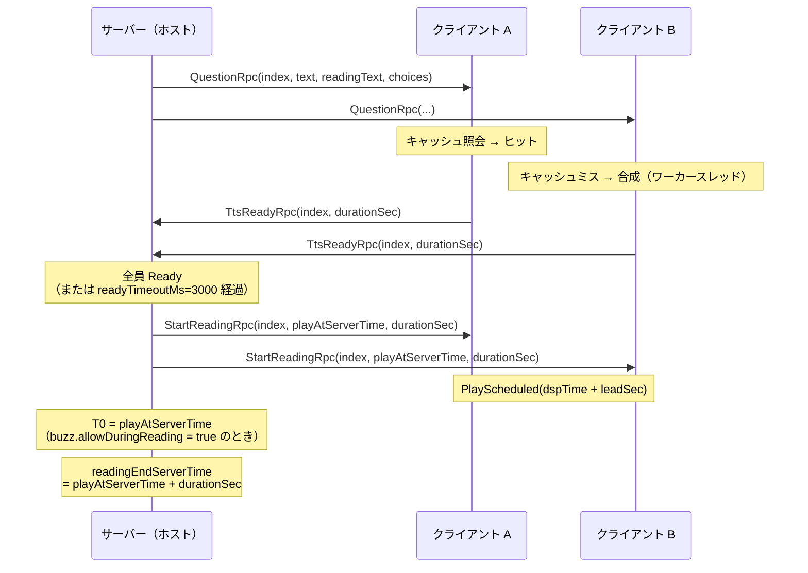

# TTS 設計（voicevox_core 組み込み）

## 目的

春日部つむぎの声で問題文を読み上げる機能を、各クライアントのローカル合成で実現するための設計を定める。
具体的には次の 7 点を確定する。

1. voicevox_core 0.17.0 C API の呼び出し順と C# P/Invoke 署名
2. ONNX Runtime（`voicevox_onnxruntime.dll`）の動的ロードと Unity での配置
3. 公式ダウンローダーの使い方と、取得後の配置構成
4. 春日部つむぎのスタイル ID を実行時に解決する方法
5. 合成結果のキャッシュ
6. 全クライアントで再生開始時刻を揃える方法
7. 音声モデルの配布方式 2 案と、規約上の確認結果

## 関連ドキュメント

- [docs/tasks/setup-brief.md](tasks/setup-brief.md) — 共通ブリーフ（仮決め K15 / K16 / K24）
- **[docs/tts-native-api.md](tts-native-api.md)** — C API の呼び出し順・P/Invoke 署名・ONNX Runtime 配置（本書 §1〜§3 を分離）
- [docs/network.md](network.md) — 再生同期の時刻軸（§7.3）と問題配信
- [External/README.md](../External/README.md) — External/ の構成とダウンローダー実行手順
- `scripts/fetch-voicevox.ps1` — ダウンローダー取得・実行スクリプト

## 0. 実測した前提

| 項目 | 値 | 確認方法 |
|---|---|---|
| voicevox_core | **0.17.0** | `External/voicevox_core/voicevox_core-windows-x64-0.17.0.zip` 内の `VERSION` を展開して確認。公式ダウンローダー取得後の `External/voicevox_core/c_api/VERSION` とも一致（実測 2026-09-13） |
| zip の中身 | `include/voicevox_core.h`(77,868B) / `lib/voicevox_core.dll`(5,934,024B) / `lib/voicevox_core.lib` / `LICENSE` / `README.txt` / `VERSION` | `unzip -l` |
| voicevox_core のライセンス | **MIT**（`Copyright (c) 2021 Hiroshiba Kazuyuki`） | zip 内 `LICENSE` を展開して確認 |
| ヘッダの生成 | cbindgen 0.28.0 | `voicevox_core.h` 冒頭のコメント |
| ONNX Runtime のリンク方式 | `#define VOICEVOX_LOAD_ONNXRUNTIME`（動的ロード） | `voicevox_core.h` L78 付近 |
| **voicevox_onnxruntime** | **1.17.3**。DLL 名は `voicevox_onnxruntime.dll`（**実測ではバージョン接尾辞なし**。`voicevox_onnxruntime-1.17.3.dll` にはならなかった） | `External/voicevox_core/onnxruntime/VERSION_NUMBER` を実際に読んで確認（2026-09-13、公式ダウンローダー実行）。コミット `a88d4e62f033fe34f7b6746871b7a2eadbe76acb`（`GIT_COMMIT_ID`） |
| **音声モデル（vvm）** | モデルタグ **0.16.4**（0.17.0 はプレリリースのため選択されず） | 公式ダウンローダーの実行ログ（`ダウンロードモデルタグ: 0.16.4`）で確認。`models/README.txt` / `models/TERMS.txt` 自体にはバージョン番号の記載なし |
| Open JTalk 辞書 | `open_jtalk_dic_utf_8-1.11`（修正 BSD、NAIST）。**タグ v1.11.1、辞書本体 1.11**（両者は別表記なので混同しないこと。実測: `Logs/voicevox-download.log` の「ダウンロードOpen JTalk辞書タグ: v1.11.1」＝配布アーカイブのリリースタグ、フォルダ名 `open_jtalk_dic_utf_8-1.11`＝辞書本体のバージョン表記） | `External/voicevox_core/open_jtalk_dic_utf_8-1.11.tar.gz` 内の `COPYING`。公式ダウンローダー経由での取得結果（`External/voicevox_core/dict/open_jtalk_dic_utf_8-1.11/`）もフォルダ名が一致することを確認（2026-09-13） |
| Unity | 6000.6.0f1 / Api Compatibility Level = .NET Standard 2.1 / Allow unsafe code = 無効 | `ProjectSettings/` |

本書に書いた関数名・引数の順序・構造体の中身は、**すべて上記 zip の `voicevox_core.h` を実際に展開して読んだ結果**である。
公式ドキュメント <https://voicevox.github.io/voicevox_core/apis/c_api/> は動的生成のため本文が取得できなかったので、ヘッダと公式サンプル
<https://github.com/VOICEVOX/voicevox_core/blob/0.17.0/example/cpp/windows/simple_tts/simple_tts.cpp> を一次情報として採用した。

> **注意**: ヘッダの展開物（`voicevox_core.h` など）は `Assets/` に置かない。C# 側は P/Invoke のみで、ヘッダは不要。

---

## 1. ネイティブ API 連携

C API の呼び出し順、C# P/Invoke 署名、UTF-8 文字列の受け渡し、エラーコードの扱い、
ONNX Runtime の動的ロードと DLL 配置は **[docs/tts-native-api.md](tts-native-api.md)** に分離した。

要点だけ再掲する。

- 呼び出し順: `voicevox_onnxruntime_load_once` → `voicevox_open_jtalk_rc_new` → `voicevox_synthesizer_new`
  → `voicevox_voice_model_file_open` → `voicevox_synthesizer_load_voice_model` → `voicevox_synthesizer_tts`
  → `voicevox_wav_free`。
- 文字列は **UTF-8 のヌル終端 `byte[]`** で渡す（既定の ANSI マーシャリングでは日本語が化ける）。
- `VoicevoxTtsOptions` は `enable_interrogative_upspeak` 1 つだけで**速度パラメータを持たない**。
  読み上げ速度を変えるには `voicevox_synthesizer_create_audio_query` → `speedScale` 書き換え →
  `voicevox_synthesizer_synthesis` の 2 段系統を使う（§6.4）。
- `voicevox_onnxruntime_load_once` の `filename` には **絶対パス**を渡す（DLL 検索パス問題の回避）。
- 返却された wav / JSON は `voicevox_wav_free` / `voicevox_json_free` **以外で解放してはいけない**。

> 分離にともない、旧 §2「C# P/Invoke 署名案」と旧 §3「ONNX Runtime の扱い」も
> [tts-native-api.md](tts-native-api.md) へ移した。以降の節番号は分離前のまま（§4 から続く）。

---

## 4. 春日部つむぎのスタイル ID 解決（仮決め K16）

### 4.1 ハードコードしない

`voicevox_voice_model_file_create_metas_json`（**注: ヘッダ上の正式名は `get_metas_json` ではなく `create_metas_json`**）が返す JSON から、
**話者名とスタイル名で検索して ID を得る**。

```json
[
  {
    "name": "春日部つむぎ",
    "speaker_uuid": "35b2c544-660e-401e-b503-0e14c635303a",
    "styles": [ { "name": "ノーマル", "id": 8, "type": "talk" } ],
    "version": "0.17.0"
  }
]
```

```csharp
public uint ResolveStyleId(string speakerName, string styleName)
{
    var ptr = VoicevoxNative.voicevox_synthesizer_create_metas_json(_synthesizer);
    try
    {
        var json  = Utf8.FromPtr(ptr);
        var metas = JsonConvert.DeserializeObject<SpeakerMeta[]>(json);   // Newtonsoft（仮決め K7）
        var style = metas
            .Where(m => m.Name == speakerName)
            .SelectMany(m => m.Styles)
            .FirstOrDefault(s => s.Name == styleName);

        if (style is null)
            throw new TtsSetupException(
                $"話者「{speakerName}」のスタイル「{styleName}」が見つかりません。" +
                $"読み込まれている話者: {string.Join(", ", metas.Select(m => m.Name))}");

        return style.Id;
    }
    finally { VoicevoxNative.voicevox_json_free(ptr); }
}
```

解決に失敗したときのフォールバック順:

1. 指定の話者・スタイル（既定: `春日部つむぎ` / `ノーマル`）
2. 指定の話者の **最初の talk スタイル**（スタイル名が将来変わった場合の保険）
3. 読み込まれている **最初の talk スタイル**（別の話者でも読み上げは成立する）＋ UI に警告
4. すべて失敗 → 読み上げなしで続行（§9）

JSON フィールドの命名は Rust の Serde 実装に準じ、VOICEVOX ENGINE とおおむね同じになる（`voicevox_core.h` の Serialization 節）。
`speaker_uuid` のようなスネークケースがあるので、デシリアライズ時は `SnakeCaseNamingStrategy` を指定するか、`[JsonProperty]` で明示する。

### 4.2 参考: 実際の ID（脚注、ハードコードしないこと）

VOICEVOX 音声モデルリポジトリ <https://github.com/VOICEVOX/voicevox_vvm> の README（リリース 0.16.4 の `README.txt`）の対応表から:

| VVM ファイル | 話者名 | スタイル名 | スタイル ID |
|---|---|---|---|
| `0.vvm` | 春日部つむぎ | ノーマル | **8** |
| `s0.vvm` | 春日部つむぎ | ノーマル（ソング） | 3008 |

同じ `0.vvm` には四国めたん（2/0/6/4）、ずんだもん（3/1/7/5）、雨晴はう（10）も入っている。
**本プロジェクトが必要とするのは `0.vvm` のみ**（トーク用ノーマル）。歌唱用 `s0.vvm`（130MB）は不要。
ダウンローダーの `--models-pattern 0.vvm` で `0.vvm` だけ取得できる（§5）。

> この表は**配置確認とトラブルシュートのための参考値**であり、コードに `8` を書いてはいけない。
> VVM のバージョンが上がると ID が変わりうるため、必ず §4.1 の実行時解決を使う。

---

## 5. 公式ダウンローダー

### 5.1 入手

公式 README（<https://github.com/VOICEVOX/voicevox_core/blob/0.17.0/docs/guide/user/downloader.md>）の Windows 手順:

```powershell
Invoke-WebRequest https://github.com/VOICEVOX/voicevox_core/releases/latest/download/download-windows-x64.exe -OutFile ./download.exe
```

本プロジェクトは **0.17.0 に固定**したいので、`latest` ではなくタグ指定で取得する。`scripts/fetch-voicevox.ps1` がこれを行う。

```powershell
gh release download 0.17.0 -R VOICEVOX/voicevox_core -p download-windows-x64.exe -D External/voicevox_core/
```

### 5.2 オプション（downloader のソースを読んで確認）

公式ドキュメントには一部しか載っていないため、`crates/downloader/src/main.rs`（タグ 0.17.0）の `struct Args` を実際に読んで全オプションを確認した。

| オプション | 値 | 既定 | 説明 |
|---|---|---|---|
| `--only <TARGET>...` | `c-api` / `onnxruntime` / `additional-libraries` / `models` / `dict` | — | 対象を限定（`--exclude` / `--min` と排他） |
| `--exclude <TARGET>...` | 同上 | — | 対象を除外（`--min` と排他） |
| `--min` | フラグ | — | `--only c-api` のエイリアス |
| `-o, --output <DIRECTORY>` | パス | **`.\voicevox_core`**（Windows） | 出力先 |
| `--c-api-version <SEMVER>` | セマンティックバージョン | `>=0.16.0-preview.0,<0.18` の最新非 pre-release | C API のバージョン |
| `--onnxruntime-version <SEMVER>` | 同上 | `>=1.17.3,<1.24` の最新非 pre-release | ONNX Runtime のバージョン |
| `--onnxruntime-type <TYPE>` | — | 既定値あり | ONNX Runtime の種類 |
| `--additional-libraries-version <SEMVER>` | 同上 | `>=0.2.1,<0.4` の最新 | DirectML / CUDA |
| `--models-version <SEMVER>` | 同上 | `>=0.16,<0.18` の最新 | 音声モデルのバージョン |
| `--models-pattern <GLOB>` | glob | `*` | 取得する VVM のファイル名パターン |
| `--devices <DEVICE>...` | `cpu` / `directml` / `cuda` | **`cpu`** | デバイス |
| `--cpu-arch <ARCH>` | — | 実行環境から自動判定 | CPU アーキテクチャ |
| `--os <OS>` | — | 実行環境から自動判定 | 対象 OS |
| `-t, --tries <NUMBER>` | 数値 / `inf` | **`5`** | リトライ回数（`0` か `inf` で無限） |
| `--c-api-repo <REPOSITORY>` | — | `VOICEVOX/voicevox_core` | |
| `--onnxruntime-builder-repo` | — | `VOICEVOX/onnxruntime-builder` | |
| `--additional-libraries-repo` | — | `VOICEVOX/voicevox_additional_libraries` | |
| `--models-repo <REPOSITORY>` | — | `VOICEVOX/voicevox_vvm` | |
| `--help` / `-h` | フラグ | — | ヘルプ |

`--only` / `--exclude` を指定しない場合は 5 つの対象すべて（`c-api` / `onnxruntime` / `additional-libraries` / `models` / `dict`）をダウンロードする。

**GitHub のレートリミット**: 環境変数 `GH_TOKEN` または `GITHUB_TOKEN` に認証トークンを設定すると緩和される（両方あれば `GH_TOKEN` が優先）。
`GH_TOKEN=$(gh auth token)` で渡すのが公式の推奨。

### 5.3 対話プロンプトについて（重要）

**0.17.0 のダウンローダーには非対話オプション（`--yes` / `--accept-terms` 相当）が存在しない。**

`crates/downloader/src/main.rs` の `ensure_confirmation` 関数を読んだ結果:

- `models` または `onnxruntime` を取得する場合、**「VOICEVOX 音声モデル 利用規約」「VOICEVOX ONNX Runtime 利用規約」への同意を求める対話プロンプトが出る**。
- 規約本文は `minus` クレートのページャで表示され、`q` で閉じたあと `[y,n,r] :` の入力を求められる。
- 入力は `io::stdin()` から読まれるため、`"y"` をパイプで流し込めば理屈のうえでは通る。ただし **ページャが TTY を要求する**ため、非 TTY 環境ではパニックして本文を直接 print するフォールバックに落ちる。動作は環境依存で不安定。
- `--only c-api dict` のように、規約対象（`models` / `onnxruntime`）を含めなければプロンプトは出ない。

**結論**: ダウンローダーは **PowerShell のコンソールで対話的に実行する**。`scripts/fetch-voicevox.ps1` はコマンドを組み立てて実行するだけで、同意入力はユーザーが行う。
スクリプトには「規約が表示されます。内容を読んで y を入力してください」という案内を出す。

### 5.4 取得対象

本プロジェクトが必要とするのは 4 つ。

```powershell
.\download-windows-x64.exe `
    --output .\External\voicevox_core `
    --only c-api onnxruntime models dict `
    --devices cpu `
    --models-pattern 0.vvm `
    --c-api-version 0.17.0
```

- `additional-libraries` は DirectML / CUDA 用なので **除外**（CPU 版のみ、確定事項の「Windows Standalone のみ」に合わせる）。
- `--models-pattern 0.vvm` で春日部つむぎ ノーマルを含む `0.vvm`（約 58MB）だけを取得する。全 VVM は 1.5GB 超あるため必須。
- `--c-api-version 0.17.0` を明示して、`External/voicevox_core/` に既にある zip とバージョンを揃える。
- `c-api` は既に手動で zip を配置済みだが、ダウンローダー経由なら利用規約ファイル等も一緒に取得できるので含めておく。

### 5.5 ダウンロード後の配置構成

```
External/voicevox_core/
├── download-windows-x64.exe              ← fetch-voicevox.ps1 が取得
├── voicevox_core-windows-x64-0.17.0.zip  ← 既に配置済み（手動）
├── open_jtalk_dic_utf_8-1.11.tar.gz      ← 既に配置済み（手動）
├── c_api/
│   ├── include/
│   │   └── voicevox_core.h
│   ├── lib/
│   │   ├── voicevox_core.dll             ★ Assets へコピー
│   │   └── voicevox_core.lib
│   ├── LICENSE
│   ├── README.txt
│   └── VERSION
├── onnxruntime/
│   └── lib/
│       └── voicevox_onnxruntime.dll      ★ Assets へコピー
│                                           （バージョン 1.17.3。実測 2026-09-13:
│                                            ファイル名にバージョン接尾辞は付かない。
│                                            third-party-notices.html も同梱される）
├── models/
│   ├── vvms/
│   │   └── 0.vvm                         ★ StreamingAssets へコピー（モデルタグ 0.16.4、実測）
│   ├── README.txt
│   └── TERMS.txt                         ← VOICEVOX 音声モデル 利用規約
└── dict/
    └── open_jtalk_dic_utf_8-1.11/        ★ StreamingAssets へコピー
        ├── char.bin
        ├── matrix.bin
        ├── sys.dic
        ├── unk.dic
        ├── left-id.def / right-id.def / pos-id.def / rewrite.def
        └── COPYING                       ← 修正 BSD（NAIST）
```

★ 印を `scripts/setup-external.ps1` が Assets へコピーする（仮決め K24）。

**実装後の実際の配置（2026-09-13、issue #21 で `scripts/setup-external.ps1` を実装・実行した結果）**:

```
Assets/Plugins/voicevox_core/x86_64/
    voicevox_core.dll
    voicevox_onnxruntime.dll

Assets/StreamingAssets/voicevox_core/
    dict/
        open_jtalk_dic_utf_8-1.11/     ← External の dict/ 構成をそのまま写す
    models/
        vvms/
            0.vvm
        TERMS.txt                      ← VOICEVOX 音声モデル 利用規約（配布時同梱）
    onnxruntime/
        TERMS.txt                      ← VOICEVOX ONNX Runtime 利用規約（配布時同梱）
    c_api/
        LICENSE                        ← voicevox_core（MIT）
```

K24 の表記（`voicevox_core/{open_jtalk_dic_utf_8-1.11, models}`）に対し、
実装では **External 側の構成（`dict/` / `models/vvms/`）をそのまま写す形**にした。
規約ファイルを同じ木に同梱するため、および External との差分確認を容易にするため。
`TsumugiQuiz.Tts.VoicevoxPaths` の探索は **どちらの配置でも辞書・vvm を見つける**
（`<root>/open_jtalk_dic*` と `<root>/dict/open_jtalk_dic*` の両方、vvm は `models/` 以下を再帰探索）。

いずれも `.gitignore` で除外する（`setup-external.ps1` が実行前に除外設定を検証する）。

---

## 6. 再生同期（仮決め K15）

### 6.0 `TtsService` のファイル構成（#140 で partial 分割）

`TtsService` は 1000 行を超えたため（PR #133 レビュー L-5）、挙動を変えずに責務ごとの
`partial class` ファイルへ分割した。公開 API（アクセス修飾子・メソッド名・シグネチャ・XML doc）は変えていない。

| ファイル | 責務 |
|---|---|
| `TtsService.cs` | フィールド・ライフサイクル（`Awake` / `OnDestroy` / `OnApplicationQuit` / `Update`）・公開プロパティ |
| `TtsService.Initialization.cs` | `ConfigureDefaults` / `ApplyDefaults` / `Initialize` / `EnsureInitializedAsync` / `RetryInitializeAsync`、合成エンジンの生成・破棄（`CreateEngine` / `GetEngineAsync` / `DisposeEngine`）、アプリ設定の読み込み（`LoadSettings`）、終了処理（`Shutdown`） |
| `TtsService.Consent.cs` | 同意ゲートの判定（`HasConsent` / `EvaluateConsent`、#37 / #127） |
| `TtsService.Synthesis.cs` | 合成本体（`SynthesizeAsync` / `PrefetchAsync` / `ProduceAsync` / `SynthesizeAndCacheAsync` / `WithCancellation`）、メモリ不足からの回復、失敗ログ |
| `TtsService.Cache.cs` | ディスクキャッシュ経由の読み込み・全消し（`ClearCache` / `TryLoadFromCache`） |
| `TtsService.Status.cs` | 内部状態の書き換え（`SetState`）と `StatusChanged` の発火（`NotifyStatusChanged`） |

### 6.1 時刻軸

`docs/network.md` §7.3 と同一の仕様。要点のみ再掲する。

```
サーバー（ホスト）:
  1. 問題を配信（network.md §8）
  2. 各クライアントの TtsReadyRpc を待つ
     ・全員 Ready、または tts.readyTimeoutMs（既定 3000ms）経過で次へ
  3. playAtServerTime = NetworkManager.ServerTime.Time + tts.leadTimeSec（既定 0.3）
  4. StartReadingRpc(questionIndex, playAtServerTime, durationSec) を SendTo.ClientsAndHost

クライアント:
  5. leadSec = playAtServerTime - NetworkManager.Singleton.LocalTime.Time
     ・leadSec <= 0 なら audioSource.Play()（間に合わなかった）
     ・そうでなければ audioSource.PlayScheduled(AudioSettings.dspTime + leadSec)
```

`AudioSource.PlayScheduled(double time)` の `time` は「`AudioSettings.dspTime` と同じ絶対時間軸の秒数」
（<https://docs.unity3d.com/6000.3/Documentation/ScriptReference/AudioSource.PlayScheduled.html>: "Absolute start time in seconds on the AudioSettings.dspTime timeline"）。
同ページが「100〜200ms 程度未来にスケジュールすること」を推奨しているため、`tts.leadTimeSec` の既定を 0.3 秒とした。
指定時刻が既に過去なら即座に再生が始まる仕様なので、遅延したクライアントでも音は鳴る（頭が欠ける形で追従する）。

### 6.2 Ready 通知のフロー



- `durationSec` は **ホストが合成した wav の長さ**を全員に配る。クライアントごとの合成結果は同じテキスト・同じ styleId・同じ speed なので同じ長さになるはずだが、**ホストの値を正**とする（僅差でも全員の「読み上げ完了時刻」を揃えるため）。
- ホストが司会専用モード（仮決め K18）でも、ホストは必ず合成を行う（`durationSec` の算出と、司会画面での再生のため）。
- `readyTimeoutMs` で打ち切られたクライアントは、合成が終わり次第そのタイミングで再生する（頭切れになるが、進行は止めない）。

### 6.3 wav → AudioClip

`voicevox_synthesizer_tts` は **WAV フォーマットのバイト列**（RIFF ヘッダ付き、16bit PCM）を返す。
`UnityWebRequestMultimedia.GetAudioClip` はファイル URL を要求するため、**メモリ上の wav を直接 `AudioClip` にするパーサを自前で持つ**。

```csharp
// TsumugiQuiz.Core に置く（Unity 非依存の解析部）＋ Tts 側で AudioClip 化
public readonly struct WavData
{
    public readonly float[] Samples;   // インターリーブ済み
    public readonly int     Channels;
    public readonly int     SampleRate;
}

public static WavData ParseWav(ReadOnlySpan<byte> bytes);   // RIFF/fmt /data のみ対応、16bit PCM

// Unity 側
var wav  = WavParser.ParseWav(bytes);
var clip = AudioClip.Create("tts", wav.Samples.Length / wav.Channels,
                            wav.Channels, wav.SampleRate, stream: false);
clip.SetData(wav.Samples, 0);
```

`AudioClip.Create` と `SetData` は **メインスレッドでしか呼べない**。合成とパースはワーカースレッドで行い、`AudioClip` 化だけメインスレッドに戻す。

**生成した `AudioClip` の所有権は呼び出し側にある**（#22）。`AudioClip` はサンプルをネイティブメモリに持つため、
再生が終わったら（遅くとも次の問題の合成を始める前に）`TtsResult.ReleaseClip()` で必ず解放する。
`ReleaseClip()` は二重呼び出し・破棄済みでも安全で、メインスレッドから呼ぶこと。

### 6.4 読み上げ速度

`VoicevoxTtsOptions` には速度のパラメータがない（tts-native-api.md §1.2）。速度を変えるには AudioQuery の `speedScale` を書き換える。

```csharp
public byte[] TtsWithSpeed(string text, uint styleId, float speed)
{
    if (Mathf.Approximately(speed, 1.0f)) return Tts(text, styleId);   // ショートカット

    var textUtf8 = Utf8.ToNullTerminated(text);
    Vv.Check(VoicevoxNative.voicevox_synthesizer_create_audio_query(
                 _synthesizer, textUtf8, styleId, out var jsonPtr), "AudioQuery の生成");
    string json;
    try     { json = Utf8.FromPtr(jsonPtr); }
    finally { VoicevoxNative.voicevox_json_free(jsonPtr); }

    // speedScale だけを書き換える（他のフィールドは触らない）
    var query = JObject.Parse(json);
    query["speedScale"] = speed;                      // 0.5〜2.0 に clamp 済みの値
    var editedUtf8 = Utf8.ToNullTerminated(query.ToString(Formatting.None));

    var opts = VoicevoxNative.voicevox_make_default_synthesis_options();
    Vv.Check(VoicevoxNative.voicevox_synthesizer_synthesis(
                 _synthesizer, editedUtf8, styleId, opts, out var lenPtr, out var wavPtr), "音声合成");
    try
    {
        var len = checked((int)lenPtr.ToUInt64());
        var wav = new byte[len];
        Marshal.Copy(wavPtr, wav, 0, len);
        return wav;
    }
    finally { VoicevoxNative.voicevox_wav_free(wavPtr); }
}
```

- ルーム設定 `tts.speed`（既定 `1.0`、範囲 `0.5`〜`2.0`）。
- **`AudioSource.pitch` で速度を変えてはいけない**。声の高さが変わるうえ、`durationSec` が全員でずれる（`pitch` は端末ごとの設定になりうる）。必ず合成段階で確定させる。
- `speed` はキャッシュキーに含める（§5 / K16）。

### 6.5 初期化のタイミング（#22 で確定）

`TtsService` は Boot シーンに常駐する（`DontDestroyOnLoad`）が、**`Awake` では初期化しない**。
Boot シーンに置いた Editor 設定（`TtsServiceBootstrap`）が `_initializeOnAwake` を **false** にする。

理由: voicevox_core の初期化は `voicevox_onnxruntime_load_once` で
**ONNX Runtime をプロセス全体にロードする**副作用があり、一度ロードすると以後は取り消せない
（ヘッダのコメント: 冪等で、2 回目以降は引数を無視して同じ参照を返す）。
Boot シーンを読み込むだけの他の PlayMode テスト（`BootSceneBootstrapTests` など）や
エディタ拡張まで巻き込むと、DLL 検索パスの実測（tts-native-api.md §3.3、
`VoicevoxDllSearchPathTests`）ができなくなる。

したがって初期化の入口は次の 1 本にする。

```csharp
// 読み上げを使う画面の起動シーケンス（#23 の同期再生）から呼ぶ
await TtsService.Instance.EnsureInitializedAsync();
if (!TtsService.Instance.Status.IsReady)
{
    // 読み上げなしで続行（§9）。Status.Reason は UI に出してよい文言
}
```

- `EnsureInitializedAsync()` は**多重に呼んでも初期化は 1 回だけ**で、常に同じ `Task` を返す。
- 初期化に失敗しても例外を投げない。`Status` が `NotAvailable(理由)` になるので、
  待ったあとに `Status` を見て読み上げの可否を判断する。
- `Application.*` を読むため**メインスレッドから呼ぶこと**。
- 呼び忘れても `SynthesizeAsync` / `PrefetchAsync` が内部で同じ入口を通るので読み上げ自体は成立するが、
  初回の待ち時間（辞書とモデルの読み込みで数秒）がそのまま 1 問目に乗る。

**同意ゲート（#37 / #127、requirements.md FR-74 / FR-75 / NFR-08）**

利用規約に同意していない状態・同意を撤回した状態では、読み上げを実行してはいけない。
判定は UI 層の `ConsentGate.HasUserConsented()` が持つが、asmdef の依存方向が `UI → Tts` の一方向で
**Tts 層から UI 層は参照できない**ため、**確認は呼び出し側（UI 層）の責務**とする。

```csharp
if (!ConsentGate.HasUserConsented())
{
    return;   // EnsureInitializedAsync も呼ばない（TtsSyncPlayer.InitializeAsync）
}

// 撤回（FR-75）を後から拾うため、合成のたびに確認させる
await TtsService.Instance.EnsureInitializedAsync(consentCheck: TtsConsentCheckFactory.Build());
```

- `TtsService.ConfigureDefaults` / `Initialize` / `EnsureInitializedAsync` / `RetryInitializeAsync` の
  `consentCheck`（既定 null = 制限なし）に `ConsentGate.HasUserConsented` を渡すと、**合成のたびに**確認され、
  false なら合成せず `null` を返す。
- 判定自体が例外になった場合は安全側（未同意扱い）に倒す。
- **`TtsService.ReadingEnabled` は同意ゲートとは別の軸**で、撤回時も書き換えない（#127）。
  撤回のたびに潰すと同意し直しても読み上げが戻らなくなるため。
  なお `ReadingEnabled` を**本番のコードで書き込んでいる箇所は現時点で無い**（#127 レビュー M-1）。
  ルーム設定 `tts.enabled` の反映先は `TtsSyncCoordinator.SetReadingEnabled`（`NetworkVariable` 同期、
  書き込むのは `RoomSettingsApplier` だけ。docs/network.md §12.6）で、`TtsService` 側へは反映していない。
- **判定の出所は `TtsConsentCheckFactory.Build()`（`TsumugiQuiz.UI.Views.Settings`、#127）に一本化する**。
  渡すのは「判定結果」ではなく「判定関数」で、これがゲーム進行中の撤回を次の問題から効かせる仕組みになる。
  呼び出し元は次の 5 か所（#32 で `TtsSettingsProviderFactory` に一本化したのと同じ作法）:

  | 呼び出し元 | 渡す先 |
  |---|---|
  | **アプリ起動時**（`ViewRouter.Awake` → `DefaultViewControllerRegistrations.ConfigureTtsConsentGate`、#127 H-1） | **`TtsService.ConfigureDefaults`**（初期化は始めない） |
  | `GameView`（`GameView.Tts.cs` の `WireTtsSyncPlayer`、#127） | `TtsSyncPlayer.SetConsentCheck` → `TtsService.EnsureInitializedAsync` |
  | `QuestionEditorView`（`QuestionEditorView.Form.Tts.cs`、#32） | `TtsService.EnsureInitializedAsync`（読み上げプレビュー） |
  | `TtsStatusPanel` の「再試行」（#127） | `TtsService.RetryInitializeAsync` |
  | `TitleView` / `SettingsView` | `TtsStatusPanel` 経由（上と同じ） |

  `RetryInitializeAsync` に渡し忘れると、再試行のたびに `TtsService` 側の `consentCheck` が
  null（＝制限なし）へ戻ってしまう（#127 で修正）。

**最初の初期化者は `GameView` ではない（#127 レビュー H-1）**

読み上げの初期化を最初に始めるのは、**ロビーで `GameSession` がスポーンした時点**の
`TtsSyncCoordinator.OnNetworkSpawn` → `TtsSyncPlayer.InitializeAsync` であり、
`GameView` がセッションを取得して `WireTtsSyncPlayer` を呼ぶ**より前**に走る。
`Network` / `Tts` 層から `UI` 層は参照できないので、その時点では同意確認を渡せない。
対策は次の 3 段構えとした。

1. **アプリ起動時に `TtsService.ConfigureDefaults(settingsProvider:, consentCheck:)` を呼ぶ**
   （`ViewRouter.Awake`、Terms/Title の振り分けと同じ場所）。登録するだけで
   **voicevox_core / ONNX Runtime のロードは始めない**（#25 H-5・§6.5 の方針を維持）。
2. **`TtsSyncPlayer` は自分に `consentCheck` が差し込まれていなければ `TtsService.IsConsentSatisfied` に従う**。
   これでロビー時点の `InitializeAsync` も同意ゲートを通る（未同意なら初期化そのものを行わない）。
3. **`TtsService.Initialize` は 2 回目以降でも非 null の `consentCheck` を取り込む**（レビュー M-5）。
   「同意を知らない呼び出し元」が先に初期化しても、あとから渡した判定が必ず効く
   （アプリ設定 `settingsProvider` は初期化時に一度しか読まないため取り込まない。
   変更するときは `RetryInitializeAsync` で渡し直す）。

検証は PlayMode `TtsConsentGateBootstrapTests`（Boot → Main を実際に読み込み、ロビーで
`GameSession` をスポーンさせて「未同意なら `TtsService.Status` が `NotInitialized` のまま」を固定）。

**アプリ設定（`tts.*`）の反映（#28 で確定、#138 で「都度読み」へ変更）**

`consentCheck` と同じ理由（`Tts` 層から `UI` 層の `AppSettingsStore` は参照できない）で、
`tts.speakerName` / `tts.styleName` / `tts.cacheMaxBytes` / `tts.cacheMaxEntries` / `tts.assetPathOverride`
（アプリ設定、docs/room-settings.md §2）を読み込む窓口は `ITtsSettingsProvider` として抽象化してあり
（`TtsSettings.cs`）、呼び出し側（UI 層）が差し込む。

**provider の出所は `TtsSettingsProviderFactory.BuildOrNull()`（`TsumugiQuiz.UI.Views.Settings`）に一本化する。**
返るのは `AppSettingsTtsSettingsProvider` で、**`Load()` のたびに `app-settings.json` を読み直す**（#138）。
`AppPaths` が未設定（Boot を経由しないテスト等）のときだけ `null` を返し、
`TtsService` 既定の `DefaultTtsSettingsProvider`（すべて既定値）へフォールバックする。

```csharp
// 起動時に登録しておく（ConfigureTtsConsentGate）。初期化は始めない。
TtsService.Instance.ConfigureDefaults(
    settingsProvider: TtsSettingsProviderFactory.BuildOrNull(),
    consentCheck: TtsConsentCheckFactory.Build());
```

| 呼び出し元 | 渡す先 |
|---|---|
| **アプリ起動時**（`ViewRouter.Awake` → `DefaultViewControllerRegistrations.ConfigureTtsConsentGate`） | `TtsService.ConfigureDefaults(settingsProvider:)` |
| `GameView`（`GameView.Tts.cs` の `WireTtsSyncPlayer`） | `TtsSyncPlayer.SetSettingsProvider` → `TtsService.EnsureInitializedAsync` |
| `QuestionEditorView`（`QuestionEditorView.Form.Tts.cs`、#32） | `TtsService.EnsureInitializedAsync` / `TtsStatusPanel.Create`（読み上げプレビュー） |
| `TtsStatusPanel` の「再試行」（Title / Settings / 問題エディタ） | `TtsService.RetryInitializeAsync(settingsProvider:)` |
| Settings View のアプリ設定「保存」（`SettingsView.AppTab.cs` → `TtsAppSettingsReloader`、#138） | `TtsService.RetryInitializeAsync(settingsProvider:)` |

**なぜ「起動時スナップショット」ではいけないか（#138）**

`TtsService.Initialize` が `Settings = LoadSettings()` を実行するのは**初期化のその瞬間の 1 回だけ**で、
その最初の初期化者は `GameView` ではなく**ロビーで `GameSession` がスポーンした時点**の
`TtsSyncCoordinator.OnNetworkSpawn` → `TtsSyncPlayer.InitializeAsync` である（上の H-1 参照）。
起動時に固定値（`FixedTtsSettingsProvider`）を登録していると、
「設定画面で `tts.speakerName` / `tts.assetPathOverride` を変更 → 再起動せずホスト」で
**起動時の値のまま初期化されてしまう**。`Load()` のたびに読み直す provider にしておけば、
誰が最初の初期化者でも「そのとき保存されている値」が使われる。

**初期化後に設定を変えたとき（`TtsAppSettingsReloader`、#138）**

provider を都度読みにしても、**初期化後の変更は自動では反映されない**。
話者・スタイル・`assetPathOverride` は合成エンジン（`ITtsSynthesisEngine`）の**生成時に固定**され、
キャッシュ上限（`TtsCacheLimits`）も初期化時にしか読まれないからである。
そのため Settings View のアプリ設定「保存」（`SettingsView.AppTab.cs` の `OnAppSaveClicked`）が
`TtsAppSettingsReloader.ReloadIfNeeded(TtsService.Instance)` を呼び、
**保存内容が適用中の設定と違うときだけ** `RetryInitializeAsync` で初期化をやり直す
（`NetworkBootstrap.ApplyAppSettings` / `GameView.InvalidateCharacterEnabledCache` と同じ作法）。

再初期化を始める条件は次の 4 つを**すべて**満たすときだけ:

1. すでに初期化を始めている（`Status.State != NotInitialized`）。
   未初期化のまま走らせると、**設定を保存しただけで voicevox_core（ONNX Runtime）を
   プロセス全体へロード**してしまう（§6.5 冒頭・#25 H-5 の方針に反する）。
   未初期化なら何もしなくてよい（都度読みの provider が次の初期化で最新値を読む）
2. 利用規約に同意している（FR-74 / FR-75）。撤回後にロードし直さない。
   判定の出所は他と同じ `TtsConsentCheckFactory.Build()`
3. 保存先を解決できる（`AppPaths` 設定済み ＝ `BuildOrNull()` が非 null）
4. 保存内容が適用中の `TtsService.Settings` と実際に違う（同じ値での作り直しを避ける）

**初期化中（`Initializing`）の保存は、完了してから反映する（#138 レビュー H-1）**

`RetryInitializeAsync` は同期部分で直前のエンジンを破棄する（`DisposeEngine`）が、
**初期化タスクが走っている最中はその完了を最大 10 秒（`ShutdownWaitMs`）メインスレッドで待つ**。
設定画面は Title だけでなく**ロビーからも開ける**（`LobbyView` の「設定」ボタン）ので、
ロビーでの先行初期化（`TtsSyncCoordinator.OnNetworkSpawn`）の最中に保存すると、
そのまま画面が固まる。そこで `TtsAppSettingsReloader` は

- `Initializing` のときは**その場で再初期化せず**、`TtsService.StatusChanged` を購読して
  初期化の完了を待ち、完了時点で判定（上の 4 条件）をやり直してから `RetryInitializeAsync` を呼ぶ。
  購読は**常に 1 つだけ**で、届いた時点で自己解除する（保存を連打しても再初期化は 1 回）
- 初期化が失敗して `NotAvailable` になった場合は再初期化せず、ログに残すだけにする
  （配置が直っていない状態で読み直しても同じ失敗を繰り返すため。直したあとは
  「音声合成」パネルの「再試行」から明示的にやり直せる）
- `Ready` まで進んでいれば直前のエンジンの破棄は即時に終わるので、**そこでの再初期化はブロックしない**

保存直後のメッセージも出し分ける（`SettingsView.AppTab.cs`）:

| 状況 | メッセージ |
|---|---|
| 再初期化なし（未初期化・未同意・変化なし） | アプリ設定を保存しました。 |
| その場で再初期化（`Ready` / `NotAvailable`） | アプリ設定を保存しました。読み上げを初期化し直しています… |
| 初期化完了まで持ち越し（`Initializing`） | アプリ設定を保存しました。読み上げは初期化完了後に反映します。 |

出題中（Game View）からは設定画面へ入れないので、この再初期化が読み上げ中の合成を巻き込むことはない。

- `TtsService.EnsureInitializedAsync` は**初回呼び出し時にしか `settingsProvider` を読まない**
  （§6.5 のとおり、voicevox_core の初期化は明示的に一度だけ行う設計）ため、`SetSettingsProvider` は
  `InitializeAsync` より前に呼ぶ必要がある
- `RetryInitializeAsync` は初期化状態を一度リセットしてからやり直すため、
  既に初期化済みでも新しい `tts.*`（`assetPathOverride` を含む）を反映できる
- 検証は EditMode `TtsSettingsProviderFactoryTests` / `TtsAppSettingsReloaderTests`
  （判定と持ち越しのみ。実際の再初期化は `RestartOverrideForTesting` で差し替えるので `External/` 不要）と、
  PlayMode `TtsAppSettingsLiveTests`（Boot → Main → ロビーのスポーン → 設定画面で保存、の実経路。
  初期化中の保存で「保存クリックの同期処理が 1 秒を超えない」ことも実測で固定している。
  実測は数ミリ秒で、この閾値が守っているのは「`ShutdownWaitMs` = 10 秒のブロックが再発していない」ことである）

### 6.6 実装した同期再生（#23 で確定）

#### コンポーネント構成

同期再生は 2 つのコンポーネントで分担し、**両方を `Assets/TsumugiQuiz/Prefabs/GameSession.prefab`
（`NetworkObject` + `GameSession` + `QuestionDistributor`）に載せる**。

| クラス | asmdef | 役割 |
|---|---|---|
| `TtsSyncCoordinator : NetworkBehaviour` | `TsumugiQuiz.Network` | 司令塔。Ready 待ちの集約、`playAtServerTime` の決定、RPC の送受信、受付開始 T0 の確定 |
| `TtsReadyTracker` | `TsumugiQuiz.Network` | Ready 通知の集約ロジック（純 C#。Unity / NGO に非依存で EditMode テスト可能） |
| `TtsSyncPlayer : MonoBehaviour` | `TsumugiQuiz.Tts` | `AudioSource` 1 つで `PlayScheduled`。合成の依頼（`TtsService`）とクリップの解放も担う |
| `PlaybackScheduler` / `PlaybackSchedule` | `TsumugiQuiz.Tts` | サーバー時刻 → `AudioSettings.dspTime` の変換と予約の判断（純 C#） |
| `IReadingPlayback` | `TsumugiQuiz.Core`（`Core/Audio`） | 司令塔 ↔ 再生の契約 |

`Network` と `Tts` は同じ層で互いに参照できない（docs/architecture.md §3 の依存方向）ため、
契約を `Core` 層の `IReadingPlayback`（純 C#）に置き、司令塔は同じ `GameObject` の実装を
`GetComponent<IReadingPlayback>()` で見つける。差し替えは `TtsSyncCoordinator.SetPlayback` でもできる。

#### RPC

| メソッド | 方向 | 備考 |
|---|---|---|
| `TtsSyncCoordinator.TtsReadyRpc(int questionIndex, double durationSec)` | `SendTo.Server`（`internal`） | 読み上げの準備完了。送信元は `rpcParams.Receive.SenderClientId` から取る。読み上げを行わないクライアント（`tts.enabled=false` / 未同意 / 配置不足）も **長さ 0 で即座に** 返す。範囲外（0〜`TtsReadyTracker.MaxReportedDurationSec` = 120 秒）・重複・待っていないクライアント・待っていない問題インデックスからの通知は棄却する |
| `TtsSyncCoordinator.PlayAtRpc(int questionIndex, double playAtServerTime, double durationSec)` | `SendTo.ClientsAndHost`（`InvokePermission = Server`、`private`） | 再生開始時刻の配信。`durationSec` は **ホストの合成結果だけ**（§6.2）。受信側は「提示済みの現在問と一致するか」「直近より古くないか」も検証して古い配信を捨てる |

> 名称について: 本節の設計時は `StartReadingRpc` と書いていたが、実装では
> 「再生開始時刻を配る」という役割に合わせて **`PlayAtRpc`** とした（統括指示 2026-09-13）。

#### 1 問の流れ（実装）

```
サーバー（ホスト）                                 クライアント
GameSession.StartQuestion(index)
  → QuestionDistributor が DTO を配信（network.md §8.6）
  → 受信確認（Ack）が揃う
GameSession.QuestionShown(index, dto, source = Distribution) を全ピアで発火
  ├ サーバー: TtsReadyTracker.Begin(index, Ack を返したクライアント, readyTimeoutMs)
  │           GameSession.SetBuzzOpenTime(
  │               now + readyTimeout + max(leadTime, ReadyHoldMarginSec))   ← ゲートの予約
  └ 全ピア  : TtsService.SynthesizeAsync(readingText, speed) → TtsReadyRpc(index, durationSec)
              （tts.enabled=false なら合成しない。初期化が終わっていなければ 0 を報告）
              （source = Resync なら合成しない＝途中参加・再接続の合流。§6.7）
                                                    ↑ 読み不在なら問題文を使う（§7.1）
サーバー: 全員 Ready または readyTimeoutMs 経過
  → playAtServerTime = ServerTime.Time + tts.leadTimeSec
  → PlayAtRpc(index, playAtServerTime, ホストの durationSec)
  → buzz.allowDuringReading ? GameSession.NotifyReadingStarted(playAtServerTime)
                            : GameSession.NotifyReadingCompleted(playAtServerTime + durationSec)
全ピア: PlaybackScheduler.ToDspTime(playAtServerTime, LocalTime.Time, AudioSettings.dspTime)
        → AudioSource.PlayScheduled（間に合わなければ頭を飛ばして即再生）
```

- **ゲートの予約**が要るのは、`GameSession.SetBuzzOpenTime` が **Reading 中しか受理しない**ため
  （network.md §8.6）。出題（Ack 完了）の直後に受付が開いてしまうと、合成を待つ間に T0 を差し込めない。
  そこで出題の合図を受けた時点で「Ready 待ちの上限 + `max(tts.leadTimeSec, ReadyHoldMarginSec)`」まで
  受付を止め、Ready が揃った時点で実際の `playAtServerTime` へ引き下げる。結果として
  **T0 = max(受信確認の完了時刻, playAtServerTime)** になる。
  マージン（`TtsSyncCoordinator.ReadyHoldMarginSec` = 0.1 秒、`QuestionDistributor.AckHoldMarginSec` と同じ思想）を
  足すのは、Ready のタイムアウト判定（同期再生の tick）が受付開始（状態機械の tick）より
  **必ず先に走る**ようにするため。`tts.leadTimeSec` を下限の 0.1 秒にしてもこの順序は崩れない。
- **読み上げを行わない場合**（`tts.enabled=false`、ホスト自身が読み上げ不可 = 配置不足・未同意）は
  Ready 待ちもゲートの予約も行わず、受付は受信確認の完了と同時に開く（進行を止めない、§9）。
- **時刻の基準**は `NetworkManager.LocalTime.Time`（§6.1 / network.md §7.3 の式どおり）。
  1 プロセスのホスト + クライアントで実測した予約 dsp 時刻のずれは **10ms 前後**
  （`TtsSyncPlaybackTests` のログで 7.7〜10.3ms。実行ごとに変動する）で、
  network.md §7.2 の見積り（数 ms〜数十 ms）に収まる。
  **実機・マルチプロセスでの実測は #8（検証手順）/ #15（縦切り確認）で行う**（統括判断 2026-09-13）。
- **クリップの解放**: 再生完了（dsp 時刻が終了時刻を越えた）・次の問題の合成開始・Despawn / 破棄の
  いずれでも `TtsResult.ReleaseClip()` を呼ぶ。再生完了時は `TtsSyncPlayer.ReadingCompleted`
  （引数は問題インデックス）を発火するので、立ち絵・UI（#28）はこれを購読する。
- **Ready がタイムアウトしたクライアント**には `PlayAtRpc` が先に届く。合成が終わり次第、
  変換済みの dsp 目標時刻に対して「頭を飛ばして即再生」する（§6.1）。
  過ぎた分が音声の長さ以上なら再生しない（無音で追いつく）。
- **`durationSec` はホストの報告値だけを使う**。ホストが報告できなかった場合（合成できない・
  Ready がタイムアウトした）は **0** で、読み上げ完了時刻 = `playAtServerTime` として扱う。
  クライアントの報告値へフォールバックしない（統括判断 2026-09-13）。
  クライアントの値は信用できない入力（network.md §9）で、採用すると
  `buzz.allowDuringReading = false` のときに受付開始を最大 120 秒遅らせられてしまう。
- **Ready を待つ相手**は「問題データの受信確認（Ack）を返したクライアント」に合わせる（network.md §8.6）。
  データが届いていないクライアントは出題（提示）を処理できず Ready も返せないため、
  待ち対象に入れるとタイムアウトぶんだけ全員が待たされる。
- **`tts.enabled` は `NetworkVariable<bool>`**（サーバー書き込み・クライアント読み取り）で同期する。
  クライアントも値を見て、無効なら合成そのものを始めない。切り替えは
  `TtsSyncCoordinator.SetReadingEnabled`（サーバーのみ）。
  **`SetReadingEnabled` を呼ぶのは `TsumugiQuiz.Network.RoomSettingsApplier` だけ**（#28 Phase 2 の統括判断）。
  Settings View（#28）は `tts.enabled` を**ルーム設定**として `RoomSettingsSync.TrySetSettings` に渡すのみで、
  実行時の読み上げ ON/OFF（`ReadingEnabled`）を直接書き換えない（docs/network.md §12.6）。
- **初期化のタイミング**: `EnsureInitializedAsync` は `TtsSyncCoordinator.OnNetworkSpawn` のクライアント側で、
  **`tts.enabled` が true かつ同意済みのときだけ**呼ぶ（ONNX Runtime のプロセス全体へのロードを
  読み上げを使わない場面で起こさないため、§6.5）。初期化が終わる前に出題された問題は
  「読み上げなし」で進める（`Status.IsReady` でなければ合成しない）。
- 速度は本 issue では定数 `1.0`（`TtsSyncCoordinator.DefaultSpeed`）。
  `tts.enabled` / `tts.speed` / `tts.readyTimeoutMs` / `tts.leadTimeSec` / `buzz.allowDuringReading` は
  `TtsSyncCoordinator` のプロパティとして用意してあり、ルーム設定との接続は **#26**（コード上は `TODO(#26)`）。
- **利用規約の同意（#127 で確定、FR-74 / FR-75 / NFR-08）**: `GameView`（`GameView.Tts.cs` の
  `WireTtsSyncPlayer`）が、セッション取得時・読み上げの初期化より前に
  `TtsSyncPlayer.SetConsentCheck(TtsConsentCheckFactory.Build())` を配線する
  （同じ判定が `TtsService.EnsureInitializedAsync(consentCheck:)` にも渡る）。判定は**出題のたびに**
  評価されるため、ゲーム進行中に撤回しても次の問題から止まる。詳しくは下の表を参照。

**ゲーム進行中に同意を撤回したときの挙動（統括判断 #127、2026-09-18 ユーザー承認）**

| | 撤回した瞬間 | 撤回後に提示される問題 |
|---|---|---|
| **鳴っている**音声 | **止めない**（その 1 問は完了まで鳴らす） | — |
| **合成済み・まだ鳴っていない**音声 | **再生を始めない**（`StartPlayback` の入口で確認、レビュー H-2） | — |
| 合成（`PrepareReadingAsync`） | — | **行わない**（`IsReadingPossible` が false） |
| ログ | — | `[TtsSyncCoordinator] 問題 N は読み上げません（未同意・読み上げ無効・準備未完了のいずれか）。`（`Debug.Log`、issue #164。**配信の前に**撤回・未同意だったクライアントはここでしかログが残らない。配信の後の撤回は下記 `StartPlayback` 入口の `[TtsSyncPlayer]` ログで追える） |
| Ready 通知（`TtsReadyRpc`） | — | **長さ 0 で即座に返す**（下記） |
| 自分がホストの場合 | — | `BeginReadyRound` が同期再生自体を行わない（全員を待たせない） |
| `PlayAtRpc` を受けたとき | 予約せず完了だけ通知する（合成済みでも鳴らさない） | 予約自体は記録されるが、合成結果が無いので鳴らない |

- **鳴っている音声を止めない**のは、判定が出題単位（`IsReadingPossible` → `PrepareAsync`）で行われる設計に
  そろえたため。読み上げの途中で音が切れると早押しの公平性（受付開始 T0 の基準）が崩れる副作用もある。
  次の問題からは合成も再生も行わないので、FR-74 / FR-75 の「撤回したら使わせない」は満たす。
- **合成済み・未再生は鳴らさない**（レビュー H-2）。合成が終わってから実際に鳴り始めるまでには
  Ready 待ち（最大 `tts.readyTimeoutMs` = 既定 3 秒）と `tts.leadTimeSec`（既定 0.3 秒）の隙間があり、
  ここで撤回されると「撤回したのに読み上げが始まる」ことになるため、`TtsSyncPlayer.StartPlayback` の
  入口でも同意を確認する。再生は始めないが、立ち絵・UI が待ち続けないよう
  `ReadingCompleted` だけは発火する（`CancelReading` と同じ扱い）。
- **ホスト自身が撤回した場合**も、ホストは同時にクライアントでもあるので上の表と同じ扱いになる
  （レビュー L-7）。加えてサーバーとして `BeginReadyRound` が同期再生自体を行わなくなるため、
  以後の問題では**全員分の Ready 待ちもゲートの予約も無くなり、受付は配信完了と同時に開く**
  （§9 の「読み上げを行わない場合」と同じ進行。他のクライアントが同意済みでも、
  読み上げ時間の正は常にホストの報告値なので全体として読み上げなしで進む）。
- **Ready は「返さない」ではなく「長さ 0 で即返す」**。これは #109 の再同期（`Resync`）とは逆の選択で、
  理由は次のとおり: 撤回したクライアントは**出題時点で接続しており、サーバーの Ready 待ち対象
  （`ResolveReadyClientIds`）に入っている**ため、返さないとそのクライアントぶんだけ全員が
  `tts.readyTimeoutMs`（既定 3 秒）待たされる。一方 `Resync` の合流者は待ち対象に入っていないので、
  返しても棄却ログが増えるだけだった。既存の「読み上げを行わないクライアント（配置不足・未同意）は
  即座に 0 秒で Ready を返す」経路（`PrepareReadingAsync` の先頭）にそのまま乗る。
- **スキップ理由を区別しない**（issue #164、統括判断）: `PrepareReadingAsync` の先頭のログは、
  読み上げの窓口が無い場合・読み上げテキストが空の場合はその旨を書き分けるが、
  `IsReadingPossible` が false の内訳（未同意・読み上げ無効・初期化未完了）はまとめて 1 つの文言にする。
  `Network` 層は `Tts` 層を参照できない（docs/architecture.md §3）ため、区別するには `Core` 層の
  `IReadingPlayback` を広げる必要があるが、ログ 1 行を出すだけの本 issue の範囲に対して
  インターフェース変更は見合わないと判断した。
- 検証: PlayMode `TtsConsentRevocationTests`（出題 → 合成 → 撤回 → 次の問題で合成されない。
  2 問目で上記ログが出ることを `LogAssert.Expect` で固定、issue #164）、
  PlayMode `TtsPlaybackConsentGuardTests`（合成済み・未再生 → 撤回 → 再生を始めない、H-2）、
  PlayMode `TtsConsentGateBootstrapTests`（アプリ起動時の登録、H-1）、
  EditMode `TtsConsentWiringTests`（配線そのもの）。

### 6.7 途中参加・再接続したクライアントの扱い（#109 で確定）

出題中に途中参加（`network.allowLateJoin`）・再接続したクライアントには、サーバーが現在問の
問題データ（DTO）・画像を送り直す（docs/network.md §2.4「進行中に合流したクライアントへの再送」）。
このとき **`GameSession.QuestionShown` は `QuestionShownSource.Resync` として発火する**。

**合流したクライアントは、その問題の読み上げには参加しない**（統括判断 #109）。

| | 通常の出題（`Distribution`） | 合流時の再同期（`Resync`） |
|---|---|---|
| 合成（`PrepareReadingAsync`） | 行う | **行わない** |
| Ready 通知（`TtsReadyRpc`） | 返す | **返さない** |
| `PlayAtRpc` を受けたとき | 予約して再生する | 再生の予約はしない（合成していないので鳴らせない）。ただし再生開始時刻は記録し `ReadingScheduled` も発火する（文字送りの時間軸として使う、#144 §6.8） |
| サーバーの Ready 待ち | 対象（`ResolveReadyClientIds`） | 対象外（出題時に接続していたクライアントだけを待つ） |

理由:

- 合流した時点で読み上げは既に始まっている（あるいは終わっている）。いまから合成しても
  全員と同じ `playAtServerTime` には間に合わず、途中から鳴らすと不揃いになる
- サーバーは出題時点の接続者だけを待っているので、後から Ready を返しても**受理されず棄却ログになる**
  （`TtsSyncCoordinator` の棄却ログが増えるだけで、進行には何も影響しない）

合流したクライアントは**その問題だけ音声なし**（問題文・画像は表示される）で進み、
**次の問題からは通常どおり**読み上げに参加する（`_shownQuestionIndex` を更新しないため、
次の出題で通常経路の `QuestionShown` を受けた時点から従来の流れに戻る）。

### 6.8 問題文の文字送りと読み上げの同期（issue #144、**2026-09-30 ユーザー承認済み**）

自由入力（早押し）形式の問題文を、ノベルゲームのように先頭から 1 文字ずつ表示する（requirements.md FR-43）。
表示は**各クライアントのローカル処理**で、ネットワーク同期は行わない。読み上げの再生開始時刻は既存の
`PlayAtRpc`（§6.6）で全員にそろっているため、同じ時刻軸で文字を送れば読み上げとも他のクライアントとも揃う。

#### 進め方

| 状況 | 進め方 |
|---|---|
| 自由入力・通常の出題（`QuestionShownSource.Distribution`）・部屋として読み上げあり（ルーム設定 `tts.enabled = true`） | 再生開始時刻を待つ（1 文字も出さない）→ `TtsSyncCoordinator.ReadingScheduled` を受けたら**ホストの読み上げ時間を文字数で按分**して送る。**この PC が音を鳴らすかは問わない**（同意撤回・読み上げ未準備の PC も同じ時間軸で表示する） |
| 自由入力・部屋として読み上げなし（`tts.enabled = false`） | 出題と同時に**固定速度**（ルーム設定 `question.revealMsPerChar`、既定 80ms/文字）で送る |
| 再生開始時刻を待っている間に早押し受付が開いた（Phase = `BuzzOpen`） | 読み上げなしの進行とみなし、**受付開始時刻（`GameSession.BuzzOpenServerTime` を表示側の時計へ写した時刻）を起点に**固定速度で送る（待ちの上限タイマーは持たない。PR #166 レビュー M-1 / 再レビュー LOW） |
| 途中参加・再接続の再同期（`Resync`） | **再同期の応答（`GameSession.SessionStateRpc`）にサーバー側の現在の問題の再生開始時刻・読み上げ時間を載せ**、受け取った PC は `TtsSyncCoordinator.ApplyResyncReading` で記録してから提示を処理する。これで再接続（coordinator が新しくスポーンされ記録が無い）・途中参加でも、読み上げは鳴らせないが文字送りは**同じ時間軸で途中から**揃う（PR #166 再レビュー 2 回目の統括判断）。応答に載っていなくても、合流後に届いた `PlayAtRpc` は記録する（上の §6.7 の表）。それでも時間軸が無く受付前・受付中（Reading / BuzzOpen）なら読み上げ待ちから始め、受付開始から固定速度（下限あり、下記）。回答中・判定後で時間軸が無ければ全文 |
| View の復元（Game View を開いた時点で出題済み。`RefreshFromCurrentState` / #95 の `TryRestoreMissedQuestion`） | 判定前（Reading / BuzzOpen / Locked / Answering / Judging）なら通常の出題と同じ経路で始め、取りこぼした再生開始時刻は上と同じ値から追いつく。受付が開いていれば読み上げ待ちをやめ、回答中なら止める。Result 以降は全文（PR #166 レビュー H-1） |
| 選択式・司会専任の司会画面・`question.revealMsPerChar = 0` | 一括表示（全文） |

- **統括判断（B 案、2026-09-30）**: 「読み上げの見込み」は部屋単位（`TtsSyncCoordinator.ReadingEnabled`、
  ルーム設定 `tts.enabled`）で判定し、この PC が合成・再生できるかは見ない。当初案（この PC が読み上げない
  なら出題と同時に固定速度）では、ホストが読み上げている部屋で受付開始（= 再生開始時刻。出題から最大
  `tts.readyTimeoutMs + tts.leadTimeSec` ≒ 3.3 秒後）より前に全文が読めてしまい、早押しの公平性が崩れるため。
  読み上げない PC も `PlayAtRpc` は受け取る（§6.6）ので、音は鳴らなくても表示は他の人と同じ時間軸になる。
- 固定速度を使うのは「部屋として読み上げが無い」場合だけ: `tts.enabled = false`、出題時点で既に受付が開いている、
  再生開始時刻が届かないまま受付が開いた（ホスト自身が読み上げられない構成では `PlayAtRpc` が来ない）、
  `durationSec = 0`（下記）。
- **待ちの上限タイマーは持たない**（PR #166 レビュー M-1、統括判断）。読み上げのある部屋では受付開始（T0）は
  再生開始時刻以降なので、「再生開始時刻が届かないまま受付が開いた」ことを合図に切り替えれば十分で、
  タイマーで先に送り始めると受付前に読めてしまう。
- **読み上げのある部屋の固定速度には下限 250ms/文字を設ける**（`QuestionRevealPolicy.ReadingRoomFallbackMinMsPerChar`、**2026-09-30 ユーザー承認済み**）。
  実測の読み上げ（春日部つむぎ・速度 1.0）は約 200ms/文字（2.84 秒で 14 文字など、PR #166 の実機ログ）で、既定の 80ms/文字のままだと
  時間軸に乗れない PC のほうが読み上げに同期している PC より先に全文を読めてしまうため、遅い側に倒す。
  実際に使う速度は `max(question.revealMsPerChar, 250)`（`0` = 一括表示はそのまま）。読み上げの無い部屋はルーム設定どおり。
- `ReadingScheduled` の `durationSec` が 0（ホストが合成できなかった・Ready がタイムアウトした、§6.6）の場合は、
  **再生開始時刻（= 受付開始）を起点に**固定速度で送る（受け取った時刻ではない。PR #166 レビュー L-1）。
- 再生開始時刻（サーバー時刻軸）は、読み上げの予約（`TtsSyncPlayer.Schedule`）と同じく
  `NetworkManager.LocalTime.Time` を「いま」として、表示側の時計（`Time.realtimeSinceStartupAsDouble`）へ写す
  （`QuestionRevealPolicy.ToLocalTime`）。音声の頭を飛ばして再生したクライアント（§6.1）と同様に、
  表示も時間軸へ追いつく。

#### 按分の式

`i` 文字目（0 始まり）を `再生開始 + i × (読み上げ時間 ÷ 文字数)` に出す（固定速度では `i × 1 文字あたりの秒数`）。
1 文字目は開始時刻ちょうど、最後の文字は読み上げ終了の 1 文字ぶん手前で出る。「文字」は UTF-16 のコード単位ではなく
テキスト要素（`StringInfo.ParseCombiningCharacters`、サロゲートペアを分割しない）で数える。
計算は Core の `TsumugiQuiz.Core.Reveal.QuestionRevealSchedule`（不変・純関数、EditMode `QuestionRevealScheduleTests`）。
モードを切り替えても表示文字数は減らない（切り替え時点の表示数を下限として引き継ぐ）。

#### 止める・再開・全文

| 契機 | 表示 |
|---|---|
| 早押しの確定（`GameSession.BuzzLocked`、または Phase が `Locked` / `Answering` / `Judging`） | その時点で止める |
| 誤答・お手つき後の再開放（`GameSession.BuzzReopened`、または Phase が再び `BuzzOpen`） | 再開する。読み上げ同期（`Synced`）は**時間軸をずらさず**、止めていた間に進んだぶんへ追いつく（読み上げ音声は早押しで止まらないため）。固定速度（`FixedSpeed`）は**止めていた時間ぶん開始時刻を後ろへずらし**、止めた位置から続ける（読み上げの無い部屋で再開放の直後に全文が出るのを防ぐ。PR #166 レビュー M-3） |
| 判定確定・時間切れ（`GameSession.QuestionResolved`、または Phase が `Result` / `Finished`） | 全文 |

RPC（イベント）とフェーズ（`NetworkVariable`）は到着順が保証されないため両方から同じ操作を行う（どれも冪等）。
**通常の配信（`Distribution`）の時点ではフェーズで「止める／全文にする」を判断しない**（出題の RPC がフェーズの同期より先に届くと前問の Result が見えるため。`ExpectsRoomReading` が `BuzzOpen` かどうかだけを見る）。**再同期と View の復元ではフェーズに合わせる**。
また**通常の配信では coordinator が覚えている再生開始時刻（`Last*`）を使わない**。新しい問題の `PlayAtRpc` は必ず出題の後に届くので、出題の時点で見える値は前のゲームの同じ問題番号のものでしかありえない（PR #166 再レビュー NH-1）。`Last*` は**通常の出題の合図（`QuestionShown` の `Distribution`）を受けるたびに**サーバー・クライアントとも初期値に戻す（`TtsSyncCoordinator.ResetLastReading`）。出題の合図と `PlayAtRpc` はどちらもサーバーからの RPC で到着順が保たれ、その問題の `PlayAtRpc` は必ず後に届くため。フェーズの Lobby / Finished → Reading で戻す案は、フェーズの同期（tick ごと）が RPC より遅れて届くと受け取ったばかりの再生開始時刻まで消してしまう（PlayMode で再現）ため採らなかった。戻さないと 2 回目のゲームで、1 回目の最後の問題番号より小さい問題の `PlayAtRpc` が「古い配信」として捨てられ、読み上げが鳴らない（同じ不具合も同時に解消した。PlayMode `TtsSyncSecondGameTests`）。
**一時停止中も文字送りは音声に追従する**（司会の一時停止、K18）。一時停止しても読み上げ音声は止まらないため、
「音声に合わせて進む」を優先した（統括判断 2026-09-30）。音声の一時停止は未対応で、対応する場合は別 issue で
音声と文字送りを一緒に止める。

#### 表示の実装

- `GameView.Reveal.cs`（partial）が `IVisualElementScheduledItem`（16ms 間隔）で描画を更新し、
  表示が確定（全文・停止）したら更新を止める。
- 文字が増えるたびに下の要素（残り時間バー・早押しボタン）がずれないよう、全文を持つ不可視の
  `question-text-sizer`（`visibility: hidden`）で高さを先に確保し、その上に `question-text-label`
  （表示中の部分、`position: absolute`）を重ねる（`game-view.uxml` / `theme-views-game.uss`）。

#### 既知の制限（PR #166 レビュー L-3 / L-4）

- **ZWJ でつないだ絵文字**（例: 家族・肌色の修飾付きの絵文字）は、`StringInfo.ParseCombiningCharacters` が
  サロゲートペアと結合文字しかまとめないため、複数の「文字」に分かれて数えられる。文字送りの途中で
  一瞬だけ分解された形（先頭の絵文字だけ）が見えることがある。全文になれば正しく表示される。
  問題文に絵文字を使うことは想定していないため、書記素クラスタ単位の分割は入れていない
- **折り返し位置**: 表示中の部分（`question-text-label`）は全文の sizer とは別に折り返しを計算するため、
  英単語の途中や行頭禁則の対象文字の直前で止まっていると、全文のときと違う位置で折り返し、
  次の文字が出た瞬間に単語が次の行へ移ることがある。日本語の問題文はほぼ 1 文字単位で折り返すので影響は小さい。
  高さは sizer が確保しているので、下の要素がずれることはない

#### モーラ単位の長さ（`AudioQuery`）を使わなかった理由

voicevox_core 0.17.0 の `AudioQuery` には音素の長さが含まれることを一次情報で確認した
（`crates/voicevox_core/src/engine/talk/audio_query.rs`、タグ `0.17.0`、`gh api` で取得）:
`accent_phrases[].moras[]` の `text`（カタカナ）/ `consonant_length`（任意）/ `vowel_length`、
`accent_phrases[].pause_mora`（任意。句読点のポーズで、長さは `vowel_length`）、
`prePhonemeLength` / `postPhonemeLength` / `speedScale`。`pause_length` というフィールドは無い。
C API ヘッダ（`voicevox_core.h` の `voicevox_mora_validate` 等）の記述とも一致する。

ただし次の理由で、#144 では**読み上げ時間の按分**を採用した（統括の仕様「`readingText` と `text` が異なる場合は按分」の
延長として、同じ場合も按分する）:

1. モーラの `text` はカタカナで、問題文 `text`（漢字かな交じり）の文字位置と対応付ける情報が `AudioQuery` に無い。
   `readingText` 省略時（`text` をそのまま読む）でも漢字 1 文字が何モーラかは分からないため、写像できるのは
   問題文がかなだけの場合に限られる
2. 使うには合成を 2 段（`create_audio_query` → `synthesis`）に切り替え、モーラ長をキャッシュ（§7、wav のみ保存）と
   `IReadingPlayback` 経由で UI まで運ぶ変更が要り、M サイズの範囲を超える

将来モーラ長を使う場合は、`QuestionRevealSchedule` の按分（等間隔）を「文字ごとの出現時刻の配列」に置き換える形で拡張できる。

---

## 7. キャッシュ（仮決め K16）

### 7.1 キー

```
key = SHA-256( readingText + "\0" + styleName + "\0" + speakerName
               + "\0" + speed.ToString("F2", InvariantCulture)
               + "\0" + coreVersion + "\0" + modelsVersion )
      の先頭 16 バイトを小文字 hex（32 文字）
```

K16 の `SHA-256(readingText + styleId + speed)` から次の 3 点を変更した（理由付き）。

1. **`styleId` ではなく `speakerName` + `styleName` を使う**。`styleId` は VVM のバージョンによって変わりうるため、
   ID をキーに入れると「同じ声なのにキャッシュが効かない／別の声なのに当たる」が両方起こりうる。名前で持てば意味が安定する。
2. **`coreVersion`（`voicevox_get_version()`）と `modelsVersion` を含める**。voicevox_core を更新すると同じ入力でも波形が変わる。
   含めないと古い音声が残り続ける。
3. **区切りに NUL 文字 (`\0`) を入れる**。区切りなしで連結すると `("あい", "う")` と `("あ", "いう")` が同じキーになる（連結の曖昧性）。

`readingText` が空のときは `text` を使う（問題データの仕様に合わせる）。

### 7.2 保存先とフォーマット

```
%USERPROFILE%\AppData\LocalLow\Tomonorarari-Think\TsumugiQuiz\TtsCache\
    index.json                       ← LRU 管理用のメタ情報
    <key[0:2]>/<key>.wav             ← 先頭 2 文字でサブディレクトリ分割
```

`Application.persistentDataPath/TtsCache/`（仮決め K8）。問題 JSON と違い、ユーザーが直接触る必要がないので Documents ではなく persistentDataPath でよい。

`index.json`:

```json
{
  "version": 1,
  "entries": [
    { "key": "a1b2…", "bytes": 184320, "durationSec": 4.21,
      "lastUsedUtc": "2026-09-13T10:23:45Z", "speakerName": "春日部つむぎ", "styleName": "ノーマル" }
  ]
}
```

### 7.3 上限と追い出し

| 設定 | 既定 | 説明 |
|---|---|---|
| `tts.cacheMaxBytes` | `200 * 1024 * 1024`（200MB） | 合計サイズの上限 |
| `tts.cacheMaxEntries` | `5000` | エントリ数の上限 |

**LRU**。起動時と、書き込み後に上限を超えていたら `lastUsedUtc` の古い順に削除する。
削除は「上限の 90% を下回るまで」まとめて行う（毎回 1 件ずつ消すとディスク I/O が無駄になる）。

堅牢性:

- `index.json` が壊れていたら、ディレクトリを走査して再構築する（`.wav` の実在とサイズから復元。`durationSec` は wav ヘッダから算出）。
- wav の書き込みは `<key>.wav.tmp` に書いてから `File.Move` でアトミックに置き換える。
- キャッシュの読み書き失敗は **致命的でない**。ログを出して合成にフォールバックする。
- 「キャッシュをクリア」ボタンを設定画面に置く。

### 7.3.1 実装したキャッシュの形式（#22 で確定）

実装は `Assets/TsumugiQuiz/Scripts/Tts/` の `TtsCacheKey` / `TtsCacheIndex` / `TtsCache` /
`TtsCacheFileSystem`（`ITtsCacheFileSystem` 経由で I/O を差し替え可能）。

**ファイル名・ディレクトリ**

| 項目 | 実装した値 |
|---|---|
| ルート | `Application.persistentDataPath/TtsCache/`（`TtsService.CacheDirectoryName`） |
| インデックス | `<root>/index.json`（`TtsCache.IndexFileName`） |
| 音声 | `<root>/<key[0:2]>/<key>.wav`（`TtsCache.GetWavPath`） |
| 一時ファイル | `<最終パス>.<プロセス ID>.tmp`（`TtsCacheFileSystem.BuildTempPath`）。宛先が既にあれば `File.Replace`、無ければ `File.Move` |
| キー | SHA-256 の先頭 16 バイトを小文字 hex（32 文字固定）。`TtsCacheKey.IsValid` で形式を検証する |

**`index.json`**（§7.2 のスキーマどおり。`version` は `1`、`entries` は `lastUsedUtc` の古い順に並べて書く）

```json
{
  "version": 1,
  "entries": [
    {
      "key": "cdbb2f87b8d25720b6099635622f3a8c",
      "bytes": 45100,
      "durationSec": 0.939,
      "lastUsedUtc": "2026-09-13T10:23:45Z",
      "speakerName": "春日部つむぎ",
      "styleName": "ノーマル"
    }
  ]
}
```

- `version` が `1` 以外、JSON が壊れている、ルート要素が `null` のいずれでも**再構築**に落ちる。
  個々のエントリだけが壊れている場合はその 1 件を捨てて残りを採用する（`TtsCacheIndex.TryParse`）。
- 走査による再構築（`TtsCache.RebuildIndex`）の判定:
  - ファイル名がキー形式でないもの、規約どおりのサブディレクトリに無いものは**索引に載せず、削除もしない**
    （他人のファイルを消さないため）。
  - サイズ 0、または wav ヘッダが解析できないものは**削除する**（容量を占めたまま LRU で追い出せなくなるため）。
  - `durationSec` は先頭 1KB（`WavParser.HeaderProbeSize`）だけ読み、`data` チャンクの宣言サイズから算出する。
  - 走査では最終アクセス時刻が分からないため、走査順（キー順）で 1 ティックずつずらした現在時刻を入れる。
  - 先頭 1KB にヘッダが収まらず判定できなかった場合（`WavProbeResult.Incomplete`）は**削除しない**。
    「壊れている」と確定した場合（`Invalid`）だけ削除する。
  - 前回の異常終了などで残った `*.tmp` も掃除する。ファイル名のプロセス ID が
    **生きている別プロセス**のものは、書き込み中かもしれないので残す。
- 最終アクセス時刻の更新はメモリ上で溜め、16 件ごと・保存時・`Flush()`（`TtsService` の終了時）に書き出す
  （命中ごとに 5000 件の JSON を書き直さないため）。
- `tts.cacheMaxBytes` か `tts.cacheMaxEntries` が `0` のときはキャッシュ無効とみなし、wav を書かない
  （書いた直後に必ず追い出されるため）。
- 同じキーの合成が同時に走らないよう、進行中の合成は `TtsService` 側で共有する
  （ホストの事前合成とクライアントの要求が重なるケース）。
  片方の呼び出しが取り消されても、進行中の合成自体は止めずに完了させてキャッシュへ入れる。
- `OutOfMemoryException` が出たらキャッシュを全消しして **1 回だけ**やり直し、
  それでも失敗したら読み上げを無効化する（§9）。
- WAV の解析は Unity 非依存の `TsumugiQuiz.Core.Audio.WavParser`（§6.3 のとおり `Core` に置いた）。

### 7.4 事前合成

| 役割 | 事前合成の対象 |
|---|---|
| ホスト | **問題セット読み込み時に全問**をバックグラウンドで合成（進捗バーを表示）。司会用に全問の `durationSec` を持つ必要があるため |
| クライアント | **受信した問題を順次**。先読みは次の 1 問（`question.prefetchCount`、network.md §8.1） |

- 合成キューは**同時実行 1**（`SemaphoreSlim(1)`）。voicevox_core の合成は CPU を大量に使うため、並列化するとゲーム本体が重くなる。
- ホストの一括合成は `Task` でチェーンし、`CancellationToken` で中断できるようにする（ロビーを抜けたら止める）。
- ヒット率を上げるため、`readingText` は問題データ側で正規化しておく（前後空白の除去、連続空白の圧縮）。
- 実装は `TtsService.PrefetchAsync(IEnumerable<string>, speed, CancellationToken)`（#22）。
  `AudioClip` を作らないのでワーカースレッドだけで完結し、キャッシュ照会は wav 本体を読まない
  `TtsCache.Contains` で行う。戻り値は実際に合成した件数（キャッシュ命中分を含まない）。

---

## 8. 立ち絵との連携

> **未実装（設計時点の初期案）**: 本節（§8 冒頭）の `ITtsPlaybackObserver` / `TtsPlaybackState` は
> 設計段階のスケッチであり、そのままの形では実装していない。**実際に実装した内容は §8.1** を参照。

Character 表示の実装は別 issue だが、TTS 側が公開するイベントのインターフェースをここで確定する。

```csharp
namespace TsumugiQuiz.Tts
{
    public enum TtsPlaybackState
    {
        Idle,        // 待機
        Preparing,   // 合成中 / キャッシュ読み込み中
        Scheduled,   // PlayScheduled 済み、再生開始待ち
        Speaking,    // 読み上げ中
        Failed,      // 合成失敗（読み上げなしで続行）
    }

    public interface ITtsPlaybackObserver
    {
        /// <summary>状態が変わるたびに呼ばれる。必ずメインスレッド。</summary>
        void OnStateChanged(TtsPlaybackState state);

        /// <summary>読み上げ開始。durationSec は予定長。</summary>
        void OnSpeakingStarted(double playAtServerTime, double durationSec);

        /// <summary>読み上げ終了（正常終了・中断の両方）。</summary>
        void OnSpeakingFinished(bool interrupted);
    }
}
```

立ち絵側のマッピング（最低限 4 状態、確定事項）:

| TTS / ゲーム状態 | 立ち絵 |
|---|---|
| `Speaking` | **読み上げ中** |
| `Idle` / `Preparing` / `Scheduled` / `Failed` | **待機** |
| 判定が正解 | **正解**（TTS とは独立に、`GameSession.QuestionResolved`（`QuizPhase.Result`）から駆動） |
| 判定が不正解 | **不正解** |

- `TsumugiQuiz.Tts` は `TsumugiQuiz.UI` に依存してはいけない（仮決め K6 の依存方向）。観測者は UI 側が登録する。
- `OnSpeakingFinished` は `PlayScheduled` した時刻 + `durationSec` に達したときに発火させる。`AudioSource.isPlaying` のポーリングは
  フレーム落ちで不正確になるので、`AudioSettings.dspTime` との比較で判定する。

### 8.1 実装した立ち絵連携（#24 で確定、設計との差分）

`CharacterView`（`TsumugiQuiz.UI`、`Assets/TsumugiQuiz/Scripts/UI/Character/`）を実装した際、
上記の `ITtsPlaybackObserver` / `TtsPlaybackState` はそのままの形では実装せず、次のとおり簡略化した。

- **観測の実体は `TtsSyncPlayer` の 2 つの `Action<int>` イベント**（`ReadingStarted` / 既存の `ReadingCompleted`）にした。
  `TtsPlaybackState` の 5 状態・`ITtsPlaybackObserver` の 3 メソッドをフルに実装すると、
  `Preparing → Scheduled → Speaking` の遷移を dsp 時刻と突き合わせて厳密に管理する必要があり
  （`PlayScheduled` を発行した時点と実際に音が鳴り始める時点はリードタイム分ずれる）、
  本 issue のスコープ（立ち絵の表示切り替え）に対して実装コストが見合わないと判断した。
  `CharacterView` が実際に必要とするのは「このクライアントで読み上げ音声が鳴っている区間かどうか」の
  2 値だけなので、`ReadingStarted`（`StartPlayback` で実際に再生を開始する瞬間に発火）と
  `ReadingCompleted`（既存、再生完了時に発火）の 2 イベントで足りる。
- `ReadingStarted` は `PlayScheduled` 分岐（未来の時刻に再生予約）でも「予約した瞬間」に発火する
  （実際の発音開始は `tts.leadTimeSec` 既定 0.3 秒後）。バウンス演出程度の用途では
  この誤差は無視できると判断した（統括に確認したい点として PR 報告に記載）。
  フレーム単位で dsp 時刻を監視して発音開始の瞬間に正確に合わせる実装は、必要になった時点の
  追加 issue で行う。
- 判定結果（正解/不正解）は当初どおり `GameSession.QuestionResolved` を購読して駆動する
  （TTS の状態とは独立、上表のとおり）。
- 依存方向は変わらず、`TsumugiQuiz.UI` が `TsumugiQuiz.Tts` / `TsumugiQuiz.Network` の
  公開イベントを購読するだけで、逆方向の参照は無い。
- 立ち絵の状態遷移そのものは Unity 非依存の純 C# `CharacterStateMachine`（`Idle` / `Reading` /
  `Correct` / `Wrong` の 4 状態）に切り出し、EditMode テストで検証した
  （`Assets/TsumugiQuiz/Tests/EditMode/UI/Character/CharacterStateMachineTests.cs`）。
  正解/不正解表示は 2 秒（`CharacterStateMachine.ResultHoldSeconds`）保持してから待機に戻る。
  読み上げ中に判定が確定した場合（`buzz.allowDuringReading = true`）は判定表示を優先し、
  遅れて届く `ReadingCompleted` は無視する。
- `TtsSyncPlayer.CancelReading()`（次の問題の準備開始時などに前問の再生を打ち切る）でも、
  何かが進行中だった場合は `ReadingCompleted` を発火する（レビュー M4）。次の問題の合成中に
  前問の立ち絵表示が「読み上げ中」のまま残ることを防ぐ。`CharacterView.Unbind()` も
  接続解除時に状態機械を待機へ戻す（同 M4）。
- `ReadingStarted` / `ReadingCompleted` の発火は購読者の例外から呼び出し元（音声再生の進行）を
  守るため try/catch で保護し、例外は `Debug.LogException` に残す（レビュー M5）。

### 8.2 立ち絵画像の配置（#24、統括レビューにより B 案へ変更）

原本（PSD/PNG・zip）は二次配布禁止（docs/licenses.md §3）のため、**配布物（`Assets/` 配下すべて。
`Assets/StreamingAssets/` も含む）には一切含めない**。「git にコミットしない」ことと
「`Assets/` に置かない」ことは別の要求であり、後者のほうが厳しい（レビュー H1: 当初
`Assets/StreamingAssets/tsumugi/` に配置する実装だったが、そこもビルド成果物に同梱される
`Assets/` の一部であるため、統括判断で撤回した）。

ユーザーが `AppPaths.DataRoot`（`TsumugiQuiz.Core.AppPaths`、`Application.persistentDataPath`
相当、#71）配下の `tsumugi/tsumugi_v2.png` に自分で配置したものを実行時に読む方式（voicevox
音声モデルと異なり、こちらは「同梱せずユーザー配置」の B 案を採用、docs/licenses.md §3）。
`scripts/setup-external.ps1` は `External/tsumugi/` の zip を展開し、開発者の利便のため
データルートへコピーするが、これはあくまで開発環境向けの補助であり、配布物には含めない
（External/README.md §5.5）。

実行時は `CharacterImagePaths.ResolveImagePath()`（`AppPaths.Combine("tsumugi", "tsumugi_v2.png")`）
が指すパスを `CharacterImageLoader`（`TsumugiQuiz.UI`）が `File.ReadAllBytes` + `Texture2D.LoadImage`
で読み込む。ファイルが無い・壊れている・大きすぎる（32 MiB 超、レビュー M1）場合は例外を投げず、
プレースホルダ扱い（テクスチャ null）を返す。`CharacterView` はこの場合 `character-root` ごと
`DisplayStyle.None` で非表示にする（レビュー H1。シルエット枠や案内ラベルを常時表示することはしない。
案内文言 `CharacterImageLoader.NotPlacedMessage` はログにのみ残す）。

立ち絵テクスチャの読み込みは `GameView`（`GameView.Character.cs`）がプロセス単位でキャッシュし、
View の表示のたびにディスクから読み直さない（レビュー M6）。

**表情差分（待機/読み上げ中/正解/不正解の 4 枚）は本 issue（#24）では作成していない** → **#86 で対応（§8.3）**。
#24 の時点では v2.0 の全身 PNG 1 枚を「待機」の絵として使い、他 3 状態は
同じ画像に対する UI 側の演出（読み上げ中: `character-image-frame--bounce-up` クラスの付け外しに
よる軽いバウンス。#191 からは画像だけを下端中央を支点に 1.03 倍に拡大する USS の `scale` トランジション
（旧: カードごと `translate: 0 -14px`。バストアップの下端の切れ目がカードの下辺から浮くため変更） / 正解: `Image.tintColor` による弱い暖色の
ティント + 丸マーク / 不正解: `Image.tintColor` による灰色のティント + バツマーク、#192）で表現する。
`tintColor` はテクスチャの画素に乗算されるだけで透明部分には影響しないため、旧実装（枠全体を覆う
矩形オーバーレイ `character-tint-overlay`）で起きていた「立ち絵の余白にも色がかかる」問題が無い
（#192。色の値は `theme.uss` の `--color-character-tint-correct` / `--color-character-tint-wrong`）。
PSD のレイヤー構成は
`psd-tools`（Python）で一覧した結果を External/README.md §5.6 に記載した。
これらの演出は #86 の表情差分と併用する（差分が未生成の環境でも従来どおり働く）。

### 8.3 表情差分（#86 で確定、2026-09-18）

`CharacterState`（`Idle` / `Reading` / `Correct` / `Wrong`）ごとに別の PNG へ差し替える。

| 状態 | ファイル名（`AppPaths.DataRoot/tsumugi/`） | 切り替えの契機 |
|---|---|---|
| `Idle` | `tsumugi_idle.png` | 初期状態 / `TtsSyncPlayer.ReadingCompleted` / 判定表示の保持時間（2 秒）経過 |
| `Reading` | `tsumugi_reading.png` | `TtsSyncPlayer.ReadingStarted` |
| `Correct` | `tsumugi_correct.png` | `GameSession.QuestionResolved`（`QuizJudgement.Correct`） |
| `Wrong` | `tsumugi_wrong.png` | 同（`Wrong` / `TimedOut`） |

> **#212 で 9 状態に増やした**（§8.3.1）。時間切れ・回答できる人がいないは `Wrong` から分けた。
> 上の表と以下の箇条書きは #86 時点の記録。

- **状態遷移そのものは #24 の `CharacterStateMachine` のまま**で変えていない。#86 で追加したのは
  「状態 → 画像ファイル」の対応（`CharacterImagePaths.GetFileNameCandidates`）と、
  状態が変わったときに `character-image` のテクスチャを差し替える処理だけ。
- **フォールバック**: 状態専用の差分 → `tsumugi_idle.png` → `tsumugi_v2.png`（#24 の全身 PNG）の順に
  読み込みを試し、最初に読めたものを使う。1 枚も無ければ従来どおり `character-root` ごと非表示。
  未配置の候補はログを汚さないよう無言でスキップし（`CharacterImageLoader.LoadIfExists`）、
  全滅したときだけ警告を 1 本出す。
- **ネットワーク同期はしない**。表情は各クライアントのローカル表示で、`QuestionResolved` は
  すでに全クライアントへ配信されるので、同じ判定で全員のつむぎが同じ表情になる
  （「自分が正解したときだけ喜ぶ」形にはしていない。#24 の状態機械の仕様をそのまま踏襲）。
- **キャッシュ**: `GameView.Character.cs` が「状態 → テクスチャ」と「パス → テクスチャ」の 2 段で
  プロセス単位にキャッシュする。後者は、差分が未生成で複数の状態が同じファイル
  （`tsumugi_idle.png` か `tsumugi_v2.png`）へフォールバックしたときに、同じ PNG を
  何度もデコードしないためのもの。
  **キャッシュはプロセス単位なので、PNG を生成・差し替えたらアプリを再起動する必要がある**
  （起動中に差し替えても反映されない。External/README.md §5.7 にも記載）。
- **同意を撤回してもこのテクスチャキャッシュは破棄しない**（#139 で判断）。理由は §8.4 を参照。
- **差分の作り方**: `scripts/generate-tsumugi-expressions.ps1`（PowerShell）→
  `scripts/generate_tsumugi_expressions.py`（Python、`psd-tools` + `Pillow`）が、
  ユーザー自身の環境で PSD のレイヤー表示を切り替えて書き出す。生成物は配布物に含めない
  （docs/licenses.md §3.1、External/README.md §5.7）。

### 8.3.1 場面ごとの表情（#212 で確定、2026-10-03）

誤答した瞬間・時間切れなどにも表情で反応させるため、`CharacterState` を 9 状態にした。組み合わせ
（PSD のレイヤー）はユーザーがプレビューで選んだもの（External/README.md §5.7、docs/licenses.md §3.1）。

| 状態 | ファイル名 | 切り替えの契機 | 戻り方 | マーク |
|---|---|---|---|---|
| `Idle` | `tsumugi_idle.png` | 初期状態 / 読み上げ完了 | — | なし |
| `Reading` | `tsumugi_reading.png` | `TtsSyncPlayer.ReadingStarted`（待機中のときだけ） | 読み上げ完了で `Idle` | なし |
| `BuzzSelf` | `tsumugi_buzz_self.png` | `GameSession.BuzzLocked`（勝者が自分） | 時間では戻らない（誤答の瞬間・結果・次の出題で切り替わる） | なし |
| `BuzzOther` | `tsumugi_buzz_other.png` | 同（勝者が他人。司会専用モードのホストは常にこちら） | 同上 | なし |
| `WrongMoment` | `tsumugi_wrong_moment.png` | `GameSession.BuzzReopened`（誤答・回答時間切れで受付が開き直された） | 1.5 秒（`WrongMomentHoldSeconds`） | なし（結果が未確定のため） |
| `Correct` | `tsumugi_correct.png` | `QuestionResolved(Correct)` / 選択式（下の規則） | 2 秒（`ResultHoldSeconds`） | ○ |
| `Wrong` | `tsumugi_wrong.png` | `QuestionResolved(Wrong)` / 選択式（下の規則） | 2 秒 | × |
| `TimedOut` | `tsumugi_timeout.png` | `QuestionResolved(TimedOut)` / 選択式（下の規則） | 2 秒 | ×（従来の時間切れと同じ） |
| `NoEligibleBuzzers` | `tsumugi_no_eligible.png` | `QuestionResolved(NoEligibleBuzzers)`（#200） | 2 秒 | ×（時間切れと同じ扱い） |

- **保持時間が切れたあとの戻り先**: 読み上げの音声がまだ鳴っていれば `Reading`、鳴っていなければ `Idle`。
  読み上げの音声は早押しで止まらない（§6.8）ので、状態機械は `ReadingStarted` 〜 `ReadingCompleted` の区間を
  表情とは別に覚えておく。結果の表示中に次の問題の読み上げが始まった場合も、保持時間のあと `Reading` になる。
- **出題（`QuestionShown`）**: 前の問題の回答権・誤答の瞬間の表情が残っていれば戻す（結果の表示は保持時間まで残す）。
- **選択式（`GameSession.ChoiceResolved`）**: 全員が同時に答えるので、立場ごとに次の規則で決める
  （ユーザー決定 2026-10-03、`CharacterChoiceOutcome`）。

  | 立場 | 表情 |
  |---|---|
  | 選んだ人 | 自分の正誤（`Correct` / `Wrong`） |
  | 選べる立場なのに選ばなかったプレイヤー | `TimedOut`（どんよりと ×。ほかの人が正解していても） |
  | 選べない立場（司会専任のホスト、その問題が休みの参加者）、または自分の ID が分からない | 全体の結果（誰かが正解なら `Correct`、全員外れなら `Wrong`、誰も選ばなければ `TimedOut`） |

  選べる立場かは、サーバーが選択を拒否する条件と同じにする（`CharacterChoiceOutcome.IsLocalAnswerer`）:
  司会専任のホスト（`GameSession.IsModeratorHostSender`）と、同期された進行状態（#194）でその問題に
  `SuspendedSkipNext`（次問休み、`QuizStateMachine.SubmitChoice` が `Penalized` で拒否する）が立っている参加者は選べない。
  休みの人に時間切れの顔を出すと不自然なため、全体の結果にする。`GameView` が `CharacterView.Bind` に
  `isLocalChoiceAnswererProvider` として渡す。
- **自分 / 他人の判定**: `CharacterView.Bind` に渡す `localClientIdProvider`（`GameView` の `LocalClientIdOrNull`）。
  ID が分からない間は「他人」として扱う。
- **途中参加・再接続のとき**: 再同期（`ResyncClient`）では `BuzzLocked` を受け取らないので、回答権の表情は出ない
  （待機のまま）。統括判断で許容した。
- **フォールバック**: 増やした表情のうち、誤答の瞬間・時間切れは `tsumugi_wrong.png`、回答できる人がいないは
  `tsumugi_timeout.png` → `tsumugi_wrong.png` を経由してから `tsumugi_idle.png` → `tsumugi_v2.png` へ落ちる。
  回答権は `tsumugi_idle.png` へ落ちる。#86 の 4 枚しか生成していない利用者でも、誤答・時間切れでは不正解の顔が出る。
- **ティント（#192）**: その状態専用の差分を読めたとき（`CharacterTextureResolution.IsDedicated`）は掛けない。
  フォールバックしたときだけ、正解（`--color-character-tint-correct`）・不正解 / 時間切れ / 回答できる人がいない
  （`--color-character-tint-wrong`）で掛ける（`CharacterStateVisuals.GetTint`）。誤答の瞬間・回答権には掛けない。
- **まとめて読み込む**: `GameView.ResolveCharacterTexture` は、どれか 1 つの状態が初めて必要になったとき
  （＝同意を確認して立ち絵を初めて出すとき。`CharacterView` は同意済みのときだけ解決を呼ぶ）に全状態を読み込む。
  初めての回答権・誤答の瞬間にデコードが重なって引っかかるのを避けるため。読み込みにかかった時間は
  `[GameView] 立ち絵を読み込みました（…ms）` としてログに残る。
  ゲーム中に同意し直した場合（撤回 → 再同意）は、同意を評価し直す次の出題（`QuestionShown`）のときに、
  まだ読み込んでいなければこのまとめ読み込み（下の実測で約 200〜300 ms）が走る。
  - 実測（2026-10-03、Unity 6000.6.0f1 の Editor の PlayMode、Direct3D12、生成した実際の 9 枚、987x1280・各約 0.93MB）:
    5 回で 259.5 / 203.9 / 208.1 / 204.5 / 205.5 ms。テスト用のノイズ画像（987x1280、各 4.45MB、`-nographics`）では
    9 枚で 286.8 ms（`CharacterSceneExpressionTests.GameViewCache_FirstResolve_PreloadsEveryState` のログ）。
  - メモリ: 1 枚 987x1280 の RGBA32 で 5,053,440 バイト、mipmap 込みで約 6.74MB。9 枚で約 60MB を
    プロセス終了まで保持する（統括判断で許容）。`makeNoLongerReadable` で CPU 側のコピーは持たない。
- **表情を増やしたので、#86 の 4 枚を生成済みの環境も生成し直すこと**（External/README.md §5.7）。
  作り直すまでは、`tsumugi_wrong.png` は以前の顔（どんより。#212 からは時間切れの顔）のままになる。

### 8.4 同意撤回への追従（#139 で確定、2026-09-18）

FR-74 / FR-75 / NFR-08 は立ち絵を TTS と同じ条件（利用規約に同意済みであること）で扱う。
#86（PR #135）の時点では `CharacterView` の同意判定が **構築時と `RefreshVisibility()` の明示呼び出しだけ**で、
Game View を表示したままゲームが進む間に撤回しても立ち絵が残っていた（#127 レビュー M-3 → #139）。

**再評価の契機**（読み上げ #127 と同じ粒度に揃える）:

| 契機 | 実装 |
|---|---|
| Game View の表示ごと（＝ 撤回操作の画面から戻ったとき） | `CharacterView` のコンストラクタ。`GameView` は表示のたびに新しいインスタンスを作る（`ViewControllerRegistry`） |
| 出題ごと | `CharacterView.Bind` が購読する `GameSession.QuestionShown`（`Resync` 由来でも同じ） |
| ルート要素がパネルへ接続されたとき | `AttachToPanelEvent`（要素を作り置きして後から足す使い方への保険） |

判定関数の出所は読み上げと同じ `TtsConsentCheckFactory.Build()`（= `ConsentGate.HasUserConsented`）に
統一した。クラス名の `Tts` は #127 の命名を引き継いでいるだけで、用途を読み上げに限定する意味ではない。

- **毎フレーム・毎 Tick（100ms）では評価しない**。`ConsentGate.HasUserConsented` は 1 回ごとに
  `consent.json` と同梱規約テキストを読み直すため。したがって **撤回した瞬間に消えるのではなく、
  次の出題から消える**（読み上げが「次の問題から止まる」のと同じ）。
- 非同意になったときは `character-root` を `DisplayStyle.None` にするだけでなく、
  `character-image` のテクスチャ参照も手放す（`CharacterView.ClearTexture`、PR #135 レビュー L4）。

**テクスチャキャッシュ（`GameView.Character.cs` の 2 段キャッシュ）は撤回時にも破棄しない**（統括判断を要する
論点だったため根拠を残す）:

1. 守るべきは「同意が無い間は立ち絵を**表示しない**」ことで、画像そのものはユーザーが自分のデータルートへ
   置いた（あるいは生成した）ファイルとしてディスクに残り続ける。プロセス内のデコード結果だけを捨てても、
   権利・要件のどちらの観点でも状況は変わらない。
2. キャッシュは `static` でプロセス全体が共有する。撤回のタイミングで `Texture2D` を `Destroy` すると、
   同じ参照を `image.image` に持っている他の `CharacterView`（別 View・テスト）が破棄済みテクスチャを
   指してしまう（`ResetCharacterTextureCacheForTesting` の注意書きと同じ危険）。
   参照を手放すのは表示側（`CharacterView.ClearTexture`）の責務にしてある。
3. 同意し直したときに読み直しが必要になり、キャッシュの目的（View 表示のたび・状態が戻るたびに
   ディスクから読み直さない）を損なう。
4. 保持量は最大 4 枚（既定の書き出しは 987x1280 のバストアップ、#191。全身の `tsumugi_v2.png` は 2037x4084）で、プロセス終了まで保持する既存設計の範囲内。
   #212 で最大 9 枚（約 60MB、§8.3.1）になったが、プロセス終了まで保持する方針は変えていない。

---

## 9. 失敗時の扱い

| 失敗 | 検出 | 動作 |
|---|---|---|
| `voicevox_core.dll` が無い | `DllNotFoundException`（最初の P/Invoke で発生） | 起動時の自己診断で捕捉。「音声合成ライブラリが見つかりません」を設定画面に表示し、**読み上げ機能を無効にしてゲームは続行**。External の配置手順（README）へのリンクを出す |
| `voicevox_onnxruntime.dll` が無い | `voicevox_onnxruntime_load_once` が `InitInferenceRuntime`(29) を返す | 同上 |
| ONNX Runtime のバージョン不一致 | 同上（min 未満なら失敗） | エラーメッセージに min / max を含めて表示 |
| Open JTalk 辞書が無い | `voicevox_open_jtalk_rc_new` が失敗、または `NotLoadedOpenjtalkDict`(1) | 同上 |
| `.vvm` が無い | `StreamingAssets` の走査で 0 件 | **モデル未配置の案内画面**を出す（§10 の配布案 b で必要）。ダウンロード手順 or 再インストールを案内 |
| `.vvm` が壊れている | `OpenZipFile`(16) / `ReadZipEntry`(17) / `InvalidModelFormat`(28) / `InvalidModelData`(27) | ファイルを削除して再取得を促す |
| スタイルが見つからない | §4.1 の解決失敗 | フォールバック順に降格。最後は読み上げなし |
| 合成失敗（`RunModel`(8) / `AnalyzeText`(11) など） | `voicevox_synthesizer_tts` の返り値 | **その問題だけ読み上げをスキップ**。ログに `questionId` と ResultCode を残し、UI に「この問題は読み上げできませんでした」を小さく表示。ゲームは止めない |
| 合成が遅い | `readyTimeoutMs`（3000ms）超過 | サーバーは待たずに進む。遅れたクライアントは合成完了後に途中から再生 |
| メモリ不足 | `OutOfMemoryException` | キャッシュを全消しして 1 回だけリトライ。それでも失敗なら読み上げ無効化 |

共通の原則:

- **読み上げが失敗してもクイズは必ず続行できる**。TTS はゲームの必須要素ではない。
- 例外はすべて `TtsService` の境界で捕捉し、`TtsPlaybackState.Failed` に落とす。上位へ投げない。
- ログにはネイティブ側のメッセージ（`voicevox_error_result_to_message`）を必ず含める。
- **ユーザー向けの文言に ResultCode の数値をそのまま出さない**。「詳細はログを参照」として、ログには数値を残す。
- **`VoicevoxException.Message` を UI にそのまま表示しない**。このメッセージは
  「どの API が失敗したか + ResultCode の数値 + ネイティブ側の原文」を含む**ログ向け**の文言である。
  UI には「読み上げできませんでした（詳細はログを参照）」のような固定文を出し、
  例外の内容は `Debug.LogException` 等でログにだけ残す。
  ファイル配置の不足を表す `TtsSetupException` は、ユーザーの操作で直せる内容（`scripts/setup-external.ps1`
  の実行、再インストール）なので、こちらは UI に出してよい。

### 9.1 実装したフォールバック UI と文言（#25、レビュー反映版）

上記の失敗のうち、**起動時の自己診断・初期化失敗**（配置不足・バージョン不一致の疑い・原因不明の失敗）と
**同意未了・読み上げ無効（ユーザー操作）**は `TsumugiQuiz.Tts.TtsUnavailableReason`（列挙）に分類し、
`TsumugiQuiz.Tts.TtsStatusMessages` がユーザー向け文言・対処案内を持つ（ResultCode の数値・
`[数値 名前]` 形式・例外の型名は含まない。ただし ONNX Runtime の対応バージョン番号だけは例外的に許容する）。
Title View 隅の状態表示（Ready / 準備中 / **未確認** / 利用不可）と `TsumugiQuiz.UI.TtsStatusPanel`
（クリックで開く案内パネル、マークアップは `Resources/UI/tts-status-panel.uxml`）がこれを表示する。
合成失敗（問題単位のスキップ）はこの分類に含めず、従来どおり `TtsService` 内でログに残して続行する。

| `TtsUnavailableReason` | 見出し（Headline） | 対処案内（Guidance） | 判定元 |
|---|---|---|---|
| `MissingCoreDll` | 音声合成ライブラリが見つかりません。 | 「配置手順を表示」から手順を確認し、配置したら再試行してください。 | `VoicevoxLocation.Readiness == MissingNative` かつ `VoicevoxPaths.CoreDllExists` が false、または `voicevox_core.dll` の P/Invoke が `DllNotFoundException`（いずれも `ThrowIfNotReady` 段階） |
| `MissingOnnxRuntime` | 音声合成に必要な ONNX Runtime が見つかりません。 | 同上 | `Readiness == MissingNative` かつ core dll はある（`ThrowIfNotReady` 段階のみで判定。ロード失敗側では判定しない） |
| `MissingDictionary` | 読み上げ用の辞書が見つかりません。 | 同上 | `Readiness == MissingDictionary` |
| `MissingModel` | 音声モデルが見つかりません。 | 同上 | `Readiness == MissingModels` |
| `OnnxRuntimeVersionMismatch` | ONNX Runtime のバージョンが対応していない可能性があります。 | 同上（＋ `Detail` に「対応バージョンは 1.{min} 以上 1.{max} 以下です。」を数値のみで表示） | ONNX Runtime のロードが `InitInferenceRuntime` で失敗し、**かつ** min/max の取得に成功した場合のみ。取得できなければ判定不能として次項へ |
| `InitializationFailed` | 読み上げを初期化できませんでした。 | 時間をおいて再試行してください。改善しない場合は「配置手順を表示」の内容を見直すか、詳細をログで確認してください。 | 上記以外の失敗、理由を分類できなかった `TtsSetupException`、ResultCode/min-max が確定できない ONNX Runtime 失敗、想定外の例外（すべてのフォールバック値） |
| `ConsentNotGiven` | 利用規約への同意が必要です。 | 利用規約画面で内容を確認し、同意してください。 | `ConsentGate.HasUserConsented() == false`（FR-74・FR-75、他の理由より優先） |
| `UserSuppressed` | 読み上げが無効になっています。 | 設定で読み上げを有効にすると使えるようになります（このセッション限りの状態です）。 | `TtsService.ReadingEnabled == false`。配置不足（Missing*）とは別概念で、`ReadingEnabled` は **このセッション限り**（アプリを再起動すれば既定の true に戻る）。ルーム設定 `tts.enabled` からの反映は `RoomSettingsApplier` 経由のみで、Settings View は直接書き換えない（#28 Phase 2、docs/network.md §12.6） |

`TtsService.UnavailableReason`（`Status.State == NotAvailable` のときだけ値を持つ）・`UnavailableDetail`
（`OnnxRuntimeVersionMismatch` のときだけ min/max の文言を返す）と、`StatusChanged` イベント（状態が変わるたびに
メインスレッドで発火。内部では毎フレームのポーリングで検知し、購読者ごとに例外を隔離して呼ぶ）を
`TtsStatusPanel` が購読して表示を更新する。

`TtsStatusPanel.Create` が返す `VisualElement` は「再試行（初回は『確認する』表記）」
（`TtsService.RetryInitializeAsync` を呼ぶ。実行中はボタンを無効化）・「読み上げなしで続行」（`ReadingEnabled` は
変更せずパネルを閉じるだけ）・「配置手順を表示」（外部 URL は使わず、アプリ内蔵テキスト
`Resources/Docs/tts-setup.txt` をパネル内に展開表示。公開 Releases が用意できたら
`TtsStatusPanel.PublicReleasesUrlTodo36`（`TODO(#36)`）にリンクを足す）・「利用規約画面へ」（`ConsentNotGiven` の
ときのみ）を持つ。Settings View（#28）・HostSetup（#5）にも同じ `VisualElement` を組み込められる（Settings の
「音声合成」タブ自体は #28 に持ち越し）。

**Title View では読み上げの初期化を行わない**（隅の表示は受動的。`NotInitialized` は「未確認」と表示する）。
初期化はパネルの「再試行（確認する）」、またはロビー/ゲーム入場（#23）からのみ行われる。

---

## 10. 音声モデルの配布方式（2 案）

### 10.1 規約の確認結果

| 対象 | ライセンス / 規約 | 再配布 | 出典 |
|---|---|---|---|
| voicevox_core（C API、`voicevox_core.dll`） | **MIT** | **可**（著作権表示とライセンス文の同梱が条件） | 配布 zip 内の `LICENSE`（`Copyright (c) 2021 Hiroshiba Kazuyuki`） |
| **VOICEVOX 音声モデル（`0.vvm`）** | **VOICEVOX 音声モデル 利用規約** | **可**。許諾内容 2 に「**アプリケーションに組み込んで再配布することができます**」と明記 | <https://github.com/VOICEVOX/voicevox_vvm>（README / リリース資産の `TERMS.txt`） |
| 春日部つむぎ 音声ライブラリ | 同規約の「音声ライブラリ利用規約」節 | 生成音声は「**VOICEVOX:春日部つむぎ**」のクレジット表記があれば商用・非商用で利用可。詳細は <https://zunko.jp/con_ongen_kiyaku.html> | 同上 |
| Open JTalk 辞書（`open_jtalk_dic_utf_8-1.11`） | **修正 BSD（3 条項、NAIST）** | **可**（著作権表示・条件文・免責の同梱が条件） | `open_jtalk_dic_utf_8-1.11.tar.gz` 内の `COPYING` |
| VOICEVOX ONNX Runtime（`voicevox_onnxruntime.dll`、1.17.3） | **VOICEVOX ONNX Runtime 利用規約** | **可**（許諾内容 2 に「アプリケーションに組み込んで再配布することができます」と明記。2026-09-13 に公式ダウンローダー実行後の `onnxruntime/TERMS.txt` を実際に読んで確認済み） | `External/voicevox_core/onnxruntime/TERMS.txt`（22 行、原文は docs/licenses.md §7 に転記済み）。第三者コンポーネントの notices は同梱の `onnxruntime/third-party-notices.html` を参照 |
| VOICEVOX（ソフトウェア本体＝GUI エディタ） | VOICEVOX 利用規約 <https://voicevox.hiroshiba.jp/term/> | 「本ソフトウェアの全てまたは一部を無断で再配布すること」を禁止 | 同 URL |

**重要な区別**: <https://voicevox.hiroshiba.jp/term/> の再配布禁止は **VOICEVOX（GUI ソフトウェア本体）** に対するもの。
本プロジェクトが同梱するのは voicevox_core（MIT）、音声モデル（明示的に組み込み再配布可）、VOICEVOX ONNX Runtime（同）であり、GUI 本体は含まない。
ただし **クレジット表記は必須**（「ご利用の際は VOICEVOX を利用したことがわかるクレジット表記が必要です」）。

> **結論**: **vvm・VOICEVOX ONNX Runtime とも再配布は規約上「可」である**ことが確認できた。したがって案 (a) 同梱は規約上の障害がない。
> 2026-09-13 に公式ダウンローダーを実行し、モデルタグ 0.16.4・ONNX Runtime 1.17.3 を実際に取得、
> `docs/licenses.md` §6・§7 へ原文を転記済み（旧「未確認」は解消済み）。

### 10.2 案 (a) 配布 zip に同梱

```
TsumugiQuiz-v1.0.0-win-x64.zip
├── TsumugiQuiz.exe
├── TsumugiQuiz_Data/
│   ├── Plugins/x86_64/{voicevox_core.dll, voicevox_onnxruntime.dll}
│   └── StreamingAssets/voicevox_core/
│       ├── open_jtalk_dic_utf_8-1.11/     約 100MB（展開後）
│       └── models/0.vvm                    約 58MB
├── UnityPlayer.dll
└── LICENSES/
    ├── voicevox_core-LICENSE.txt
    ├── voicevox-models-TERMS.txt
    ├── voicevox-onnxruntime-TERMS.txt
    ├── open_jtalk_dic-COPYING.txt
    └── Mono.Nat-LICENSE.md
```

> **実装メモ（issue #34）**: 上図は初期の構成案であり、実装では `LICENSES/` フォルダに分割せず、
> `scripts/gen-third-party-notices.ps1` が `Resources/Licenses/*.txt` + `Resources/Terms/*.txt`
> （docs/licenses.md §12.1、計 14 件）を 1 本の `THIRD-PARTY-NOTICES.txt` に連結し、zip 直下に
> 同梱する構成に統合した（`scripts/package-release.ps1`、docs/dev-workflow.md §8）。
> なお、上図の zip 名は `v1.0.0` だが、`package-release.ps1` の既定版番号は
> `ProjectSettings.asset` の `bundleVersion`（本稿執筆時点は `1.0`）をそのまま使うため、実際の
> zip 名は `TsumugiQuiz-v1.0-win-x64.zip` になる（レビュー L-10。3 点区切りに揃えるかどうかの
> バージョニング運用は未確定、docs/dev-workflow.md §8.4 参照）。

| 利点 | 欠点 |
|---|---|
| 初回起動でそのまま動く。手順ゼロ | 配布 zip が **+200MB 程度**になる |
| ネットワーク不要（LAN だけのイベントでも使える） | GitHub Releases のファイルサイズ制限（2GB）には余裕があるが、ダウンロードが重い |
| 全員が同じモデルバージョンを使うので `durationSec` がずれない | モデル更新のたびに再配布が必要 |
| 規約上の障害なし（§10.1 で確認済み） | ライセンスファイルの同梱漏れが致命的になるので、ビルドスクリプトで検証が必要 |

### 10.3 案 (b) 初回起動時ダウンロード

| 利点 | 欠点 |
|---|---|
| 配布 zip が小さい（約 60MB） | 初回にネットワークが必須。オフライン会場で詰む |
| モデルだけ後から更新できる | ダウンロード UI・進捗・再開・検証をすべて自前で作る必要がある |
| ライセンスファイルはダウンローダーが持ってくる | GitHub のレートリミットに当たる可能性（トークンなしだと厳しい） |
| | **アプリ内で規約同意 UI を実装する必要がある**（ダウンローダーが対話で求めている同意を、アプリが肩代わりすることになる） |
| | クライアントごとにモデルバージョンがずれると `durationSec` が合わない |

実装案は 2 通り。

- **b-1**: 公式ダウンローダー `download-windows-x64.exe` を同梱し、アプリから起動する。規約表示はダウンローダーに任せられるが、コンソールウィンドウが出るので体験が悪い。
- **b-2**: アプリが GitHub Releases API から直接取得する。規約本文をアプリ内で表示し、同意を得てからダウンロードする。UI は作り込める。

### 10.4 結論と、どちらでも動くコード構成

**結論: 案 (a)（同梱）を第一候補とする。** §10.1 で vvm の再配布が規約上可能だと確認できたため、案 (b) の主な採用理由（規約リスク回避）が消えた。
ただし **VOICEVOX ONNX Runtime 利用規約の確認後に最終決定する**（統括に報告する未確定事項）。

どちらに転んでも動くよう、**モデルの探索と存在チェックを 1 箇所に集約**する。

```csharp
public interface IVoicevoxAssetLocator
{
    /// <summary>Open JTalk 辞書ディレクトリ。無ければ null。</summary>
    string? FindDictionaryDir();

    /// <summary>読み込む .vvm のパス一覧。0 件なら未配置。</summary>
    IReadOnlyList<string> FindVoiceModelFiles();

    /// <summary>ネイティブ DLL のディレクトリ。</summary>
    string NativeDir { get; }
}

public sealed class VoicevoxAssetLocator : IVoicevoxAssetLocator
{
    // 探索順:
    //   1. StreamingAssets/voicevox_core/          （案 a: 同梱）
    //   2. persistentDataPath/voicevox_core/       （案 b: 初回ダウンロード先）
    //   3. 設定で指定された任意のパス              （上級者向け / 開発時に External を直接指す）
}

// 起動時の自己診断
public enum TtsReadiness { Ready, MissingNative, MissingDictionary, MissingModels }

public TtsReadiness Diagnose()
{
    if (!File.Exists(Path.Combine(_locator.NativeDir, "voicevox_core.dll")))      return TtsReadiness.MissingNative;
    if (!File.Exists(Path.Combine(_locator.NativeDir, "voicevox_onnxruntime.dll")))return TtsReadiness.MissingNative;
    if (_locator.FindDictionaryDir() is null)                                     return TtsReadiness.MissingDictionary;
    if (_locator.FindVoiceModelFiles().Count == 0)                                return TtsReadiness.MissingModels;
    return TtsReadiness.Ready;
}
```

`Diagnose()` が `Ready` 以外を返したら、**案内画面**（`Settings` 配下の「音声合成」タブ）へ誘導する。
案 (a) では「再インストールしてください」、案 (b) では「ダウンロードする」ボタンを出す。**この分岐だけが 2 案の差**になるよう設計する。

**実装（2026-09-13、issue #21）**: 上記は `TsumugiQuiz.Tts.VoicevoxPaths`（探索）と `VoicevoxLocation`（解決結果 + `Readiness`）として実装した。
探索順は次のとおりで、**設定によるオーバーライド（`tts.assetPathOverride` 相当）が最優先**である
（開発時に External を直接指したり、ユーザーが別ドライブに置いたモデルを使うため。指定があれば StreamingAssets より先に見る）。

1. `VoicevoxPathOverrides.AssetPath`（設定によるオーバーライド。**最優先**）
2. `Application.streamingAssetsPath/voicevox_core/`（案 a: 同梱）
3. `Application.persistentDataPath/voicevox_core/`（案 b: 初回ダウンロード先）

ネイティブ DLL のディレクトリも同様に `VoicevoxPathOverrides.NativeDir` が最優先で、指定がなければ
エディタは `Assets/Plugins/voicevox_core/x86_64`、ビルド後は `<Product>_Data/Plugins/x86_64` を使う。

### 10.5 クレジット表記（`docs/licenses.md` に反映すること）

アプリ内クレジット画面に最低限これらを載せる。

```
音声合成: VOICEVOX
音声ライブラリ: VOICEVOX:春日部つむぎ
  https://voicevox.hiroshiba.jp/
  春日部つむぎ 音源利用規約: https://zunko.jp/con_ongen_kiyaku.html

VOICEVOX CORE  — MIT License, Copyright (c) 2021 Hiroshiba Kazuyuki
Open JTalk 辞書 — Modified BSD, Copyright (c) 2009, Nara Institute of Science and Technology, Japan
VOICEVOX ONNX Runtime — VOICEVOX ONNX Runtime 利用規約
VOICEVOX 音声モデル   — VOICEVOX 音声モデル 利用規約

立ち絵: 春日部つむぎ公式立ち絵素材 v2.0（作成: 春日部つくし）
  https://tsumugi-official.studio.site/rule （移転先。旧: https://tsukushinyoki10.wixsite.com/ktsumugiofficial）
```

---

## 11. テスト方針

### 11.1 EditMode（純 C#、External 不要）

| 対象 | テスト内容 |
|---|---|
| `TtsCacheKey` | §7.1 の連結規則。区切り文字の効果（`("あい","う")` と `("あ","いう")` が別キーになること）。同じ入力で同じキー |
| `TtsCacheIndex` | LRU の追い出し順。上限超過時に 90% を下回るまで削除すること。壊れた `index.json` からの再構築 |
| `WavParser.ParseWav` | 既知の小さな 16bit PCM WAV（テスト用に生成）からサンプル数・チャンネル数・サンプルレートが正しく取れること。壊れたヘッダで例外 |
| 再生同期の計算 | `playAtServerTime` と `LocalTime` から `leadSec` を求める純関数。`leadSec <= 0` の分岐 |
| `ResolveStyleId` | メタ JSON の文字列を直接与えて、名前解決とフォールバック順を検証（P/Invoke 部分はインターフェースで差し替え） |
| `VoicevoxAssetLocator` | 探索順。`System.IO.Abstractions` 相当の抽象化かテンポラリディレクトリを使う |
| `Utf8.ToNullTerminated` / `FromPtr` | ラウンドトリップ（ポインタ部分は `Marshal.AllocHGlobal` でテスト可能） |

### 11.2 PlayMode（実 DLL を使う）

External が配置されていない環境では **スキップ**する。

```csharp
[UnityTest]
public IEnumerator Tts_春日部つむぎのノーマルで合成できる()
{
    if (!VoicevoxTestFixture.IsAvailable)
        Assert.Ignore("voicevox_core / 辞書 / .vvm が配置されていないためスキップします");
    ...
}

internal static class VoicevoxTestFixture
{
    public static bool IsAvailable =>
        File.Exists(Path.Combine(NativeDir, "voicevox_core.dll")) &&
        File.Exists(Path.Combine(NativeDir, "voicevox_onnxruntime.dll")) &&
        Directory.Exists(DictDir) &&
        Directory.GetFiles(ModelsDir, "*.vvm").Length > 0;
}
```

| テスト | 確認内容 |
|---|---|
| 初期化 | `voicevox_onnxruntime_load_once` → `voicevox_open_jtalk_rc_new` → `voicevox_synthesizer_new` が `Ok` を返す |
| バージョン | `voicevox_get_version()` が `"0.17.0"` を返す |
| モデル読み込み | `0.vvm` を読み込み、`create_metas_json` に「春日部つむぎ」が含まれる |
| スタイル解決 | `ResolveStyleId("春日部つむぎ", "ノーマル")` が例外を投げない |
| 合成 | 短いテキストの合成が `Ok`、`wavLen > 44`（RIFF ヘッダ超）、`ParseWav` が通る |
| メモリ | 100 回合成しても `voicevox_wav_free` で解放され、プロセスの WorkingSet が単調増加しない |
| 破棄 | `voicevox_synthesizer_delete` 後に再初期化できる |
| DLL 欠落 | `voicevox_core.dll` をリネームした状態で `Diagnose()` が `MissingNative` を返す（手動テスト） |
| AudioClip | 合成 → `ParseWav` → `AudioClip.Create` → `PlayScheduled` が例外なく通る |

### 11.3 検証しないこと（後続 issue）

- ビルド後の exe で DLL が解決されるか（tts-native-api.md §3.3 のリスク）。`scripts/build.ps1`（仮決め K23）でビルドしてから手動確認する。
- 実機の複数台での再生同期のずれ（人間の耳で判断する）。
- 長文（1000 文字以上）の合成時間とメモリ使用量。

---

## 12. ルーム設定・アプリ設定への追加提案

**統括承認済み（2026-09-13）。正式な一覧は [docs/room-settings.md](room-settings.md)。**

`docs/room-settings.md` の `tts.enabled`（既定 `true`）と `tts.speed`（既定 `1.0`、範囲 `0.5`〜`2.0`）はそのまま使う。
本書の設計で新たに必要になったキーを以下にまとめる（下表は参考。正式版は room-settings.md §2）。

| キー | 種別 | 型 | 既定 | 範囲 | 説明 | 該当節 |
|---|---|---|---|---|---|---|
| `tts.readyTimeoutMs` | ルーム設定 | integer | `3000` | `0`〜`15000` | 全クライアントの Ready を待つ上限（仮決め K15） | §6.1 |
| `tts.leadTimeSec` | ルーム設定 | number | `0.3` | `0.1`〜`2.0` | `playAtServerTime` を現在のサーバー時刻からどれだけ先に置くか | §6.1 |
| `tts.speakerName` | アプリ設定 | string | `"春日部つむぎ"` | — | 話者名。実行時にメタ情報から解決する（仮決め K16） | §4.1 |
| `tts.styleName` | アプリ設定 | string | `"ノーマル"` | — | スタイル名。同上 | §4.1 |
| `tts.cacheMaxBytes` | アプリ設定 | integer | `209715200`（200MB） | `0`〜 | キャッシュ合計サイズの上限 | §7.3 |
| `tts.cacheMaxEntries` | アプリ設定 | integer | `5000` | `0`〜 | キャッシュのエントリ数上限 | §7.3 |
| `tts.assetPathOverride` | アプリ設定 | string | `""` | — | 辞書・モデルの探索パスを手動指定（開発時に External を直接指す用途） | §10.4 |

「ルーム設定」はホストが決めて全員に同期する値、「アプリ設定」は各 PC ローカルの値。
`tts.speakerName` / `tts.styleName` をアプリ設定にしているのは、これがルームごとに変える性質のものではないため。
ただし `durationSec` はホストの値を正とするので（§6.2）、話者を変えても同期は壊れない。

